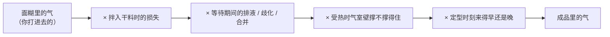
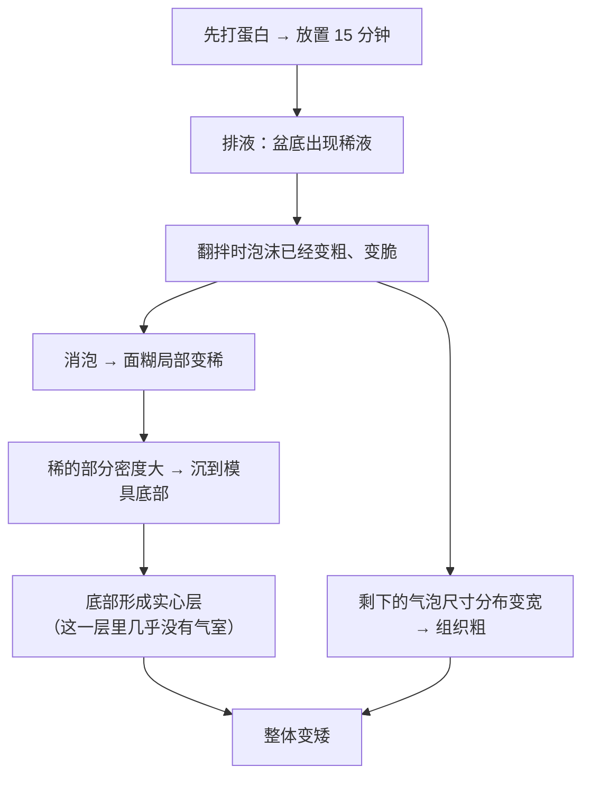
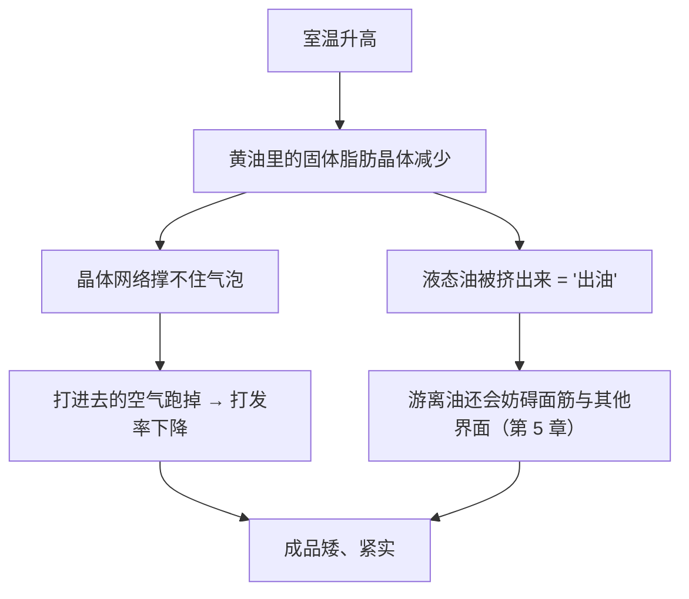

# 第 14 章 思考题参考答案

> 只记「问题 + 正确答案」。案例题给**完整推理链**——
> "气进去了吗 → 活到进炉了吗 → 活到定型了吗 → 改哪一项 → 怎么验证"。
>
> 涉及数字的地方，来源见[参考书目与出处登记](../standards.md)。

## Q1

**问**：为什么说"打发体系里，气室的数量在搅拌结束时就定了"？这能解释什么样的组织？

**答**：

因为打发**不生成新的气体分子**，它只是把已经存在的空气**夹带**进液相并切碎
（第 10 章的 entrainment）。酵母和膨松剂可以在后续时间里持续往已有气室里补气，
**打发不能**——搅拌一停，气源就关了。

后面的所有"变大"都只有两种来源：

| 来源 | 说明 |
|------|------|
| 已有气泡里的气**受热膨胀** | 气体体积随温度上升 |
| 水**汽化**进入已有气泡 | 第 15 章 |

两者都只作用在**已经存在的气室**上。

**所以能解释这种组织**：如果搅拌时只夹带进少数几个大气泡，
受热时就只有这几个被吹大，其余部分没有气室可撑 →
成品是**几个大孔 + 一片密实**。这和第 13 章里"膨松剂放太少反而出现大气孔"是同一个道理：

> ## **气孔的大小取决于气室的数量，而不是气体的总量。**

## Q2

**问**：蛋清里"负责打起来"和"负责站得住"的不是同一批蛋白质。这对操作意味着什么？

**答**：

实测结论（一项用电泳 + 质谱追踪泡沫蛋白组成的研究）：

| 阶段 | 主要是谁 |
|------|---------|
| 起泡（打完 5 分钟取样） | **卵转铁蛋白、卵白蛋白、卵类粘蛋白** |
| 稳泡（静置 2 小时后仍在泡沫里） | **卵粘蛋白、卵巨球蛋白、卵白蛋白碎片与聚合物、溶菌酶**等比例大幅上升 |

对操作的三条意义：

1. **"打发成功"不能预测"泡沫耐放"**——它们由不同的分子负责，
   所以"看起来打得很漂亮，一放就出水"是完全正常的现象，不是你手抖；
2. **改善稳定性的手段和改善起泡性的手段不同**：
   想更容易打起来，动的是界面吸附（pH、盐、搅打时间）；
   想更耐放，动的是**连续相黏度**（糖、糖浆、面糊稠度）；
3. **凡是"改变蛋清蛋白质组成"的处理都会同时动这两件事**：
   蛋的存放（天然卵白蛋白→S-卵白蛋白）、巴氏杀菌、干燥粉化，
   都可能让"更好打"与"更耐放"往相反方向走。

## Q3

**问**：蛋黄脂质在海绵蛋糕里帮忙充气，在蛋清里却破坏泡沫。怎么解释？

**答**：

关键在**脂质以什么形式存在**。

| 形式 | 行为 | 依据 |
|------|------|------|
| 包在**完整的低密度脂蛋白（LDL）颗粒**里 | 颗粒本身具有表面活性，作为一个"带着蛋白外衣的脂质包"参与充气与气室稳定 | 海绵蛋糕研究：拆散 LDL 后**充气与气室稳定性受影响**，而定型时刻与程度基本不变 |
| 以**游离脂质**混入蛋清体系 | 抢占气—水界面却撑不起弹性膜，还在相邻界面之间**搭桥**，把蛋白质网络打断 | 工业蛋液研究：**蛋黄残留 ≥0.7%（w/w）** 时泡沫失稳 |

**一句话**：同样的分子，**有没有"外衣"决定它是帮手还是破坏者**。

**可迁移的问法**：看到一个配方里出现脂质，先问它**是以什么形式进来的**——
乳化好的（蛋黄、奶油、乳化剂）通常帮忙充气；游离的（融化的黄油、油、手上的油）通常拆台。

## Q4

**问**："面糊的充气程度与成品的充气程度没有显著关联"——怎么解释？它**不能**推出什么？

**答**：

**怎么解释**——用第 10 章的模型：

左边那一项只是连乘里的**第一项**。当后面几项的波动比它还大时，
"面糊充气量"与"成品充气量"之间自然测不出显著关联。

那项研究里还有两个细节支持这个解释：

- **打得更久**（气泡更多更细）→ 面糊更稠、气泡更小，但成品**中心高度反而下降**；
- **转速最高（1000 rpm）时打发率反而更低**——说明"更用力"不等于"更充分"。

**它不能推出什么**（很重要）：

1. **不能推出"打发不重要"**——它只说明"面糊含气量"不是成品体积的**唯一或主要**预测量；
2. **不能外推到所有成品**——那是一项关于**充气饼干面糊**的研究，
   戚风、海绵、马卡龙的定型时刻和黏度都不同；
3. **不能推出"打得越少越好"**——研究里没有测试"几乎不打"的极端，
   而第 10 章的模型也告诉你：气室太少时成品会是几个大孔加一片密实。

## Q5

**问**：戚风案例——先打蛋白到硬性发泡，再花 15 分钟调蛋黄糊，成品矮、底部实心、组织粗。

**答**：

**（a）最可能出问题的是第二问："它活到进炉了吗？"**

配方（**以面粉总量为 100%**）里蛋清占 200%，是这份配方的**主要气源**。
打好之后放置 15 分钟，泡沫经历了：

- **排液**：液体往下淌 → 盆底积液，膜变薄；
- **歧化 + 合并**：小气泡消失、大气泡变大 → 泡沫变粗；
- 结果是**混合时更容易消泡**，且被消掉的那部分变成稀液沉底。

**（b）顺序错误**：**蛋黄糊应该先做好，蛋白霜最后打。**

推理链：

**（c）两条改法与代价**：

| 改法 | 为什么有用 | 代价 |
|------|-----------|------|
| **换顺序**：先把蛋黄糊（油 + 奶 + 粉）做好，再打蛋白，打完立刻翻拌入炉 | 直接缩短泡沫必须存活的时间——这是本章第二问的标准答案 | 需要提前预热烤箱、动作要连贯；对新手是节奏压力 |
| **提高泡沫的抗衰减能力**：把配方里的一部分糖留给蛋白霜（糖提高连续相黏度、减慢排液） | 有两项独立研究支持"糖让泡沫更稳" | 糖在蛋白霜里会让它**更难打起来**（同样两项研究），打发时间变长；而且糖是从配方里挪过来的，**蛋黄糊那边就少了**——这是一次配平改动，不是免费的 |

**怎么验证**：做本章实操任务三（等待 0 / 10 / 25 分钟三组）。
如果成品高度随等待时间明显下降，就证实了是第二问的问题。

## Q6

**问**：天气变热后，同一份黄油蛋糕配方开始"打发时出油、成品变矮变紧实"。

**答**：

**（a）机制**：黄油打发体系里，**站岗的是固体脂肪晶体**——
空气被夹在晶体构成的网络里（第 5 章）。温度升高 → 固体脂肪的比例下降 →

**（b）加大 10% 黄油的预测**：多半**帮不上忙，还可能更糟**。因为问题不是"脂肪不够多"，
而是"**固体**脂肪不够多"。在同样偏高的室温下，多加的黄油同样是软的：

- 打发率不会因此回来；
- 配方里的油脂比例升高，会**进一步阻断面筋、推迟定型**（第 5 章），组织可能更松散甚至更塌；
- 连带把糖、粉的相对比例改了——这是一次没打算做的配平改动。

**（c）不改配方的做法**：**改操作温度**。例如：

- 把黄油与盆先冷一会儿，让它回到"能留下清晰指印、不粘手、不出油"的状态再打（第 5 章判据）；
- 分段打发，中途把盆放回冰箱几分钟；
- 在一天中较凉的时段做，或给操作台降温。

⚠️ 本书**不给**具体温度数字——家用黄油的固体脂肪含量—温度曲线本书未核到
（见[出处登记](../standards.md)的已知缺口）。**用手指判据，并把当天室温记进[烘焙记录表](../forms/bake-log.md)。**

## Q7

**问**：【辨析】"蛋要回温到室温才好打"。

**答**：

**证据强度：缺乏证据。**

| 维度 | 本书核到的情况 |
|------|--------------|
| 支持它的实验 | **没有核到**比较蛋温对起泡性与成品影响的对照实验（已登记为缺口） |
| 与官方建议的关系 | **方向相反**：美国 FDA 的带壳蛋安全页要求**冷藏保存**，冰箱保持在 40 °F（约 4 °C）以下，并指出外观干净无裂纹的蛋也可能带沙门氏菌。⚠️ 各国口径不同，以当地现行发布为准 |
| 为什么流传 | 机制上"温度高 → 黏度低 → 更容易被打散"听起来合理；而且很多配方书把它和"黄油要软"写在一起，**被当成同一条规则记住了**——但这两件事的机理完全不同（黄油那条动的是固体脂肪比例，有明确机制） |

**怎么自己验证**（一个能做的对照）：

| 组 | 处理 | 打到同一外观所需时间 | 泡沫高度 | 静置 15 分钟后积液 |
|----|------|------------------|---------|-----------------|
| ① 冰箱取出后**立刻**打 | | | | |
| ② 室温放置后再打 | | | | |

同一批蛋、同样的量、同一台搅拌机、同一档转速，只改这一件事，做两三次取重复。
**要点**：记录的不能只有"打没打起来"，还要记**打到同样状态花了多久**和**放置后掉得多快**——
这两个量分别对应 Q2 里那两批不同的蛋白质。

⚠️ 做完不要试吃生蛋清泡沫。

## Q8

**问**：【辨析】"加糖会让蛋白打不发"。两项研究分别测的是哪个量？为什么这点关键？

**答**：

**证据强度：⚠️ 说反了一半。**

| 研究 | 测的量 | 结果 |
|------|-------|------|
| 蔗糖与氯化钠对蛋清起泡性的研究 | **形成难度**与**稳定性** | 蔗糖使泡沫**更难形成**，但形成后**更稳定** |
| 咸鸭蛋清蛋白霜研究（四种糖 × 四档糖量） | **打发指数、泡沫耐久指数、比重、打发率、气相体积** | 随糖量升高：打发指数、耐久指数、比重**上升**；**打发率与气相体积基本不变** |

**为什么"测的是哪个量"很关键**：

"打不发"这句话在厨房里至少指三件不同的事：

1. **打起来要花更久**（形成速率）；
2. **最后含气量更少**（打发率 / 气相体积）；
3. **打完很快就塌**（稳定性）。

两项研究合起来给的答案是：**① 是真的，③ 是反的，② 在那项研究里没有发生。**

> **可迁移的读法**：听到任何一条"加 X 会让 Y 变差"的说法，
> 先追问"**变差的是哪个量**"。烘焙圈大量的争论其实是**两个人在说两个不同的量**。

⚠️ 并注意第二项研究用的是**咸鸭蛋清**，糖量档位的基准写法本书未核到，
**只能引用方向与"哪个量变了"，不能引用数字当配方。**
