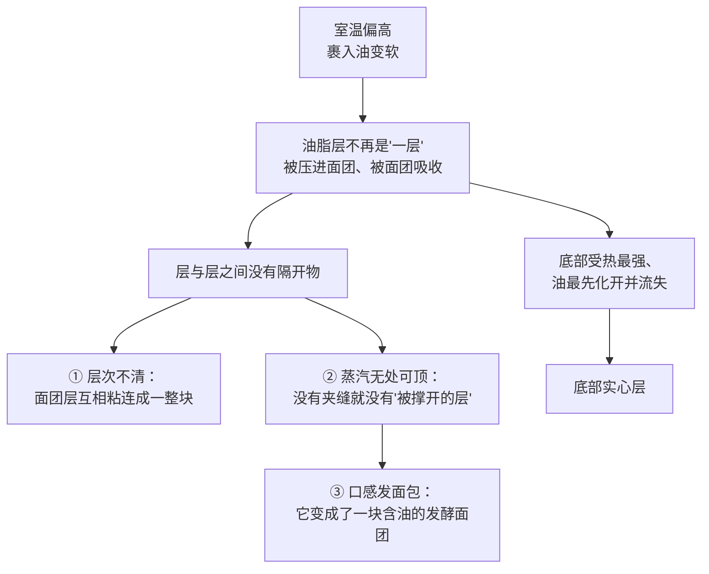
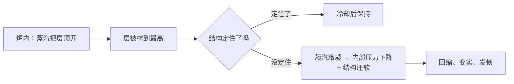

# 第 15 章 思考题参考答案

> 只记「问题 + 正确答案」。案例题给**完整推理链**——
> "有没有水 → 有没有热 → 有没有东西被顶开 → 窗口什么时候关 → 怎么验证"。
>
> 涉及数字的地方，来源见[参考书目与出处登记](../standards.md)。

## Q1

**问**：为什么说蒸汽"既是最强的气源，又是烤箱里的温度上限"？

**答**：

**两件事其实是同一件事**：汽化要吸收大量的能量。

| 量 | 数值（NIST 水的饱和性质数据） | 含义 |
|----|------------------------------|------|
| 液态水比容（约 91 °C） | 约 0.00104 m³/kg | 1 g 水 ≈ 1 mL |
| 饱和蒸汽比容（约 91 °C） | 约 2.24 m³/kg | 1 g 水 ≈ 2240 mL |
| 饱和蒸汽比容（约 102.5 °C） | 约 1.54 m³/kg | 1 g 水 ≈ 1540 mL |
| 汽化焓（同区间） | 约 2250~2280 kJ/kg | **汽化本身要花的能量** |
| 把水从 20 °C 加热到 100 °C | 约 335 kJ/kg | 汽化要花掉它的六七倍 |

**"最强"**：同样质量下，没有任何一条膨发路线能一次贡献上千倍的体积。

**"温度上限"**：热量优先被用来汽化水，而不是继续升温。
只要成品内部还有自由水在蒸发，内部温度就很难越过水的沸点——
模拟研究引入蒸发—冷凝机制后**芯温不越过 100 °C**（约 98 °C 稳定），
实测的汉堡面包芯温在最初 8 分钟升到约 100 °C 后保持。

> **对操作的意义**：**"里面没熟"常常不是炉温不够，而是热量还在被汽化吃掉。**
> 解决方向是延长时间或改善传热，而不是一味升高炉温（升高炉温只会让表面更快焦）。

## Q2

**问**：蒸汽膨发的三个前提是什么？为什么第三个最容易被忽略？

**答**：

1. **有水**——能被加热到汽化的那部分水；
2. **有热**——而且要来得够快（汽化很贵）；
3. **有能被顶开、又能及时定住的结构**。

**第三个最容易被忽略**，有三个原因：

| 原因 | 说明 |
|------|------|
| 前两个是"原料与设备"，看得见 | 水在配方里、热在烤箱上，都容易检查；"结构"是**工艺做出来的**，看不见 |
| 蒸汽本身没有形状 | 它不像酵母产的气那样"长在气室里"——它在任何地方都能生成，**关不住就只是失重** |
| 失败现象容易误导 | "没起层"看起来像"火力不够"，其实往往是层被压穿了 |

**证据**：那篇多层面团—油脂体系的综述把关键写成两条——建立多层结构，
并**在加工中维持它，以便烘烤时蒸汽把层撑开**。
维持，才是难的那一半。

## Q3

**问**："从第 3 次擀折开始出现脱气"支持什么、不支持什么？

**答**：

**支持**：

- **层的价值来自"隔开"，而隔开会在层足够薄时失效**——
  该研究里出现脱气时，面团层厚度中位数约 **750 µm**；
- 在此之前（前两次擀折），**面筋网络与整体保气能力没有明显变化**——
  所以"擀折本身会破坏面筋"这种笼统说法**不成立**，至少在前几次不成立；
- 配套证据：另一项研究把层数（50~200）、终厚（1.0~3.5 mm）与裹入油量放在一起优化，
  说明这三个变量**必须一起看**。

**不支持**（很重要）：

1. **不支持"擀 3 次最好"**——那是**那种丹麦酥、那台设备、那个厚度**下的观察；
2. **不支持"脱气一定是坏事"**——脱气改变的是保气，而成品好坏还取决于定型与配方；
3. **不支持把 750 µm 当成一个可以量的家用指标**——家里没有 MRI，也很难量到层厚。

**怎么用它指导自己**：把"擀折次数"当成一个**需要自己找转折点的变量**，
做本章实操任务四（按配方次数 vs 多两次），看横截面与底部。
**找到自己的转折点，而不是抄别人的次数。**

## Q4

**问**：压力实测的两条结论分别推翻了哪种常见解释？

**答**：

| 实测结论 | 它推翻的常见解释 |
|---------|----------------|
| 升压**主要来自变硬表层的机械约束**（最高约 1.1 kPa） | "面包在炉里涨，是因为里面的气把面团顶起来" 这种只看内部的说法——**外层的约束同样是主角**。这也解释了为什么"表皮什么时候定住"能决定成品体积 |
| **未检测到**气泡壁变硬引起的升压 | "气室壁在受热中先变硬、于是内部压力升高把面包撑大"这种想当然的机制**没有被观测到** |

**补充两条同一项研究里的观察**，它们同样有用：

- **70 °C 以前就出现压力骤降**，归因于**气室合并**——
  说明"合并"不是烘烤末期才发生的事，它很早就开始了（与第 10 章一致）；
- **烘烤结束之前，面团内部压力已经趋于平衡**——说明此时已经是**开孔结构**。
  这意味着"保气"这场比赛，在出炉之前就已经结束了。

> **可迁移的读法**：当你想解释"炉里发生了什么"时，
> **先问有没有人真的测过**。这项研究的价值就在于：它把两个听起来都合理的机制，
> 一个证实、一个证伪。

## Q5

**问**：可颂案例——层次不清、底部实心、口感发面包；室温偏高，油"渗"进面团。

**答**：

**（a）三个现象的来源**：

关键是把"油脂"的角色说清楚：在起酥体系里，**油脂不是风味原料，是隔离物**（第 5 章）。
油一旦被面团吸收，层就合并成了一块面团——**这时候再多的蒸汽也没有东西可顶**。

**（b）擀折从 3 次加到 5 次的预测**：**大概率更糟**。

- 问题不是"层不够多"，而是"**层没有被隔开**"。在油已经渗进面团的前提下，
  多擀两次只是**把已经糊在一起的面团继续压薄**；
- MRI 研究显示**擀折次数增加会带来脱气**；
- 而且多擀两次意味着面团在偏高室温下**多待一段时间**，油会更软——**问题会自我放大**。

**（c）两条更可能有效的改法与代价**：

| 改法 | 为什么有用 | 代价 |
|------|-----------|------|
| **控温**：面团与裹入油都先冷透，每次擀折之间回冷藏；在一天中较凉的时段做 | 直接恢复"油是固态、能隔开层"这个前提（第 5 章：裹入油要"能弯不能断"） | 总时长变长；冷过头则油会碎裂成块，反而断层 |
| **调整裹入油**：换一款在你当地室温下**塑性范围更宽**的油脂 | 一项研究写明"高脂黄油因其可塑性与操作性能被看重，而这些性能强烈依赖脂肪结晶网络"；另有研究显示不同油脂的固体脂肪含量随温度变化差别很大 | 风味会变（这是取舍，不是升级）；⚠️ 本书**不给**具体温度区间与牌号，家用黄油的固体脂肪含量—温度曲线未核到 |

**怎么验证**：下次做两份，**只改"每次擀折之间是否回冷藏"**，其余全部一致，比较横截面。

## Q6

**问**：千层酥出炉漂亮、放凉后回缩变实。

**答**：

**（a）用"膨胀窗口 → 定型"解释**：

两条实测可以支撑这条链：

- 烘烤中撑住形状的压力量级很小（实测升压约 1.1 kPa 量级），
  **冷却时压力还会进一步下降**（该研究测到约 −0.15 kPa，且表皮透气性低于面包芯）；
- 结构真正"定住"靠的是**淀粉糊化与蛋白质交联**（第 10 章引过的面筋交联动力学：
  在 80、90、95 °C 保温下按一级动力学聚合）。**这两件事都需要时间与温度。**

**（b）该先怀疑哪两项**：

| 怀疑对象 | 怎么验证 |
|---------|---------|
| **烤得不够久 / 没烤干**（定型不足） | 延长烘烤时间（必要时降低炉温以免上色过度），其余不变，比较冷却后的回缩量 |
| **炉温不准**（第 29 章：你的烤箱几乎一定不准） | 用独立温度计实测炉温，把设定值与实测值的偏差记下来；这是项目 P3 的内容 |

⚠️ 不要先怀疑"配方比例"——**同一份配方上一次是好的**，
变化更可能来自烘烤这一端。诊断的顺序应该是**先查变了的变量**。

## Q7

**问**：【辨析】"炉内膨胀主要靠蒸汽"。

**答**：

**证据强度：⚠️ 分体系，笼统说不成立。**

| 体系 | 主要气源 | 依据 |
|------|---------|------|
| **有酵母的面团**（面包、可颂、丹麦酥） | 发酵产气的贡献可以更大 | 一项起酥点心研究测得**发酵产生的 CO₂ 对成品高度的贡献大于烘烤时水与乙醇的蒸发**；另一项用电阻加热炉的研究显示**醒发速度与炉内膨胀相关（r = 0.75）**、酵母**在约 50~65 °C 前仍有活性** |
| **无酵母、无膨松剂**（千层酥、泡芙） | 蒸汽是主角 | 因为没有别的气源；机制见多层体系综述（但该综述明说**确切机制仍不清楚**） |
| **所有体系** | 还有一股常被忘掉的：**已有气体的受热膨胀** | 物理；第 10 章 |

**它为什么流传**：因为"蒸汽"这个解释很有画面感，而且在千层酥、泡芙上确实成立，
于是被推广到了所有成品——这正是本书辨析栏反复出现的模式：
**一条在某类配方里成立的规律，被过度推广。**

**能引用的中间结论**：法棍研究测得**蒸汽有利膨胀，最大可达 1.7 倍**，
出现在**面包芯温度接近 90 °C** 时。注意它说的是"有利"，不是"主要"。

## Q8

**问**：【辨析】"泡芙必须煮到锅底结膜"；本书为什么把泡芙机制标成推理？

**答**：

**证据强度：缺乏证据。**

- 本书**没有核到**任何专门研究泡芙膨胀机制的同行评议实验；
  检索到的多是**配方替代类**研究（换掉一部分面粉后体积与感官如何变）与专利文献；
- "结膜"这个判据大致对应"淀粉充分糊化 + 水分蒸发到合适程度"，
  这两件事本身有依据（第 17 章），但**"结膜"与成品的定量关系没有依据**。

**本书为什么愿意留这个空白**：

1. **写出来很容易，负责不容易**——凭机制推理可以写出一段很像样的解释，
   但读者没法当场纠错，一炉毁了就是毁了（本书 §1 的四条纪律）；
2. **标注为推理反而更有用**：你知道哪部分有依据（糊化、蛋白质凝固、定型时刻），
   哪部分只是惯例（结膜、加蛋的状态、不能开炉门），就知道**哪些可以改、哪些先别动**。

**对读其他泡芙教程的提示**：

| 看到这种表述 | 你该怎么读 |
|------------|----------|
| "必须煮到 XX 秒 / 结出一层膜" | 工艺口语。**可以照做，但别当成原理**；它可能只在作者那口锅、那个火力下成立 |
| "面糊要达到某种倒三角状态" | 这是在描述**黏度**——这是有意义的判据，因为黏度确实影响保气（第 14 章） |
| "烤的时候绝对不能开炉门" | 机制合理（表层定住前不能泄压降温），但**本书未核到实验**。想知道就自己做对照 |
| "泡芙必须用高筋 / 必须用低筋" | 先问出处。第 2 章已经说过：面粉分类的蛋白质区间本书都没能核到法定依据 |
