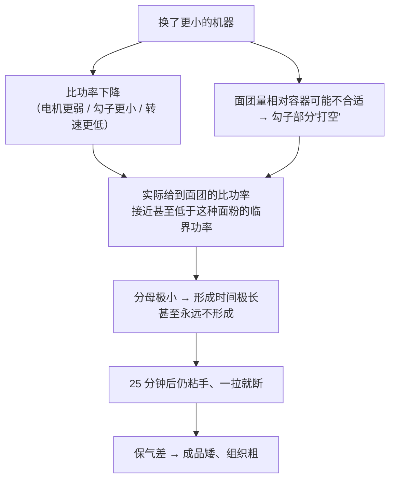

# 第 16 章 思考题参考答案

> 只记「问题 + 正确答案」。案例题给**完整推理链**——
> "水够不够 → 功率够不够 → 时间够不够 → 谁在拆网 → 怎么验证"。
>
> 涉及数字的地方，来源见[参考书目与出处登记](../standards.md)。

## Q1

**问**：为什么说"干面粉里没有面筋"？形成面筋需要哪三个输入？

**答**：

干面粉里有的是**分散在淀粉颗粒之间的两类蛋白质**（第 2 章：麦谷蛋白管强度、
麦醇溶蛋白管延展，后者**无法单独形成网络**）。面筋是它们**吸水之后被机械作用
反复拉开与重连**才出现的**连续网络**。

三个输入：

| 输入 | 作用 | 它的边界 |
|------|------|---------|
| **水** | 让蛋白质舒展、能互相接触 | **有上限**：太多会稀释网络（某研究在加水 55%、面粉基准时看到发酵中面筋纤维断裂） |
| **机械功率** | 机械激活"承力键"（链间二硫键与氢键） | **有下限**：低于该面粉的**临界功率**，网络不会形成 |
| **时间** | 让水分布均匀、让键重新配对 | 能替代一部分功，但**替代不了全部** |

一条直接的形态学证据：同一批面粉做成不同浓度的面糊时，
**30% 是分散颗粒、35%~40% 成簇、45% 才形成连续网络**——
**"有没有面筋"首先是个浓度问题。**

## Q2

**问**：那条形成时间的式子有哪三条实用推论？

**答**：

式子：**面团形成时间 = 面粉的能量需求 ÷（你给的比功率 − 该面粉的临界功率）**

| 推论 | 厨房里的含义 |
|------|------------|
| ① **分母可能 ≤ 0** | 力气不够（档位太低、面团太少让勾子打空、手揉太轻）时，**揉多久都不会形成网络**。这是"揉了半天还是散的"最容易被忽略的原因 |
| ② **时间与功率不是等价交换** | "揉 10 分钟"这种指令**不可移植**——它只在原作者那台机器、那个档位、那个面团量下成立 |
| ③ **两个参数都是面粉的性质** | 研究里只有**不可提取麦谷蛋白聚合物占比（UPP）** 与它们相关。所以"同样揉法换一袋粉就不一样"是可以预期的，不是你手生 |

**附带的第四条**（很有用）：研究还发现**在搅拌开始时加一个停顿会降低临界功率**——
这就是"自解法"的机制位置：**它把门槛降下来了。**

## Q3

**问**：为什么自解法不只是省力？引用两条实测。

**答**：

| 证据 | 内容 | 它证明了什么 |
|------|------|------------|
| ① 机械化学活化研究 | **在搅拌一开始加一个停顿，会降低该面粉的临界功率**（与加入干扰巯基—二硫键的化学品效果同向） | 它改变的是**门槛**，不是单纯地"少揉几分钟" |
| ② 静置研究 | 静置使**水分布越来越均匀，在 60~120 分钟之间趋稳**，强结合水比例上升；共聚焦显微镜下蛋白网络**更致密均匀**；另一项面条面团研究里，含水 60% 组的延展性从 **64.33 mm 升到 152.67 mm**（静置 0 → 120 分钟） | 时间**确实在替你做功**：水合与网络重排都在发生 |

**为什么这条值得记**：它把"省力"变成了"**用时间换功率**"这笔可以主动做的交易。
设备不够强的家庭厨房，**这是最划算的一条**。

⚠️ 但要注意两条限制：

- 两项静置研究做的是**面条与馒头类面团**，不是面包，只能引用方向；
- 本书**不给**"静置多久最好"的数字——它随配方、粉、室温而变。

## Q4

**问**："聚集程度与网络连续性并不正相关"能解释什么现象？

**答**：

它解释了厨房里这几件看起来自相矛盾的事：

| 现象 | 解释 |
|------|------|
| **面团看起来光滑抱团，一扯就断** | 蛋白质抱成了团，但团与团之间没有连成连续的网 |
| **加了很多"增筋"手段却更脆** | 提高聚集不等于提高连续性；过度聚集反而可能让网络变得僵而脆 |
| **高含水量面团摸起来很软，却能撑住大气室** | 连续性好、延展性好，即使"抱团感"弱 |

**更一般的教训**：

> **"手感"测的是聚集，"能不能包住气"测的是连续性。**
> 它们相关但不等同——这也是为什么本书在 16.8 里把判据写成
> **"能被拉开变薄而不是一拉就断"**，而不是"摸起来光滑"。

## Q5

**问**：吐司案例——换了更小的厨师机之后，揉 25 分钟仍粘手、拉开就断。

**答**：

**（a）最可能发生了什么**：

注意这份配方（**以面粉总量为 100%**）里还有两个抢水/干扰面筋的角色：
**糖 8%**（第 4 章：抢水、推迟面筋交联）与**黄油 8%**（第 5 章：阻断面筋）。
它们会让所需的机械功更高——**同一份配方在更弱的机器上，更容易掉到门槛以下。**

**（b）"再多揉 15 分钟"的预测**：**大概率没用，而且有副作用。**

- 如果比功率低于临界功率，**时间再长也不会形成网络**（式子的分母 ≤ 0）；
- 长时间搅拌会让**面团升温**（温度是第 23 章的变量），酵母提前活跃、面团发粘；
- 还会白白消耗时间，使后续发酵节奏全乱。

**（c）三条改法与代价**：

| 改法 | 为什么有用 | 代价 |
|------|-----------|------|
| **加一个开头的停顿（自解）**：粉 + 水先混匀静置一段时间再加其余原料揉 | 实测：开头的停顿**降低临界功率**；静置还让水分布更均匀 | 总时长变长；需要重新安排加盐、加油、加酵母的顺序（第 22 章） |
| **改变加料顺序**：先把面筋揉出来，再加油脂（必要时后加糖） | 油脂阻断面筋（第 5 章）、糖抢水（第 4 章）——晚一点加，等于在前期降低所需功率 | 后加油需要额外搅拌时间把油吃进去；⚠️ "盐 / 油什么时候加"的定量依据本书未核到，按惯例处理 |
| **改给能方式**：改用折叠法（每隔一段时间折一次），或增大面团量让勾子吃得住 | 折叠是另一种给能量的方式，不依赖高转速；面团量合适可避免"打空" | 总时长明显变长；折叠法的操作节奏要重新安排。⚠️ 不同给能方式的比较实验本书未核到，**只能说"方向合理"** |

**怎么验证**：做实操任务三（连续揉 12 分钟 vs 揉 4 + 静置 20 + 揉 4），
看哪一组更容易拉开——这直接检验"时间换功率"在你这台机器上成不成立。

## Q6

**问**：冷冻面团解冻后发得慢、成品塌陷；补了一倍酵母后发快了但仍塌。

**答**：

**（a）为什么补酵母解决不了**：

用第 10 章的模型：**膨发 = 产气 × 保气**。
补酵母只加强了**产气**那一半，而"塌陷"是**保气 + 定型**那一半的问题。
第 10 章那项实测正好说明这件事：把发酵终点统一到同样的产气量后，
**不同菌株的炉内膨胀仍然不同**，膨胀更大的**气室数量更多**——**产气一样，结果可以完全不同。**

**（b）冻融至少破坏了两样东西**：

| 被破坏的 | 证据 |
|---------|------|
| **酵母**（活力下降，并**释放谷胱甘肽**） | 一项冷冻面团研究发现：减少酵母失活与谷胱甘肽释放之后，产气与保气都改善。谷胱甘肽是含巯基的小分子，会参与二硫键交换 |
| **面筋网络本身** | 多项研究观察到冻融使**麦谷蛋白大聚体含量下降、游离巯基上升**，并把**二硫键断裂**认定为主因；冰晶还会机械性地破坏网络 |

所以补酵母之后的表现完全可以预期：**发得更快（产气恢复了），但还是塌（保气没恢复）。**

**（c）还能从哪两个方向改善**：

| 方向 | 做法 | 代价 / 局限 |
|------|------|-----------|
| **减少冻融损伤** | 减少温度波动（别反复冻融）、缩短冻藏时间、分小份速冻 | 需要设备与流程配合；⚠️ 本书**不给**冻藏期限数字（未核到家庭条件下的数据） |
| **补强保气那一半** | 用更强的粉、提高面筋网络发育程度、降低含水量、或使用能稳定网络的配料 | 每一条都是**配平改动**：更强的粉会改变口感，减水会改变组织与保湿（第 3 章），加配料会改变配方结构 |

**怎么验证**：把"入炉前高度"与"炉内涨幅"分两列记（第 11 章的做法）。
如果补酵母后**入炉前高度恢复了、炉内涨幅仍然差**，就证实问题在保气与定型这一端。

## Q7

**问**：【辨析】"必须揉出手套膜"。

**答**：

**证据强度：⚠️ 工艺口语，且不适用于所有配方。**

| 维度 | 说明 |
|------|------|
| **它描述的是什么** | 一个**状态**：网络已经连续、延展性好到可以被拉成薄片而不破。这个方向与"面筋发育"一致（形态学上对应从"簇"到"连续网络"） |
| **本书能核到什么** | **没有找到"手套膜"的学术对应表述**（已登记为缺口）。学术侧用的是别的指标：面团形成时间、延展性、麦谷蛋白大聚体含量、应变硬化指数等 |
| **对哪些成品不适用** | 饼干、派皮、马芬、绝大多数蛋糕——它们要的是**少面筋**；高含水量欧包常用**折叠**而非揉到成膜 |
| **为什么不给"多薄"的标准** | 因为形成时间取决于**你给的功率与这种面粉的临界功率之差**，两者都随设备与面粉变化。**任何一个绝对标准都不可移植** |
| **它为什么流传** | 因为在**高糖高油的软式吐司**这类配方里，它确实是一个好用、可视化的终点判据——然后被推广成了普遍标准 |

**本书给的替代判据**：能整体离盆、能被拉开变薄而不是一拉就断、**并且你能重复做到同一个状态**。

## Q8

**问**：【辨析】"揉过头会把面筋揉断"。为什么"过度"必须带上含水量？

**答**：

**证据强度：⚠️ 方向有依据，但"过度"是相对的。**

直接证据来自那项面糊浓度研究——**延长搅拌的后果在不同含水量下方向相反**：

| 浓度 | 延长搅拌后 |
|------|-----------|
| 30%（很稀） | 面筋聚集指数**下降**、麦谷蛋白大聚体减少 |
| 35%、40% | **相反**：麦谷蛋白大聚体**增加**，二级结构更有序，麦谷蛋白与麦醇溶蛋白之间的聚集更明显 |
| 45%（接近面团） | 又变成**下降** |

**为什么必须带上含水量**：

1. **水决定了分子能不能动、能动多快**——同样的搅拌在稀体系和稠体系里做的是不同的事；
2. **水决定了机械能怎么传递**：太稀时能量大量耗散在液相里，太稠时能量集中在网络上；
3. 另有研究显示，不同的**功输入**（10%~180% wh/kg）与转速会改变成品中面筋的表面积与宏观结构——
   **"过度"对应的不是一个时间，而是一个能量水平。**

> **可迁移的读法**：凡是"某某会把某某搞坏"的说法，
> 先问**"在什么条件下"**。本书辨析栏反复出现的模式就是：
> **一条在特定条件下成立的规律，被说成了普遍规律。**
