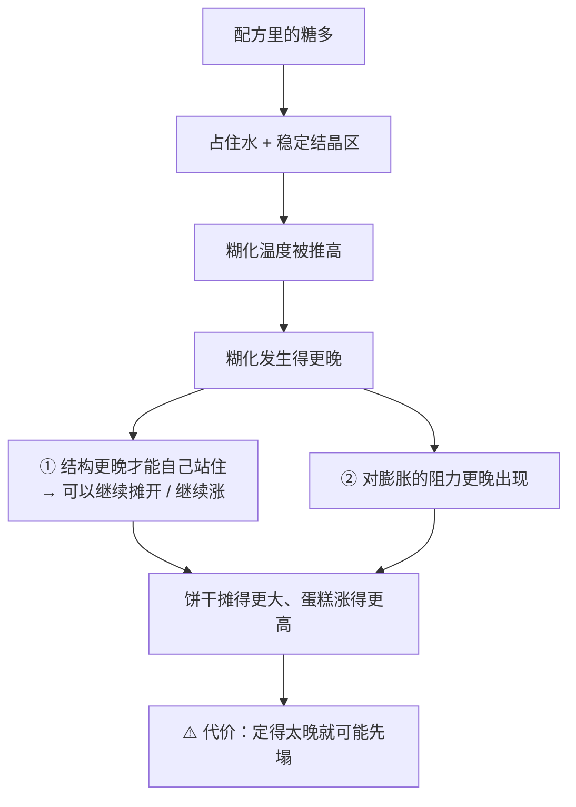
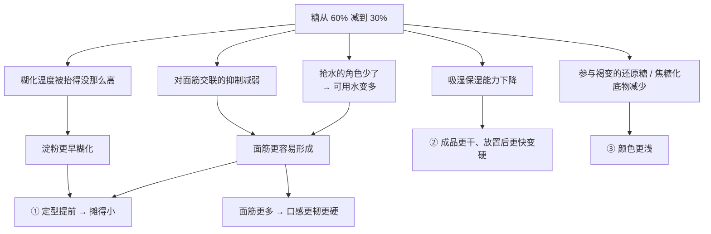
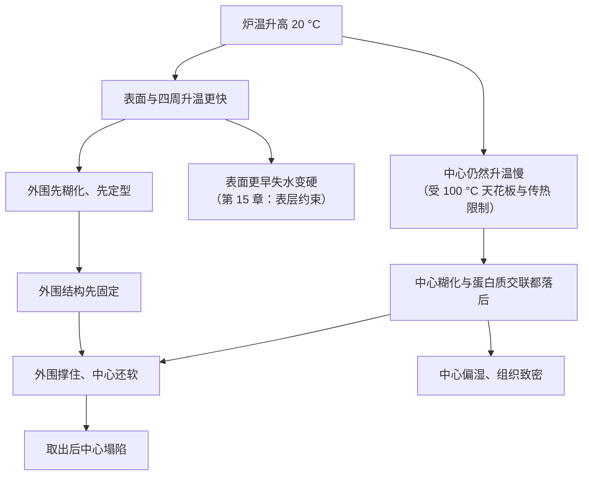

# 第 17 章 思考题参考答案

> 只记「问题 + 正确答案」。案例题给**完整推理链**——
> "配方给了多少水和糖 → 糊化会不会发生、什么时候发生 → 定型时刻被推到哪 → 怎么验证"。
>
> 涉及数字的地方，来源见[参考书目与出处登记](../standards.md)。

## Q1

**问**：为什么"煮锅里的糊化"和"烤箱里的糊化"是两件事？列出三条差别。

**答**：

| 差别 | 煮锅 | 烤箱（烘焙体系） |
|------|------|----------------|
| ① **水量** | 过量，淀粉泡在水里 | 不足，而且要和面筋、糖抢（第 3、4 章） |
| ② **温度上限** | 可以一直到沸腾，甚至持续沸腾 | 内部**很难越过 100 °C**——汽化把热吃掉了（第 15 章：汽化焓约 2250 kJ/kg） |
| ③ **均匀性** | 搅拌，各处差不多 | **各处不同**：糊化进程取决于距表面的深度（实测），所以皮和芯完全不是一回事 |

**结论**：教科书上"淀粉六十几 °C 糊化"的数字来自**水过量**条件
（某研究测得玉米与小麦淀粉在过量水中于 65~75 °C 糊化）。
**把它搬进面团里，前提就没了。**

## Q2

**问**：水不足时的两个吸热峰分别有什么行为？意味着什么？

**答**：

| 峰 | 行为 |
|----|------|
| **低温峰** | **位置固定**（某研究的马铃薯淀粉为 66 °C）；**水过量时只有它** |
| **高温峰** | 只在**水不足**（水:淀粉低于约 1.5 : 1，w/w）时出现；**水越少，它出现的温度越高**，而且**峰越小** |

**在小麦淀粉上的验证**：把含水量从 50% 降到 1.5%，
**完全失去双折射（糊化完成）的温度随含水量降低而升高**，
而且**双折射的消失与通过高温峰是对应的**。

**意味着什么**：

> ## **在缺水体系里，"糊化温度"不是一个数，而是一条随含水量移动的曲线。**

三条实际推论：

1. **配方决定糊化温度**——不是烤箱决定；
2. **含水量越低，糊化越难完成**，甚至完不成（饼干）；
3. 因此本书**不给**用于烘焙配方的糊化温度数字，只给"条件 → 方向"。

## Q3

**问**："面包芯完全糊化、面包皮糊化度只有 29.90%~44.36%"能解释哪三个现象？

**答**：

| 现象 | 解释 |
|------|------|
| ① **皮和芯的口感完全不同** | 芯是完全糊化的淀粉凝胶（软、有弹性）；皮的淀粉只糊化了三成到四成多，它主要靠**失水**变硬变脆 |
| ② **烤得越久 / 炉温越高，皮越厚越硬** | 表面先失水，失水之后那部分淀粉**更没有条件糊化**；同一项研究里含水量越低，皮的糊化度越低 |
| ③ **同一炉里靠外 / 靠热源的那几个更硬** | 糊化进程取决于**局部温度与距表面的深度**（另一项研究的结论）。烤箱热点会把这条梯度放大（第 28 章） |

**补充一条能自己验证的**：面包第二天先变硬的部位、以及"回软"发生在哪里，
都与这条梯度和水分再分配有关（第 45 章）。

## Q4

**问**：糊化的"双重身份"是什么？为什么这解释了"糖推迟定型"？

**答**：

**双重身份**：

| 身份 | 证据 |
|------|------|
| **建立结构** | 海绵蛋糕研究写明：**面糊变成蛋糕靠淀粉糊化与蛋白质聚合两种成胶现象** |
| **关闭窗口** | 酥皮研究写明：**完整淀粉的糊化限制面团的起发与膨胀**；把一部分淀粉酶解后**膨胀阻力下降、起发变好** |

**为什么解释了"糖推迟定型"**：

这与第 1、4 章引过的那项研究一致：**蔗糖越多，面筋交联被推迟或抑制得越厉害，
于是饼干定型更晚、直径更大**；同时**蔗糖 + 低水分把糊化温度抬到烘烤中几乎不糊化**。

> **可迁移的问法**：看到任何一个原料，问它**把定型时刻往前推还是往后推**。
> 这是第三部分的核心问法。

## Q5

**问**：曲奇把糖从 60% 减到 30%（**以面粉总量为 100%**），结果摊得小、偏硬偏干、颜色浅。

**答**：

**（a）完整推理链**：

| 变化 | 来自哪一条 |
|------|-----------|
| **摊得小** | 糊化与面筋交联都提前 → **定型提前**，饼干还没来得及摊开就定住了 |
| **偏硬偏干** | ①糖的吸湿保湿减少（第 4 章）；②面筋比以前发达 |
| **颜色浅** | 参与上色的糖少了（第 4 章：糖参与褐变） |

**（b）与糊化直接有关的是"摊得小"**（定型时刻提前）。
依据：一项研究直接观察到饼干直径是"**摊开速率 × 定型时间**"的结果，
定型更晚的那一组摊得更大（第 2 章的软 / 硬质小麦粉对照）。

**（c）两个补救方向与代价**：

| 方向 | 做法 | 代价 |
|------|------|------|
| **补"推迟定型"这件事** | 减少面筋形成：换蛋白质更低的粉、减少搅拌、增加油脂 | 换粉与加油都会改变口感与结构（第 2、5 章）；加油还会让饼干更酥更散 |
| **补"保湿"这件事** | 提高配方的保湿能力，或改变烘烤（更短更高温，让它来不及干） | ⚠️ 糖的四个角色**没有一样东西能同时补上**（第 4 章）；改烘烤会连带改颜色与口感。**这是取舍，不是修复** |

> ⚠️ 本书**不给**"减糖后该加多少油"这类换算——
> 各类成品的烘焙百分比典型区间本书未核到一手出处（已登记为缺口）。
> **改一档、记一次、比一次**，比抄一个数字可靠。

## Q6

**问**：磅蛋糕把炉温调高 20 °C，结果中间凹陷、偏湿、组织致密。

**答**：

**（a）用"糊化 + 定型时刻"解释**：

**（b）为什么升温反而让中间更湿**：

1. **热进不去更快，只是外面更快**——第 15 章讲过，只要还有水在蒸发，
   内部温度就被钉在 100 °C 以下；升高炉温主要加速的是**表面**；
2. 表面更早变硬变干，**形成了一层阻碍传热与传质的壳**
   （压力实测显示表皮的透气性低于面包芯）；
3. 因为"看起来已经上色了"，人会**提前出炉**——于是中心的糊化与蛋白质交联都没完成。

**（c）怎么验证**：

| 做法 | 看什么 |
|------|-------|
| 回到原来的炉温，其余不变，再做一次 | 凹陷是否消失（**先验证是不是这个变量**） |
| 用探针温度计测中心温度，记录出炉时的读数 | 两种炉温下**出炉时中心温度**是否不同——第 32 章的核心方法：**时间不可移植，温度与现象可移植** |
| 用独立温度计实测炉温 | 你的烤箱几乎一定不准（第 29 章、项目 P3）。"调高 20 °C"实际改了多少，要测才知道 |

## Q7

**问**：【辨析】"淀粉在 60 多 °C 就糊化了"。

**答**：

**证据强度：❌ 少了前提（在烘焙体系里基本不适用）。**

| 维度 | 说明 |
|------|------|
| **这个数字来自什么条件** | **水过量**。某量热研究测得玉米与小麦淀粉在过量水中于 **65~75 °C** 发生不可逆糊化吸热 |
| **烘焙体系里为什么不成立** | ①水不足：小麦淀粉从 50% 水降到 1.5% 水的实验显示**完成糊化的温度随含水量降低而升高**；②水不足时还会出现**第二个吸热峰**，且它随水减少而上移；③糖进一步把它推高（五组独立证据，第 4 章） |
| **搬进烘焙会犯什么错** | 会得出"只要烤到 70 °C 以上淀粉就糊化了"的结论，从而**误判成品为什么没定住 / 为什么发硬**。最典型的反例：饼干体系里**几乎没有淀粉糊化** |
| **它为什么流传** | 因为它在**食品工艺学的基础章节**里是对的——那里讲的就是过量水体系。**是被搬错了地方，不是被编造出来的** |

**本书的替代写法**：不给单点温度，改为问三件事——**有多少水、有多少糖、局部温度到了多少**。

## Q8

**问**：【辨析】"多加水能让淀粉糊化更充分，所以成品更松软"。

**答**：

**证据强度：⚠️ 前半句常对，后半句在面包里常错；而且它混淆了两件事。**

**混淆的两件事**：

| 被混淆的 | 实际情况 |
|---------|---------|
| ① "糊化更充分" | 实测：加水 45%、60%、75%（面粉基准）的白面包，**面包芯在 45% 时就已经完全糊化**。**再加水并不能让芯"更糊化"**——它已经到顶了 |
| ② "成品更松软" | 加水确实常常让成品更软，但原因是**别的**：含水量本身、组织结构、老化速度（水分再分配）。这些与"糊化度"不是同一件事 |

**加水还有代价**（第 3 章）：某研究在加水 55%（面粉基准）时观察到
**发酵过程中面筋纤维断裂**，比容上升但咀嚼性与黏性下降。
**水同时被面筋、淀粉和蒸汽争夺**——多给一个，就少给另一个。

**唯一"多加水确实提高糊化度"的地方**：**表皮**。
因为皮的糊化度本来就低（29.90%~44.36%），且**随含水量降低而下降**。
但表皮的软硬更多由**失水**决定（第 30、33 章）。

> **可迁移的读法**：听到"因为 A 所以 B"的说法，先分别验证 A 和 B。
> 这条说法里 **B（更松软）常常是真的，A（糊化更充分）常常不是原因**——
> **相关不等于机制。**
