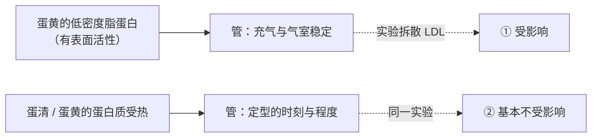
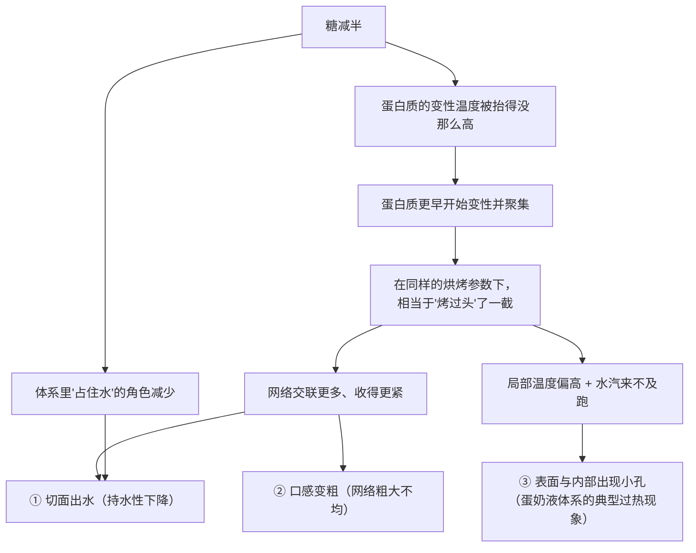

# 第 18 章 思考题参考答案

> 只记「问题 + 正确答案」。案例题给**完整推理链**——
> "配方的目标是什么 → 改动抢走了谁的什么 → 定型时刻被推到哪 → 怎么验证"。
>
> 涉及数字的地方，来源见[参考书目与出处登记](../standards.md)。

## Q1

**问**："变性"和"凝固"分别指什么？为什么很稀的蛋液加热只会变浑浊而不成块？

**答**：

| 步骤 | 发生了什么 | 单位 |
|------|-----------|------|
| **变性**（denaturation） | 蛋白质原本折叠好的结构散开，本来藏在内部的疏水基团露到外面 | **单个分子**的事 |
| **聚集 → 凝胶**（aggregation → gelation） | 露出来的部位互相碰上并结合（疏水作用、二硫键），连成三维网络，把水关在网眼里 | **一群分子**的事 |

**为什么稀蛋液不成块**：变性照常发生（所以变浑浊——分子团聚成小颗粒散射光线），
但浓度太低时分子**碰不到足够多的同伴**，第二步的网络搭不起来，宏观上仍然是液体。

**这一条的用处**：它解释了为什么"加水/加奶稀释"会让蛋的结构作用变弱得很快——
稀释不是线性地减少结构，它可能**直接让成胶这一步跑不完**。

> **另一个方向的佐证**：量热研究显示，**蛋白质浓度越高，测得的变性温度越低**——
> 浓的蛋液不但更容易成网，还更早开始。

## Q2

**问**：为什么"卵白蛋白变性温度约 80.22 °C"不能写进厨房判据？给三条以上理由。

**答**：

| 理由 | 说明 |
|------|------|
| ① **那是稀溶液模型体系** | 该测定条件是**纯水、5% w/v 蛋白质**。你的面糊里有糖、盐、脂肪、淀粉、另外十几种蛋白质 |
| ② **糖、盐、pH 都会移动它** | 同一研究里：糖**提高**两种蛋白的热稳定性；NaCl / KCl **提高**卵白蛋白、**降低**溶菌酶；pH 的方向也是相反的 |
| ③ **浓度会移动它** | 浓度越高，测得的变性温度越低 |
| ④ **连升温速率都会移动它** | 该研究中升温速率上升使测得的温度下降（⚠️ 仅见于该研究）。你在家的升温速率与量热仪完全不同 |
| ⑤ **蛋不是一种蛋白质** | 蛋清与蛋黄各自是一群蛋白质，它们不在同一个温度上做同一件事 |

**结论**：

> ## **这类温度是"某个测法、某个体系下的读数"，不是物质的固有属性。**

**本书的替代写法**：给**方向**（谁把它往前推、谁往后推）+ **官方安全温度**
（美国 FDA：含蛋菜品 160 °F，约 71 °C，并用食品温度计确认；⚠️ 各国口径不同）
+ **状态判据**（晃动程度、切面、内部温度记录）。

## Q3

**问**：蛋清凝胶的"硬度"与"持水性"经常反向变。举两个例子，并说明它对"又结实又湿润"意味着什么。

**答**：

| 改动 | 硬度 / 弹性 | 持水性 |
|------|-----------|-------|
| **加盐** | 提高 | **下降** |
| **加黄原胶（0.2%）** | 硬度与强度**下降** | **提高到 97.18%** |

（同一研究里还有两条方向一致的：**pH 偏离中性**时硬度与持水性**同时下降**；
**加糖**则让硬度与弹性提高、持水性**略微提高**——糖是少数两头都不吃亏的。）

**对"又结实又湿润"意味着什么**：

> ## **结实和湿润常常是同一个网络的两面：网收得越紧，支撑越好，但挤出的水越多。**

所以这个目标通常不能靠"多加蛋 / 多烤一会儿"达成，而要靠**换一条路**：

1. **加糖**（提高变性温度 → 定型推后，同时保湿，第 4 章）；
2. **引入能抓水的成分**（研究里是胶体；配方里常见的是淀粉糊、汤种一类，第 22 章）；
3. **控制失水**（第 21、30、33 章）。

⚠️ **诚实说明**："加热过头 → 网络收紧 → 出水"这条链在烘焙成品上的直接对照实验
本书**未核到**，属机制推理。可引用的实测只到"温度越高、蛋黄的热聚集越剧烈、颗粒越大"。

## Q4

**问**：拆散蛋黄低密度脂蛋白后"充气受影响、定型不受影响"，这条结论为什么重要？

**答**：

因为它证明了**两套机制可以被分别改动**：

**它能帮你排除哪一类误判**：成品"矮"时，人们往往只有一个假设（"没发起来"）。
这条结论提醒你**至少有两个独立的原因**：

| 现象 | 先怀疑 | 验证方法 |
|------|-------|---------|
| 入炉前就没涨起来 | **产气 / 充气**（第二部分） | 记录入炉前高度 |
| 入炉前正常、炉里涨了又塌 | **保气与定型**（这一部分） | 记录**炉内涨幅**，并记出炉时中心温度 |

> 这正是第 10 章那条记录纪律的价值：**"入炉前高度"和"炉内涨幅"分两列记。**

## Q5

**问**：蛋奶液糖减半，其余不变，结果表面起小孔、切面出水、口感变粗。

**答**：

**（a）完整推理链**：

**（b）与"定型时刻"直接有关的是"更早聚集"这一步**。
依据：三个独立来源都指向"**糖提高蛋白质的变性温度**"
（蛋清两种球蛋白的量热研究；蔗糖 vs 海藻糖对溶菌酶与肌红蛋白，低水分下尤其明显；
复合糖把液态蛋黄的变性温度提高到 77 °C 以上）。
**糖减了，这个"缓冲"就没了——配方没变，但它相当于把烘烤强度调高了。**

**（c）两个补救方向与代价**：

| 方向 | 做法 | 代价 |
|------|------|------|
| **把烘烤强度降回来** | 降低炉温、延长时间，或用水浴一类更温和的加热（先用独立温度计确认你的炉温，第 29 章） | 时间变长；上色变浅（第 21 章）；**这是在补偿，不是在恢复**——糖本来还负责甜度与保湿 |
| **把"抓水"这件事补上** | 引入其他能抓水的成分（淀粉、胶体一类），或**减少蛋量**以降低交联密度 | 加淀粉会改口感与不透明度；减蛋会**同时减掉结构与水**（第 6 章），可能矮塌 |

> ⚠️ 本书**不给**"减糖后该加多少淀粉"这类换算——各类成品的百分比典型区间未核到一手出处。
> **改一档、记一次、比一次。**

## Q6

**问**：戚风"每次多烤 8 分钟"之后不湿了，但很干、掉渣、第二天很硬。

**答**：

**（a）用"不可逆"与"持水性"解释**：

| 现象 | 机制 |
|------|------|
| **不湿了** | 中心温度终于走完了淀粉糊化与蛋白质聚集——这部分是**真的改善** |
| **干、掉渣** | 两条同时发生：① **失水**（多烤 8 分钟，水一直在跑）；② **交联过度**，网络收紧把水挤出来。而蛋白质这一侧的交联**不可逆**，冷却不会松开 |
| **第二天更硬** | 出炉时含水量本来就更低，加上淀粉回生与水分在面筋与淀粉之间重新分配（第 17、45 章），**起点低 → 终点更硬** |

**（b）为什么"多烤一会儿"不是中性操作**：

> ## **它同时改了三件事：内部温度、失水量、褐变程度——而其中两件不可逆。**

**（c）该改哪个变量、怎么验证**：

| 步骤 | 做法 | 看什么 |
|------|------|-------|
| ① 先确认是不是炉温问题 | 用独立温度计实测炉温（第 29 章、项目 P3） | "设定 170 °C"实际是多少 |
| ② 把"熟没熟"的判据从时间换成温度 | 每次记录**出炉时中心温度**，而不是分钟数 | 找到"刚好不湿"的那个读数（第 32 章：**时间不可移植，温度与现象可移植**） |
| ③ 如果中心温度已经够了还湿 | 那是**配方或传热**问题，不是时间问题：模具、批量、炉内位置、含水量 | 改一个变量、记一次（第 20、28、31 章） |
| ④ 用失重区分两种"干" | 每次称烤前烤后重量 | 失重明显更大 → 失水；失重差不多却更干 → 交联过度 |

## Q7

**问**：【辨析】"蛋清 60 °C 凝固、蛋黄 65 °C 凝固"。

**答**：

**证据强度：❌ 少了前提；就"谁先凝"这一问而言，本书按缺乏证据处理。**

| 维度 | 说明 |
|------|------|
| **缺了什么前提** | ①浓度（稀释了就完全不同）；②升温速率；③糖、盐、酸；④"凝固"到底指什么——**变性**、**开始成胶**，还是**摸起来成块**？三者不是同一个时刻 |
| **已核到的只有分项数据** | 蛋清侧：纯水 5% w/v、5 °C/min 下卵白蛋白约 80.22 °C、溶菌酶约 77.46 °C；蛋黄侧：液态蛋黄在 72 °C 出现热聚集速率转折，X 射线观测在 58~72 °C 与 66~90 °C 两个区间做的是**凝胶动力学**。**它们测的不是同一件事，不能横向排序** |
| **为什么流传** | 因为在**某一类做法**（低温慢煮的温泉蛋一类）里，这些数字确实能重复出结果。问题出在被推广到所有体系 |

**在自家厨房能建立的替代判据**：

1. **记录出炉/出锅时的中心温度**，而不是时间——建立**你这份配方**的读数；
2. **记录"晃动程度"**：同一时刻轻推容器，看中心是"液体波动"还是"整体颤动"；
3. 需要判断**安全**时按官方来：美国 FDA 对含蛋菜品给出 160 °F（约 71 °C），
   熟蛋类菜品再加热到 165 °F（约 74 °C），并要求**用食品温度计确认**。
   ⚠️ 各国口径不同，以当地现行发布为准。

## Q8

**问**：【辨析】"牛奶让面包更软更香"。

**答**：

**证据强度：缺乏证据（本书未核到）。**

⚠️ 本书**未核到**在常规小麦配方里比较"用水 vs 用牛奶"的一手对照实验，
因此**不写这条结论，也不断言它没用**。

**本书的记账方法**——把牛奶拆成四笔：

| 拆出来的 | 它在争什么 | 在哪一章 |
|---------|-----------|---------|
| **水** | 和面筋、淀粉抢；也是蒸汽的来源 | 第 3、15 章 |
| **蛋白质** | 参与结构与热行为（实测：乳清蛋白提高小麦淀粉峰值黏度约 +22%，卵白蛋白降低约 −16%） | 本章、第 17 章 |
| **乳糖** | 一种**面包酵母通常吃不了**的糖，但它参与褐变 | 第 4、11 章 |
| **脂肪** | 反结构那一侧（妨碍面筋、带入空气） | 第 5 章 |

> ⚠️ **第 9 章的读数纪律**：遇到含牛奶的配方，**把水与牛奶分开报**，
> 不要合并成一个"含水量"——本书未核到可直接引用的牛奶含水量官方数值。

**你自己能验证的做法**：同一份配方做两组，一组全水、一组全奶，
**其余全部一致、同炉同时**，记录：入炉前高度、炉内涨幅、上色、出炉中心温度、
第二天的硬度。**这是一个干净的单变量对照**——只要你记得
"换成牛奶"其实同时改了四笔账，所以结果**给方向，不给机制**。
