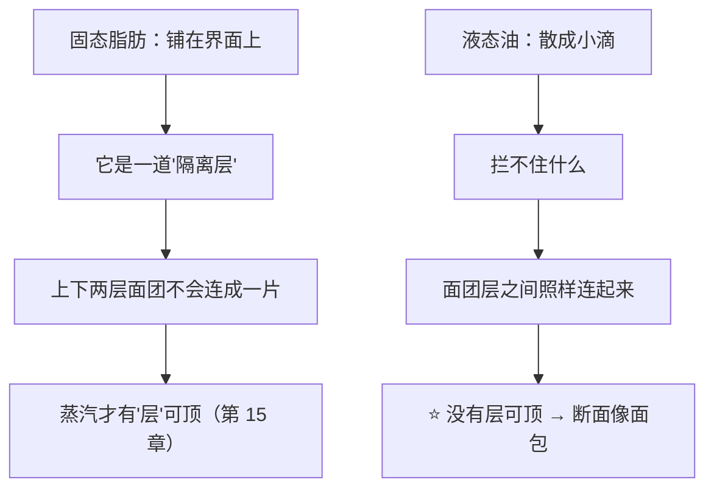
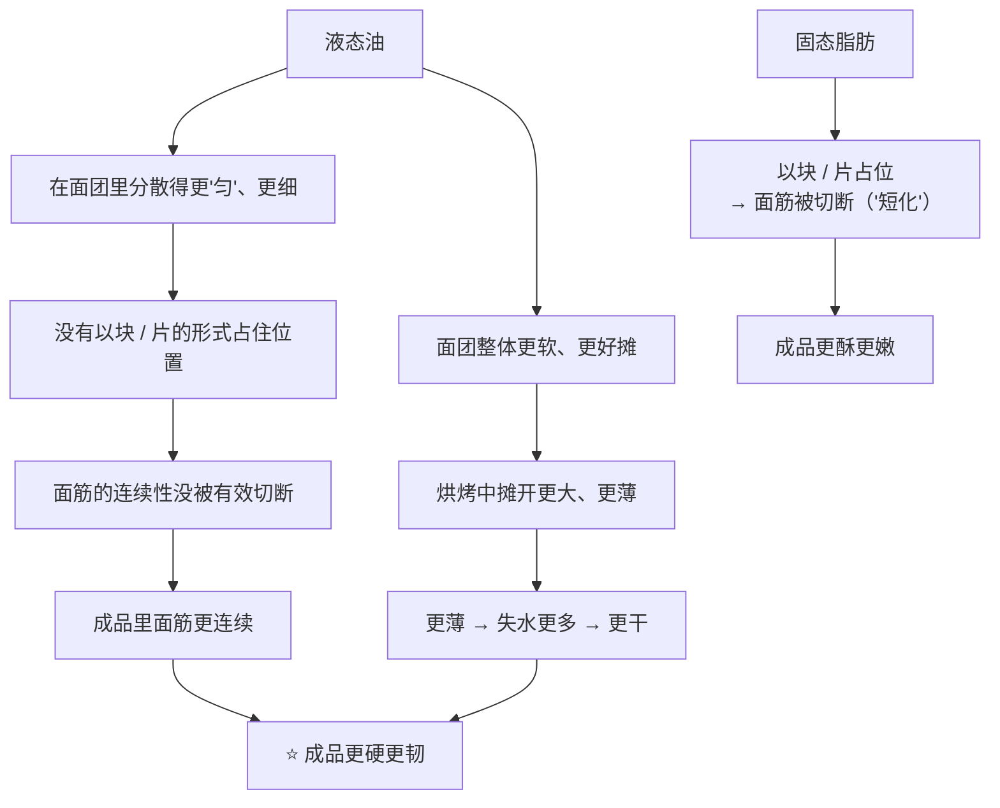
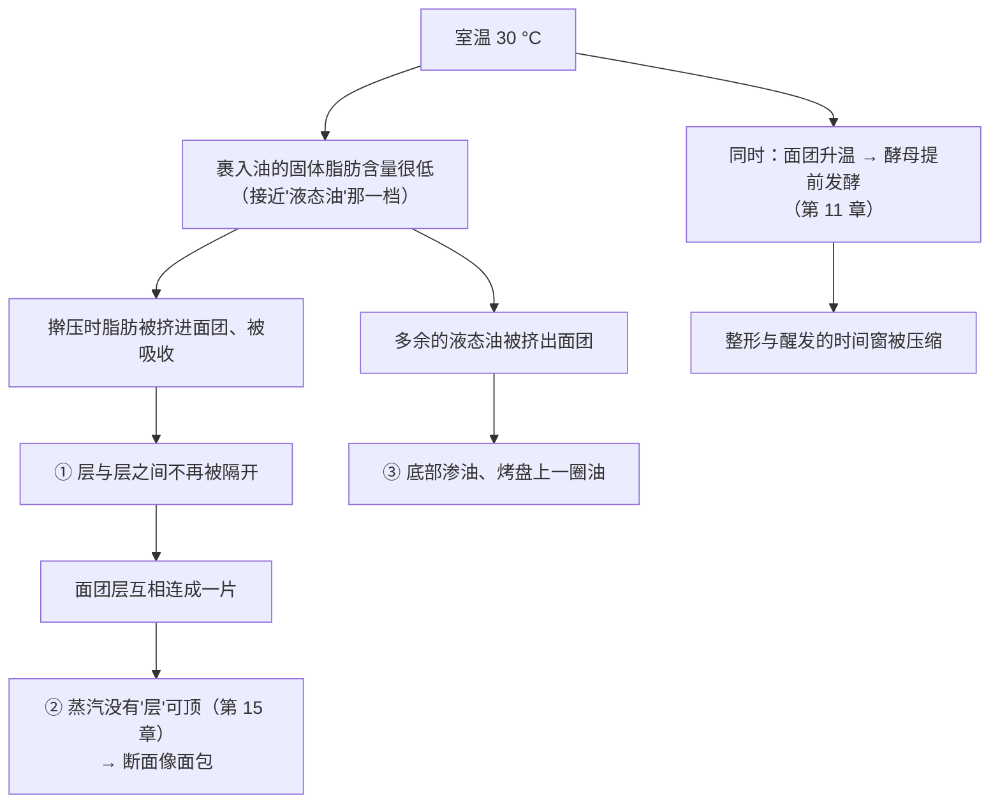

# 第 19 章 思考题参考答案

> 只记「问题 + 正确答案」。案例题给**完整推理链**——
> "这一步的目标是什么 → 脂肪在什么状态 → 它还能不能'隔开' → 怎么验证"。
>
> 涉及数字的地方，来源见[参考书目与出处登记](../standards.md)。

## Q1

**问**：为什么"固态脂肪"不是一个状态而是一个量？

**答**：

因为室温下的一块黄油**不是均匀固体**，而是**脂肪晶体搭成的网络，孔隙里泡着液态油**。
所以真正有意义的问题是：**在这个温度下，有百分之多少是固体**——这就是**固体脂肪含量**。

**实测的量级**（一项比较棕榈基起酥油与动物脂的研究）：

| 观察 | 数值 |
|------|------|
| 该研究覆盖的起酥油熔点范围 | **33~60 °C** |
| 高熔点档（55~60 °C）在 10 °C 时的固体脂肪含量 | **高达 98%** |
| 低熔点档（33~42 °C）的主导晶型 | **β′** |

**为什么"黄油""起酥油"是一类而不是一种**：

1. **熔点范围本身就跨了近 30 °C**；
2. **晶型不同**（α / β′ / β），而 **β′ 是烘焙应用中受偏好的晶型**；
3. **晶体大小不同**；
4. 同一批原料用不同的冷—温—冷成熟制度处理，**结晶行为与质地都会变**
   （高脂黄油研究：可塑性与操作性能**强烈依赖结晶网络与微观结构**）。

> ⚠️ 本书**不给**"黄油要在多少 °C 操作"的数字——家用黄油的固体脂肪含量—温度曲线
> 未核到可引用数据（已登记为缺口）。用手指判据：
> **能留下清晰指印、不粘手、不出油**；裹入油再加"**能弯不能断**"。

## Q2

**问**：高、低固体脂肪含量的棕榈油在面团里"待的位置"有什么不同？对起层意味着什么？

**答**：

| 熔点 38 °C（25 °C 时固体脂肪含量 29.35%） | 熔点 24 °C（25 °C 时 4.61%） |
|---|---|
| 位于**蛋白质与淀粉的界面上** | 变成**分散的小液滴** |
| 热处理后面筋网络**平均长度更短**、剪切强度更高 | 新鲜面团的面筋网络**更连续** |

**对起层意味着什么**：

**一句话**：

> ## **起层要的不是"油"，是"在擀压温度下还能保持成片的东西"。**

这也是可颂研究里那句话的意思：**不饱和油在室温下是液态的，
无法提供富含饱和脂肪的固态脂肪所具有的工艺功能。**

## Q3

**问**：为什么"用油做的饼干面团更软，成品却更硬"？

**答**：

**实测**（六种油脂做饼干的研究）：**葵花籽油 → 面团最软、摊开最大、成品最硬**；
**氢化脂 → 面团最硬、摊开最小、成品最嫩**。一篇综述也记录到"用油时面团更软、摊得更大"。

**因果链**：

**可迁移的一句**：

> ## **面团的软硬和成品的软硬没有必然关系，甚至常常相反。**
> 所以"面团太硬，加点油吧"这种临场决定，**改的是成品，不只是手感**。

## Q4

**问**："从第 3 次擀折起出现脱气"能不能直接用在你家的可颂上？

**答**：**不能。** 三条理由：

| 理由 | 说明 |
|------|------|
| ① **产品不同** | 那是**丹麦酥**，油脂层 4~12 层，配方、含水量、糖油量都与你的不同 |
| ② **设备不同** | 工业层压机与手擀的受力、速度、面团升温完全不同 |
| ③ **关键量不是"次数"而是"厚度与温度"** | 该研究给出的是"此时**面团层厚度中位数约 750 µm**"——次数只是达到这个厚度的途径 |

**但可迁移的东西有两条**：

1. **转折点是存在的**：继续擀折会从"增加层数"变成"赶走气"；
2. **它能被自己测出来**。

**找到你自己那个转折点的方法**（本章实操任务四）：
同一份面团分三组，擀折 **n−1 / n / n+1** 次，其余全部一致、同炉同时，
记录擀完时的**面团温度**、断面能数出的层、成品高度与组织。
**如果多擀一次反而更矮更致密，你就找到了它。**

> ⚠️ 注意这个实验也不干净：擀折次数同时改变了面团温度、脂肪被塑化的程度与总操作时间
> （可颂研究观察到**机械加工对脂肪质地不利**）。**它给方向，不给定量。**

## Q5

**问**：夏天 30 °C 厨房里做可颂，成品没有层、断面像面包、底部有油渗出。

**答**：

**（a）完整推理链**：

**（b）属于 19.6 的"太热"那一类**——脂肪的固体脂肪含量太低，
它不再是"隔离层"，而是被面团吸收的润滑剂。

**（c）该改哪个变量：温度（脂肪与面团的相对硬度）。** 两个可执行做法：

| 做法 | 具体 | 代价 |
|------|------|------|
| **把操作切成多段，每段之间回冷藏** | 每擀折一次就放回冷藏静置，让脂肪与面团**重新对齐硬度** | 总时长拉长；面团在冷藏中继续发酵（第 24 章），时间安排要重算 |
| **换一款熔点更高的裹入油** | 选在你厨房温度下仍能"能弯不能断"的油脂 | 风味会变（黄油的风味来自乳脂）；⚠️ 不同油脂的**熔化行为**差别很大——千层酥研究里有两种共混物**就因为熔化行为被判定不适合** |

**怎么验证**：下次**只改这一个变量**（加回冷藏步骤，其余全同），
记录每次擀折前后的**面团温度**与成品断面层次。

## Q6

**问**：冬天用刚从冷藏取出的黄油擀酥皮，面片擀不开、边缘开裂，成品层次断断续续。

**答**：

**（a）属于"太冷"那一类**：固体脂肪含量太高，脂肪太脆，
被擀压时**断裂**而不是跟着面团一起延展。

**（b）为什么"用力多擀几下"会更糟**：

| 用力擀 | 结果 |
|--------|------|
| 脂肪继续**碎成更多小块** | 断层更多——丹麦酥研究把这种缺陷量化过：**缺油与断层可占预期油脂层总长的 7.7%** |
| 面团被过度施力 | 面筋被"打"得更强、更回弹（第 16 章），面片更难擀开，形成恶性循环 |
| 局部升温 | 一部分脂肪反而开始软化——于是**同一张面片上同时出现"太冷"和"太热"两种失败** |

**（c）怎么验证**：

| 步骤 | 做什么 | 看什么 |
|------|-------|-------|
| ① | 把裹入油从冷藏取出后**先回温到"能弯不能断"** 再擀，其余全同 | 边缘还开不开裂 |
| ② | 记录每次开擀前的**脂肪温度与面团温度** | 两者是否接近 |
| ③ | 数成品断面的层，并**拍下断裂处的位置** | 断层是否减少 |
| ④ | 如果还是擀不开 | 那更可能是**面筋回弹**问题（第 16 章），改法是"多给松弛时间"，不是多用力 |

## Q7

**问**：【辨析】"黄油和植物油可以等量互换"。

**答**：

**证据强度：❌ 明确错误（在需要固态脂肪的配方里）。**

**三条实测依据**：

| # | 证据 |
|---|------|
| ① | 模型面团研究：**高固体脂肪含量的油脂待在蛋白质—淀粉界面上，低固体脂肪含量的变成分散小液滴**；后者的**面筋网络反而更连续** |
| ② | 可颂研究原文：**不饱和油在室温下是液态的，无法提供富含饱和脂肪的固态脂肪所具有的工艺功能** |
| ③ | 千层酥研究：四种共混物里**有两种因为"熔化行为"被判定不适合做千层酥**——**连"都是固态脂肪"都不够，还要熔化行为对** |
| ④ | 饼干研究：**葵花籽油 → 面团最软、摊开最大、成品最硬**；**氢化脂 → 面团最硬、摊开最小、成品最嫩** |

**"等量"还漏掉了什么**：

> **水。** 黄油按美国法定定义**含乳脂不低于 80%**——也就是说
> **它还有近两成不是脂肪**（其中主要是水，第 5 章）。
> 用纯油等重替换黄油，等于**同时减掉了这部分水**，
> 而水要参与水合、糊化与蒸汽（第 3、15、17 章）。
> ⚠️ 各国对黄油的法定定义口径不同。

**还有两笔账**：**风味**（乳脂特有）与**乳固形物**（参与褐变，第 4、21 章）。

## Q8

**问**：【辨析】"层越多越酥"。

**答**：

**证据强度：⚠️ 有条件——转折点是存在的。**

**已核到的实测**：

| 研究 | 数字 | 为什么不能当通用参数 |
|------|------|-------------------|
| 丹麦酥定量 MRI | 油脂层 **4~12 层**；**第 3 次擀折前充气不受影响，从第 3 次起出现脱气**；此时面团层厚度中位数约 **750 µm** | **特定产品 + 特定设备**；而且真正的量是**厚度**，不是次数 |
| 减脂千层酥响应面优化 | 油脂层数 **50~200**、最终厚度 **1.0~3.5 mm**、裹入油量——**三者共同**显著影响结构 | 这是**实验设计范围**，不是推荐值；而且三个参数**耦合**，不能单独调一个 |

**为什么"越多越酥"会流传**：因为在**层数还少**的那一段，它确实成立——
层越多，单层越薄，口感越细。问题出在**它被外推到了转折点之后**。

**转折点之后会发生什么**：

1. **继续擀折开始赶走气**（丹麦酥研究的直接观察）；
2. 单层薄到一定程度后，**面团层与油脂层容易破**——缺油与断层的比例上升
   （实测可占预期油脂层总长的 **7.7%**）；
3. **擀压本身会塑化脂肪**，而塑化**对质地不利**（可颂替代油脂研究的观察）。

> **本书的替代写法**：不给次数，给**方法**——
> 用 n−1 / n / n+1 三组对照，找到**你这套做法**的转折点（本章实操任务四）。
