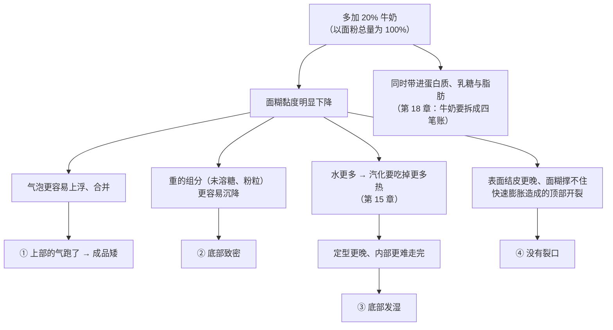

# 第 20 章 思考题参考答案

> 只记「问题 + 正确答案」。案例题给**完整推理链**——
> "这份配方在轴上的位置 → 改动把它移到哪 → 哪套机制被换掉了 → 怎么验证"。
>
> 涉及数字的地方，来源见[参考书目与出处登记](../standards.md)。

## Q1

**问**：为什么"面团和面糊"是一条连续谱？用已核到的实验点说明。

**答**：

最直接的证据来自一项面粉—水面糊研究，它把浓度一路走了过来：

| 面糊浓度（**面糊中面粉的质量分数**） | 面筋蛋白的形态 |
|---|---|
| **30%** | 分散的**颗粒** |
| **35%、40%** | **成簇** |
| **45%** | **连续网络** |

**读法**：面筋不是"有"或"没有"，而是**逐步聚起来**的。
"面团 / 面糊"这两个词描述的是这条连续变化上的两段，**中间没有分界线**。

**旁证**（同方向）：

- 白面包加水 45% / 60% / 75%（**面粉基准**）：**面包芯在 45% 时就已经完全糊化**——
  也就是说**淀粉这条线在很宽的含水范围内都能完成**；
- 中式馒头加水 45% / 50% / 55%（**面粉基准**）：加水越多网络越呈纤维状，
  但 **55% 时发酵中出现面筋纤维断裂**——**同一条轴上继续走，机制会换**。

> **可迁移的一句**：
> ## **改水量不是"让它湿一点"，是在这条轴上移动位置。**

## Q2

**问**：三个"45%"的基准分别是什么？搞混会怎样？

**答**：

| 出现的地方 | 基准 | 含义 |
|-----------|------|------|
| 面糊浓度 **45%** | **面糊总重中面粉占的质量分数** | 这份糊有多浓；换算过去水比面粉**还多** |
| 白面包加水 **45%** | **面粉重量**（该研究写明） | 每 100 g 面粉加 45 g 水——这是**相当干**的面团 |
| 中式馒头加水 **45%** | **面粉重量** | 同上 |

**搞混的后果**：

> 会把"**水比面粉还多的稀糊**"和"**偏干的面团**"当成同一件事。
> 于是得出"面筋在 45% 就能形成连续网络，所以我的面团肯定没问题"之类的结论——
> **两个 45% 描述的体系差了整整一条轴。**

**本书的纪律**（第 9 章）：

1. 自己写：**一律以面粉总量为 100%**；用别的基准时**当页写明**；
2. 读别人的：**没写明基准的百分比只能当方向用，不能当数字用**；
3. 含牛奶、蛋、酸奶的配方，**把它们各列一行**，不要并进"含水量"。

## Q3

**问**："多搅一会儿"在两端分别意味着什么？为什么中间会反转？

**答**：

| | 面团端 | 面糊端 |
|---|-------|-------|
| 搅拌的作用 | **输入机械功、建网络**。第 16 章的模型把它写成：面团形成时间 = 面粉的能量需求 ÷（比功率 − 该面粉的临界功率） | **充气与分散**（第 14 章） |
| 多搅的结果 | 网络更发达，直到过头 | **可能更差**：一项充气饼干面糊研究里，**成品中心高度随充气时长下降**，密度与力学阻力上升 |

**中间为什么反转**：同一项面粉—水面糊研究观察到，

> **延长搅拌在浓度 30% 与 45% 下降低面筋聚集指数与麦谷蛋白大聚体，
> 而在 35% 与 40% 下方向相反。**

而且该研究还指出**聚集程度与网络连续性并非正相关**——
也就是说"**聚得多**"不等于"**连得好**"。

**结论**：

> ## **"搅多久"离开含水量就没有答案；而且"搅得更多 = 网络更强"这个直觉只在轴的一段成立。**

⚠️ 这项研究做的是**面粉—水模型面糊**，不是蛋糕面糊。
本书只引用"方向会随浓度反转"这一点，**不外推到具体成品**。

## Q4

**问**：面糊靠什么保气？为什么不给"最佳黏度"的数字？

**答**：

**靠黏度。** 面糊没有连续的面筋网络（Q1），气室的稳定性主要由连续相的黏度决定。
海绵蛋糕研究的表述很直接：**面糊黏度越高，排液、气室合并与气泡上浮越少，气室越稳定**。

**为什么不给数字**：因为另一项研究的方向看起来相反——
**流动距离更长、黏度更低的面粉—水与面粉—蔗糖面糊，做出的蛋糕体积更大**
（同一研究里**籽粒硬度与溶剂保持力也与蛋糕体积负相关**）。

**这两条不矛盾，但测的不是同一件事**：

| | 第一条 | 第二条 |
|---|-------|-------|
| 在测什么 | **同一份面糊里气室稳不稳** | **不同面粉**做出的成品体积 |
| 变量是 | 黏度 | 面粉性质（连带影响黏度、吸水、糊化） |

所以能说的只有两个方向 + 一个诚实的空白：

> **太稀** → 气泡上浮、合并、重组分沉降 → 矮、粗、底部致密；
> **太稠** → 涨不动、传热慢 → 矮、紧实；
> **中间有窗口，但"窗口在哪"本书未核到实验**（已登记为缺口）。

**你能做的**：用**面糊比重**（同一容器装满称重）把自己的几次结果排成序列，
找到你这份配方的窗口。

## Q5

**问**：马芬面糊"看起来太稠"，多加 20% 牛奶（以面粉总量为 100%），结果矮、底部致密发湿、顶部没裂口。

**答**：

**（a）完整推理链**：

**（b）他跨过的是"面糊保气靠黏度"这一档**——
在面团端，水多一点主要改的是延展性；在**面糊端，黏度本身就是保气机制**，
黏度掉下去，**保气机制就被削弱了**。

**（c）两个方向与代价**：

| 方向 | 做法 | 代价 |
|------|------|------|
| **保住黏度，换个方式补湿润** | 不加液体，改为提高体系的**保水能力**（提高糖量——糖吸湿保湿且推迟定型，第 4、17 章；或引入能抓水的成分） | 改糖会连带改甜度、上色与定型时刻；改配方就要重新走一遍对照 |
| **加液体，但把黏度补回来** | 加液体的同时提高干物质（如提高面粉量，或部分改用吸水更强的材料） | 这等于**重做一份配方**，其余比例都要跟着重算（第 9 章：缩放与改动是两回事） |

> ⚠️ 本书**不给**"加多少牛奶要补多少粉"的换算——各类成品的百分比典型区间未核到一手出处。
> **先用面糊比重把当前这份记录下来，再改一档比一次。**

## Q6

**问**：吐司加水从 62% 提到 75%（以面粉总量为 100%），搅拌时间不变，结果黏、摊开、组织粗大、侧面塌陷。

**答**：

**（a）解释**：

| 现象 | 机制 |
|------|------|
| **面团很黏** | 自由水变多；同时**同样的搅拌时间在更稀的体系里输入的"有效功"不同**——第 16 章的模型里，面团形成时间取决于比功率与该面粉的临界功率，**含水量一变，整条曲线都变了** |
| **整形时摊开** | 网络的强度不足以支撑形状；挂面面团研究里可以看到同方向的量化变化：**应力松弛模量随含水量升高明显下降** |
| **组织粗大** | 保气能力下降 → 气室更容易**合并**（第 10 章） |
| **侧面塌陷** | 撑起来了但**没定住**——第三部分导读那张"撑不起来 vs 没定住"的分辨表，这属于后者 |

**（b）"机制被换掉"的那一步是"搅拌时间不变"**：
加水 13 个百分点之后，**这已经不是同一份面团了**，
沿用旧的搅拌时间等于**给了一个不匹配的能量输入**。
另外，馒头面团研究在 **55%（面粉基准）** 就观察到发酵中**面筋纤维断裂**——
高含水量体系里"网络被扯断"是一个真实存在的风险方向。

**（c）分步验证（一次只改一个变量）**：

| 步骤 | 只改什么 | 记录什么 |
|------|---------|---------|
| ① | 把水**分两次加到 68%**（中间档），搅拌时间不变 | 面团手感、整形时是否摊开、成品组织 |
| ② | 保持 68%，**只延长搅拌 / 增加折叠次数** | 面团能不能站住（第 16 章的自测判据） |
| ③ | 保持 68%，**只增加松弛/静置时间** | 延展性变化（静置研究方向：水分更均匀、网络更致密） |
| ④ | 确认 68% 稳定后，再往 72% 走 | 找到**你这份配方的档边界** |

> **一条纪律**：高含水量不是"更好"，是**一次交换**——
> 买到延展性与更均匀的网络，代价是网络更容易被扯断（第 40 章会还这笔账）。

## Q7

**问**：【辨析】"面糊不能多搅，一搅就出筋"。

**答**：

**证据强度：⚠️ 有条件——而且已核到的实验让它变复杂了。**

| 维度 | 说明 |
|------|------|
| **它在哪一段成立** | 在含水量足以形成连续网络的那一段（研究里是面糊浓度 **45%**），继续搅确实在动面筋 |
| **哪里变复杂了** | 同一研究发现**延长搅拌的影响方向会随浓度反转**：**30% 与 45% 下降低**面筋聚集指数与麦谷蛋白大聚体，**35% 与 40% 下相反** |
| **还有一条** | **聚集程度与网络连续性并非正相关**——"出筋"这个词把两件事混成了一件 |
| **面糊端的另一个真实代价** | 多搅可能**赶走气**：一项充气饼干面糊研究里**成品中心高度随充气时长下降** |
| **为什么流传** | 因为"搅过头的马芬不好吃"是**真实观察**；问题在于**把现象直接归因到面筋**，而这条因果本书**未核到**直接实验 |

**本书的写法**：不说"会出筋"，说——

> **在面糊端多搅，可能同时在改三件事：充气量、面筋聚集、面糊温度。
> 先把它当变量记录，别急着给它一个机制。**

## Q8

**问**：【辨析】"看配方的含水量就知道是什么成品"。

**答**：

**证据强度：⚠️ 方向有道理，但实践上先要过两道关。**

**第一关：基准。** 本章 20.1 的表里，同样写作 45% 的数字有三种含义
（面糊中面粉的质量分数 / 加水量占面粉重量 / ……）。
**不问基准就比较百分比，等于拿两把不同的尺子量东西。**

**第二关：液体不止是水。** 牛奶、蛋、酸奶、糖浆都带水，
而且它们**还带进别的东西**（第 18 章：牛奶要拆成水 + 蛋白质 + 乳糖 + 脂肪四笔）。
所以"含水量"这一个数字**并不能代表这份配方在轴上的位置**。

**为什么本书不给各类成品的含水量区间**：

> ⚠️ 这类区间（"面包 60~70%""蛋糕面糊 100% 以上"）**本书未核到一手出处**，
> 已登记为缺口。给一个听起来专业的区间很容易，但**它会被读者当成判据去用**。

**替代做法**（本章 20.1 采用的）：用**能核到的实验点**标定这条轴，
每个点写明**它自己的基准**；再用"哪套机制能开工"来判断成品类别——
**这比记区间更可迁移**。
