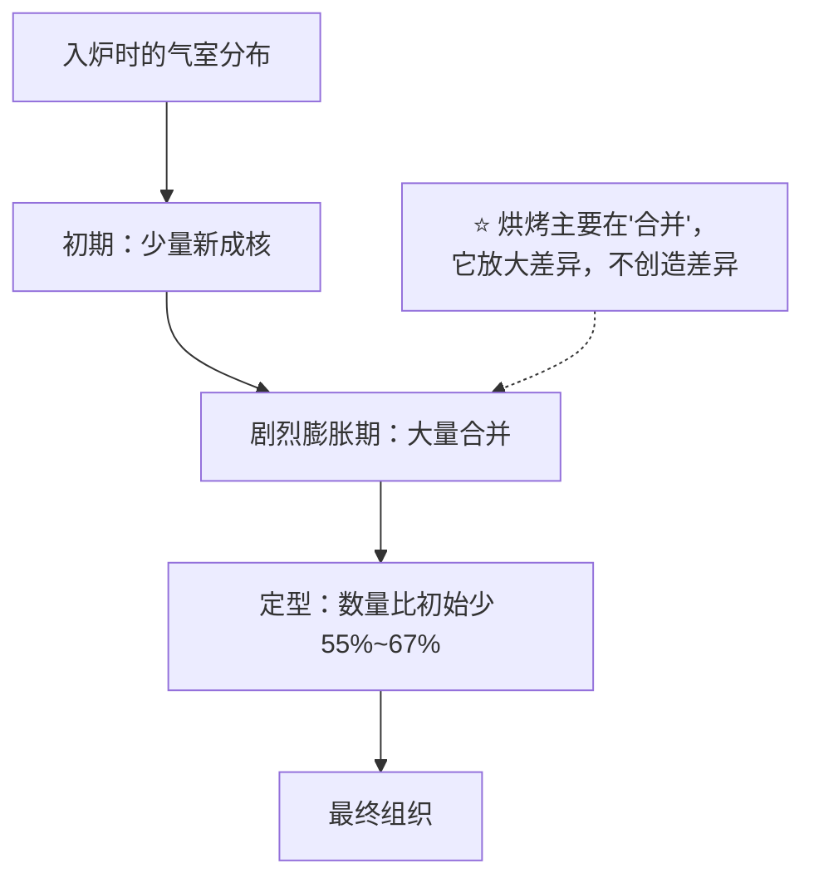
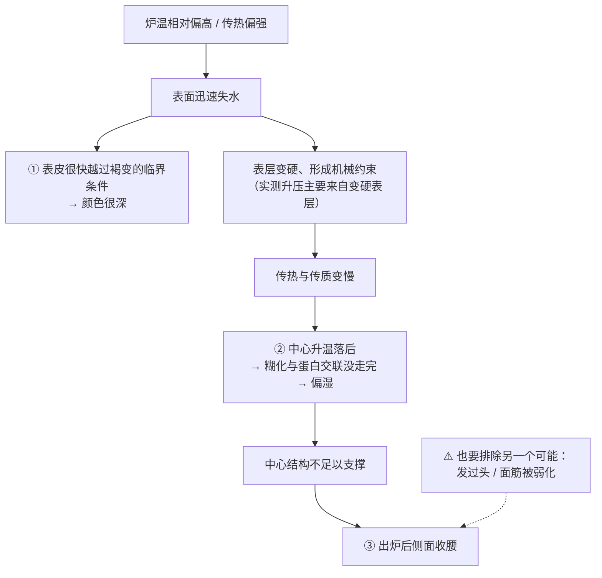

# 第 21 章 思考题参考答案

> 只记「问题 + 正确答案」。案例题给**完整推理链**——
> "现象在时间轴的哪一段 → 哪套机制出了问题 → 改哪个变量 → 用哪个记录量验证"。
>
> 涉及数字的地方，来源见[参考书目与出处登记](../standards.md)。

## Q1

**问**：为什么烤箱里有"两条温度曲线"？各自的上限由什么决定？

**答**：

| | 内部（芯） | 表面（皮） |
|---|----------|-----------|
| 为什么升温慢 | 水在蒸发，**汽化把热吃掉了**（第 15 章：汽化焓约 2250~2280 kJ/kg） | 表面先失水，**失水之后就没有这个"刹车"了** |
| 上限由什么决定 | **水的沸点**——只要还有水在蒸发，就很难越过 100 °C | 由**炉温与传热**决定，可以远高于 100 °C |
| 实测 | 模拟中芯温不越过 100 °C，约 25 分钟后稳定在 **98 °C** 左右；实测汉堡面包芯温在最初 8 分钟升到约 100 °C 并保持 | 吐司研究（190~230 °C、各 40 分钟）对照组**表皮温度 128.5 °C → 190.2 °C** |

**这条差别解释了三件事**：

1. **褐变只发生在表面**——芯又湿又被钉在 100 °C 以下；
2. **表皮的糊化度本来就低**（实测 29.90%~44.36%，第 17 章），它主要靠**失水**变硬变脆；
3. **"外面好了里面没好"是必然倾向**，不是手艺问题——你能改的是**两条曲线的相对速度**。

## Q2

**问**：炉内膨胀的气来自哪三笔？为什么"酵母继续产气"不是主力？

**答**：

**三笔**：

| 来源 | 说明 |
|------|------|
| ① **已有气体受热膨胀** | 发酵或打发时就在里面的气室，随温度升高而变大 |
| ② **溶解的 CO₂ 逸出** | 温度升高使 CO₂ 在面团中的溶解度下降 |
| ③ **水与乙醇汽化** | 第 15 章：水变成蒸汽，体积放大一千多倍 |

**为什么酵母不是主力**（两条证据）：

1. **它确实还活着一阵，但很快就不行了**：电阻加热炉研究显示酵母
   **在约 50~65 °C 前仍有代谢活性**，**66 °C 时活细胞约 30%**；
   耐热菌株在 **77 °C** 时也只有 42.2%。⚠️ 这些是特定炉型与菌株，不是"死亡温度"。
2. **更关键的一条**（第 10 章）：一项用碳酸氢钠 + 葡萄糖酸-δ-内酯**代替酵母**的研究得出——
   **面团膨胀既不受 CO₂ 的量限制，也不受其释放动力学限制**，
   受限的是**烘烤阶段还能不能继续充气**。

> **可迁移的一句**：
> ## **炉内膨胀比的不是"还能产多少气"，而是"结构还能不能继续被撑大"。**

⚠️ 但也别走到另一个极端：耐热菌株研究里**面团高度增幅（18.6%~31.5%）与细胞存活率强正相关**，
说明酵母在这一段**仍有贡献**——只是不是唯一的那一笔。

## Q3

**问**：气室数量的三个阶段是什么？对组织意味着什么？

**答**：

| 阶段 | 实测 |
|------|------|
| ① **膨胀初期** | 合并速率**为负**——也就是**有新气室成核**，数量**增加多达 8%** |
| ② **最剧烈膨胀期** | 合并占上风，数量**每秒减少 2%~3%** |
| ③ **面包心形成结束** | 比初始**减少 55%~67%** |

**对组织意味着什么**：

**两条推论**：

1. **组织的差异来自更早的步骤**——扫描电镜研究：各**面团**阶段两份样品没有差别，
   但**烤到第 12 分钟时气室分布已经不同**。所以想改组织，
   要去改**搅拌、发酵、整形**（第 22、24、25 章），而不是改烘烤；
2. **"多的气室"不等于"好组织"**：真正决定组织的是**哪些活到了定型**。

## Q4

**问**："上色了就是熟了"错在哪？正确的判据是什么？

**答**：

**错在把两条独立的线当成一条**：

| 线 | 发生在哪 | 条件 |
|----|---------|------|
| **上色** | **表面** | 表面要先**失水**、温度升到水的沸点以上。定量旁证：**水分活度降到 0.4 以下是一个临界点**，越过后 HMF 生成速率急剧上升 |
| **熟（定型）** | **内部** | 淀粉糊化（进程取决于**距表面的深度**，一级动力学）+ 蛋白质交联（一级动力学，随温度加速） |

**它们可以严重脱节**——尤其在炉温偏高时：表面迅速干、迅速上色，
而内部仍被 100 °C 天花板与传热速度限制着。

⚠️ 另外，本书**不写"美拉德反应从 140~165 °C 开始"**这个数字——
它在二手资料里到处出现，但**找不到给出它的一手实验出处**。

**正确的判据**（第 32 章的核心）：

> ## **时间不可移植，温度与现象可移植。**

具体做三件事：

1. **测中心温度**并每次记录，建立"你这份配方"的读数；
2. **用状态判据**（晃动程度、回弹、切面）；
3. **记失重率**——同一配方下失重率稳定，说明烘烤强度稳定。

## Q5

**问**：吐司 180 °C 烤 30 分钟，表面很深、侧面收腰、中间偏湿，他想再多烤 5 分钟。

**答**：

**（a）完整推理链**：

**（b）"多烤 5 分钟"会改善哪个、恶化哪个**：

| 现象 | 多烤 5 分钟的影响 |
|------|-----------------|
| 中间偏湿 | **可能改善**（中心温度终于走完） |
| 表面很深 | **恶化**——表面本来就已经到位了 |
| 侧面收腰 | 可能略改善（结构更完整），但**同时更干**：失水继续，而蛋白质交联**不可逆**（第 18 章） |

> **一句话**：多烤是在**用表面的代价换内部的完成度**。

**（c）两个更好的改动方向**：

| 方向 | 做法 | 要记录什么来验证 |
|------|------|----------------|
| **降低炉温、延长时间** | 例如降一档炉温，烤到**同一个中心温度**为止（不是同一时间） | 出炉时**中心温度**、**失重率**、表皮厚度与颜色——如果中心温度相同而颜色更浅、失重更低，方向就对了 |
| **先确认炉温是不是准的** | 用独立温度计实测（第 29 章、项目 P3）；同时检查模具材质与颜色、摆放位置（第 28、31 章） | 设定值与实测值的差；换位置后的差异 |

> ⚠️ 还要排除"发过头"这个独立嫌疑：记录**入炉前高度**与**炉内涨幅**两列（第 10 章）——
> 如果入炉前就已经很高、炉内几乎不涨，那更像发酵问题，不是烘烤问题。

## Q6

**问**：欧包入炉前高度正常，但炉内几乎没涨，组织紧实、底部有致密带。

**答**：

**（a）用"膨胀窗口"与"定型时刻"分析**：

**入炉前高度正常** ⇒ 产气与保气在炉外是够的（第二部分没问题）。
**炉内几乎不涨** ⇒ 问题出在**窗口太短**——要么定型太早，要么这一段的气没能起作用：

| 可能 | 机制 |
|------|------|
| **定型太早** | 表面过早结皮变硬 → 机械约束（实测升压主要来自变硬表层）；或配方含水/含糖偏低使糊化提前（第 17 章） |
| **气用不上** | 气室在入炉前已经过度膨胀/合并——第 10 章那项醒发研究观察到**越过峰值是断崖式下降**；第 10 章另一项还指出**初始 CO₂ 体积过高会损害炉内膨胀** |
| **底部致密带** | 底部受热与失水方式不同，常与下火过强 / 装载方式 / 面团过软下塌有关（第 28、31 章） |

**（b）三个值得怀疑的变量，一次只改一个**：

| # | 变量 | 只改它，看什么 |
|---|------|--------------|
| ① | **醒发程度**（缩短一档） | 炉内涨幅是否回来——这能区分"发过头"与"烘烤问题" |
| ② | **炉温与预热**（用独立温度计实测后调整；确认蓄热是否足够） | 炉内涨幅、表皮厚度 |
| ③ | **蒸汽 / 表面保湿**（让表面晚一点定住） | 炉内涨幅与表皮厚度。⚠️ 家用蒸汽替代方案的定量效果本书**未核到**，只能自己对照 |

**（c）最能区分"没涨"和"涨了又塌"的记录量**：

> ## **炉内涨幅——但要配合"最高点"一起看。**

炉内涨幅只给你"入炉前 → 出炉后"的净差。
如果怀疑"涨了又塌"，就**隔着炉门每隔几分钟拍一张照**（不开门），
事后看它有没有出现过更高的峰值。**净差相同、过程完全不同**——这是两种不同的失败。

## Q7

**问**：【辨析】"前十分钟绝对不能开炉门"。

**答**：

**证据强度：⚠️ 工艺口语——机制方向相容，但本书未核到对照实验。**

| 维度 | 说明 |
|------|------|
| **机制上说得通的部分** | 表层定住之前，成品正处在**还在涨**的阶段；而实测显示烘烤中的升压**主要来自变硬表层的机械约束**（最高约 1.1 kPa）。开门会同时造成**降温**与**环境改变**，理论上可能影响这一段 |
| **缺什么** | **没有核到**比较"开门 vs 不开门"的定量对照实验（已登记为缺口） |
| **为什么本书不给"十分钟"** | 这个时间取决于体积、炉温、模具、蒸汽——**它不可能是一个通用数字**。而且不同成品的"表层定住"发生在完全不同的时刻 |
| **为什么流传** | 因为在**戚风、舒芙蕾一类靠泡沫撑住、结构很脆弱**的成品上，人们确实反复观察到失败。它在那一类里成立，被推广到了所有成品 |

**本书的写法**：把它当**惯例**——

> **在"还在涨"的阶段尽量别开门；想确认状态，用炉灯和玻璃看，或者用探针温度计一次到位。**
> 与其争论几分钟，不如**记录你这份配方的膨胀峰值出现在第几分钟**（Q6 的拍照法）。

## Q8

**问**：【辨析】"喷蒸汽是为了上色"。

**答**：

**证据强度：⚠️ 实测显示它主要改的不是颜色。**

一项比较加湿烘烤与常规烘烤的研究（185 / 195 / 205 °C × 25 / 30 / 35 分钟）：

| 指标 | 结果 |
|------|------|
| **表皮颜色** | **没有显著影响**（P > 0.05） |
| **表皮厚度** | **显著减小**（P < 0.001） |
| **面包芯初始含水量** | **提高** |
| **储存 96 小时的变硬速度** | **更慢**（较低烘烤温度与较短时间下尤其明显） |

另有一项法棍研究从另一个角度支持蒸汽的价值：**水蒸气有利于膨胀**
（该研究里膨胀最大可达 1.7 倍，出现在芯温接近 90 °C 时）。

**所以蒸汽真正改变的两件事是**：

> ## **① 让表面晚一点干、晚一点定住（表皮更薄、膨胀更充分）；
> ## ② 让成品带着更多水出炉（于是第二天更慢变硬）。**

⚠️ **两条重要边界**：

1. 这是**一项研究、特定产品与设备**的结果，本书只引用方向；
2. **家用蒸汽替代方案（放水碗、喷水）的定量效果本书未核到**（已登记为缺口）——
   要用就自己做对照，记录**炉内涨幅、表皮厚度、失重率**三项。
