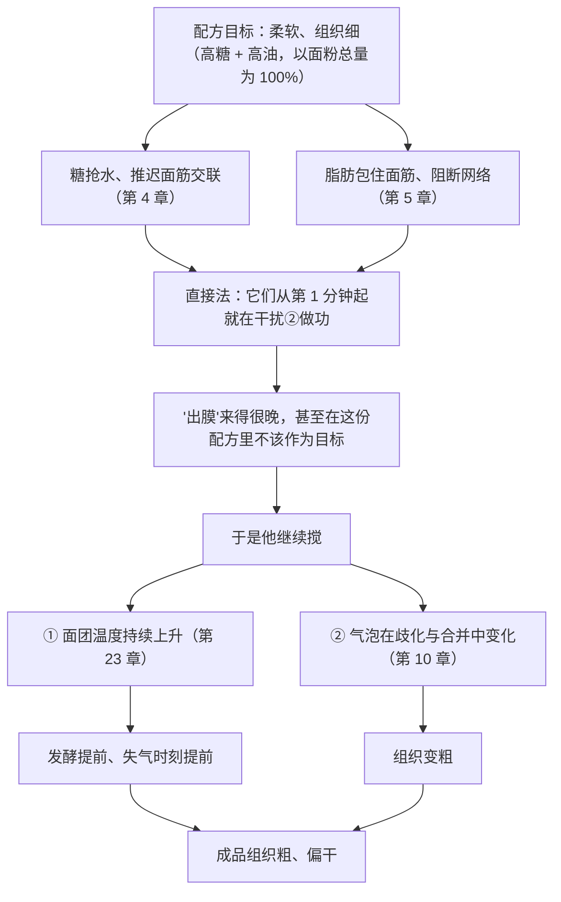
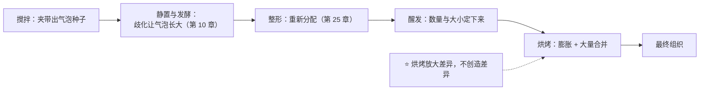

# 第 22 章 思考题参考答案

> 只记「问题 + 正确答案」。案例题给**完整推理链**——
> "这份配方的目标是什么 → 这个操作抢走了谁的什么 → 连带要改哪一项 → 用哪个记录量验证"。
>
> 涉及数字的地方，来源见[参考书目与出处登记](../standards.md)。

## Q1

**问**：搅拌同时在做哪四件事？为什么"搅拌不够"和"搅拌过头"可能同时发生？

**答**：

| # | 它在做什么 | 讲过它的章 |
|---|-----------|-----------|
| ① | **水合**——让水找到蛋白质与淀粉 | 第 3、16 章 |
| ② | **做功**——机械激活面筋网络 | 第 16 章 |
| ③ | **卷入空气**——气室的"种子"是被**夹带**进来的 | 第 10、14 章 |
| ④ | **分散与隔离**——糖、盐、油脂各就各位 | 第 4、5、7 章 |

**为什么两件事能同时成立**：这四件事**最好的停手时刻不在同一刻**。

一个典型场景：高油高糖的面团里，脂肪从一开始就在阻断面筋（第 5 章），
所以 ② 还没到位；但你为了让它"出膜"继续搅，
③（气泡）已经在**歧化与合并**中变化（第 10 章）、面团温度也一路上升（第 23 章），
甚至可能把已经形成的网络搅坏。

> ## **所以"搅够了没有"不是一个问题，是四个问题。**

## Q2

**问**：为什么"搅 8 分钟"不可移植？换一袋面粉改的是哪一项？

**答**：

那条关系式是：

> **面团形成时间 = 面粉的能量需求 ÷（比功率 − 该面粉的临界功率）**

| 你换了什么 | 改的是式子里的哪一项 |
|-----------|-------------------|
| **换一袋面粉** | **分子（能量需求）与分母里的临界功率同时变**——它们都是"这袋粉"的属性 |
| 换机器 / 换转速 | **比功率** |
| 面团做多做少 | **比功率**（同样的机器，面团越多，单位质量拿到的功率越低） |
| 在开头加一个停顿（自解法） | **降低临界功率**——研究里实测到这一点 |

所以"8 分钟"只是**某一台机器、某一个面团量、某一袋粉**下的一个解。

**旁证**：一项专门比较揉面机类型与总转数的研究发现，机型与总转数**都有统计显著影响**，
而且**直接法与 biga 法各自适配不同机型**。⚠️ 该研究的转数是实验设计，不是推荐值。

## Q3

**问**：中种法与汤种法都"先处理一部分面粉"。各自先给了那部分面粉什么？

**答**：

| | 中种法 | 汤种法 |
|---|-------|-------|
| 先给的是 | **时间与微生物**（发酵） | **热与水**（糊化） |
| 那部分面粉发生了什么 | 被发酵：产酸、产风味前体、面筋被代谢物弱化（第 11、12 章） | 被糊化：淀粉吸水膨胀、失去结晶（第 17 章），**面筋被破坏** |
| 买到什么 | 风味、延展性、抗老化；**更宽的操作时间窗**（中种含盐研究里，盐还能改变对发酵时间的要求） | **保水**：更高的含水量与比容、更低的硬度与咀嚼性（两项独立研究方向一致） |
| 抢走什么 | **时间**；面团更软、终点更难判断 | **结构**：那部分面粉不再提供面筋；而且**总水量必须重新配平**（研究中加糊的面团需要更多水） |

**一条重要的限定**（来自扁面包研究）：

> ## **中种买到的是"芯"的品质。对一个几乎没有芯的成品（很薄的饼类），
> ## 实测显示制法对比容没有显著影响——你买了也用不上。**

## Q4

**问**：高糖高油软面包用直接法长时间搅拌，"不出膜"，成品组织粗、偏干。

**答**：

**（a）推理链**：

**（b）三个改动方向**：

| 方向 | 它改的是四件事里的哪一件 | 预期 |
|------|----------------------|------|
| **改用后油法**（先把粉、水、糖搅到面筋起来，再加油脂） | 改 **④ 隔离的时机**——让 ② 做功先完成 | 达到同样状态所需的功更少。⚠️ 这是**惯例**，本书未核到定量实验 |
| **改用中种法或折叠法** | 改 **① 水合与 ② 做功的分配**：用时间与分批给功替换掉一部分连续搅拌 | 面团温度更低、终点更好判断 |
| **停止用"出膜"当终点** | 改的是**判据本身** | 改用"搅拌档位 × 时长 × 面团终温"对照成品，建立自己的曲线 |

**（c）要记录的三个量**：

> ## **出缸时的面团温度、入炉前高度、炉内涨幅。**

前者告诉你搅拌给了多少热（第 23 章），后两者把"发得够不够"和"撑得住不住"分开
（第 10、21 章）。

## Q5

**问**：戚风蛋白打好后隔了十几分钟才翻拌，成品偏矮、底部有致密带。

**答**：

**（a）它属于哪一类问题**：**泡沫的寿命问题**（第 14 章）——
"能打起来"和"能站住"是两件事：起泡与稳泡由**不同的蛋白质**主导，
泡沫会通过**排液、合并、歧化**逐步劣化。
等待期间泡沫排液，液体下沉到盆底，翻拌时又被稀释的部分带进面糊，
于是出现"底部致密带"这个典型现象（第 20 章讲过它也可能来自沉降）。

**（b）为什么"下次打得更硬一点"不是好方案**：

| 理由 | 说明 |
|------|------|
| 它改的不是出问题的那一步 | 问题出在**打好之后的等待**，不是打的程度 |
| 本书不给"打到什么程度"的通用终点 | 它由配方黏度与"从打好到入炉的时间"共同决定（已登记为缺口） |
| 打过头有独立的风险 | 界面膜断裂与聚集后**不会复原**；而"加一个新蛋白补救"的效果本书**未核到**实验 |

**（c）只改一个变量的验证方案**：

> **做一次"等待时间"对照**：同一盆蛋白霜分两份，一份立刻翻拌入炉，
> 另一份等固定时长（例如你上次的那个时长）再翻拌，
> 两组的**配方、打发程度、炉温完全相同**。记录：入炉前面糊体积（或比重）、
> 炉内涨幅、成品高度、底部是否有致密带。

## Q6

**问**：【辨析】"面团必须揉出手套膜"。

**答**：

**证据强度：⚠️ 工艺口语，而且不通用——本书未核到它的学术对应（已登记为缺口）。**

| 维度 | 说明 |
|------|------|
| 它大致对应什么 | "面筋网络已经足够连续，可以被拉伸而不断"——与第 16 章的网络连续性方向相容 |
| 哪些配方里**不适用** | ① **高油高糖面团**：脂肪与糖本来就在阻断面筋（第 5、4 章）；② **高含水量面团**：它靠折叠与时间发展；③ **面糊**：延长搅拌的效果在不同浓度下**方向相反**；④ **所有以"短"为目标的配方**（酥皮、饼干、塔皮——第 19 章）：在那里"出膜"等于失败 |
| 为什么流传 | 因为在**以面筋为主要结构、油糖不高的面包**里它确实好用，然后被推广到了所有配方 |

**替代判据（可自建）**：

> **取样法**：同一份面团，搅拌过程中每隔固定时间取一小块，按同样方式拉伸并拍照，
> 与最终成品的"入炉前高度 / 炉内涨幅 / 组织"对照。
> ## **你得到的是你这台机器、这袋粉的一条曲线——曲线可迁移，"8 分钟"不可迁移。**

## Q7

**问**：【辨析】"打发打得越久越蓬松"。

**答**：

**证据强度：❌ 实测方向相反。**

一项关于充气条件（转速与充气时长）的研究测到：

| 指标 | 随充气时长变化 |
|------|--------------|
| **打发率与气泡数** | **上升**（主要变化发生在前 20 分钟） |
| **成品中心高度** | **下降** |
| 成品密度与力学阻力 | **上升** |
| 更高转速（该研究中 1000 rpm） | 打发率与稠度指数**反而更低** |

**最值得记住的一点**：该研究做了典型相关分析，发现面糊与成品的**质构、感官之间**有显著联系，
但**面糊的"充气"与成品的"充气"之间没有找到显著联系**。

> ## **面糊里多出来的气，不一定活到成品里。**
>
> 这与第 10 章的结论是同一件事："产气 ≠ 结果"，中间还隔着**保气**与**定型时刻**。

## Q8

**问**：为什么说"整形前的每一步都在决定组织，烘烤只是在放大差异"？

**答**：

**两条证据接起来**：

| 环节 | 证据 |
|------|------|
| **气室的种子来自搅拌** | 气泡是在搅拌时被**夹带**进面团的（第 10 章的综述）；**烘烤不会凭空造出新气泡**，炉内那点新成核只发生在膨胀初期（数量增加多达 8%） |
| **烘烤主要在做合并** | 最剧烈膨胀期气室数量**每秒减少 2%~3%**，到面包心形成结束时比初始**减少 55%~67%** |
| **差异出现得很早** | 扫描电镜研究：各**面团**阶段两份样品没有差别，**烤到第 12 分钟气室分布已经不同** |

**所以链条是**：

**可操作的结论**：组织不好时，**先回去查搅拌、发酵与整形**（第 22、24、25 章），
而不是改炉温或时间——后者改的是"放大倍率"，不是"被放大的东西"。
