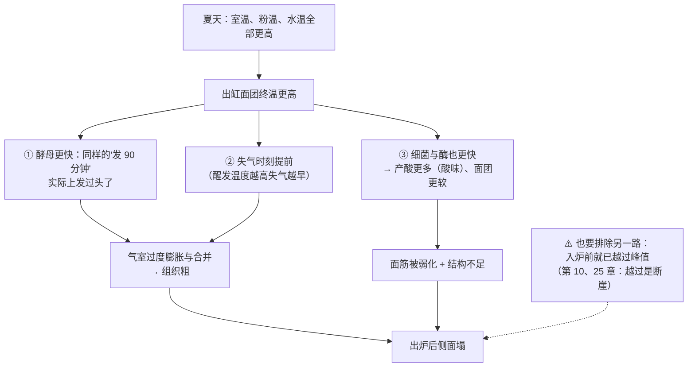

# 第 23 章 思考题参考答案

> 只记「问题 + 正确答案」。案例题给**完整推理链**——
> "这份配方的目标是什么 → 温度改了谁 → 连带要改哪一项 → 用哪个记录量验证"。
>
> 涉及数字的地方，来源见[参考书目与出处登记](../standards.md)。

## Q1

**问**：温度同时拨动哪三个旋钮？为什么说"温度控制是取舍，不是优化"？

**答**：

| 旋钮 | 它改变什么 | 在哪几章 |
|------|-----------|---------|
| ① **生物与酶的速度** | 酵母、乳酸菌产气与产风味的速度；**面粉自带的酶**（淀粉酶、蛋白酶）咬得多快 | 第 2、11、12、24 章 |
| ② **脂肪的硬度** | 固体脂肪含量随温度变，决定它是"隔开层"还是"被吸进面里" | 第 5、19 章 |
| ③ **体系的物性** | 黏度、延展性、气体溶解度、保气能力 | 第 10、16 章 |

**为什么是取舍**：这三者**想要的温度不一样**，而且经常互相冲突。
最典型的例子是可颂这类起酥面团——**酵母想要暖，裹入油想要冷**，
于是整个工艺就是在这两个要求之间来回折中（第 38 章会展开）。

> ## **没有"最佳温度"，只有"你这次优先照顾谁"。**

## Q2

**问**：为什么"用的是冷水，面团却是温的"？

**答**：

因为**搅拌是在给面团做功，而功会变成热**。这直接连到第 22 章的核心概念：

> 面团形成时间 = 能量需求 ÷（**比功率** − 临界功率）

你为了发展面筋而输入的那些功，**有相当一部分最后以热的形式留在面团里**。
所以"搅得更久 / 更快"不是一个干净的单变量：它同时改了面筋、气泡**和温度**。

**已核到的旁证**：文献里"控制面团温度"本身就是一个被专门研究的工程问题
（例如面团黏度的温度依赖对温度控制的后果、搅拌中面团温度变化的测量）。
⚠️ 本书只核到这两条的**题录**，因此不引用它们的任何数字。

**可操作的推论**：想要强度又不想升温时，**用折叠 / 压片把功分批给**（第 22 章）——
这正是这类手法在夏天特别好用的原因。

## Q3

**问**：那条水温公式有哪四条隐含假设？本书为什么不当依据，又为什么仍要讲？

**答**：

**公式**：期望水温 = 目标面团终温 × 3 − 室温 − 粉温 − 摩擦系数。

**四条假设**：

| # | 假设 | 何时失效 |
|---|------|---------|
| ① | 粉、水、环境三者**等权**（所以乘 3） | 配方里还有蛋、奶、黄油、**汤种、中种**等质量可观的原料时，它们既没进公式、也不该按等权计 |
| ② | 环境的影响可折算成**一个常数项** | 缸预先冰过 / 晒过、冬夏温差大时不稳定 |
| ③ | **摩擦系数是常数** | 它其实是「机器 × 面团量 × 转速 × 时长」的联合属性，换任何一项都会变 |
| ④ | 可忽略水合放热、容器蓄热与蒸发吸热 | 长时间搅拌、面团量很小时偏差更明显 |

**为什么不当依据**：⚠️ **本书没有核到它的一手出处**（已登记为缺口）。
按本书纪律，**查不到出处的数字与公式不写死**。

**为什么仍然讲**：因为它**作为一种记账方式是有价值的**——
它提醒你终温由"粉 + 水 + 环境 + 搅拌"四笔共同决定。
本书的替代做法是**把它反过来用**：

> ## **先测出"你这套流程的升温量"，再用它反推水温。**
> 也就是自己测那个"摩擦系数"，并且**承认它会变**。

## Q4

**问**：夏天照抄冬天成功的参数，面团中途就很松软，成品组织粗、有酸味、侧面塌。

**答**：

**（a）推理链**：

**（b）四个降温入口与代价**：

| 入口 | 做法 | 代价 |
|------|------|------|
| **水温** | 换冷水，或部分用冰（按重量替换配方里的水） | 最容易；但要重新测终温，否则只是换了个盲猜 |
| **粉温与器具** | 面粉、搅拌缸预先冷藏 | 需要冰箱空间与提前量 |
| **室温** | 换时段（清晨）、换位置（远离炉灶） | 不总是可控 |
| **搅拌方式** | 缩短高速段，改用**折叠 / 压片**分批给功（第 22 章） | 占用你更长的在场时间 |

**（c）要记录的量**：

> ## **室温、粉温、水温、出缸终温（四个温度）+ 发到目标高度所用的时间 + 入炉前高度与炉内涨幅。**

只要"发到同一高度所用的时间明显变短"，温度这条线就基本坐实了；
如果时间没变而成品变了，就要去查别的变量（第 27 章）。

## Q5

**问**：司康按"黄油室温软化后搓成粗砂状"，成品没有层次、口感发硬发韧。

**答**：

**（a）这份配方真正想要的是什么**：**"短"与"层"**（第 19 章）——
靠**固态**脂肪把面粉颗粒隔开、把面团分成片，使面筋**没法连成连续网络**，
并在烘烤时靠脂肪熔化留下的空隙与蒸汽形成松散结构。

**（b）"室温软化"破坏了什么**：

| 被破坏的 | 机制 |
|---------|------|
| **隔开** | 软到一定程度的脂肪会被**揉进面里**、变成连续相，而不是留在颗粒之间（第 19 章：低固体脂肪含量的脂肪在面团里呈分散小液滴，面筋网络反而更连续） |
| **短** | 面筋于是连起来了 → 发韧 |
| **层** | 没有成片的固态脂肪，就没有被顶开的层（第 15、19 章） |

**（c）改法与判据**：

> **改法**：用**冷、硬、成块**的黄油，快速切拌成不均匀的碎块（留下看得见的片状），
> 全程尽量少用手（手会加热），必要时中途把面团送回冷藏。

**判据（代替"室温软化"）**：

| 目标 | 判据 |
|------|------|
| 要"短"与"层"（司康、酥皮、塔皮） | **能看见黄油片**、面团摸上去**凉**、黄油**不粘手也不出油** |
| 要"打进空气"（乳化法的蛋糕） | 黄油**能留下清晰指印、不粘手、不出油** |

⚠️ 本书**不给温度数字**（已登记为缺口）：实测显示同一个 25 °C 下，
熔点不同的脂肪固体脂肪含量可以是 **29.35%、21.53% 或 4.61%**——**"室温"根本不是一个统一状态**。

## Q6

**问**：【辨析】"面团必须打到 26 °C"。

**答**：

**证据强度：⚠️ 本书不给这个数字——已核到的面团温度数据不能拼成一个推荐值。**

已核到的四组数据分别是：

| 研究体系 | 用到的温度 | 它在回答什么问题 |
|---------|-----------|----------------|
| 冷冻面团微结构 | **16 / 31 °C** | 哪个终温更能扛住 14 周冻藏 |
| 预发酵冷冻面团抗冻融 | 搅拌温度 **5 / 10 °C** | 怎么在冻融中稳住酵母与保气 |
| 受虫害小麦（高蛋白酶活） | **15 / 20 / 25 °C** | 怎么给失控的酶踩刹车 |
| 化学膨松薄饼 | **34 / 38 °C** | 温度高了要多加多少膨松剂 |

**为什么不能拼**：

1. **四个不同的体系与目标**——冷冻、抗酶、化学膨松，没有一个是在问"常温直接法面包的最佳终温"；
2. **每一项的温度都是实验设计**，不是推荐值；
3. 真正决定"你该用多少"的是你的配方目标、发酵时长安排与厨房条件。

**该怎么做**：把终温当成**你自己设定并记录的变量**，
用 23.10 的"升温量"流程建立属于你的那张表。

## Q7

**问**：【辨析】"黄油化了再冻回去就和原来一样"。

**答**：

**证据强度：缺乏证据——本书未核到对照实验，因此既不肯定也不否定。**

| 已核到的方向 | 说明 |
|------------|------|
| **可塑性依赖结晶网络与微观结构** | 高脂黄油之所以被看重，正是因为可塑性与操作性能；而这些性能**强烈依赖脂肪结晶网络**，不同的冷—温—冷成熟制度会改变结晶行为与质地 |
| **机械加工（塑化）对质地不利** | 一项用双凝胶替代裹入油的研究明确观察到这一点 |
| **储存中还在继续结晶** | 层压油脂冷藏储存研究：含可可脂的两种**在 18 天后因后结晶变硬、烘焙表现下降** |

**为什么这三条不足以下结论**：它们说明"结晶历史是有影响的"，
但**没有一项直接比较"家用条件下融化—再冷却过的黄油 vs 没融过的黄油"做出来的成品**。

**本书的写法**：

> **别用它做最吃脂肪性能的活**（裹入油、要"层"的酥皮）——
> 那里失败的代价最大；做乳化法蛋糕一类时，
> **用手感判据决定它能不能用**，并在记录里写一句"这块黄油融过"。
> ⚠️ 顺带一提：**融化又凝固的黄油可能出现水油分离**，
> 这会改变你配方里"油"和"水"两笔账（第 5、9 章）。
