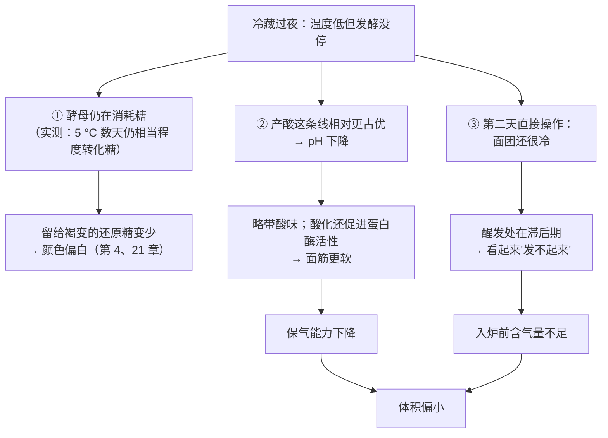
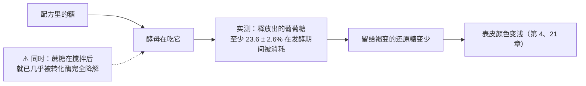

# 第 24 章 思考题参考答案

> 只记「问题 + 正确答案」。案例题给**完整推理链**——
> "目标是什么 → 时间与温度改了哪条时钟 → 连带影响 → 用哪个记录量验证"。
>
> 涉及数字的地方，来源见[参考书目与出处登记](../standards.md)。

## Q1

**问**：面团静置时有哪四条并行的时钟？为什么"发到两倍大"只看到一条？

**答**：

| 时钟 | 在做什么 | 你看得见吗 |
|------|---------|-----------|
| ① **酵母产气** | CO₂ 与乙醇 | **看得见**（体积） |
| ② **产风味** | 醇、酯、醛、酮等 | 看不见，只闻得到一点 |
| ③ **细菌产酸** | 乳酸 / 乙酸，pH 下降 | 看不见（尝得出一点） |
| ④ **面粉自带的酶** | 淀粉酶放糖、蛋白酶切蛋白 | **完全看不见**，但决定面团软硬与上色 |

**"两倍大"的问题**：它只是①的一个读数，而且是**产气与保气的合成结果**——
保气差的面团即使产气很多也涨不到两倍，保气好的面团发过头了也还在涨。

> ## **体积是四条时钟里唯一有刻度的那条，于是所有人都盯着它——这正是误判的来源。**

⚠️ 另外，"两倍"这个通用终点**本书未核到**依据（已登记为缺口）：
文献里的醒发终点都绑着特定产品的实验设计。

## Q2

**问**：那项"全部发到相同高度"的香气实验，关键设计是什么？它证明了什么？

**答**：

**关键设计**：把酵母用量（**2 / 4 / 6%，以面粉总量为 100%**）与发酵温度（**5 / 15 / 35 °C**）
设为变量，但**所有面团都发酵到相同高度之后才烘烤**——
也就是**把"发的程度"这个混杂因素消掉**。

**结果**：

| 变量 | 香气上的结果 |
|------|------------|
| 酵母用量↑ | 酵母代谢相关化合物普遍增加（2,3-丁二酮、苯乙醛气味活性最高） |
| **较高温度（15 与 35 °C）** | **脂质氧化类**化合物（己醛、庚醛）增加 |
| **低温（5 °C）** | **三种酯**（乙酸乙酯、己酸乙酯、辛酸乙酯）增加 |

**它证明了**：

> ## **体积相同 ≠ 面团相同。**
> "发好了"描述的是①这条时钟的位置，而成品的风味由①②③④共同决定。

**对你的意义**：做对照实验时，**要发到同一个高度再比**，而不是发同样的时间——
否则你比较的其实是"发的程度"，不是你想改的那个变量。

## Q3

**问**：为什么"低温久发 ≠ 高温短发"？三条实测依据。

**答**：

| # | 实测 | 含义 |
|---|------|------|
| ① **存在滞后期** | 欧姆加热醒发研究：常规加热到膨胀比 3 需 **122 分钟，其中 58 分钟是滞后期**；提高升温速率后总时长降到 65~70 分钟，**缩短的主要就是滞后期**（最短 20 分钟）；且**相同升温速率下加热方式本身无影响** | 曲线不是简单地被拉长或压缩，**前面那一段的性质不一样** |
| ② **失气时刻随温度提前** | 醒发温度 30~50 °C 的研究：温度越高**失气时刻越早**（酵母活性上升 + CO₂ 溶解度下降） | 高温**同时缩短了可用窗口**，容错更小 |
| ③ **越过峰值是断崖** | 醒发程度研究：比容先升后降，**峰值在 1.3 mL/g**，1.5 与 1.7 时**急剧下降**，伴随变硬与皮芯分离 | 高温让你更快冲到峰值，**也更快冲过它** |

⚠️ ②③的具体数字都是**各自研究的实验设计**，本书只引用方向。

**再加一条来自第 24.2 的证据**：即使发到等高，**低温与高温产生的挥发物构成也不同**。

> ## **温度改变的是曲线的形状与成分构成，不只是横轴的刻度。**

## Q4

**问**：冷藏过夜的吐司面团，第二天直接整形烘烤，成品体积偏小、颜色偏白、略带酸味。

**答**：

**（a）逐条推理链**：

**（b）最可能出问题的一步**：**"拿出来直接整形醒发"**——
面团还没回温，醒发的**滞后期**被误当成"发得慢"，于是他要么等得不够（体积小），
要么为了赶时间升高温度（又带来别的问题）。

**（c）两个改动方向**：

| 方向 | 做法 | 记录什么来验证 |
|------|------|--------------|
| **给回温时间** | 取出后先放到室温，**记下回温到可操作状态用了多久**，再整形 | 回温时长、醒发到目标高度的时长、**入炉前高度**——若体积回来了，问题就是滞后期 |
| **缩短冷藏时长或降低酵母量** | 二选一，一次只改一个 | **颜色**与**酸味**这两项——如果颜色变深、酸味变淡，说明之前确实是"在冰箱里发过头了" |

> ⚠️ 本书**不给"该冷藏几小时"**（已登记为缺口）：它随配方、酵母量、冰箱温度而变。
> 冷藏保存请遵循当地食品安全指引（美国 FDA 建议冰箱保持在 40 °F、约 4 °C 以下；各国口径不同）。

## Q5

**问**：高温快速发到两倍，入炉后几乎没有炉内膨胀，组织粗、有大孔。

**答**：

**（a）用"失气时刻"与"峰值断崖"解释**：

| 现象 | 机制 |
|------|------|
| 很快涨到两倍 | 高温加快产气（第 11 章） |
| 但**窗口更短** | 醒发温度越高**失气时刻越早**——面团"扛不住"的时刻提前了 |
| 越过峰值 | 比容**先升后降**，越过峰值是**断崖**：气室过度膨胀后合并、壁被拉薄 |
| 组织粗、大孔 | 气室**合并**（第 10 章：最剧烈膨胀期每秒减少 2%~3%，到面包心形成结束比初始少 55%~67%） |
| 炉内几乎不涨 | 入炉时结构已经被撑到极限，**没有余量了** |

**（b）第 10 章直接适用的那条结论**：

> ## **初始 CO₂ 体积过高会损害炉内膨胀。**
>
> 同一项研究还指出：**面团膨胀既不受 CO₂ 的量限制，也不受其释放动力学限制**，
> 受限的是**烘烤阶段还能不能继续充气**。
> 换句话说：**把气提前用完，就等于把炉内膨胀提前花掉了。**

**（c）怎么用记录区分"发过头"与"烤的问题"**：

| 记录量 | 发过头会怎样 | 烤的问题会怎样 |
|-------|------------|--------------|
| **入炉前高度** | **偏高**（已经接近或越过峰值） | 正常 |
| **炉内涨幅** | **很小甚至为负** | 也可能小，但入炉前高度是正常的 |
| 高度—时间曲线 | 能看到峰值出现在入炉之前 | 峰值还没到 |
| 出炉中心温度与失重率（第 21 章） | 通常正常 | 常有异常（偏低或偏高） |

> **一句话**：**"入炉前高度 + 炉内涨幅"这两列分开记，就能把第二部分的问题和第五部分的问题分开。**

## Q6

**问**：【辨析】"冷藏就是把发酵暂停了"。

**答**：

**证据强度：❌ 没有暂停。**

**最直接的证据来自一项为开发冷藏面团而做的微生物学工作**：
研究者之所以要专门去筛选"**冷敏感发酵**"的酵母突变株，
理由就是**常规面包酵母在 5 °C 储存数天的面团里，仍会把糖相当程度地转化成 CO₂ 与乙醇**。

他们筛到的突变株：

| 温度 | 该突变株的发酵活性 |
|------|-----------------|
| **5 °C** | 基本为零 |
| **10 °C** | 约为亲本的 **1/5** |
| **25~40 °C** | 恢复到与亲本相同 |

用它做的面团**冷藏一周后仍能正常使用**——这从反面说明了：**普通酵母做不到这一点。**

**正确的理解**：

> ## **冷藏是调速器，不是暂停键；而且它对四条时钟的减速幅度并不一样。**
> 正因为减速幅度不同，成品的成分构成才会变——这才是"冷藏发酵不一样"的真正机制。

## Q7

**问**：【辨析】"面团发久一点颜色更漂亮"。

**答**：

**证据强度：❌ 常常相反。**

**那本"糖的账"**：

（该研究的配方为 **8% 酵母、14% 蔗糖，以小麦粉干物质为基准**——
基准写明，所以本书可以引用它的写法。）

**为什么这个说法仍然流传**：因为在**发酵不足**的一端，多发一会儿确实会让成品更好
（更蓬松、风味更足，看起来"更漂亮"）。**它在某一段成立，被推广到了整条曲线。**

**配套的判断规则**：

> **发过头的三个信号要一起看：组织粗（气室合并）、颜色浅（糖被吃掉）、形状塌（面筋被弱化）。**
> 只要三个里出现两个，就先怀疑发酵，而不是烤箱。

⚠️ 补充一条边界：如果你的配方**本来就几乎不含糖**（例如传统欧包），
上色主要依赖**面粉自身的酶放出的糖**与氨基酸（第 2、21 章），
这时"发久了颜色浅"的原因链条相同，但权重不一样。
