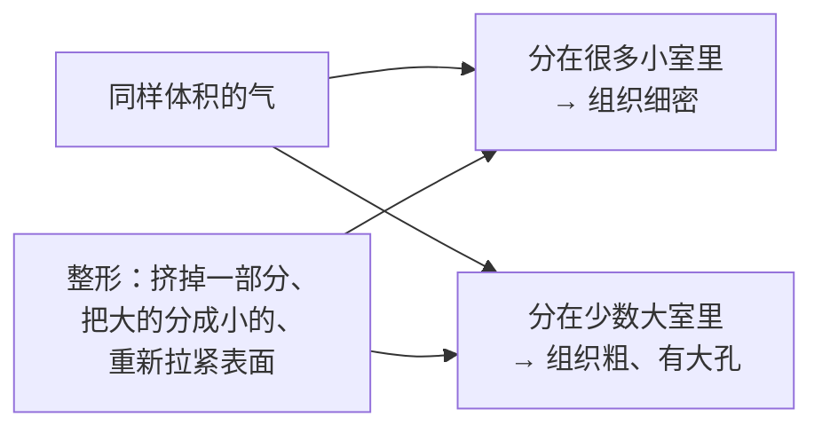
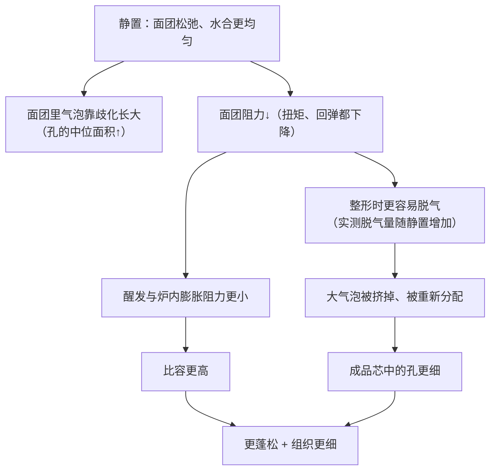
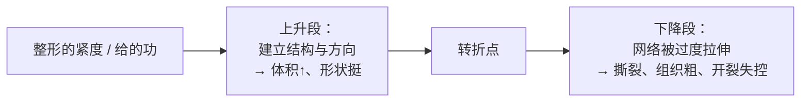
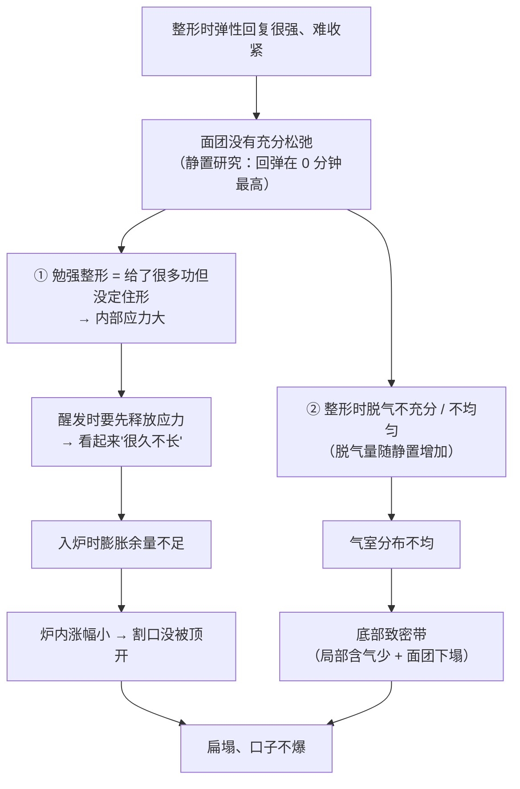

# 第 25 章 思考题参考答案

> 只记「问题 + 正确答案」。案例题给**完整推理链**——
> "现象出在哪一步 → 哪套机制 → 改哪个变量 → 用哪个记录量验证"。
>
> 涉及数字的地方，来源见[参考书目与出处登记](../standards.md)。

## Q1

**问**：为什么说整形"几乎不改变气的总量，却改变了组织"？

**答**：

**因为"组织"描述的不是气有多少，而是气被分成了多少个、多大的室。**

**两个必须一起看的机制**：

| 机制 | 它在做什么 | 实测 |
|------|-----------|------|
| **歧化** | 气体从小泡扩散到大泡，**小的变小、大的变大** | 不加酵母的面团中气泡半径中位数从搅拌后 36 分钟的 **22.1 ± 0.7 µm** 增至 162 分钟的 **27.3 ± 0.7 µm** |
| **合并** | 相邻气室之间的壁破掉，合成一个大的 | 烘烤中最剧烈膨胀期气室数量**每秒减少 2%~3%**；面包心形成结束时比初始**减少 55%~67%** |

**所以时间本身就在把组织往"粗"的方向推**，而整形是你**主动**把它推回去的那一次：
挤掉过大的气室、把气重新分布、并用拉紧的表面给它一个方向。

⚠️ 但要记住第 25.3 的转折点：**推得过头就变成撕裂**。

## Q2

**问**：静置时间研究里，面团里的孔与成品里的孔为什么方向相反？

**答**：

**两组结果**：

| 测量对象 | 随静置时间（0 → 10 → 20 分钟）延长 |
|---------|--------------------------------|
| **面团** | 孔隙率**上升**；小气泡数量**减少**；孔的中位面积**增大**；扭矩**显著下降**；回弹**下降**；脱气量**增加** |
| **成品** | 比容与孔隙率**上升**；**面包芯中孔的中位面积下降**（组织更细） |

**一个能解释它的机制**（本书的解读，与已核到的证据相容）：

**一句话**：

> ## **"面团里的孔"是过程量，"成品里的孔"是结果量——整形正好夹在它们中间，
> ## 而松弛决定了整形这一下能做到多少。**

⚠️ 这是**一项研究、一种产品**，本书只引用方向，不把"10 分钟""20 分钟"当参数。

## Q3

**问**："更小辊间距 → 成品更大但组织更粗"说明了什么？为什么两句矛盾的经验能同时成立？

**答**：

**它说明两件事**：

1. **体积与组织不是同一个目标**——把面筋发展得更充分（更小辊间距）能换来更大的体积，
   **但代价是气室更少、平均直径更大**（组织更粗）。
2. **存在过度拉伸**——在含麸皮的面团里，**8 次压片优于 12 次**：
   麸皮本身就在割断网络，再过度拉伸，害处更明显。

**为什么"越紧越好"和"太紧会裂"都对**：

> ## **它们说的是同一条曲线的两侧，只是各自没说自己站在哪一边。**

**实操含义**：你要找的是**你这份面团的转折点**，而不是别人的"整几圈"。
方法在 25.10 的任务三与任务四：**做对照，记炉内涨幅与组织**。

## Q4

**问**：整形时面团弹得厉害、很难收紧，醒发很久不长，成品扁塌、底部致密带、割口没爆开。

**答**：

**（a）推理链**：

**（b）最可能省略或做反的那一步**：**中间醒发（松弛）**——
要么完全省略，要么时间太短。**症状很典型**：*弹、难收紧、之后醒发迟迟不动*。

⚠️ 另一个需要排除的嫌疑：**面筋被过度发展**（第 22 章）或**低温面团**（第 23 章），
它们也会让面团"弹"。区分方法见（c）。

**（c）两个改动方向与记录量**：

| 方向 | 做法 | 记录什么 |
|------|------|---------|
| **加入（或延长）中间醒发** | 分割滚圆后盖好静置一段固定时间再整形 | **整形时的手感（能不能收紧）** + 醒发到目标高度的时长 + **炉内涨幅**。若涨幅回来，方向就对了 |
| **先排除温度与搅拌** | 记录**出缸面团终温**（第 23 章）；若面团偏冷，先回温再整形；若搅拌时间明显偏长，下次减少 | 面团终温、搅拌时长。**这两个数能把"没松弛"和"太冷/搅太久"分开** |

## Q5

**问**：吐司整形时用擀面杖反复擀压排气，成品体积偏小、发韧、侧面有大孔。

**答**：

**（a）他同时做了哪两件事**：

| 做的事 | 后果 |
|-------|------|
| ① **排气**（把气室挤掉、分小） | 方向本身没错——静置研究里更充分的脱气对应**更细的组织** |
| ② **给面团做功**（擀压就是压片） | 压片研究证明**压片会发展面筋**；反复擀压＝持续输入功 |

**（b）哪一件过头了**：**大概率是 ②**。

证据链：**发韧**指向面筋被过度发展或被过度拉伸；
压片研究里**更小辊间距（更强的发展）→ 体积更大但组织更粗**，
而**过度的压片次数（含麸皮时 12 次 vs 8 次）反而变差**。
**侧面的大孔**则典型地来自**排气不均匀**——擀压把气赶到了局部，或卷入时夹带了空腔。

> **一句话**：他以为自己在做①，实际上主要在做②，而且越过了转折点。

**（c）单变量对照设计**：

| 组 | 处理（其余完全相同） | 看什么 |
|----|-------------------|-------|
| ① | 只用手轻拍排气，不擀 | 体积、韧度、侧面是否有大孔 |
| ② | 擀压固定次数（比他平时少） | 同上 |
| ③（可选） | 擀压他平时的次数 | 同上 |

**关键**：三组的**静置时间、醒发到同一高度、炉温、烤盘位置**必须一致——
否则你比的还是别的东西。记录**入炉前高度、炉内涨幅、组织照片**。

## Q6

**问**：【辨析】"割口能让面包涨得更大"。

**答**：

**证据强度：缺乏证据——本书未核到任何割口的对照实验。**

| 维度 | 说明 |
|------|------|
| 检索结果 | 在同行评议文献里检索"scoring / slashing + 面包 / 面团"，**只找到设备与产品专利**，没有对照实验（已登记为缺口） |
| 因此本书怎么处理 | **25.5 整节显式标注为机制推理**，不给深度、角度、数量、间距 |
| 能站得住的方向 | ① 烘烤中的**升压主要来自变硬表层的机械约束**（实测最高约 1.1 kPa）；② **表皮形成造成的压力会改变内部组织**（无表皮的电阻加热炉里组织变细）；③ 膨胀最剧烈的一段出现在**芯温接近 90 °C** 前后 |
| 更准确的说法 | **割口指定的是"破口的位置与方向"**。不割它也会裂——只是裂在面团自己选的地方 |

**为什么这个说法会流传**：因为在**表皮定得早、内部还想涨**的那类成品（高温入炉的欧包）上，
割与不割的**外形差别非常明显**，很容易被读成"割了才涨得起来"。

**本书建议的替代**：做一次 25.10 任务四那样的对照，
记录**炉内涨幅**与**裂口位置**——如果涨幅几乎不变而裂口位置变了，
你就亲眼看到了"它改的是位置，不是量"。

## Q7

**问**：【辨析】"醒发要盖着保湿"。

**答**：

**证据强度：⚠️ 机制方向相容，但定量影响本书未核到。**

**支持它的两条实测**（都不是直接测醒发湿度的，这一点必须说清楚）：

| 实测 | 出处方向 |
|------|---------|
| 烘烤中的**升压最高约 1.1 kPa，主要来自变硬表层的机械约束** | 说明**变硬的表层确实是一个力学角色**，不是装饰 |
| 在**几乎不形成表皮的电阻加热炉**中烘烤，两种原本组织差别很大的面粉**组织都变细了** | 说明**表层的状态会反过来改变内部组织** |

**由此推出的方向（机制推理）**：

> **醒发时表面提前干燥，相当于提前给面团戴上一层约束**——
> 它可能限制炉内膨胀，也会改变开裂的位置与形态。

**为什么本书仍然不给湿度参数**：

1. 上面两条测的是**烘烤中的表皮**，不是**醒发中的表面干燥**——**不是同一件事**；
2. 本书**未核到**家用条件下比较"盖 vs 不盖""不同湿度"的对照实验（已登记为缺口）；
3. 家庭环境的湿度差异极大，任何一个数字都不可移植。

**能做的**：把"有没有盖、盖了什么、表面是否发干"写进记录表，
并在出现**割口不爆、表皮特别厚、炉内涨幅偏小**时，把它列为嫌疑之一。
