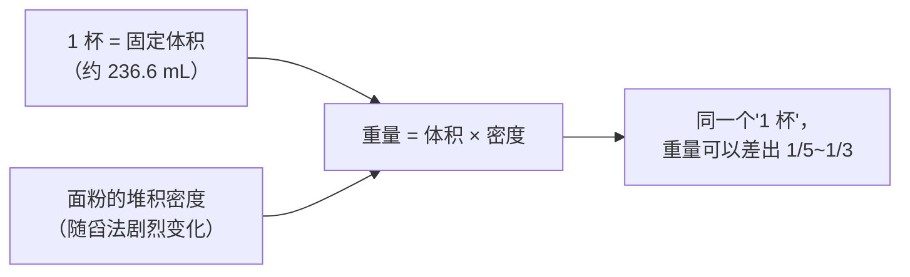
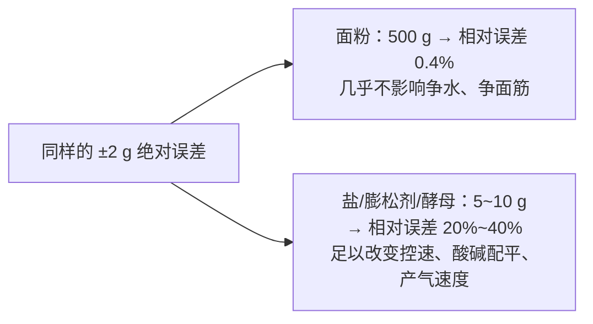
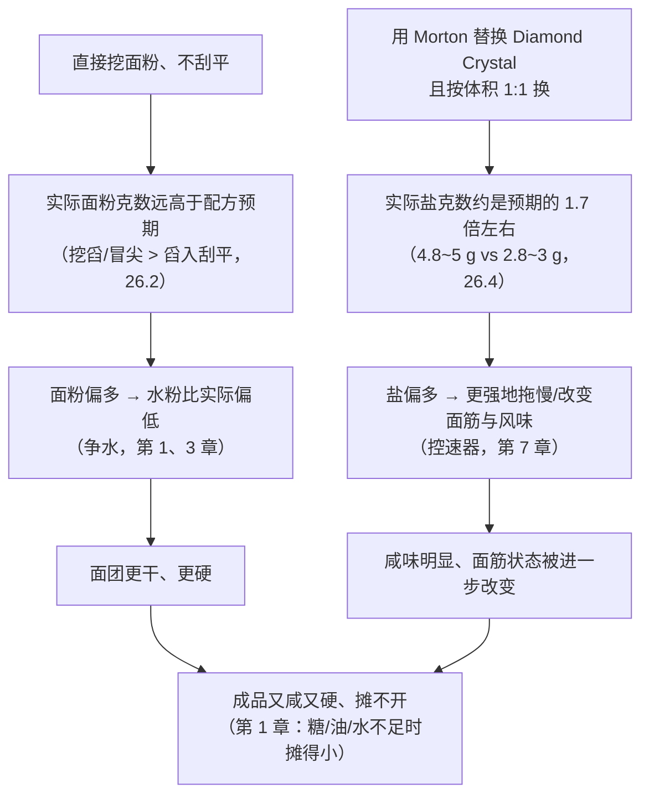

# 第 26 章 思考题参考答案

> 只记「问题 + 正确答案」。案例题给**完整推理链**——
> "现象出在哪一步 → 哪套机制 → 改哪个变量 → 用哪个记录量验证"。
>
> 涉及数字的地方，来源见[参考书目与出处登记](../standards.md)。

## Q1

**问**：为什么说"1 杯面粉"这四个字本身"没有告诉你重量"？请用"体积"与"堆积密度"两个词解释。

**答**：

**因为量杯量的是体积，而体积要换算成重量，必须乘以密度——而面粉的密度不是固定值。**

面粉不是均质液体，它是**颗粒之间夹着空气**的堆积体。颗粒间夹的空气比例
（也就是[堆积密度](../glossary.md#bulk-density)）完全取决于你**怎么把它装进杯子里**——
蓬松地舀入，装得少；用力挖、压实，装得多。**"1 杯"这个说法只固定了体积，
没有固定密度，所以它没有固定重量。**

⚠️ 这正是量杯对液体可靠、对粉状原料不可靠的根本原因：
水的密度不会因为"你怎么倒"而改变，面粉的堆积密度会。

## Q2

**问**：1963 年那项实验里，"过筛后舀入刮平"与"不过筛直接挖舀刮平"分别测得多少克？
这个差距和 ATK、King Arthur 各自给出的数字是否吻合？

**答**：

| 方法 | 1963 年实验数据 |
|------|---------------|
| 过筛后舀入、刮平 | **115 g**（实验室均值） |
| 不过筛、直接挖舀、刮平 | **137 g**（实验室均值） |

两者相差约 **22 g，约 19%**。

**与另外两个独立来源对照**：

| 来源 | 对应的方法与数字 | 是否落在同一方向与量级上 |
|------|----------------|----------------------|
| America's Test Kitchen（官方实测均值） | 挖舀刮平 ≈ **142 g** | ✅ 与 1963 年的"挖舀刮平 137 g"非常接近 |
| King Arthur（厂商说明，仅供参照） | 蓬松舀入刮平 ≈ **120 g**；直接挖（不蓬松）可达 **160 g** | ✅ 120 g 落在"舀入刮平"档（115~126 g）附近；160 g 比"挖舀刮平"档更高，但方向一致（挖的比舀的重） |

**结论**：三个独立来源（1963 年学术实验、ATK 当代实测、King Arthur 厂商说明）
**在"挖比舀重""不过筛比过筛重"这两个方向上完全一致**，
量级也基本吻合（舀入档约 115~126 g，挖舀档约 137~160 g）——
**这就是本书要求"关键数字至少两个独立来源交叉验证"的具体样子。**

## Q3

**问**：分辨率与准确度是两个不同的概念。请解释区别，并说明"秤显示到 0.1 g"为什么不能直接当作"这台秤准到 0.1 g"的证据。

**答**：

| 概念 | 回答的问题 |
|------|-----------|
| **分辨率 / 可读性** | 这台秤**愿意显示**多细的刻度（1 g 一跳，还是 0.1 g 一跳）|
| **准确度** | 它显示的数字和**真实重量**之间实际能差多少 |

**这是两件独立的事**：一台秤完全可以"显示到 0.1 g"，但它的**真实误差**仍然是 ±1~3 g——
显示位数只反映它的**电路分辨率**，不反映它的**称量机构本身有多准**。

美国官方计量标准 NIST Handbook 44 专门用两个不同的参数来区分它们：
**分度值 d**（显示分辨率）与**检定分度值 e**（用来定义准确度等级、决定公差的值）。
该标准还指出：**这套认证主要管的是商用衡器**，家用厨房秤**不在强制认证范围内**——
也就是说，**没有任何机构保证你家那台秤显示的"准确度"和它的分辨率是匹配的。**

实测也验证了这一点：America's Test Kitchen 用标定砝码测试普通家用秤，
发现**多数秤分辨率为 1 g，但实际准确度普遍在 ±1~3 g**；
只有**经过 NIST 可溯源认证**的高端型号才能做到 ±0.7 g。

**所以**："秤显示到 0.1 g"只能说明它的**分辨率**是 0.1 g，
**不能**说明它的**准确度**也是 0.1 g——除非它明确标注了经过认证的准确度等级。

## Q4

**问**：为什么同样是 ±2 g 的称量误差，对面粉几乎没有影响，对盐和膨松剂却可能是"另一份配方"？请用具体的百分比数字说明。

**答**：

**因为误差要放进"相对这份原料本身的用量"里看，而不是看绝对值。**

| 原料 | 配方里的典型用量 | ±2 g 占它的百分比 |
|------|----------------|------------------|
| 面粉（基准） | 500 g | **0.4%** |
| 盐（面粉基准的 2%） | 10 g | **20%** |
| 泡打粉/小苏打（面粉基准的 1%） | 5 g | **40%** |
| 干酵母（面粉基准的 1%） | 5 g | **40%** |

**原因是分母不同**：面粉是配方里的基准（100%），本身用量大，
±2 g 的绝对误差相对它来说微不足道；而盐、膨松剂、酵母的用量本身就很小（配方的个位数百分比），
**同样 ±2 g 的误差，相对它们自己的用量来说是一个巨大的比例**。

第 13 章讲过化学膨松依赖**精确的酸碱配平**（中和值），第 7 章讲过盐是**控速器**，
第 11 章讲过酵母用量直接影响产气速度——**这些恰恰都是误差被放大后最先受影响的环节。**

## Q5

**问**：某人按美式配方做饼干，配方写"1 cup all-purpose flour, 1 tsp kosher salt (Diamond Crystal)"。
他只有 Morton 犹太盐，习惯直接挖面粉不刮平。成品又咸又硬、不怎么摊开。

**答**：

**（a）推理链**：

**（b）两步误差的方向**：

- **挖面粉不刮平** → 实际面粉克数偏高 → **烘焙百分比以面粉总量为 100% 不变，
  但面粉的真实克数比预期多，于是水、糖、油脂、盐相对这份"虚高"面粉的实际占比全部被"稀释"变低**
  （因为分母面粉变大了，其余原料相对它的占比看起来都下降了，但**配方设计时假定的平衡被打破**）；
- **用 Morton 替换 Diamond Crystal 且按体积换** → 实际盐克数偏高（约 1.6~1.8 倍）→
  **盐相对面粉的真实百分比远高于配方设计值**。

**（c）两个改动方向与验证方法**：

| 方向 | 做法 | 怎么验证 |
|------|------|---------|
| **面粉改用秤称** | 按配方换算出的克数直接称，不用量杯 | 记录**这次称出的实际克数**与**成品直径/硬度**，和上次对比 |
| **盐改用秤称，并按晶体类型换算** | 查到 Morton 与 Diamond Crystal 的实测克数比（约 4.8~5 g 对 2.8~3 g），按配方要求的**克数**（不是茶匙数）称 Morton 盐 | 记录实际称出的盐克数，吃的时候对比咸度 |

**关键**：**一次只改一个变量**（先只改面粉，或先只改盐），
否则不知道哪一项改动真正起了作用（见[烘焙记录与复盘表](../forms/bake-log.md)的核心原则）。

## Q6

**问**：【辨析】"用量杯量面粉，只要称重前先刮平表面，结果就是准的"。

**答**：

**证据强度：❌ 明确错误。**

| 维度 | 说明 |
|------|------|
| "刮平"消除的误差 | **冒尖**——避免杯子上方鼓起一座小山，这一层误差是真实存在的，刮平确实能消除它 |
| "刮平"**没有**消除的误差 | **装入方式本身**：同样刮平，"舀入刮平"与"挖舀刮平"实测相差约 115~142 g（26.2）——
刮平只保证"表面是平的"，**不保证装进去之前面粉已经被压实了多少** |
| 实测证据 | 1963 年实验中"过筛舀入刮平"115 g、"不过筛挖舀刮平"137 g——**两者都"刮平"了，差距依然高达约 19%** |

**为什么这个说法会流传**：因为"刮平"确实比"冒尖"更接近"标准"，
**改善是真实的，但不完整**——它只处理了误差的一部分来源，让人误以为处理了全部。

**本书建议**：刮平是基本动作，但**真正决定准不准的是装入时有没有压实**，
这一点只有**用秤**才能彻底解决。

## Q7

**问**：【辨析】"家用电子秤显示到个位数的克数就足够精确了"。

**答**：

**证据强度：⚠️ 有条件成立，不能一概而论。**

**成立的条件**（26.6）：当这个原料在配方里的**用量本身很大**（比如面粉、大部分液体）时，
±1~3 g 的秤误差相对它的用量占比极小（例如 500 g 面粉里的 ±2 g 只占 0.4%），
**这时 1 g 分辨率、±1~3 g 准确度的普通家用秤完全够用**。

**不成立的条件**：当原料**用量本身很小**（盐、泡打粉、小苏打、酵母，往往只有几克）时，
同样 ±1~3 g 的误差会变成 **20%~40% 的相对误差**（26.6 的表格），
这时"个位数克数"的普通秤**不够用**——需要分辨率更高（如 0.1 g）的小秤。

**支持这个判断的实测**：America's Test Kitchen 的测评里，
普通家用秤被认为"±3 g 的误差对大多数烹饪来说常见且可以接受"，
但**该机构同时指出，这个精度不足以应付需要克级精确的场景**（如咖啡豆称重），
而烘焙里的盐、膨松剂、酵母正属于这一类"小剂量、对精度敏感"的场景。

**结论**：**"够用"取决于你在称什么，不取决于秤本身**——
这正是 26.6"第三条可迁移判断规则"的内容：**把精度花在小剂量原料上**。
