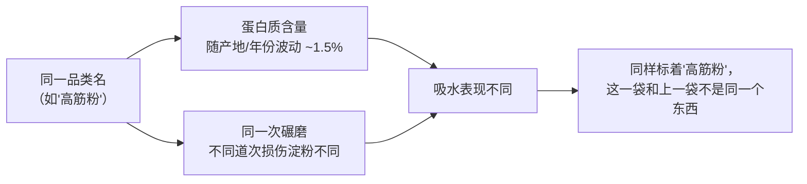
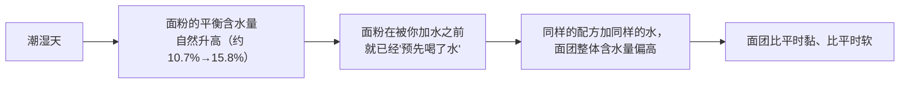
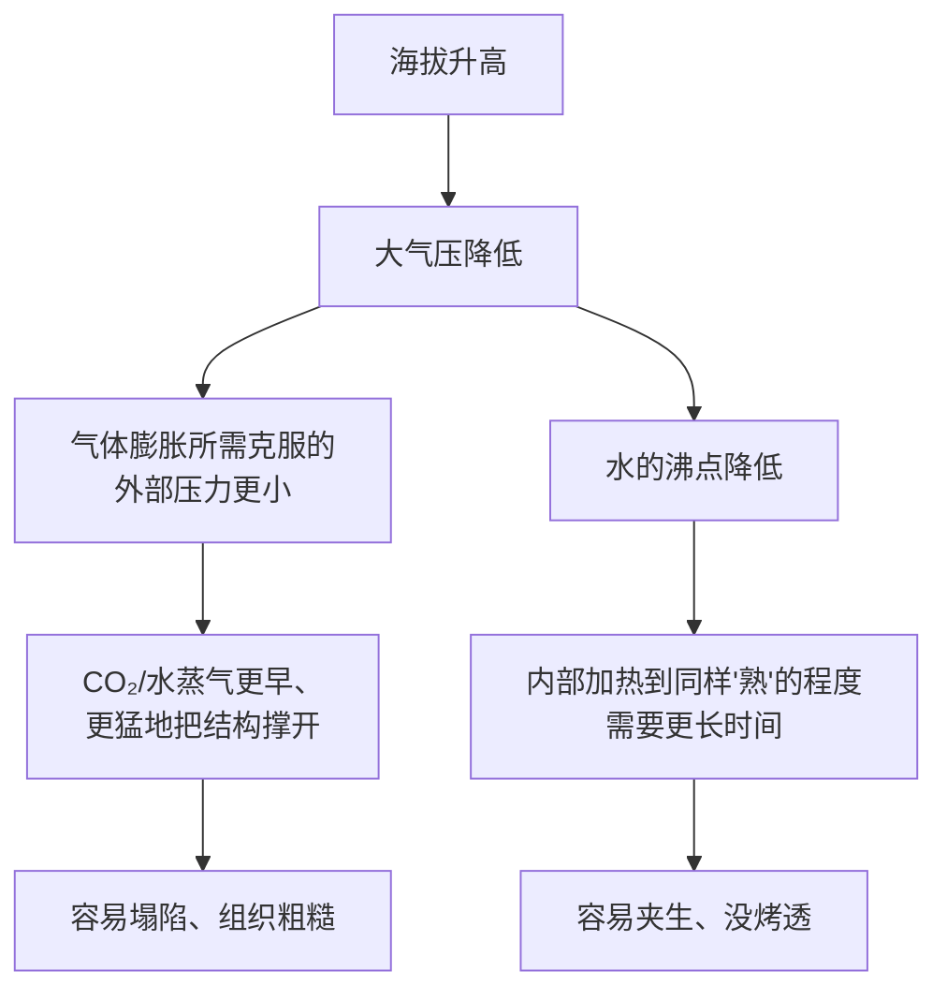
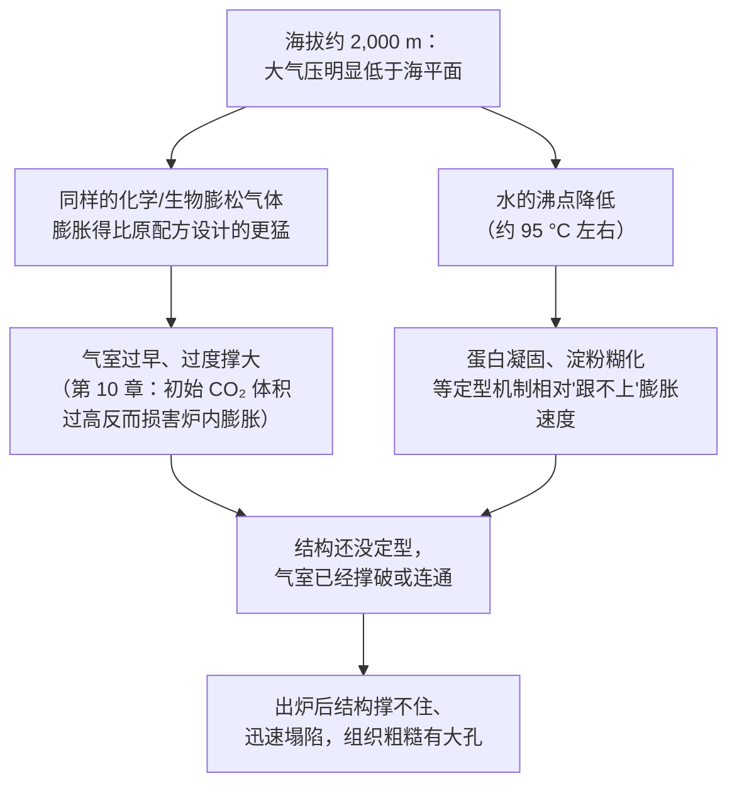

# 第 27 章 思考题参考答案

> 只记「问题 + 正确答案」。案例题给**完整推理链**——
> "现象出在哪一步 → 哪套机制 → 改哪个变量 → 用哪个记录量验证"。
>
> 涉及数字的地方，来源见[参考书目与出处登记](../standards.md)。

## Q1

**问**：为什么说"同一个品类名字的面粉"不能保证"同一包面粉"？请分别用"蛋白质含量波动"
与"碾磨批次差异"两条证据说明。

**答**：

**① 蛋白质含量波动**：USDA-ARS 一项用 49 份硬质冬小麦做的研究显示，
面粉蛋白质含量与面包体积显著正相关（r=0.80），**但蛋白质含量本身是小麦的农艺性状，
随产地、年份、甚至同一地块内的具体位置波动**——同一品种在不同地点种植，
蛋白质含量可以相差约 1.5 个百分点；磨成面粉后通常还会再损失约 1.0~1.8 个百分点。
**"高筋粉"这个品类名对应的是一个每年都在变的区间，不是一个固定的数字。**

**② 碾磨批次差异**：一项关于辊式碾磨硬红小麦的研究发现，
**即使出自同一次碾磨、同一批小麦，不同道次（streams）之间蛋白质含量就有显著差异**，
而"还原磨道"产出的面粉**损伤淀粉含量差异更大，并按比例提高了水吸收量**。

**结论**：**品类名字只是一个大致分类，不是一个精确的物理规格。**

## Q2

**问**：面粉的"平衡含水量"是什么意思？它如何解释"潮湿天面团比平时黏"这个现象？

**答**：

**平衡含水量**是面粉与周围空气**交换水分后达到的那个稳定含水百分比**——
面粉不是封闭系统，它会持续地从潮湿空气里吸水、向干燥空气里放水，
直到自身含水量与环境湿度达成一个动态平衡。

一项实测研究显示：在 30 °C 下，**相对湿度约 52% 时小麦粉平衡含水量约 10.67%，
相对湿度约 75% 时约 15.78%**——环境从"中等湿度"变成"潮湿"，
**面粉自己已经先含了更多的水**。

**所以"面团比平时黏"不一定是你多加了水，也可能是面粉自己已经先多带了水**——
**这正是配方里"加多少水"这个数字隐含的前提（面粉本身不额外带水）被打破的情形**。

## Q3

**问**：为什么海拔升高会同时让气体更容易膨胀、又让食物更难被"烤熟/煮熟"？请用大气压这一个原因解释这两个看似无关的现象。

**答**：

**两者的根源都是同一件事：大气压降低。**

| 效应 | 机制 |
|------|------|
| **气体更容易膨胀** | 气体膨胀多少取决于它要克服的外部压力；**外部大气压越低，同样量的 CO₂/水蒸气能占据的体积就越大**——这就是"发酵/烘烤时气泡涨得更猛"的原因 |
| **更难被"烤熟/煮熟"** | 水的沸点随大气压降低而降低（海平面 212 °F/100 °C，约 5,000 ft 时约 202~203 °F，约 10,000 ft 时约 193 °F）；**煮/蒸类加工的最高温度被压低了**，需要更长时间才能让内部达到足够的热损伤/凝固程度 |

**一句话**：大气压这一个变量，**同时松开了"涨多猛"和"要多久才熟"这两个阀门**，
而且是朝着**互相冲突的方向**：膨胀变快了，定型/烤熟却变慢了——
**这正是高海拔烘焙"容易塌"的根本原因**。

## Q4

**问**：为什么"水越软越好"这个说法方向是错的？请说明硬度过高与过低分别会造成什么问题。

**答**：

**证据**：行业参考资料给出的分级是**软水 <50 ppm、硬水 >200 ppm，
中等硬度（约 100~150 ppm）被认为最适合面包烘焙**。

| 水质 | 问题 | 机制 |
|------|------|------|
| **过软**（矿物质太少） | 面团**发黏、松垮** | 缺少钙镁离子，**没有"喂"给酵母营养，也没有适度加固面筋网络** |
| **过硬**（矿物质太多） | 面团**过度收紧、发酵变慢** | 矿物质让蛋白质更难吸水，**抑制面筋正常水合**；且硬水偏碱性，**碱性会降低酵母活性** |

一项实验室研究提供了机制层面的旁证：在面粉中加入硫酸钙与硫酸镁离子，
**钙离子提高吸水量但降低搅拌稳定性、延迟可拉伸性；镁离子的作用方向类似氧化剂**
（提高稳定性、降低延展性）——说明**矿物质离子确实会实质性改变面团的流变表现**，
方向不是单纯的"越多越好"或"越少越好"，而是**存在一个中间区间**。

**结论**：**"纯净水/蒸馏水最好"这个直觉是错的**——水完全没有矿物质，
反而失去了对发酵与面筋的那部分正向帮助。

## Q5

**问**：有人把海平面戚风蛋糕配方原样搬到海拔约 2,000 m 的城市，膨胀很猛但出炉后迅速塌陷、组织粗糙有大孔。

**答**：

**（a）推理链**：

**（b）两个改动方向**：

| 方向 | 对应本章规则 | 做法 |
|------|------------|------|
| **减少膨松气体/延缓膨胀速度** | 27.4 的分级调整建议（膨松剂减量） | 如果配方含化学膨松剂，按分级表方向性地减少用量；戚风主要靠打发的蛋白泡沫，可以考虑**打发程度略降一档**或**减少糖对泡沫稳定性的过度延迟**（第 14 章） |
| **让定型更早跟上膨胀** | 27.4：烤箱温度提高约 15~25 °F（约 8~14 °C） | 适当提高烤箱温度，让淀粉糊化与蛋白凝固更早发生，缩小"气室已经撑大但结构还没定住"的窗口 |

**（c）验证方法**：**一次只改一个变量**，记录**入炉前高度、炉内涨幅峰值出现的时间、
出炉后是否塌陷、组织孔洞大小**（参考[烘焙记录与复盘表](../forms/bake-log.md)）。
如果调整炉温后塌陷明显减轻，说明问题确实出在"定型跟不上膨胀"这条链路上；
如果调整膨松量/打发程度后组织变细，说明问题更偏向"气室被撑得过大"这一端。

## Q6

**问**：某人连续三周用同一牌子高筋粉做吐司，前两周很稳定，第三周面团明显偏湿、不好整形，但配方、称量、季节、操作手法都没变。

**答**：

**（a）两个最可能的嫌疑**：

| 嫌疑 | 对应依据 |
|------|---------|
| **① 新开的这袋面粉是不同批次** | 27.2：同一品牌同一品类的面粉，蛋白质含量与碾磨批次之间的损伤淀粉含量都可能不同，**即使标签相同，吸水表现也可能变化** |
| **② 这袋面粉开封后吸收了环境里的水分**（即使季节没变，开封后暴露在空气里的时长、存放方式会改变它当下的含水量） | 27.3：面粉的平衡含水量会随暴露在空气中的时间与局部小环境变化；第 26 章也提到面粉存放中会因震动/环境而变化 |

**（b）区分两个嫌疑的记录方法**：

| 嫌疑 | 怎么区分 |
|------|---------|
| 批次问题 | **换回同一批（还没开封）的面粉**重做一次，其余完全不变：如果面团恢复正常，说明是**这一袋**（批次）的问题，不是普遍性的环境问题 |
| 环境吸湿问题 | 如果手头已经没有旧批次可对比，**记录这三周各自的密封方式与开封天数**，并观察：如果同一袋面粉放置时间越长、面团越湿（哪怕季节一样），更支持是**面粉自身吸湿**在起作用 |

**关键**：两者都指向"配方和称量没有问题，是原料的隐藏状态变了"，
**不要急着怀疑自己的手法**（27.1 的核心判断规则）。

## Q7

**问**：【辨析】"自来水的氯会杀死所有酵母，烘焙必须用矿泉水"。

**答**：

**证据强度：⚠️ 机制方向存在，但说法被夸大。**

| 维度 | 说明 |
|------|------|
| **对天然酵种**（第 12 章） | 行业建议**提前把水晾置一晚让氯挥发**，以免影响酵种里**敏感的微生物群落**（野生酵母、乳酸菌、醋酸菌的混合群落）——这个方向与第 12 章"酵种对环境敏感"的结论一致，**在这一类配方上有依据** |
| **对商业酵母（即发/活性干酵母、鲜酵母）面团** | ⚠️ **本书未核到**自来水氯含量会"杀死"商业酵母的对照实验。商业酵母是经过筛选、大规模培养的单一菌株，**耐受性与敏感的天然混合菌群不是同一回事**，"杀死所有酵母"的说法把两类完全不同的菌群混为一谈 |
| **"必须用矿泉水"** | 过度延伸：**水的硬度（矿物质含量）反而不是越低越好**（第 27.5 节：过软的水会让面团发黏、发酵不稳），矿泉水的矿物质构成也未必落在"中等硬度"这个理想区间 |

**为什么这个说法会流传**：因为它在**天然酵种**这一类特别敏感的场景里有真实的机制基础，
**被过度推广到了所有用酵母的配方**——这正是本书反复强调的"流传的说法通常在某类配方里确实成立，
被过度推广到全部配方"的典型例子。

**本书的建议**：对天然酵种，**提前晾置自来水**是一个低成本的谨慎做法；
对普通商业酵母面团，**没有必要为了氯特意改用矿泉水**。
