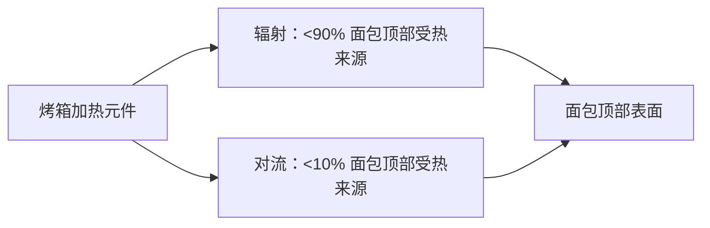
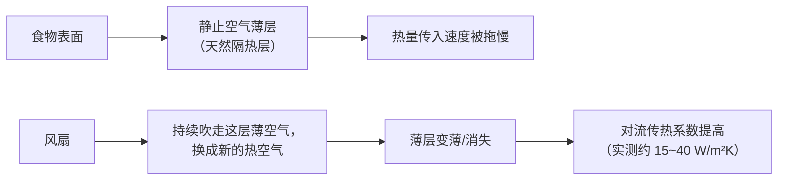
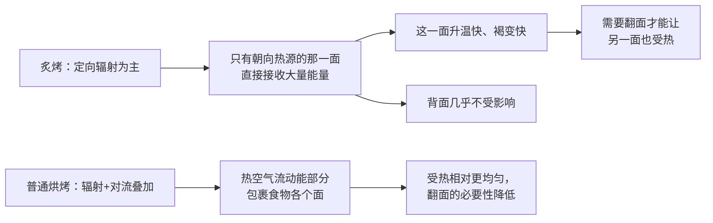
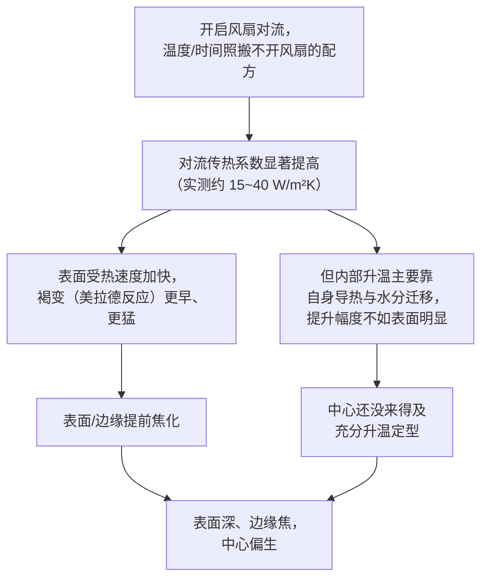

# 第 28 章 思考题参考答案

> 只记「问题 + 正确答案」。案例题给**完整推理链**——
> "现象出在哪一步 → 哪套机制 → 改哪个变量 → 用哪个记录量验证"。
>
> 涉及数字的地方，来源见[参考书目与出处登记](../standards.md)。

## Q1

**问**：为什么说"烤箱就是靠热空气加热"这句话是错的？请用"辐射"与"对流"两个概念说明，并引用本章提到的一项具体研究数据。

**答**：

**因为对流只是三种传热方式之一，而且在很多关键位置并不是占比最大的那个。**

| 概念 | 机制 |
|------|------|
| **对流** | 靠**热空气分子的流动**把能量带到食物表面——这是"靠热空气加热"这句话描述的那部分 |
| **辐射** | 热源**直接**以电磁波的形式把能量送到食物表面，**不需要空气作为介质** |

一项关于面包烘烤中热质传递过程辨识的研究发现：**面包顶部表面受热超过 90% 来自辐射，
低于 10% 来自对流**——也就是说，**在顶部这个位置，真正起主要作用的恰恰不是热空气**。

**所以"靠热空气加热"这个直觉描述了烤箱的一部分真实机制（对流确实存在），
但它把"占比最大的那部分"（辐射）完全漏掉了。**

## Q2

**问**：风扇对流烤箱提高传热速度的机制是什么？请用"边界层/静止空气薄层"这个概念解释。

**答**：

**任何静止的热食物表面，附近都会形成一层几乎不流动的空气薄层**——
这层空气导热性很差，相当于给食物自己盖了一层"隐形棉被"，
**拖慢了热量从周围空气传进食物表面的速度**。

**风扇的作用，正是持续把这层"隐形棉被"吹走、换成新的热空气**，
从而提高对流传热系数——单位时间内、单位温差下，能传给食物的热量变多了。
一项直接测量的研究显示：家用烤箱用失重速率法测得的系数在 **22~28 W/(m²·K)** 左右，
且**随炉温升高而上升**。

**一句话**：风扇不是"吹得更烫"，它是**让食物表面始终接触到"新鲜"的热空气，
而不是被自己"捂"出来的一层不流动空气挡住**。

## Q3

**问**："蓄热能力"和"导热能力"有什么区别？为什么一块材料可以"蓄热多但导得慢"？

**答**：

| 属性 | 回答的问题 | 决定因素 |
|------|-----------|---------|
| **蓄热能力**（热容） | 这块材料**能存多少热量**、温度要掉下来/升上去需要多久 | 质量 × 比热容 |
| **导热能力**（热导率） | 这块材料**把热量传给接触物的速度有多快** | 材料本身的分子/晶体结构，与质量无关 |

**这是两个独立的物理量，一个物体完全可以"蓄热多、导得慢"**：
比如堇青石陶瓷烤石——它的导热能力只有约 1~3 W/(m·K)，**导得很慢**，
但如果做得够厚、够重，它能**存住很多热量**（蓄热多），只是把这些热量
"挤"给面团底部的速度本身并不快。

**类比**：一个很大的热水袋（蓄热多）用一层厚厚的毛巾包着（导热慢），
摸起来并不烫手，但它里面确实存着很多热量，只是传给你的手很慢。

**对烘焙的意义**：**决定面团底部升温快不快的是导热能力，不是蓄热量**——
这就是为什么**同样很厚的陶瓷烤石，依然不如一块较薄的钢板"烫得快"**。

## Q4

**问**：为什么炙烤（broiler）经常需要中途翻面，而普通烘烤很少需要？

**答**：

**因为炙烤几乎完全靠辐射，而辐射的方向性很强；普通烘烤是辐射 + 对流叠加，
对流能在一定程度上把热量带到食物的各个面。**

**辐射不需要空气作为介质、且方向性强**——它像"照灯光"一样，
只有被照到的那一面才直接受益；而对流靠空气流动，
**流动的热空气能绕到食物的各个角落**，哪怕不翻面，各面受热也相对均匀一些。

**这也解释了炙烤的另一个特点**：升温很快、容易把表面烤焦，
因为辐射直接作用在表面，不像对流那样需要先加热周围空气再传给食物。

## Q5

**问**：某人用风扇对流模式照搬不开风扇的配方温度与时间，饼干表面明显更深、边缘发焦，中心偏生。

**答**：

**（a）推理链**：

**（b）两个改动方向**：

| 方向 | 对应规则 | 做法 |
|------|---------|------|
| **降低设定温度** | 28.4：保持时间不变时降温约 14~28 °C | 先尝试降温 15~25 °C，保持原时间，观察表面与中心是否更同步 |
| **缩短烘烤时间并更密切地盯状态** | 28.4：不调温度时缩短约 20% | 如果不想改温度，提前检查状态，用出炉判据（后续第 32 章）而不是原定时间 |

**（c）验证方法**：**一次只改一个变量**。先只降温不改时间，
记录表面颜色、边缘是否发焦、中心是否熟透；如果表面与中心的"熟成同步性"改善，
说明问题确实出在"对流让表面升温过快"这条链路上。

## Q6

**问**：把普通烤盘换成预热好的铸铁烤盘，其余不变，底部明显更焦、顶部差不多。

**答**：

**（a）用传导/辐射框架解释**：

顶部状态几乎没变，是因为**顶部主要靠辐射与对流**（28.1、28.2），
而这两项**都没有因为换烤盘而改变**——烤箱本身的加热元件、风扇设置都没动。

底部明显更焦，是因为**底部几乎完全靠传导**，而**铸铁的导热能力远高于
普通烤盘**（约 50 W/m·K 量级，比许多普通薄钢烤盘的导热效率在"预热到位+直接接触"
这种使用场景下传递热量的速度快得多，也远高于陶瓷类材质），
**同样的预热时间和炉温，铸铁把热量"灌"进面团底部的速度明显更快**——
这正是 28.5 讲的"后果"：**更强的初始冲击，也更容易在时间不变的情况下把底部烤过头**。

**（b）改动方向**（不换回普通烤盘）：**缩短烘烤时间，或在烘烤过程中适当降低炉温**，
让底部有更多时间与顶部"同步"完成；也可以**检查预热时长是否过长**，
铸铁蓄热充分后持续释放的热量可能比预期更猛，适当缩短预热或在烘烤中段遮挡底部
（如果设备允许）都是可以尝试的方向。**关键仍是单变量记录**：
只调整一项（时间或温度），观察底部与顶部状态是否重新匹配。

## Q7

**问**：【辨析】"烤石/烤钢越厚越好"。

**答**：

**证据强度：⚠️ 把"蓄热"和"导热"混为一谈，说法不完整。**

| 维度 | 说明 |
|------|------|
| "越厚"确实提高的东西 | **蓄热能力**（热容）——更厚的材料能存更多热量，长时间连续烘烤（比如连续烤好几炉披萨）时，厚材料的温度更不容易被"吸走" |
| "越厚"**不会**提高的东西 | **导热能力**——这是材料本身的物性（热导率），**与厚度无关**；一块很厚的陶瓷烤石，导热能力依然只有约 1~3 W/(m·K)，远低于铸铁或钢（约 15~55 W/m·K 量级） |
| 容易被混淆的地方 | 人们常把"摸起来很烫、放很久也不凉"（蓄热强的表现）误认为"它传热也快"——**实际上决定面团底部升温速度的是导热能力，不是蓄热总量**（Q3 的类比：裹着毛巾的大热水袋） |

**本书的建议**：如果追求的是**底部快速、有力的初始受热**（比如披萨的焦脆底），
**导热更快的材质（钢、铸铁）比单纯加厚的陶瓷烤石更直接有效**；
如果追求的是**长时间烘烤中炉温的稳定性**（避免连续开关炉门导致温度大幅波动），
**蓄热量大的材质（无论陶瓷还是厚金属）更有帮助**——
**这是两个不同的需求，"越厚越好"这句话把它们混在了一起**。
