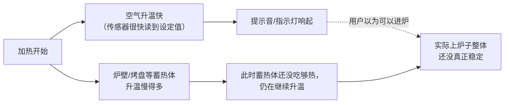
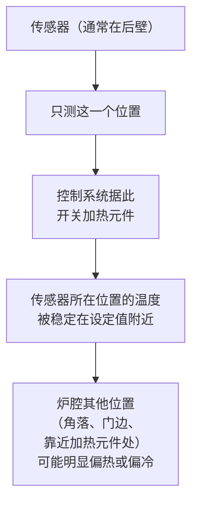
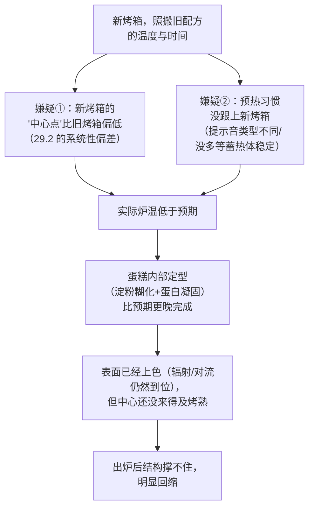

# 第 29 章 思考题参考答案

> 只记「问题 + 正确答案」。案例题给**完整推理链**——
> "现象出在哪一步 → 哪套机制 → 改哪个变量 → 用哪个记录量验证"。
>
> 涉及数字的地方，来源见[参考书目与出处登记](../standards.md)。

## Q1

**问**：为什么说"炉温不稳定"本身不代表烤箱坏了？请用"开关式温控"这个机制解释。

**答**：

**因为绝大多数家用烤箱的温控方式本身就是"低于设定值就加热、高于设定值就停"，
这种设计必然导致炉温在设定值附近持续小幅摆动，而不是稳稳停在一个数字上。**

America's Test Kitchen 明确指出：**"一台校准良好的烤箱，炉内温度可以在设定值
上下摆动多达约 25 °F（约 14 °C）"**，而这**仍被认为是正常、可接受的**；
NSF International 的标准也认可类似幅度的波动。

**所以"摆动"是设计的必然结果，不是故障**——真正该关心的问题不是
"它准不准"，而是"它摆动的中心点在哪里、幅度有多大"。

## Q2

**问**：请区分"单台烤箱内部正常摆动"与"这台烤箱长期的中心点偏离设定值"这两件事，并说明为什么标定时要分别考虑它们。

**答**：

| 现象 | 描述 | 来源 |
|------|------|------|
| **正常摆动** | 同一台烤箱，短时间内炉温在设定值上下来回波动，**这是开关式温控的固有行为** | 29.1：ATK 与 NSF 两个独立来源都认可约 ±25 °F（约 14 °C）的摆动幅度属正常 |
| **中心点偏离** | 这台烤箱**长期**摆动的那个"中心"，可能本身就不等于设定值——比如长期偏低 15 °C | 29.2：多篇消费类测评/维修资料方向一致地描述了约 14~28 °C 的系统性偏差，但**方向与幅度因烤箱而异** |

**为什么要分开考虑**：

- **摆动**是你**无法消除**的（除非换一台用更精密控制方式的烤箱），
  标定时要通过**多次读数取平均**来"滤掉"这种波动，而不是被单次读数误导；
- **中心点偏离**是你**可以补偿**的——一旦测出"这台烤箱长期偏低/偏高多少度"，
  以后设定温度时就可以主动加上这个偏移量。

**类比**：摆动像是秤本身的"抖动误差"（随机），中心点偏离像是秤的"零点漂移"（系统性）——
前者靠多次测量取平均来压低影响，后者靠校准来直接修正。

## Q3

**问**：预热提示音为什么不能直接当作"可以进炉"的唯一依据？请结合"传感器只测空气"与"蓄热体升温慢"两个机制说明。

**答**：

**两层原因**：

**① 有些提示音本身代表的就不是"到了设定温度"**：
厂商技术支持资料明确区分两种提示——一种在约 10~20 分钟后响起，代表
**空气已达到设定温度**；另一种在约 7~12 分钟后响起，厂商自己说明
"**此时尚未达到设定温度**，但已经热到可以放入大多数食物"——
**这两种提示代表的事完全不同，用户往往分不清自己的烤箱是哪一种**。

**② 就算是"真正到温度"的那种提示，它测的也只是空气**：
温控传感器是空气里的一个点，它反应快；而**炉壁、烤网、烤盘/烤石这类"蓄热体"
升温慢得多**（第 28 章的"蓄热能力"）——空气先到了设定温度，不代表
这些固体部件已经吸够了热量、达到稳定状态。

America's Test Kitchen 的对照实验也验证了后果：**半预热的烤箱会导致可预测的失败**
（曲奇摊得过大，或表面烤焦而中心未熟，具体取决于预热时上下火元件的参与方式）。

**结论**：提示音最多能告诉你"大概到了"，**真正该做的是用独立温度计确认，
并在确认之后再多等 10~15 分钟**，让蓄热体跟上。

## Q4

**问**：为什么同一个烤箱，炉腔不同位置的温度可能不一样？这和传感器的工作方式有什么关系？

**答**：

**因为温控系统只根据"传感器所在的那一个点"的读数来决定开关加热元件，
它对炉腔里其他位置的真实温度"视而不见"。**

家用烤箱的温控传感器几乎都是**单点热敏电阻**，常装在炉腔后壁——
它只能告诉控制系统"**我这个点**现在是多少度"，而控制系统的全部工作
就是把这一个点维持在设定值附近。**炉腔内其他位置离加热元件的距离、
离门的距离、气流是否能均匀到达都不一样，温度自然可能不同**。

**这正是"同一盘饼干靠后的比靠前的先上色"这类现象的机制来源**，
也是"烘烤中途转一下烤盘"这类操作建议背后的道理。

## Q5

**问**：新烤箱完全照搬旧烤箱的配方温度与时间，戚风蛋糕表面颜色正常，中心偏生、回缩严重。

**答**：

**（a）推理链与至少两个嫌疑**：

**（b）标定步骤**：按 29.5 的流程，用独立温度计在中层测几轮平均值，
对比设定值，看是否存在系统性偏低；同时记录**预热提示响起后又等了多久才进炉**，
对比这次和以往的习惯是否一致——**这能把"烤箱本身偏低"和"预热没等够"两个嫌疑分开**。

**（c）调整方法**：如果标定发现这台新烤箱长期偏低某个幅度（比如 10~15 °C），
**以后设定温度时主动把这个数字加回去**（比如配方写 180 °C，就设定成约 190~195 °C），
而不是直接改配方里的其他比例；如果问题出在预热习惯，**延长预热后的等待时间**即可，
不需要动炉温设定。

## Q6

**问**：同一盘饼干，靠后排的比靠前排的颜色深很多，其余操作完全一样。

**答**：

**（a）机制解释**：温控传感器通常装在**炉腔后壁**，只对这一个点的温度负责（29.3）；
**后排离传感器更近、也常常离加热元件更近**，炉腔前部（尤其靠近炉门的位置）
散热更快、受热相对较弱——于是**同一炉的前后位置温度本来就不一致**，
靠后的因为实际温度更高、定型更晚，褐变（美拉德反应）进行得更充分，颜色更深。

**（b）不改配方、只改操作的解决方法**：**烘烤进行到一半时，把烤盘前后调转一次方向**
（或根据 29.5 任务四标定出的"热点/冷点地图"，调整摆放位置），
让饼干在前后两个位置各经历一部分烘烤时间，抵消位置带来的差异。

**（c）验证方法**：下一次烤同一配方时，**只改"中途转不转盘"这一个变量**，
其余完全不变，对比转盘前后两批饼干的颜色均匀度；
如果转盘后前后颜色差异明显缩小，说明问题确实出在炉腔内部的位置温差上。

## Q7

**问**：【辨析】"我的烤箱是名牌，肯定比便宜烤箱准"。

**答**：

**证据强度：⚠️ 缺乏证据支持这种推断。**

| 维度 | 说明 |
|------|------|
| 已核到的信息 | 多项独立的消费者测评与维修资料描述的炉温偏差**因品牌、型号、使用年限而异**，**没有发现"贵的/名牌的就一定更准"的一致规律** |
| 本书的处理方式 | **不给任何品牌层面的推荐或排名**——这既超出本书的查证能力范围（需要持续更新的大规模横向测评），也不是本书"讲原理"的定位 |
| 更可靠的判断依据 | **标定你自己手上这台烤箱**（29.5），而不是依赖品牌声誉去推测它准不准 |

**为什么这个说法会流传**：因为"贵的东西应该更好"是一种普遍的直觉，
而且名牌烤箱在**其他方面**（如隔热、门封、做工）确实可能更出色——
但**这些优点不直接等同于"温控传感器的读数更接近真实炉温"**，
两者是不同的工程指标，**不能简单划等号**。

**本书的建议**：不管烤箱贵贱新旧，**第一件事都是自己标定一次**——
这比打听任何品牌口碑都更直接、更可靠。
