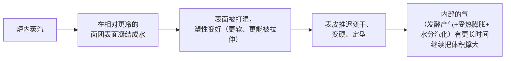
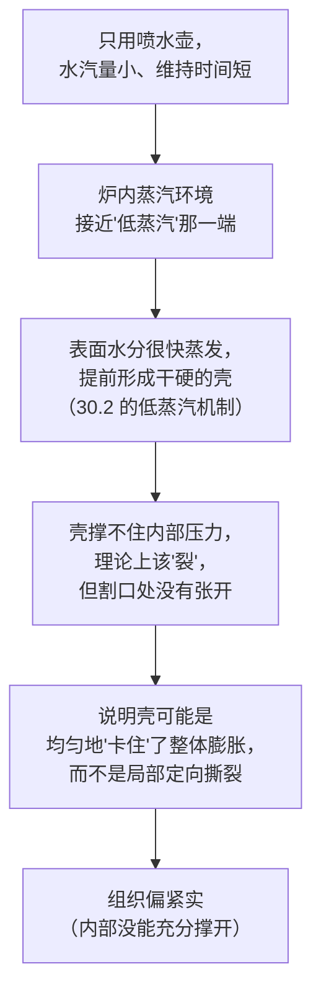

# 第 30 章 思考题参考答案

> 只记「问题 + 正确答案」。案例题给**完整推理链**——
> "现象出在哪一步 → 哪套机制 → 改哪个变量 → 用哪个记录量验证"。
>
> 涉及数字的地方，来源见[参考书目与出处登记](../standards.md)。

## Q1

**问**：为什么说蒸汽买的是"更长的膨胀窗口"而不是"更多的气"？请结合蒸汽凝结的机制解释。

**答**：

**因为蒸汽本身对面团内部的产气几乎没有贡献，它起作用的地方是面团的"表面"。**

真正"产气"的还是第 10、21 章讲过的那几笔——已有气体受热膨胀、溶解 CO₂ 逸出、
水与乙醇汽化。**蒸汽没有增加这些气的总量**，它做的是**延缓表皮这层"盖子"盖上的时间**，
让已有的气有更久的时间把面团撑开。**这就是"买窗口"而不是"买气"的含义。**

## Q2

**问**：蒸汽量和面包体积、皮肉比之间是一条 U 形曲线。请解释低蒸汽端"体积大但开裂"的机制，并说明这和高蒸汽端的"体积大"是不是同一个原因。

**答**：

**不是同一个原因——两端"体积大"的机制完全不同。**

| 蒸汽量 | 体积为什么大 | 代价 |
|--------|------------|------|
| **低蒸汽端** | 表面水分蒸发太快，**过早形成一层又干又脆的壳**，这层壳撑不住内部压力，**在最薄弱处裂开**，于是测出的"体积"里包含了这种"炸裂式"的膨胀 | **表皮开裂、外观不可接受**（研究者明确判定） |
| **高蒸汽端** | 表面长时间保持湿润塑性，**结构能更均匀、更完整地被撑大**，光泽度也最高 | 升温速率变慢（蒸汽凝结释放的热量被"喂"进了持续的表面蒸发过程），皮肉比仍然偏高 |

**所以**：低蒸汽端的"大"是**失控的撕裂**，高蒸汽端的"大"是**可控的均匀膨胀**——
**把两端的"体积数字"放在一起比较会产生误导**，这正是为什么本书强调
要把"体积"和"外观是否可接受"分开看。

## Q3

**问**：为什么说"蒸汽让面包颜色更好看"这句话，把因果关系的主次搞反了？请引用本章提到的一项对照实验的具体结论。

**答**：

**因为已核到的对照实验显示，蒸汽对颜色的影响并不显著，而对表皮厚度与面包芯含水量的影响才是显著的。**

一项直接法面团的加湿烘烤对照实验（185/195/205 °C，烤 25/30/35 分钟）明确发现：

> **加湿对表皮颜色没有显著影响（P > 0.05）**，
> 但**显著减小表皮厚度（P < 0.001）**、**提高面包芯的初始含水量**，
> 从而减慢 96 小时储存中的变硬。

**所以**：如果只盯着"颜色好不好看"去判断蒸汽有没有用，
会**漏掉它真正的、统计上显著的作用**（表皮更薄、面包芯更湿润、老化更慢）。
另一项研究确实发现蒸汽量增加时颜色读数会变浅，**但那是在"颜色、光泽、脆度、
透水性"同时变化的背景下观察到的**，不能把颜色单独挑出来当成蒸汽的核心作用。

## Q4

**问**：为什么荷兰锅/铸铁锅类的加蒸汽方法，在厂商测试中效果明显好于喷水壶？请用"水汽的量"和"水汽维持的时间"两个角度解释。

**答**：

| 角度 | 喷水壶 | 加盖容器（荷兰锅） |
|------|-------|-------------------|
| **水汽的量** | 喷洒的水量相对整个炉腔体积非常有限 | 面团自身在烘烤中持续释放的水分，**全部**被困在锅内这个小空间里，相当于一个持续的水汽来源 |
| **水汽维持的时间** | 喷一次之后，水汽很快被炉内气流带走或凝结在别处，**作用窗口很短** | 锅盖形成了一个密闭小环境，水汽**持续积累、不易逃逸**，作用窗口覆盖了表皮定型前的大部分时间 |

**结合 30.1 的机制**：蒸汽起作用靠的是"在表皮上持续凝结、维持塑性"，
**而不是"瞬间喷湿一下"**。喷水壶给的是一次性的、量很小的水汽；
加盖容器给的是持续的、围绕面团本身规模的水汽环境——**这正是为什么
厂商测试里两者效果差距明显**。

## Q5

**问**：某人只用喷水壶喷了几下，成品表皮颜色浅、组织偏紧实、割口处几乎没张开。

**答**：

**（a）推理链**：

**（b）两个改动方向**：

| 方向 | 对应机制 | 做法 |
|------|---------|------|
| **换成能维持更久蒸汽的方式** | 30.4：喷水壶效果有限，加盖容器效果明显更好 | 改用预热好的荷兰锅/加盖容器，或至少在炉内放一盘开水并尽量延长其蒸发时间 |
| **确认割口深度/角度是否给了足够的"指定破口"** | 第 25 章：割口指定破口位置，不是"让面包涨得更大" | 检查割口是否够深、角度是否合适，排除割口本身的问题 |

**（c）验证方法**：**一次只改一个变量**——先只换加蒸汽方式，其余不变，
记录表皮颜色、割口是否张开、炉内涨幅；如果明显改善，说明问题确实出在蒸汽环境上。

## Q6

**问**：某人用荷兰锅全程盖着盖子直到出炉，表皮比平时厚、偏韧，割口张开不如上次只盖一半时间好看。

**答**：

**（a）机制解释**：蒸汽的作用窗口**只在表皮还没定型的那一段**（30.1 的"买窗口"结论）。
一旦结构已经完成主要定型（第 21 章的"定型接力"：脂肪熔化 → 淀粉糊化 → 蛋白凝固 → 表面褐变），
**继续维持高湿度环境不再带来膨胀上的好处**，反而会让表皮持续吸收水汽、
**变厚变韧**，而不是正常地失水变脆——这与第 21 章"加湿减小表皮厚度"的结论
看似矛盾，实际上说的是**适度、阶段性**的加湿，不是"全程泡在水汽里"。

**（b）改动方向**：**在烘烤进行到大约一半（或观察到表面已经明显上色、
定型迹象出现）时揭开盖子**，让后半段在相对干燥的环境里完成表皮的
正常脱水与褐变，而不是让表皮一直处在潮湿环境中。

## Q7

**问**：【辨析】"没有专业蒸汽烤箱，在家就做不出欧包的开花效果"。

**答**：

**证据强度：⚠️ 方向有一定道理，但说法过于绝对。**

| 维度 | 说明 |
|------|------|
| 有道理的部分 | 家用土法加蒸汽（喷水壶、水盘等）在厂商测试中**效果明显弱于**专业设备级别的持续蒸汽注入；同行评议研究里的"理想蒸汽量"（如 300~400 mL 级别、持续数分钟）在家用条件下很难精确复现 |
| 过于绝对的部分 | 厂商自己的比较测试显示，**加盖容器类做法（荷兰锅/铸铁锅）的效果被认为是家用方法里最接近理想效果的**——它通过"困住面团自身释放的水分"这个机制，**在小尺度上模拟了专业蒸汽烤炉的持续高湿环境** |
| 本书的态度 | **不做"能/不能"的绝对判断**，而是指出：**方法之间效果差异很大**，选对方法（加盖容器优于喷水壶）比纠结"有没有专业设备"更重要 |

**本书的建议**：与其纠结"家用烤箱天生做不到"，不如先把加蒸汽的**方式**换成
效果更好的那一种（30.4），再用 30.8 的对照任务验证自己的烤箱能做到什么程度。
