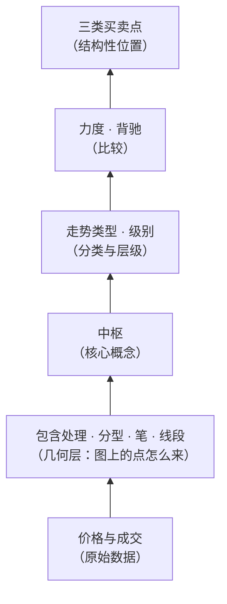

# 第一部分 · 入门与地基

这一部分要做三件事：**把问题摆出来、把地图画出来、把数据地基打好**。

## 为什么从"分类"开始，而不是从"怎么赚钱"开始

打开任何一个缠论社群，最热闹的永远是买卖点。但买卖点是整套理论的**最后一层**：

跳过下面四层直接学最上面一层，会得到一种很典型的状态：
**术语都会说，一到具体的图上就各说各话**。因为"这里是第一类买点"这句话，
展开了以后是"这是一个完成的下跌走势类型的最后一段，且它相对前一段同向走势力度衰减"——
其中每一个词都需要前面几层来定义。

所以本部分先讲**分类**（第 1 章），它是整栋楼的地基；
然后讲**级别**（第 3 章），它是让这套定义不至于循环的关键；
最后把**数据**弄对（第 2、4 章），因为再漂亮的定义，喂进去的价格序列不对也是白搭。

## 本部分章节

| 章 | 标题 | 一句话 |
|---|---|---|
| 1 | [走势只有三类](01-three-types.md) | 上涨、下跌、盘整，以及为什么这个分类必须靠中枢才封闭得起来 |
| 2 | [你在看的到底是什么](02-what-you-see.md) | K 线是有损压缩；复权为什么是第一个坑 |
| 3 | [级别](03-levels.md) | 没有级别就没有判断；周期不是级别 |
| 4 | 拿到可复现的行情 | 免费数据源实测；复权因子、停牌与除权的处理 |
| 5 | 均线与「吻」：被取代的早期框架 | 原著前十几课的体系，以及为什么不要和中枢混用 |
| P1 | 🛠 搭一个可复现的行情底座 | 🅐 手工核对复权价 / 🅑 拉一份复权日线并校验 |

## 读完这一部分，你应该能

- 说清楚"上涨 / 下跌 / 盘整"三个词在缠论里的**准确含义**，
  以及它和日常说的"涨了""横盘"有什么不同；
- 解释为什么"不说级别就谈趋势"是一句没有信息量的话；
- 判断一句缠论表述属于〔定义〕〔推论〕〔经验断言〕〔不可证伪〕中的哪一类；
- 自己拿到一份**复权正确**、可复现的行情数据。

> ⚖️ 本书只讲方法与检验，不推荐任何标的、不预测行情、不构成投资建议。
> 市场有风险，任何据此产生的后果由读者自负。
