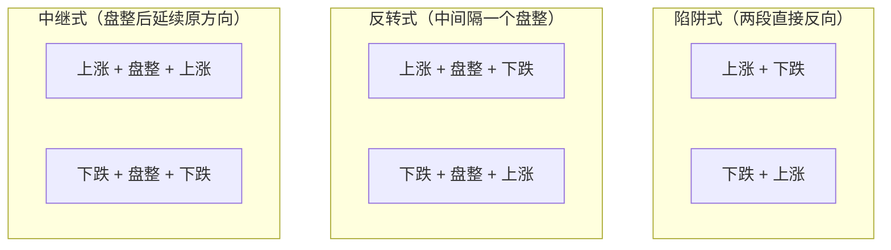
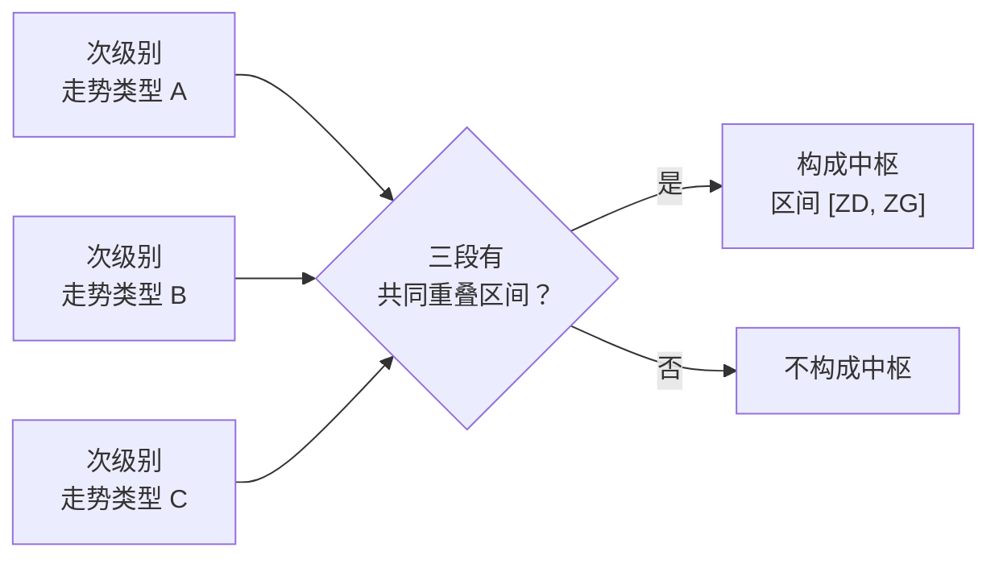
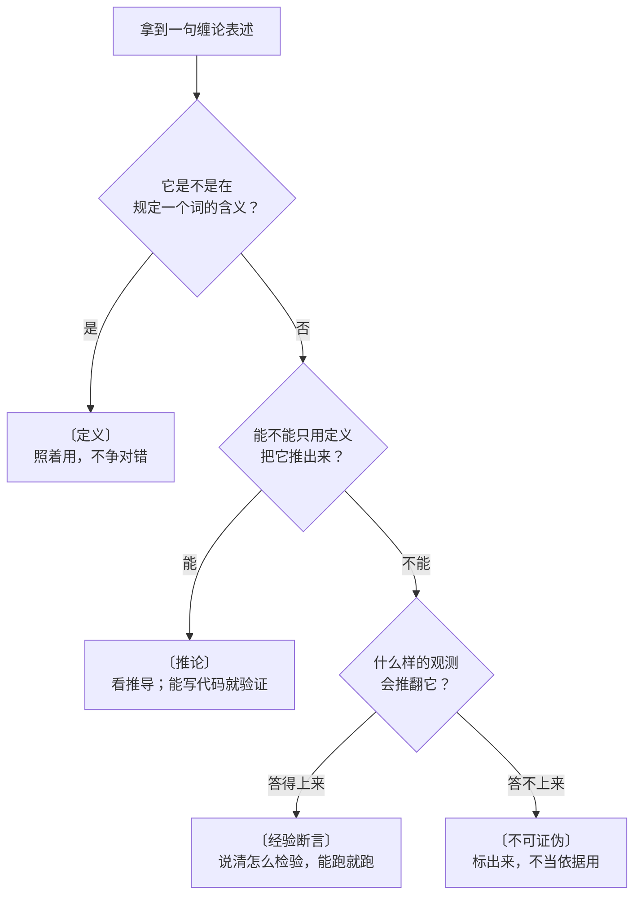

# 第 1 章 · 走势只有三类

> 本章要建立的是全书最底层的一块砖：**走势的分类**。
> 读完你应该能说清楚"上涨""下跌""盘整"在缠论里的准确含义，
> 知道这个分类为什么必须靠[中枢](../../glossary.md#zhongshu)才封闭得起来，
> 并且第一次学会给一句话打标签——判断它是定义、推论、经验断言，还是不可证伪的表述。

## 1.1 一个真问题

两个人看同一张图。

甲说："这是上涨途中的一次休整，回踩到位就继续。"
乙说："这是见顶的第一波，反弹就是出货机会。"

甲乙都能讲出一套听着挺完整的道理，而且都举得出过去成功的例子。
问题是：**他们的判断根本无法对账**。因为两人说的"上涨""见顶"各自没有严格定义，
所以事后无论走出什么形态，双方都能说自己那套是对的、只是"这次特殊"。

技术分析里绝大部分争论是这种争论。它的根源不是谁更聪明，
而是**大家用的词没有共同定义**。

缠论的出发点，就是不解释"为什么涨"，只做一件更朴素的事：
**先把看到的东西分类，而且分得让两个人能对账**。
原著把这个立场表述得很干脆——走势就是"打开走势图看到的"，
不假设它由什么因素决定，只承认它可观察。

这不是一个小要求。要做到"能对账"，分类必须同时满足三条：

1. **穷尽**：任何一段走势都能被分进去，不能有"第四种"；
2. **互斥**：同一段走势不能既是这类又是那类；
3. **可判定**：两个人拿同一段数据，按定义走一遍，得到同一个答案。

后面会看到，缠论在前两条上做得相当好，第三条上则要付出代价。

## 1.2 朴素版的三分类

原著在**第 15 课**给出了最初的定义[^1]：

[^1]: 本书对原著定义一律转述而非照抄，课次与出处见[出处与资料](../../sources.md)。

〔定义〕**朴素三分类**（第 15 课）：

| 类型 | 条件 |
|---|---|
| **上涨** | 最近一个高点比前一个高点高，**且**最近一个低点比前一个低点高 |
| **下跌** | 最近一个高点比前一个高点低，**且**最近一个低点比前一个低点低 |
| **盘整** | 高点更高但低点更低（扩张）；或高点更低但低点更高（收敛） |

把两个条件排成真值表，会发现这个分类确实**穷尽且互斥**：

| 最近高点 vs 前高 | 最近低点 vs 前低 | 类型 |
|---|---|---|
| 更高 | 更高 | 上涨 |
| 更低 | 更低 | 下跌 |
| 更高 | 更低 | 盘整（扩张） |
| 更低 | 更高 | 盘整（收敛） |

四种组合，一个不漏，互不重叠。这是一个干净的完全分类——
**缠论的全部推导，最终都回到这张两行两列的表上**。

### 它不够在哪

问题出在两个词上：**"高点"和"低点"**。

图上到处都是局部高低点。取哪些算数？原著在第 15 课当时的答案是用两条均线来过滤——
"只有在'吻'前后出现的高、低点才有意义"。但这个答案有个致命的地方：
**均线的参数是人定的**。5 日和 10 日给出一组高低点，20 日和 60 日给出另一组，
同一段走势可以既是"上涨"又是"盘整"，取决于你选了什么参数。

这就回到了 1.1 节那个无法对账的困境——只是把"我觉得"换成了"我用的参数"。

原著自己后来放弃了这条路。**第 25 课**里作者写得很明白：均线系统本质上和 MACD
是一回事，只能是一种辅助性工具，**不要和中枢混在一起**。

> 这件事值得多说一句，因为它决定了本书为什么不按原著课号顺序讲。
> 原著前十几课整套建立在均线的"吻"上，而那套框架后来被作者自己降格为辅助。
> 照课号顺序学缠论，等于先花大力气学一套已经被废弃的东西。
> 本书把它放到第 5 章作为"历史层"交代，**并明确提醒不要与中枢混用**。

〔经验断言〕顺带说一句：均线的"吻"能不能过滤出有意义的高低点，
本身是一个可以被数据检验的断言——不同参数下的分类结论有多大比例会翻转，
是可以直接算出来的。本章 🅑 档实操就做这件事。

## 1.3 两段之间：六种组合，三种性质

把两段走势接起来，会出现什么？原著在**第 16 课**做了一次穷举：



这个穷举的价值不在于分出了三种花样，而在于它带出一个**结构性约束**：

〔推论〕**同级别的两段走势类型不允许"上涨 + 上涨"或"下跌 + 下跌"直接相连。**

为什么？因为如果两段同级别、同方向的走势类型直接相连，
按 1.5 节的严格定义它们会合并成**同一个**走势类型（中枢连着数下去就是了），
而不是两个。所以"上涨 + 上涨"这种写法，要么说明中间漏了一个中枢没数到，
要么说明你把两个不同级别的东西并排放了。

这条约束在实战判读中非常好用：**当你的分解里出现了同向相连的两段，
不要想"这次比较特殊"，去检查你是不是漏数了一个中枢。**
原著在**第 43 课**也是拿这条约束来推断背驰之后可能出现什么。

## 1.4 没有级别，三分类等于没说

上面所有讨论都藏着一个前提：**在哪个级别上讨论**。

原著在第 15、16 课反复强调这一点：同一段走势，在较小周期上是一个完整的上涨，
在较大周期上可能只是一次盘整中的一段，甚至只是下跌途中的反弹。
所以"抛开级别谈趋势与盘整"是一句**没有信息量的话**。

〔定义〕**级别**是走势类型的层级。一个本级别的走势类型，由**次级别**的走势类型构成。

注意这里的措辞：级别**不等于** K 线周期。周期图（1 分钟、日线、周线）只是级别的一种
近似实现——用固定时间切片去近似"层级"，方便但不精确。第 3 章专门讲这件事。

实践上这意味着一条硬纪律：

> **一次分解只在一个级别上进行。**
> 跨级别混着填，是初学者填[走势分解记录表](../../forms/decomposition-log.md)时最常见的错误。

## 1.5 把定义封闭起来：中枢

现在回到 1.2 节留下的问题：高低点到底怎么定？

缠论的答案不是"换一个更好的指标去过滤"，而是**换一个定义方式**：
不再从"点"出发，改从**区间的重叠**出发。

〔定义〕**中枢**（第 17 课）：某级别走势类型中，
**被至少三个连续次级别走势类型所重叠的那一段区间**。

具体算法很简单。设连续三个次级别走势类型 A、B、C，高低点分别是
`(a1, a2)`、`(b1, b2)`、`(c1, c2)`，则中枢区间为：

```text
[ZD, ZG] = [ max(a2, b2, c2),  min(a1, b1, c1) ]
```

如果算出来 `ZD > ZG`，说明这三段根本没有共同重叠区间，**不构成中枢**。
完整记号见[记号速查](../../notation.md)。



有了中枢，三分类就可以重新定义，而且这次不依赖任何人为参数：

〔定义〕**严格三分类**（第 17 课）：

| 类型 | 条件 |
|---|---|
| **盘整** | 某完成的走势类型**只包含一个**中枢 |
| **上涨** | 包含**两个及以上**依次向上、且**互不重叠**的同级别中枢 |
| **下跌** | 包含**两个及以上**依次向下、且**互不重叠**的同级别中枢 |

上涨与下跌合称**趋势**。

这个定义有几个地方值得停下来看：

- **它是按"数中枢个数"判定的，不是按"看起来的形状"判定的。**
  一段肉眼看着很陡的单边走势，只要只数出一个中枢，它就是盘整；
  一段肉眼看着很磨人的震荡，只要数出两个不重叠的同向中枢，它就是趋势。
  这是初学者最反直觉的一点，也是最需要扭过来的一点。
- **"互不重叠"是硬条件。** 原著在**第 18 课**特别强调，
  趋势中的两个中枢之间不允许有任何重叠，**包括围绕中枢产生的瞬间波动之间的重叠**。
  一旦重叠，得到的不是趋势，而是一个**更大级别的中枢**（第 15 章的主题）。
- **它只对"完成的"走势类型成立。** 还在进行中的走势不能定类型——
  这一点会在 1.6 节变成一个很有意思的问题。

### 递归会不会无限下去

细心的读者立刻会发现一个循环：走势类型要靠中枢来定义，
而中枢又要靠**次级别的走势类型**来定义。这是个死循环吗？

原著在**第 35 课**正面回答了：解开循环的钥匙是**级别必须有最低层**。
类比是量子——物理世界不是无限可分的，交易也一样：
最严格地说，**每一笔成交就是最低级别**，连续三笔同价位成交即构成最低级别的中枢。
有了这个底，整个递归就是良定义的了：从最低级别开始往上，逐层构造。

〔推论〕**递归是良定义的，当且仅当存在最低级别。**
这不是文字游戏——它意味着任何缠论的**程序实现**都必须先声明"我的最低级别是什么"
（1 分钟 K 线？5 分钟？逐笔成交？），而**不同的选择会给出不同的分解结果**。
这是第 11 章要量化的东西。

## 1.6 两条原理、两条定理

有了中枢，原著在第 17 课给出了整套理论的顶层：

**基本原理一**：任何级别的任何走势类型**终要完成**。简称"走势终完美"。

**基本原理二**：任何级别的任何**完成的**走势类型，必然包含一个以上中枢。

**分解定理一**：任何级别的任何走势，都可以分解成同级别"盘整""上涨""下跌"三种走势类型的连接。

**分解定理二**：任何级别的任何走势类型，都至少由三段以上次级别走势类型构成。

这四条里，**只有一条经得起"什么观测会推翻它"的追问**。逐条看：

### 原理二：〔推论〕，可以验证

原著的论证是反证法：如果一段走势里一个中枢都没有，
意味着整张图上只存在"一次向下之后永远向上"或"一次向上之后永远向下"两种可能；
而这要求该品种在某个时刻之后**永远停止交易**，与"走势可以延续下去"的前提矛盾。

这个论证是成立的，但它**明确依赖一个前提：交易能够延续**。
原著自己在**第 26 课**承认这是理论的死穴——
突然停止交易、退市、甚至交易被判作废，理论就不适用了。
本书第 36 章会把这个前提放到 A 股的现实规则里逐条检查。

〔推论〕的好处是**可以用代码验证算法自洽性**：
实现完几何层与中枢之后，跑一遍历史数据，检查是否存在"被判为完成、却数不出中枢"的走势类型。
如果出现了，那是实现有 bug，不是理论错了。这是第 11 章的一项检查。

### 分解定理一、二：〔推论〕

两条都可以从定义与原理二推出来，本书在第 18 章给出完整推导。
定理二尤其有用：**任何走势类型至少由三段次级别走势类型构成**——
这条给了判读一个硬下界，"两段就完成了一个走势类型"一定是分解错了。

### 原理一"走势终完美"：〔不可证伪〕

这条要单独说，因为它是缠论里被引用最多、也被误用最多的一句话。

问：**什么样的观测会推翻"任何走势类型终要完成"？**

答不上来。因为"完成"的判据是"下一个走势类型开始了"，
所以在任何一个当下，如果还没完成，永远可以说"它还在延伸中"。
原著自己在**第 18 课**明确写了：一个走势类型在满足条件后**随时可以完成，
也可以不断延伸下去，直到无穷都是可以的**。

一个事后永远为真、事前不给任何约束的句子，就是〔不可证伪〕的。

**但"不可证伪"不等于"没用"**，这一点务必分清：

- 它**不是**预测工具。用"走势终完美"推出"所以一定会涨回来"是**错的**——
  走势类型的完成可以是向下完成。这条误用后面在「常见说法辨析」里还会出现。
- 它**是**一条分类完备性的宣告：不存在第四种走势，任何图形最终都落进这三类里。
- 它**是**一条心态约束：提醒你当下看到的永远是"未完成"的一段，
  所以任何"已经确定"的判断都带着未完成的风险。原著的许多篇幅其实是在讲这件事。

本书的处理方式是：**把它标出来，承认它的作用，但不拿它当依据去推结论**。

## 1.7 学会打标签

上一节其实已经把本书的核心方法演示了一遍。把它归纳成流程：



拿本章出现过的四句话走一遍：

| 表述 | 标签 | 理由 |
|---|---|---|
| "只含一个中枢的完成走势类型称为盘整" | 〔定义〕 | 它在规定"盘整"这个词的含义 |
| "同级别不允许上涨 + 上涨相连" | 〔推论〕 | 从严格三分类的定义可以推出 |
| "均线的吻能过滤出有意义的高低点" | 〔经验断言〕 | 换参数后分类翻转比例是可以算的 |
| "任何走势类型终要完成" | 〔不可证伪〕 | 未完成永远可以解释成"还在延伸" |

这四个标签会贯穿全书。**打标签不是为了贬低理论**——
恰恰相反，它是为了让理论里**真正硬的那部分**（定义与推论）不被软的部分拖累。
缠论的定义层是相当讲究的；问题从来出在有人拿〔不可证伪〕的句子去当〔推论〕用。

## 1.8 全书地图

本章讲的分类是地基。往上还有五层：

| 层 | 解决什么 | 在第几部分 |
|---|---|---|
| 几何层（包含处理 → 分型 → 笔 → 线段） | 图上的"点"到底怎么来 | 第二部分 |
| 中枢 | 分类怎么封闭；级别怎么产生 | 第三部分 |
| 力度与背驰 | 同向的两段怎么比强弱 | 第四部分 |
| 三类买卖点 | 结构性位置在哪 | 第五部分 |
| 多义性与现实约束 | 这套东西的边界在哪 | 第六、七部分 |

⚠️ 有一件事要先交代：**本书掌握的原著原文只到第 48 课**，
而几何层的严格定义（分型、笔、线段、特征序列）在第 62、65、67 课。
第二部分的定义出自第 62、65、67、71 课，本书已补核原文（见[出处与资料](../../sources.md)第 1.4 节）；
仍未取得原文的地方明确标注"据公开转述，未见原文"，并另找可核对的出处——
不拿记忆冒充出处，是这本书的底线。

## 常见说法辨析

| 说法 | 证据强度 | 辨析 |
|---|---|---|
| "缠论说走势只有三种，所以看图很简单" | ❌ 明确错误 | 混淆了**命题形式简单**与**判定过程简单**。三分类的严格版依赖中枢计数、级别选定与几何层实现，判定一点也不简单。这个说法之所以流传，是因为"只有三种"这句话本身太好传播了 |
| "盘整就是横着走，上涨就是涨" | ❌ 明确错误 | 严格定义按**中枢个数**判定。一段陡峭的单边只要只有一个中枢就是盘整，一段磨人的震荡只要有两个不重叠同向中枢就是趋势。这是最需要扭过来的直觉 |
| "走势终完美，所以跌下去一定会涨回来" | ❌ 明确错误 | 把〔不可证伪〕的句子当成了预测。"走势类型会完成"完全可以是**向下完成**，与价格回到某个位置无关。这是本章 1.6 节的核心警告 |
| "缠论是公理化的，所以像几何一样严密" | ⚠️ 有争议 | 定义层确实做了形式化努力，这是它高于多数技术分析流派的地方。但：一、最低级别的选取是人为约定；二、包含处理与线段划分带约定（第 6、10 章）；三、**"内部严密"不蕴含"对市场有效"**——前者是逻辑问题，后者是经验问题 |
| "不用管级别，看日线就行" | ❌ 明确错误 | 原著在第 15、16 课反复强调抛开级别谈趋势毫无意义。实践中固定看某一周期是可以的，但那是**选定了一个操作级别**，不是"不用管级别"——两者的区别在于前者会明说自己的判断只在该级别成立 |
| "学会三分类就能判断顶底" | ⚠️ 缺乏证据 | 三分类是**分类工具**，本身不含时点判断。顶底涉及背驰与买卖点（第四、五部分），而那些属于〔经验断言〕，需要检验才知道成色 |
| "原著说这三类买卖点是被理论保证的、绝对的" | ⚠️ 有争议 | 原著确实有这类表述。但"被理论保证"的准确含义是**在定义体系内部自洽**，与"在真实市场上按它操作会怎样"是两个问题。本书第 28 章与第六部分专门处理这个区分 |

## 思考题

数量不固定，按内容来。想清楚再看答案。

**Q1.** 第 15 课的朴素三分类在逻辑上已经是穷尽且互斥的完全分类了，
为什么还需要引入中枢重新定义一遍？请说出**具体**是哪个环节出了问题。

**Q2.**【判读】某人按某个级别分解一段走势，得到的结果是：
第一段含 2 个依次向上且互不重叠的同级别中枢，紧接着第二段又含 2 个依次向上
且互不重叠的同级别中枢，并且第二段的中枢都在第一段之上、与第一段的中枢无重叠。
他把这记作"上涨 + 上涨"。这个记法对吗？如果不对，正确的理解是什么？

**Q3.**【标签】"任何级别的任何走势类型终要完成"属于〔定义〕〔推论〕〔经验断言〕
〔不可证伪〕中的哪一类？说出你的判别过程。既然是那一类，它还有什么用？

**Q4.**【标签】"任何完成的走势类型必然包含一个以上中枢"属于哪一类？
如果要在代码里验证它，你会检查什么？验证失败时，你应该怀疑理论还是怀疑实现？

**Q5.**【判读】有人说："日线在盘整，所以现在不能动。"
这句话作为一个缠论判断，缺了哪些必要信息？请至少指出三项。

**Q6.**【查证】原著第 26 课承认，理论成立的前提是"交易能延续且算数"。
请去你所在市场的交易所官网，查一条真实存在的规则（停牌、退市、临时停牌、
涨跌幅限制等均可），说明它在什么情形下会触发这个前提失效，
以及这时候按缠论做出的判断会变成什么状态。

> 📖 **参考答案**（想清楚再看）：
> [Q1](../../qa/01-three-types-qa.md#q1) ·
> [Q2](../../qa/01-three-types-qa.md#q2) ·
> [Q3](../../qa/01-three-types-qa.md#q3) ·
> [Q4](../../qa/01-three-types-qa.md#q4) ·
> [Q5](../../qa/01-three-types-qa.md#q5) ·
> [Q6](../../qa/01-three-types-qa.md#q6)

## 本章实操

两档都**不需要开户、不需要下单**。

### 🅐 手工版：体会"高低点从哪来"这个问题

**需要**：一张历史走势图（自己的行情软件截图或打印皆可）、笔、
[走势分解记录表](../../forms/decomposition-log.md)。

1. 选一段**已经走完**的历史区间（不要选最近的、还在进行的），把图打印或截屏。
2. 先**不看任何指标**，凭肉眼标出你认为的高点与低点，用 A 组标记。
3. 再按另一套标准标一遍（比如"必须跨过 N 根 K 线才算一个高低点"，
   N 自己定一个值），用 B 组标记。
4. 分别用 A 组、B 组的高低点，按 1.2 节的朴素三分类给这段走势定类型，填进记录表。
5. **记录关键结论**：A 组与 B 组给出的类型一样吗？如果不一样，
   把"换一套高低点标准就换一个结论"这件事写进记录表的「歧义」列。

这一步做完，你就**亲手**造出了 1.2 节说的那个困境。后面学中枢时会更有感觉。

### 🅑 代码版：量化"参数一换，结论就翻"

**需要**：装好 Python 环境、一个免费行情数据源（见[出处与资料](../../sources.md)第四节）。
本章还没学几何层，所以**不要**去实现完整的缠论算法，只做一件能做的事。

1. 取一批历史日线数据，**必须用复权价**
   （不复权会凭空多出跳空缺口，见[复权](../../glossary.md#fuquan)；第 2、4 章细讲）。
2. 写一个最朴素的局部极值函数：给定窗口 `N`，若某根 K 线的高点是其前后各 `N` 根中最高，
   记为一个高点；低点同理。
3. 让 `N` 在一个范围内变化（比如 3 到 30），对每个 `N`，用得到的高低点序列
   按 1.2 节的朴素三分类给同一段走势定类型。
4. 统计：**有多大比例的样本，其分类结论会随 `N` 变化而改变？**
5. 把这个比例、样本范围、复权方式、`N` 的取值范围，
   一起登记进[出处与资料](../../sources.md)第五节。

**这一步的意义**：你会得到一个具体的数字来支撑 1.2 节那句"朴素定义不够用"。
这正是本书与姊妹书的差别——**能算出来的，就不要只用形容词**。

⚠️ 做这一步时注意两件事：一是先填
[检验预登记表](../../forms/prereg-template.md)，把 `N` 的范围和统计口径写死再跑；
二是**不要**顺手去试"哪个 `N` 收益最好"——那是第六部分要专门讲的数据窥探陷阱。

## 🔎 看盘时的用处

本章的内容压缩成几条**观察动作**（注意：是观察，不是买卖）：

1. **先问级别，再听结论。** 别人说"这里是上涨"时，第一个反应应该是
   "在哪个级别上？"没有级别的结论不必接着听。
2. **数中枢，不看形状。** 判盘整还是趋势时，去数不重叠的同向同级别中枢有几个，
   而不是看这段图"陡不陡""横不横"。
3. **看到同向相连就去找漏掉的中枢。** 分解里出现"上涨 + 上涨"，
   几乎一定是你漏数了一个中枢，或者混了级别。
4. **听到"走势终完美"就警觉。** 这句话后面如果跟着一个方向性结论
   （"所以会涨回来"），那是误用。
5. **随时给听到的句子打标签。** 这是本章最值得带走的习惯：
   问一句"什么观测会推翻它"，能立刻把一半的缠圈话术筛掉。

> ⚖️ 本书只讲方法与检验，不推荐任何标的、不预测行情、不构成投资建议。
> 市场有风险，任何据此产生的后果由读者自负。
