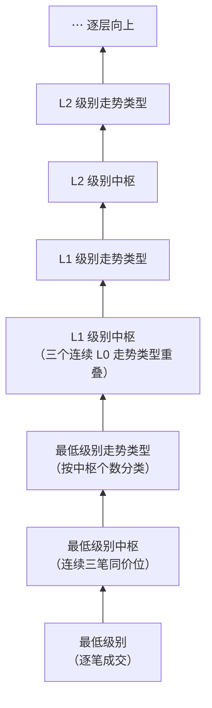
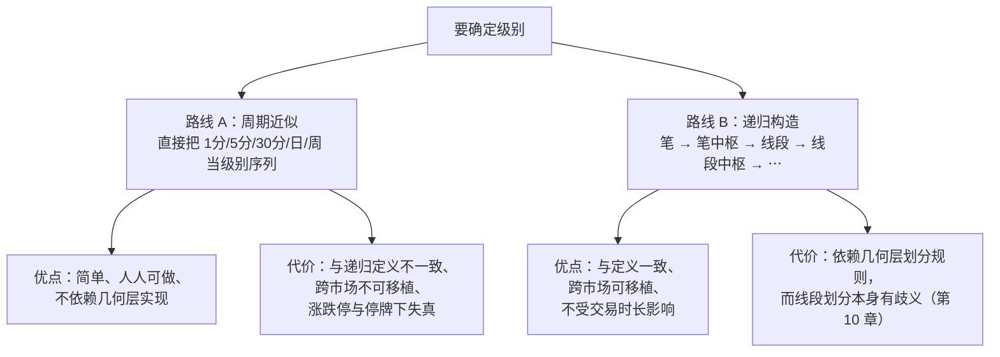

# 第 3 章 · 级别

> 级别是缠论里**最容易被略过、也最容易出错**的概念。
> 它同时扮演两个角色：既是定义的一部分，又是**解开循环定义的那把钥匙**。
> 这一章讲清楚它是什么、它和 K 线周期的关系（不是一回事），
> 以及"周期即级别"这个几乎所有人都在用的近似，代价到底有多大。

## 3.1 循环定义与那把钥匙

第 1 章留了一个扣子。把两条定义并排放：

- 走势类型（盘整 / 上涨 / 下跌）**由中枢的个数**定义；
- 中枢**由三个连续次级别走势类型**的重叠定义。

走势类型要中枢，中枢要走势类型。这是一个环。

原著在**第 35 课**正面处理了它，答案是：**级别**。
中枢不是由"走势类型"定义的，而是由"**次级别**走势类型"定义的——
只要级别有最低层，这个环就变成了一条从下往上的链：

〔定义〕**级别**是走势类型在这条递归链上的层数。

〔推论〕**递归是良定义的，当且仅当存在最低级别。**
这不是文字游戏，它有一条很实际的后果：

> **任何缠论的实现——不管是脑子里的还是代码里的——都必须先声明自己的最低级别是什么。**
> 说不出来，就说明你的"级别"是一个没有定义的词。

原著给出的最严格答案是：**每一笔成交是最低级别，连续三笔同价位成交构成最低级别中枢**
（第 35 课）。这个答案在理论上干净，但在实践中几乎没人这么做——
逐笔数据贵、量大、且免费渠道基本拿不到（见第 4 章）。
于是所有人都在做同一件事：**用 K 线周期去近似级别**。

这个近似有多大代价，是本章剩下部分的主题。

## 3.2 周期不是级别

先把两个词分清楚：

| | K 线周期 | 级别 |
|---|---|---|
| 是什么 | 聚合成交流的**时间窗口**（1 分钟、30 分钟、日） | 递归链上的**层数** |
| 由谁决定 | 你在软件里选的 | 中枢的递归构造 |
| 单位 | 时间 | 层 |
| 跨市场可比吗 | 否（见 3.3） | 是 |

〔推论〕**"30 分钟级别"这个说法，严格讲是不成立的。**
准确的说法只有两种：

- "在 30 分钟周期图上看到的中枢"——这是对**观察工具**的描述；
- "级别 L（本书以 30 分钟周期近似）"——这是对**级别**的描述，并声明了近似方式。

日常交流里说"30 分钟级别"没什么大问题，但一旦要对账、要写代码、要检验，
这个含糊就会变成实实在在的分歧。

### 原文的直接支持

本书写这一章时只能靠推理与实测。核对第 65 课原文后发现，
**作者本人就明说过这件事**（转述）：

> 再次强调，**用什么图与以什么级别操作没有任何必然关系**。
> 用 1 分钟图，也可以找出年线级别的背驰，然后进行相应级别的操作。
> 看 1 分钟图，并不意味着一定要玩超短线——把显微镜当成被显微镜的，
> 肯定是脑子水太多了。

原文还用了一个很贴切的比喻：**K 线周期是显微镜的倍数**，
而级别是被观察对象的结构层次。换更高倍的显微镜，
看到的是同一个对象的更细部分，**不是换了一个对象**。

〔推论〕**所以"我做日线所以只看日线图"这个习惯，
在原文的框架里是没有依据的**——
看什么图与在哪个级别上操作，是两个独立的选择。

⚠️ 但要注意这不否定 3.4 节的取舍：用小周期图能看到更多细节，
代价是数据量、噪声与约定敏感性都上升（第 24、29 章）。

### 一段值得注意的史料

流传的原著整理版里，有整理者在第 25 课附近加的注，
大意是：作者在 2007 年年中前后**改过级别口径**——
早期说的"30 分钟中枢"相当于后期的"5 分钟中枢"，早期的"日线中枢"相当于后期的"30 分钟中枢"，
早期的"1 分钟中枢"相当于后期"1 分钟图上的笔中枢"。

> ⚠️ **这条注不是原著正文，是整理者加的**，本书未见原文，
> 相关课次的核对状态见[出处与资料](../../sources.md)。

即便如此，它指向一件本身就值得注意的事：**缠论后期的级别体系，
是从"笔中枢 / 线段中枢"这类递归构造出发的，而不是从固定周期出发的**。
换句话说，连原著自己在写作过程中都没能把"周期"和"级别"稳定地对应起来——
这恰恰是 3.3 节要说的问题。

## 3.3 周期阶梯与级别阶梯对不上

用周期近似级别，等于假设了一件事：

> **相邻两个周期之间的关系，等同于相邻两个级别之间的关系。**

这个假设经不起算。

### 级别阶梯的下界是 3

分解定理二说：任何级别的任何走势类型，**至少由三段次级别走势类型构成**
（第 17 课）。所以从 L−1 到 L，最少要三段。这是**下界**，不是固定值——
中枢可以延伸，实际段数常常远多于三。

### 周期阶梯是多少，取决于交易时长

周期之间的倍数是**算出来的**，和理论毫无关系：

| 相邻周期 | 一根大周期 = 几根小周期 | 依据 |
|---|---|---|
| 1 分钟 → 5 分钟 | 5 | 定义 |
| 5 分钟 → 30 分钟 | 6 | 定义 |
| 30 分钟 → 日 | **由每日交易时长决定** | A 股每日 4 小时，即 8 根 |
| 日 → 周 | 5 | 每周 5 个交易日 |
| 周 → 月 | 约 4.3 | 平均 |

〔推论〕**周期阶梯的倍数是不均匀的，而且其中一级依赖于市场的交易时长。**

这条推论有两个直接后果，都很要命：

1. **同一套周期序列，在不同市场对应的"级别跨度"不同。**
   A 股每日连续交易约 4 小时，30 分钟 → 日线是 8 倍；
   若某个市场每日交易 6.5 小时，同样的 30 分钟 → 日线就是 13 倍。
   **同一句"30 分钟级别"，在两个市场里指的不是同一层东西。**
2. **周期阶梯与级别阶梯没有对齐的理由。**
   级别阶梯的下界是 3，周期阶梯是 5、6、8、5、4.3……
   两者都不是同一个数，也不成固定比例。

〔经验断言〕**"用周期近似级别，近似得有多准"** 是一个可以直接量化的问题：
取同一段数据，分别在相邻两个周期上跑出中枢，统计小周期中枢数与大周期中枢数的比值，
看它是否稳定、是否接近某个理论值。本章 🅑 档实操就做这件事。

### 制度还会再插一脚

第 2 章已经说过两条，这里合并看它们对"周期近似"的打击：

- **一字板**：时间在走，级别不动。周期阶梯照样按时间累加，级别阶梯却停住了。
- **停牌**：周期序列上少了若干根 K 线，但级别链上什么都没发生。
- **集合竞价**：开盘价、收盘价不是连续成交，而周期切分把它们当成普通端点。

〔推论〕**在存在涨跌停与停牌的市场里，"时间"与"级别"之间不存在稳定的换算关系。**
这不是缠论的问题，是用时间窗口去近似递归层数这件事本身的问题。

## 3.4 两条实现路线

知道了近似的代价，实践中就有两条路可走。**没有哪条是错的，
关键是要知道自己在走哪条、代价是什么。**

### 路线 A：周期近似

把周期序列直接当作级别序列。绝大多数看盘者、绝大多数教程走的是这条路。

**它什么时候够用**：单一市场、单一标的、只做定性讨论、且避开一字板与长期停牌的样本。
这时候周期近似的失真通常不影响结论方向。

**它什么时候不够用**：跨市场比较、写代码做统计检验、
或者判据本身依赖"同级别"这个条件时（比如背驰——第 37 课要求
`a+A+b+B+c` 里的 A、B 必须是**同级别**中枢，这时候"级别"含糊一点，
判据就直接失效了）。

### 路线 B：递归构造

从几何层出发：笔 → 由笔构成的中枢 → 线段 → 由线段构成的中枢 → ……
级别就是这条链上的层数，和时间无关。

**它的代价很明确**：整条链建立在几何层的划分规则上，
而线段划分存在著名的"两种情况"之争（第 10 章），
不同实现会在这里分岔，进而级别划分也分岔。

> **本书的立场**：路线 B 与定义一致，是本书讲解时的**默认口径**；
> 但 🅐 档实操与看盘讨论允许用路线 A，
> **只要每次都明说"以 X 周期近似级别 L"**。含糊地说"30 分钟级别"是本书不允许的。

## 3.5 级别混淆的三个典型错误

这三个在实际讨论里出现的频率极高，值得单独拎出来。

**错误一：把观察工具说成对象。**
"这是 30 分钟级别的中枢" → 准确说法是"这是我在 30 分钟周期图上识别出的中枢"。
前者听起来是在陈述客观事实，后者才诚实地包含了"我用的是什么工具"。

**错误二：跨级别比较力度。**
背驰要求比较的两段处在**同一个趋势**里，且该趋势的两个中枢**同级别**
（第 37 课）。拿一个大周期图上的段去和一个小周期图上的段比"谁力度强"，
在定义上就不成立——这不是精度问题，是**判据的前提没满足**。

**错误三：把大级别结论直接当小级别操作依据。**
"日线在盘整"是一个关于某个级别的分类结论，它**不蕴含**任何更低级别上该做什么。
更低级别上完全可以走完一个又一个完整的走势类型。
原著讲同级别分解（第 39 课）、讲持股持币（第 45 课），处理的正是这个错配。

## 3.6 本书的记法约定

为了不含糊，本书统一这样写：

- 讨论级别关系时写 **L、L−1、L+1**，不写具体周期；
- 需要落到具体操作时，明写 **"以 X 周期近似级别 L"**；
- 涉及"同级别"这个条件的判据（背驰、趋势的中枢不重叠等），
  **必须交代级别是怎么确定的**，否则该判据在本书里视为未成立。

这套约定会贯穿全书，见[记号速查](../../notation.md)。

## 常见说法辨析

| 说法 | 证据强度 | 辨析 |
|---|---|---|
| "30 分钟级别就是 30 分钟图" | ❌ 明确错误 | 周期是聚合窗口，级别是递归层数，单位都不同。**原文明说"用什么图与以什么级别操作没有任何必然关系"**（第 65 课），并把周期比作显微镜倍数 |
| "我做日线，所以只看日线图" | ⚠️ 有争议 | 原文说"用 1 分钟图也可以找出年线级别的背驰"（第 65 课）——看图与操作级别是两个独立选择。但小周期图的数据量、噪声与约定敏感性更高，这是实际的取舍（第 24、29 章） |
| "级别就是 1 分 / 5 分 / 30 分 / 日 / 周 / 月这几档" | ⚠️ 有争议 | 这是路线 A 的工作假设，能用但有代价：周期阶梯的倍数不均匀（5、6、8、5…），其中一级还依赖每日交易时长，所以跨市场不可移植 |
| "级别可以无限细分下去" | ❌ 明确错误 | 原著第 35 课明确否定：级别必须有最低层，否则递归定义不成立。类比是量子——不是无限连续的 |
| "大级别说了算，小级别是噪声" | ⚠️ 有争议 | 在**定义层面**没有哪个级别"说了算"，各级别的走势类型都是完整的。这个说法真正想表达的是资金与执行层面的选择（操作级别），那是另一回事，应该分开说 |
| "看日线就够了，不用管级别" | ❌ 明确错误 | "只看日线"本身就是**选定了一个近似级别**。问题不在于只看一个，而在于不说明自己只看一个——后者会让别人以为你的结论在所有层上都成立 |
| "原著后期把级别改成笔中枢、线段中枢了" | ⚠️ 缺乏证据（就本书掌握的材料而言） | 流传整理版里有整理者注提到口径变化，但**本书未见原著原文**（掌握范围只到第 48 课）。本书只据此说明"周期即级别"不稳，不据此断言原著的最终口径 |
| "级别越大越可靠" | ⚠️ 有争议 | 大级别的样本更少、噪声占比更低，这个直觉有道理；但"可靠"是一个〔经验断言〕，要检验才知道，而且大级别意味着每个判断的样本量小到难以统计。第六部分会碰这个问题 |

## 思考题

**Q1.** 用一句话说清楚：级别为什么能解开"走势类型 ↔ 中枢"的循环定义？
这个解法依赖什么前提？

**Q2.**【判读】某人的代码这样实现级别：读入 1 分钟 K 线，
按 5、30、240 根聚合成"5 分钟、30 分钟、日"三档，
然后在每一档上独立跑中枢识别。请指出这个实现里至少两处与缠论定义不一致的地方。

**Q3.**【标签】"任何级别的任何走势类型，至少由三段次级别走势类型构成"
属于哪一类命题？如果实测发现某段走势只由两段次级别构成，你该怀疑什么？

**Q4.** 本章说"周期阶梯的倍数其中一级依赖于每日交易时长"。
请具体说明：这为什么会导致"30 分钟级别"在两个不同市场里指的不是同一层东西？

**Q5.**【判读】甲说："5 分钟图上出现了背驰，所以日线级别要转折了。"
用第 3.5 节的三个典型错误对照，指出甲至少踩了哪几个。
（提示：背驰的前提条件见[术语表](../../glossary.md#beichi)，第 20 章会讲透。）

**Q6.**【查证】查一下你所关注市场的**每日连续竞价时长**（交易所官网），
算出"30 分钟 K 线 → 日 K 线"的倍数。再查另一个市场，算同样的数。
两个数一样吗？如果不一样，说明"30 分钟级别"这个词在跨市场讨论时会发生什么？

> 📖 **参考答案**（想清楚再看）：
> [Q1](../../qa/03-levels-qa.md#q1) ·
> [Q2](../../qa/03-levels-qa.md#q2) ·
> [Q3](../../qa/03-levels-qa.md#q3) ·
> [Q4](../../qa/03-levels-qa.md#q4) ·
> [Q5](../../qa/03-levels-qa.md#q5) ·
> [Q6](../../qa/03-levels-qa.md#q6)

## 本章实操

两档都**不需要开户、不需要下单**。

### 🅐 手工版：同一段行情，两个周期看

**需要**：任意行情软件（能切换周期即可）、
[走势分解记录表](../../forms/decomposition-log.md)。

1. 选一段**已经走完**的历史区间，先在较小周期（比如 30 分钟）上，
   凭第 1 章的严格定义尽力数出中枢，记下个数与大致区间。
2. 切到较大周期（比如日线），对**同一段时间**再数一遍。
3. 填两行记录表，级别列分别写"以 30 分钟周期近似"和"以日周期近似"。
4. 回答三个问题，写进「歧义」列：
   - 小周期上数出的中枢，在大周期上还看得见吗？
   - 小周期上判成"趋势"的段，在大周期上是什么？
   - 如果两个周期给出的分类结论不同，你会怎么向别人**准确地**描述这段走势？

第 4 步最后一问是本章的落点：正确答案不是"选一个信"，
而是**两个都说，并各自注明近似方式**。

### 🅑 代码版：量化"周期近似"的失真

**需要**：第 2 章 🅑 档写的数据体检脚本 + 复权日线/分钟线。
先填[检验预登记表](../../forms/prereg-template.md)再动手。

**实验一：算周期阶梯**

不用取数也能做——查到每日连续竞价时长，算出相邻周期的倍数表
（本章 3.3 节那张表）。把它和"级别阶梯下界为 3"放一起对照。
再换一个交易时长不同的市场算一遍，**把两组数并排写出来**。

**实验二：数中枢比值**

1. 取同一段历史区间的复权数据，在相邻的两个周期上各跑一遍中枢识别。
   ⚠️ 此时还没学几何层，可以先用一个**简化的替代判据**
   （比如用固定窗口局部极值代替笔），并在预登记表里写明这是替代判据、
   结论只在该替代判据下成立。
2. 统计：小周期中枢数 ÷ 大周期中枢数。
3. 换多段区间、多个样本重复，看这个比值**稳不稳**。
4. 把它与两件事对照：
   - 该相邻周期的**时间倍数**（5？6？8？）；
   - 级别阶梯的**理论下界 3**。

**要报告什么**：比值的分布（不是平均值一个数）、样本范围、复权方式、
替代判据的定义、周期对。登记进[出处与资料](../../sources.md)第五节。

⚠️ **不要**做这件事：挑一个让比值最接近 3 的周期对，然后说"看，对上了"。
那是数据窥探，第六部分会专门讲。要报告**全部**周期对的结果。

## 🔎 看盘时的用处

1. **别人说"X 级别"时，先在心里翻译成"X 周期图上看到的"。**
   这个翻译动作会让你自动意识到对方用的是路线 A。
2. **自己说的时候，把近似方式带上。** "以 30 分钟周期近似的那个级别上……"
   听着啰嗦，但它让讨论可以对账。
3. **看到一字板或长停牌，立刻降低对周期近似的信任。** 这时候时间和级别脱钩最严重。
4. **要比较力度前，先确认两段同级别。** 不同级别之间比力度，判据的前提就不成立。
5. **换市场讨论时重新算周期阶梯。** 别把 A 股的直觉直接搬到交易时长不同的市场。

> ⚖️ 本书只讲方法与检验，不推荐任何标的、不预测行情、不构成投资建议。
> 市场有风险，任何据此产生的后果由读者自负。
