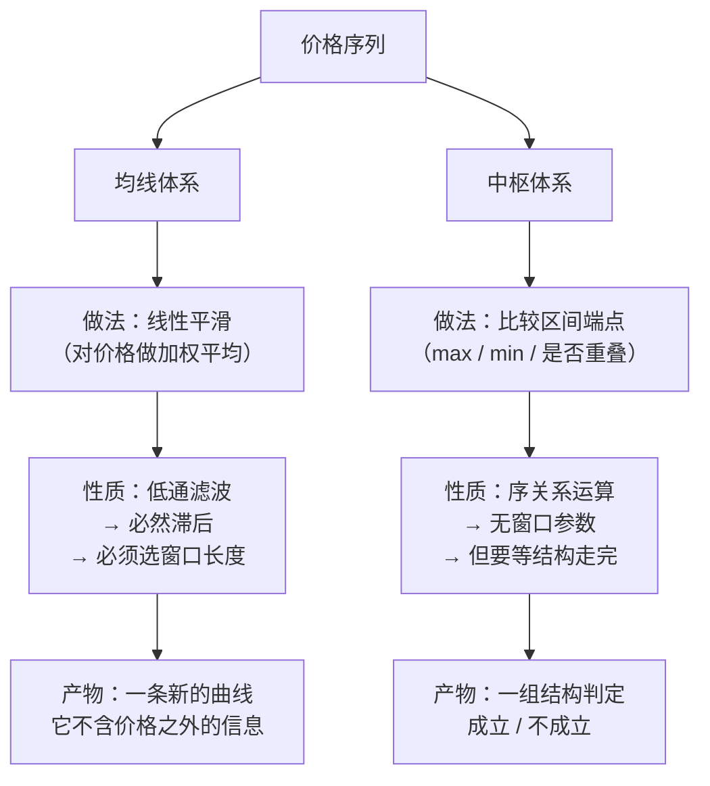

# 第 5 章 · 均线与「吻」：被取代的早期框架

> 原著前十几课建立了一整套基于两条均线的分析体系，并给出了买卖点。
> 到第 25 课，作者自己把它降格为辅助工具，明确要求**不要与中枢混用**。
> 这一章交代这套早期框架是什么、为什么被取代、以及它今天还剩下什么用。
>
> **读这一章的目的不是学会它**，是为了在看到别处混用两套体系时能认出来。

## 5.1 早期框架：两条均线与三种「吻」

原著早期（第 11–16 课）用两条不同周期的均线来描述走势，
把它们的接触方式分成三类。这些接触统称为**吻**。

> ⚠️ **术语说明**：原著对"短期均线在长期均线上方 / 下方"这两个状态，
> 用了一组拟人化的代称。本书**不沿用**那组代称，
> 一律直接写"短期均线在上 / 在下"。
> 提到这件事只是为了让读者在别处看到那些词时知道指的是什么。

〔定义〕三种吻（第 11、12 课）：

| 名称 | 原著描述（转述） | 含义 |
|---|---|---|
| **飞吻** | 短期均线略走平后，继续沿原方向走下去 | 对原趋势几乎没有反抗 |
| **唇吻** | 短期均线靠近长期均线但不穿越，然后继续原方向 | 反抗力度一般 |
| **湿吻** | 短期均线穿越长期均线，甚至反复缠绕 | 反抗力度足够强 |

原著的判断是：**转折基本都从湿吻开始**（第 15 课）。

〔定义〕早期版的买点（第 12、14 课）：

- **第一类买点**：短期均线在下的状态里，**最后一次吻**之后出现的背驰式下跌；
- **第二类买点**：短期均线转到上方后，**第一次吻**之后的下跌。

〔定义〕早期版的力度（第 15 课）：把前一次吻结束到后一次吻开始之间，
两条均线所围出的**面积**称为趋势力度；面积除以时间称为平均力度。
前后两段同向趋势中，后者力度弱于前者，即为**背驰**。

这套东西自洽、可操作，而且原著在第 14 课用它完整走了一遍买点识别流程。
它也是"大级别的第二类买点由次级别的第一类买点构成"这条定律**最早的出处**
（第 14 课）——这条定律后来被保留下来了，但它的**依据**从均线换成了中枢。

## 5.2 作者自己的定性

第 25 课里，作者把这套体系的地位说得很清楚（转述）：
所谓的"吻"是和均线系统相关的，而均线系统只是走势的一个简单数学处理，
本质上和 MACD 等指标是一回事，**只能是一种辅助性工具**；
它与中枢等概念完全不同，**一定不要混在一起**。

这句话有两层：

1. **降格**：均线体系从"分析框架"降为"辅助工具"；
2. **隔离**：它和中枢**不是一套东西**，不许混着用。

第二层比第一层更重要，5.5 节会讲为什么。

## 5.3 为什么被取代：参数依赖

早期框架有一个绕不过去的问题：**两条均线的周期是人定的**。

原著自己在举例时用过 5 与 10（第 14 课），也提到过长周期均线系统。
但换一组参数，"吻"出现在哪、出现几次，全都会变。

这不是猜测，可以直接量出来。

**实测**（7 个匿名样本，2015-01-01 ~ 2026-09-01，后复权日线，
数据源与登记见[出处与资料](../../sources.md)第五节，运行日期 2026-09-12）。
用"短期均线穿越长期均线"作为**湿吻**的可操作代理，统计交叉事件：

| 均线参数对 | 交叉事件数 |
|---|---|
| MA5 / MA10 | 2173 |
| MA5 / MA20 | 1242 |
| MA10 / MA20 | 1098 |
| MA10 / MA30 | 786 |
| MA20 / MA60 | **396** |

**同一批数据、同一段区间，事件数相差 5.5 倍。**

再看这些事件的**位置**对不对得上——P 的每个事件，能否在 Q 里找到
相隔不超过若干个交易日的对应事件：

| P → Q | 同日 | ±3 日 | ±5 日 | ±10 日 |
|---|---|---|---|---|
| MA5/10 → MA5/20 | 12% | 48% | 61% | 82% |
| MA5/10 → MA10/20 | 4% | 29% | 52% | 81% |
| MA5/10 → MA20/60 | 2% | 11% | 18% | 36% |
| MA10/20 → MA10/30 | 11% | 53% | 67% | 79% |
| MA10/20 → MA20/60 | 2% | 11% | 16% | 31% |
| MA20/60 → MA5/10 | 11% | 54% | 73% | **91%** |

**怎么读这张表**（这里要诚实，不能只挑难看的数字）：

- **相近的参数对**（MA5/10 与 MA5/20、MA10/20 与 MA10/30）在放宽到 ±3 个交易日后
  约有一半能对上——说明它们**确实在描述同一批转折**，只是时点有偏移。
  这一点对早期框架是有利的，不应该忽略。
- **相距远的参数对**（MA5/10 与 MA20/60）即使放宽到 ±10 个交易日，也只有
  31%~36% 能对上。
- **最后一行揭示了真正的结构**：MA20/60 的事件有 91% 能在 MA5/10 里找到对应，
  反过来只有 36%。也就是说——**慢参数的吻几乎都是快参数吻的子集，
  但快参数额外制造了大量慢参数根本看不见的吻。**

〔推论〕**均线参数不是一个"精度旋钮"，而是一个"事件密度旋钮"。**
调快参数不会让你看得更准，只会让你看到更多次吻。

这对早期框架是致命的，原因在下一节。

## 5.4 致命之处：数不清"第几吻"

回头看 5.1 节的买点定义：

- 第一类买点 = 短期均线在下时，**最后一次**吻之后的背驰式下跌；
- 第二类买点 = 短期均线转上后，**第一次**吻之后的下跌。

这两个定义的核心，是**给吻编号**——"最后一次""第一次"。

〔推论〕**如果吻的总数随参数变化 5.5 倍，那么"第几吻"就不是一个良定义的对象。**

具体说：

- 在 MA5/10 下数到的"第三吻"，在 MA20/60 下可能压根不算一次吻；
- "最后一吻"更糟——**只有走完了才知道哪次是最后一次**，
  而"走完"本身又依赖参数。

这就回到了第 1 章 1.1 节那个困境：甲用一组参数说"这是第一吻后的下跌，二买"，
乙用另一组参数说"这才第二吻，还早"，**两人都严格遵守了定义，结论却相反**。

中枢的做法完全不同：它不给任何东西编号，只做一件事——
**判断三段区间有没有共同重叠**。重叠是一个客观的集合运算，没有自由参数。

## 5.5 更根本的差别：滤波 vs 序关系

参数依赖只是表面。两套体系的差别在更底层。

逐条对比：

| | 均线体系 | 中枢体系 |
|---|---|---|
| 运算性质 | 对价格做加权平均（线性滤波） | 比较区间端点（序关系） |
| 自由参数 | **有**（窗口长度，且至少两个） | 无 |
| 滞后 | **必然有**，且随窗口变长而加重 | 不来自平滑；但要等结构完成 |
| 输出 | 一条连续曲线 | 布尔判定（成立 / 不成立） |
| 信息量 | **不产生新信息**，是价格的一个函数 | 同样不产生新信息，但提取的是**序结构** |
| 跨标的可比 | 差（力度用面积定义，依赖价格绝对水平） | 好（重叠与否与价格量纲无关） |

〔推论〕**均线不可能比价格包含更多信息**——它是价格的确定性函数。
它的全部价值在于"把一类结构变得**肉眼可见**"。这是一个真实的价值，
但它是**呈现**层面的，不是**判据**层面的。

中枢体系同样不产生新信息，但它提取的是**序关系**，
而序关系恰恰是缠论所有定义要用的东西（第 1 章：分类建立在高低点的比较上）。

> **一句话**：均线把价格**模糊**了一遍再看；中枢把价格的**次序**直接拿来用。
> 前者为了看清趋势牺牲了精确的时点，后者保留了精确的时点但要等结构走完。

## 5.6 它今天还剩什么用

不要因为被取代就全盘否定——原著保留了它作为**辅助**，这是有道理的。

**还能用的**：

1. **快速定位注意力**。扫一眼均线状态，几秒钟就能知道这段图值不值得细看。
   这是效率工具，不是判据。
2. **MACD 作为背驰的近似判据**。MACD 本质是两条指数均线之差，
   原著第 24 课明确用它做背驰的辅助判断，并说明这个方法"不绝对精确但比较方便"。
   第 22 章会专门讲它为什么大致能用、在哪里骗人。
3. **向不懂缠论的人描述走势**。均线是通用语言，中枢不是。

**不能用的**：

1. ❌ **不要用均线去定义高低点**，再拿这些高低点去数中枢。
   这会把均线的参数依赖**注入**到中枢判定里，等于污染了一个本来无参数的体系。
2. ❌ **不要把"吻"的编号当成买卖点依据**（5.4 节）。
3. ❌ **不要用均线面积当作力度，再去和中枢体系的背驰结论对照**。
   两者量纲不同、前提不同，对照出来的一致或不一致都没有意义。

## 5.7 不要混用的三条理由

汇总一下，这三条是本章的落点：

1. **参数会传染。** 中枢体系的最大优点是无自由参数（第 1 章 Q1）。
   一旦在链条的任何一环引入均线，整条链就重新变成参数依赖的，优点直接归零。
2. **前提不同。** 中枢体系的判据是**布尔**的（重叠/不重叠），
   均线体系的判据是**连续量的比较**（面积大小）。
   把一个连续量的结论当成布尔判定的依据，中间缺一层转换，而这层转换没人定义过。
3. **作者自己要求隔离。** 第 25 课的"一定不要混在一起"不是随口说的——
   它是在前十几课的框架被后续理论取代之后，作者对读者的明确纠偏。

## 常见说法辨析

| 说法 | 证据强度 | 辨析 |
|---|---|---|
| "缠论就是均线加 MACD" | ❌ 明确错误 | 这是把被取代的早期框架当成了理论本身。第 25 课作者自己把均线降为辅助工具；理论的地基是中枢（第 17 课） |
| "均线参数选对了就准" | ❌ 明确错误 | 实测：同一批数据上，MA5/10 与 MA20/60 的交叉事件数相差 5.5 倍，且慢参数的事件 91% 是快参数的子集、反之只有 36%。参数是**事件密度旋钮**，不是精度旋钮——不存在"选对"这回事，只存在"选定并说明" |
| "均线能提前发现趋势" | ❌ 明确错误 | 均线是价格的加权平均，是价格的确定性函数，**不可能包含价格之外的信息**，而且平滑必然带来滞后。它的价值在于让结构肉眼可见，不在于提前 |
| "第一吻、第二吻要数清楚" | ⚠️ 有争议 | 在**固定参数**下数吻是自洽的；但换参数吻的总数就变，所以"第几吻"跨参数不可比。作为个人固定流程可以用，作为和别人对账的判据不行 |
| "MACD 背驰不准，要用中枢算" | ⚠️ 有争议 | 原著自己就说 MACD 判背驰"不绝对精确但比较方便"（第 24 课），所以这个说法方向是对的。但"不准"要看用在哪——第 22 章会给出它失效的具体情形，而不是笼统说不准 |
| "早期课程可以跳过不看" | ⚠️ 有争议 | 作为**学习路径**可以跳（本书就是这么排的）。但完全不了解它，看到别人混用两套体系时会认不出来——本章的价值就在这里 |
| "均线和中枢结合起来效果更好" | ⚠️ 缺乏证据 | 这是圈内常见的折中说法，但**没见过有人给出这个"结合"的严格定义**。没有定义就无法检验，也就谈不上"更好"。真要主张这一点，先把结合方式写成可执行的判据，再按第六部分的方法检验 |

## 思考题

**Q1.** 本章说"均线不可能比价格包含更多信息"。请用一句话说明理由。
既然如此，均线为什么还有用？

**Q2.**【判读】某人说："我把均线参数从 MA5/10 换成 MA20/60，信号少多了，
噪声被过滤掉了，所以更准。"请用 5.3 节的实测数据指出这句话的问题。
（提示：注意那张表的最后一行。）

**Q3.**【标签】"转折基本都从湿吻开始"属于〔定义〕〔推论〕〔经验断言〕〔不可证伪〕
中的哪一类？如果要检验它，必须先解决什么问题？

**Q4.** 早期框架用"最后一吻""第一吻"来定义买点。
请说明：为什么 5.3 节测出的"事件数相差 5.5 倍"，
会让这两个定义**在跨参数比较时失效**？

**Q5.**【判读】某人的做法是：先用 MA20/60 找出所有金叉死叉，
把这些点当作高低点，再用这些高低点去划分笔和中枢。
请指出这个做法违反了本章的哪条理由，以及会产生什么具体后果。

**Q6.**【查证】找一份公开的缠论教程或工具（任何来源都行），
看它有没有把均线/MACD 的判据和中枢的判据混在同一条规则里使用。
如果有，写下那条规则，并指出混用发生在哪一步。

> 📖 **参考答案**（想清楚再看）：
> [Q1](../../qa/05-ma-kiss-qa.md#q1) ·
> [Q2](../../qa/05-ma-kiss-qa.md#q2) ·
> [Q3](../../qa/05-ma-kiss-qa.md#q3) ·
> [Q4](../../qa/05-ma-kiss-qa.md#q4) ·
> [Q5](../../qa/05-ma-kiss-qa.md#q5) ·
> [Q6](../../qa/05-ma-kiss-qa.md#q6)

## 本章实操

两档都**不需要开户、不需要下单**。

### 🅐 手工版：亲手换一次参数

**需要**：任意行情软件（能设均线参数即可）+
[走势分解记录表](../../forms/decomposition-log.md)。

1. 选一段**已经走完**的历史区间，挂上 MA5 与 MA10。
2. 从左到右**逐个标出**所有的吻，编号：第 1 吻、第 2 吻……
   数到最后，记下**总数**。
3. 按 5.1 节早期版的定义，标出你认为的第一类、第二类买点位置。
4. **把参数换成 MA20 与 MA60**，同一段区间**重做一遍** 2、3 步。
5. 填记录表，在「歧义」列回答：
   - 两次数出的吻**总数**差多少倍？
   - 第 3 步标出的买点位置，两次**重合吗**？
   - 如果不重合，你打算**告诉别人哪一个**？依据是什么？

第 5 步最后一问答不上来，就是本章想让你体会的东西。

### 🅑 代码版：复现参数敏感性实验

**需要**：第 4 章落盘的复权日线快照。
**先填[检验预登记表](../../forms/prereg-template.md)再动手。**

1. 选至少 4 组均线参数对（跨度要拉开，比如从 5/10 到 20/60）。
2. 对每组参数，在同一批样本上算出所有**交叉事件**（湿吻的可操作代理），
   记录事件的**交易日序号**（不要用自然日期，停牌会让自然日错位）。
3. 报告两组数：
   - **事件总数**随参数怎么变；
   - **位置重合率**：P 的事件中，有多少能在 Q 里找到 ≤ tol 个交易日内的对应。
     `tol` 至少取 0、3、5、10 四档。
4. **必须做的一步**：把矩阵**两个方向都算**（P→Q 和 Q→P）。
   本章 5.3 节最重要的发现就来自这个不对称——
   只算一个方向会漏掉"慢参数是快参数的子集"这个结构。

**报告纪律**：给出**全部**参数对的结果，不要只报最能说明问题的那几组。
登记进[出处与资料](../../sources.md)第五节。

⚠️ 顺带说一句：这个实验的结论**不依赖**"哪组参数更好"，
所以它不是在做参数寻优。如果你发现自己开始想"那到底哪组最好"，
停下来——那个问题在第六部分之前不该问，问了就是数据窥探。

## 🔎 看盘时的用处

1. **看到别人说"第几吻"，先问用的什么参数。** 不说参数的编号没有意义。
2. **均线只用来快速筛，不用来下判定。** 它是注意力工具。
3. **不要用均线的高低点去喂中枢。** 这是最常见的混用，会把参数依赖注入进来。
4. **看到"均线 + 中枢结合"的说法，先问结合规则的精确定义是什么。** 通常问不出来。
5. **记住第 25 课的隔离要求。** 两套体系可以并存于你的屏幕上，但不能并存于一条判据里。

> ⚖️ 本书只讲方法与检验，不推荐任何标的、不预测行情、不构成投资建议。
> 市场有风险，任何据此产生的后果由读者自负。
