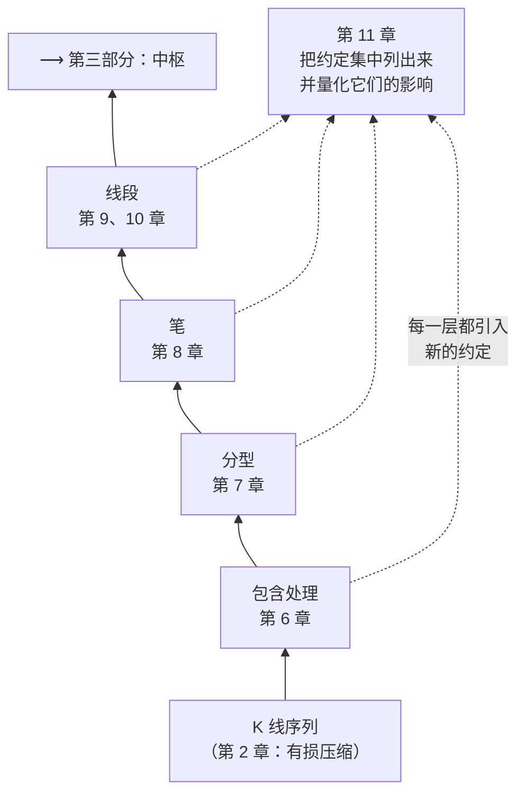

# 第二部分 · 可计算的几何层

第一章留下的问题在这里解决：**图上的"高低点"到底怎么来？**

## 这一部分在整栋楼的哪一层

第 1 章 1.2 节说过：朴素三分类的毛病不在判定规则，在于**"哪些点算高低点"没有定义**；
第 5 章说过：用均线去过滤会把参数依赖注入进来，代价太大。

缠论的解法是这一部分：**只用 K 线之间的序关系**，一层层往上搭。
包含处理消掉歧义 → 分型定出局部极值 → 笔连接相邻极值 → 线段把笔再抽象一层。
到第三部分，中枢就可以站在线段（或笔）上定义了。

## ⚠️ 一个必须先说清楚的事

**本书掌握的原著原文只到第 48 课，而这一部分的严格定义在其后**
（分型与笔在第 62 课，线段与特征序列在第 65、67 课，第 71 课还有一次再分辨）。

所以这一部分的所有定义，本书都是**据公开转述**写的，
在[出处与资料](../../sources.md)里统一标注为 ⚠️ **无原文**。
凡是转述，本书会明写"据公开转述"，**不会**把它和第 1–48 课里有原文的部分混着讲。

这不是免责声明，是一条实际的阅读建议：
**这一部分的细节争议特别多**（老笔新笔、包含关系的方向、线段划分的两种情况），
而争议之所以存在，一部分原因正是原文表述本身留了解释空间。
遇到细节分歧时，比"谁对"更有用的问题是"**他们各自选了哪套约定**"。

## 本部分章节

| 章 | 标题 | 一句话 |
|---|---|---|
| 6 | [K 线的包含处理](06-inclusion.md) | 为什么要先合并；它引入的第一个约定 |
| 7 | [分型](07-fractal.md) | 分型 = 方向变号点；顶底必然交替；确认滞后 |
| 8 | 笔 | 从分型到笔；老笔与新笔之争 |
| 9 | 线段（上） | 为什么笔不够用 |
| 10 | 线段（下） | 特征序列与著名的"两种情况" |
| 11 | 把几何层写成程序 | 把全部约定列出来，并量化不同选择的影响 |

## 读完这一部分，你应该能

- 在一张打印的 K 线图上，**手工**完成包含处理、标出分型、划出笔；
- 说清楚"老笔"和"新笔"差在哪，以及为什么这个差别通常不致命；
- 解释线段划分的"两种情况"分别是什么，以及它们为什么是实现分歧的总源头；
- **列出**一份完整的约定清单——这是第 11 章的交付物，也是让你的分解结果
  可以被别人复核的前提。

> ⚖️ 本书只讲方法与检验，不推荐任何标的、不预测行情、不构成投资建议。
> 市场有风险，任何据此产生的后果由读者自负。
