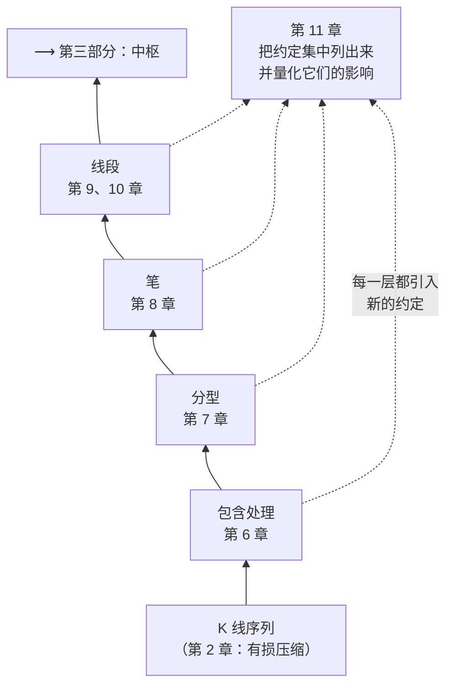

# 第二部分 · 可计算的几何层

第一章留下的问题在这里解决：**图上的"高低点"到底怎么来？**

## 这一部分在整栋楼的哪一层

第 1 章 1.2 节说过：朴素三分类的毛病不在判定规则，在于**"哪些点算高低点"没有定义**；
第 5 章说过：用均线去过滤会把参数依赖注入进来，代价太大。

缠论的解法是这一部分：**只用 K 线之间的序关系**，一层层往上搭。
包含处理消掉歧义 → 分型定出局部极值 → 笔连接相邻极值 → 线段把笔再抽象一层。
到第三部分，中枢就可以站在线段（或笔）上定义了。

## ⚠️ 一个必须先说清楚的事

**本书最初掌握的原著原文只到第 48 课，而这一部分的严格定义在其后**
（分型与笔在第 62 课，线段与特征序列在第 65、67 课，第 71 课还有一次再分辨）。
所以这一部分初版是**据公开转述**写的。

**2026-09-14，本书补做了一次原文核对**，取得了第 62、65、67、71、79 课的原文
（来源、可信度判断与被排除的来源，见[出处与资料](../../sources.md)第 1.4 节）。
现在这一部分的定义**直接标课次**，不再写"据公开转述"。
仍未取得原文的是**第 77 课**和"新笔"所出的那篇随笔——涉及它们的地方仍标 ⚠️。

### 那次核对查出了什么

这件事本身值得写进这一部分的导读，因为**它就是这一部分要讲的问题的实例**：

| 类型 | 数量 | 例子 |
|---|---|---|
| **本书写错了** | 2 处 | 第 10 章把"后一序列不一定封闭缺口"讹传成"缺口不会被第 1 个元素封闭" |
| **原文有、本书漏了** | 7 条 | 线段的**前三笔必须有重叠**；包含关系**不满足传递律**；成笔失败**原文其实给了处理** |
| **原文有直接支持** | 3 处 | "用什么图与以什么级别操作没有任何必然关系" |

〔推论〕**这一部分的争议，有相当一部分不是"原文没写"，而是"原文写了、流传中丢了"。**

这两者听起来像，后果却完全不同：

- **原文没写** → 各家自填是正当的，问题只在于**有没有声明**；
- **原文写了但丢了** → 各家自填时**以为**这里可以随便选，
  于是连"这是一个选择"都意识不到。

第 11 章实测出影响最大的那项约定（成笔失败的处理，端点重合率仅 26.2%），
恰恰属于第二类。

### 所以这一部分怎么读

**这一部分的细节争议特别多**（老笔新笔、包含关系的方向、线段划分的两种情况），
遇到分歧时，比"谁对"更有用的两个问题是：

1. **他们各自选了哪套约定？**（第 11 章给了一张 16 项的清单）
2. **这条"原文没说"，是真的没说，还是只是我没看到？**

## 本部分章节

| 章 | 标题 | 一句话 |
|---|---|---|
| 6 | [K 线的包含处理](06-inclusion.md) | 为什么要先合并；它引入的第一个约定 |
| 7 | [分型](07-fractal.md) | 分型 = 方向变号点；顶底必然交替；确认滞后 |
| 8 | [笔](08-stroke.md) | 硬条件筛掉 70.7%；老笔新笔只差 9% |
| 9 | [线段（上）](09-segment-why.md) | 笔不是走势类型：几何层与递归层的接缝 |
| 10 | [线段（下）](10-segment-how.md) | 特征序列；第二种情况实测占 39.6% |
| 11 | [把几何层写成程序](11-implementation.md) | 16 项约定清单；实测不一致率；14 条自检断言 |

## 读完这一部分，你应该能

- 在一张打印的 K 线图上，**手工**完成包含处理、标出分型、划出笔；
- 说清楚"老笔"和"新笔"差在哪，以及为什么这个差别通常不致命；
- 解释线段划分的"两种情况"分别是什么，以及它们为什么是实现分歧的总源头；
- **列出**一份完整的约定清单——这是第 11 章的交付物，也是让你的分解结果
  可以被别人复核的前提。

> ⚖️ 本书只讲方法与检验，不推荐任何标的、不预测行情、不构成投资建议。
> 市场有风险，任何据此产生的后果由读者自负。
