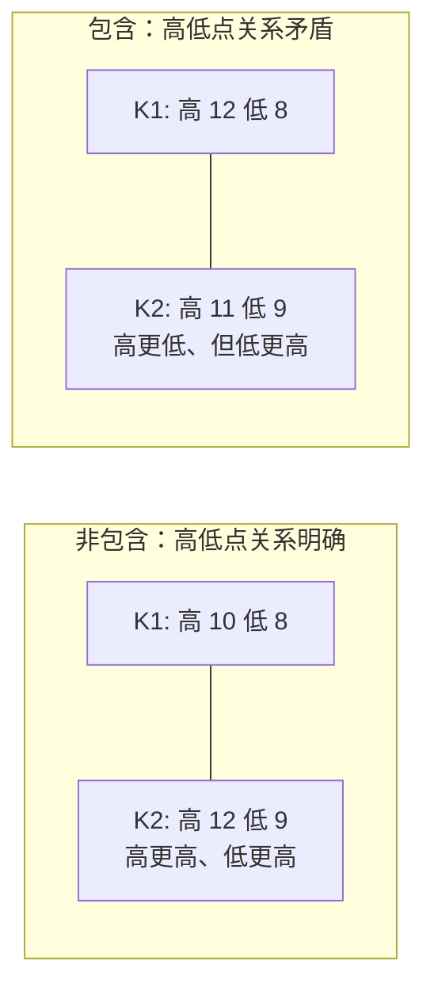

# 第 6 章 · K 线的包含处理

> 几何层的第一步，也是**第一个需要人为约定的地方**。
> 这一章讲为什么必须先合并 K 线、怎么合并、合并引入了哪些约定，
> 以及这些约定在真实数据上的影响到底有多大——最后这一问，本章给出实测数字。

## 6.1 为什么必须先合并

分型的判定要比较**相邻三根 K 线的高低点**（第 7 章）。
但原始 K 线序列里有一种情况会让这个比较没法进行：**包含关系**。

〔定义〕**包含关系**：相邻两根 K 线中，一根的高点和低点**全部落在**另一根的范围里。



看右边这组：K2 的高点更低，低点却更高。
那么这两根 K 线之间，走势到底是向上还是向下？

**答不了。** 因为"高点更高且低点更高 = 上涨"这类判据（第 1 章 1.2 节）
在这里两个条件互相矛盾。

〔推论〕**只要序列中存在包含关系，基于高低点比较的任何判据都可能给出矛盾结论。**
所以必须先把包含关系消掉——这就是包含处理的全部动机。

> 注意这里的逻辑顺序：**不是因为包含关系"不好看"才合并，
> 而是因为不合并就无法定义分型**。包含处理不是美化，是前置条件。

## 6.2 怎么合并

〔定义〕**包含处理**（第 62 课）：

| 当前方向 | 合并后的高点 | 合并后的低点 |
|---|---|---|
| **向上** | 两根 K 线高点中的**较高者** | 两根 K 线低点中的**较高者** |
| **向下** | 两根 K 线高点中的**较低者** | 两根 K 线低点中的**较低者** |

记忆方法很简单：**向上处理取高，向下处理取低**——
高低点一起朝当前方向靠。

```text
向上：H = max(H1, H2)    L = max(L1, L2)
向下：H = min(H1, H2)    L = min(L1, L2)
```

处理是**滚动**进行的：合并出的新 K 线要继续和下一根比较，
如果还构成包含就继续合并，直到不再包含为止。

### 为什么必须滚动：包含关系不满足传递律

原文给了这么做的理由（第 65 课，转述）：结合律是这套理论最基础的东西，
K 线的包含关系当然也要遵守；而**包含关系不符合传递律**——
第 1、2 根是包含关系、第 2、3 根也是包含关系，
**并不意味着第 1、3 根就有包含关系**。

所以必须遵守**顺序原则**：先用第 1、2 根确认出新的 K 线，
然后**用这根新 K 线**去和第三根比；有包含就继续合并，没有就按正常 K 线处理。

〔推论〕**"滚动合并"不是一个实现技巧，而是非传递性逼出来的必然做法。**

这条也解释了一个常见的实现错误：**拿原始的第 1 根去和第 3 根比**。
那等于假设了传递性，而传递性在这里不成立。

〔推论〕**处理后的序列不含任何包含关系**，且**再处理一次不会有任何变化**（幂等）。
这两条都是可以直接写成断言在代码里验证的——见 6.5 节的实测。

## 6.3 方向从哪来：一个绕不开的先有鸡还是先有蛋

上面那张表有个问题：合并方式取决于"当前方向"，
而方向本来就是要靠合并后的序列才能判断的。

这是几何层里的**第一个循环**。第 3 章解开级别循环靠的是"最低级别"，
这里解开循环靠的是**局部性**：

〔定义〕**方向的确定**（第 65 课给了严格的几何形式，转述）：

设第 `n` 根与第 `n+1` 根构成包含关系，而第 `n` 根与第 `n-1` 根**不是**包含关系，
用 `[dᵢ, gᵢ]` 记第 `i` 根 K 线的低高区间，则：

```text
gn ≥ gn-1   →  第 n-1, n, n+1 根是「向上」的
dn ≤ dn-1   →  第 n-1, n, n+1 根是「向下」的
```

原文同时证明了这个定义是**完备且互斥**的：
若 `gn < gn-1` 且 `dn > dn-1`，那第 `n` 根就被第 `n-1` 根包含了——
与"第 `n` 与第 `n-1` 不是包含关系"的前提矛盾；
同理 `gn ≥ gn-1` 与 `dn ≤ dn-1` 也不可能同时成立。

〔推论〕**所以在无包含的相邻对上，方向必然是"向上"或"向下"之一，
不存在第三种情况**——这正是第 7 章把分型定义成"方向变号点"的前提。

简化的说法是：每完成一次合并（或遇到一对非包含的 K 线）之后，
用**当前这根**与**前一根**的高点比较来更新方向——
高点更高则方向向上，否则向下。

也就是说，方向不是全局给定的，而是**逐根滚动更新**的。
每一步只需要知道"上一步之后方向是什么"，不需要知道整段走势是什么。

**但序列的第一根没有"上一根"。** 所以：

〔定义〕**初始方向**是一个必须人为指定的约定。

这就是本章的第一个约定。它有多要紧？6.5 节用数据回答。

## 6.4 约定清单

包含处理这一步，一共要做四个决定。**每一个都会影响输出，
而且**原文并没有把每一个都写死**。

| # | 约定 | 常见选择 | 影响范围 |
|---|---|---|---|
| 1 | **初始方向** | 向上 / 向下 / 由前两根非包含 K 线推断 | 序列开头 |
| 2 | **哪种包含要处理** | 只处理"前包含后" / 两种都处理 | 全序列 |
| 3 | **合并后如何记时间** | 取前一根 / 取后一根 / 取极值所在那根 | 后续画图与对账 |
| 4 | **相等边界怎么算** | 高点相等算不算包含 | 少数样本 |

第 2 项是实现分歧最集中的地方。第 62 课原文给的是**合并规则**，
没有明写"哪一种包含要处理"；实践中
**"前包含后"（前一根范围更大）被普遍认为必须处理，
而"后包含前"是否处理存在分歧**。本章 6.5 节的实测采用"两种都处理"。

第 3 项容易被忽略但很实际：合并之后，**这根合成 K 线属于哪一天**？
它会影响后面"一笔至少要几根 K 线"的计数（第 8 章），
也会影响你把结果画回原图时的对齐。

〔推论〕**几何层的输出不是价格序列的函数，而是「价格序列 + 约定集」的函数。**
这句话贯穿整个第二部分：**不声明约定集，你的分解结果无法被任何人复核**。

## 6.5 实测：这些约定到底有多要紧

按本书的纪律，能算的不用形容词。

**实测设定**：7 个匿名样本 × 2835 个交易日 = 19845 个交易日，
2015-01-01 ~ 2026-09-01，**后复权**日线，数据源与登记见
[出处与资料](../../sources.md)第五节，运行日期 2026-09-12。
包含处理采用"两种包含都处理"、滚动合并。

### 结果一：合并掉了多少

| 样本 | 原始 K 线 | 合并后 | 合并率 |
|---|---|---|---|
| A | 2835 | 2168 | 23.5% |
| B | 2835 | 2023 | 28.6% |
| C | 2835 | 2168 | 23.5% |
| D | 2835 | 2053 | 27.6% |
| E | 2835 | 2122 | 25.1% |
| F | 2835 | 2221 | 21.7% |
| G | 2835 | 2153 | 24.1% |
| **合计** | **19845** | **14908** | **24.9%** |

〔经验断言〕**在日线上，约四分之一的 K 线会被包含处理合并掉**，
各样本在 21.7%~28.6% 之间，相当稳定。

这个数字值得记住：它意味着**你在原始图上看到的 K 线，
有四分之一在几何层里是不存在的**。所以手工划笔时，
一定要先在合并后的序列上做，而不是在原图上凭感觉数根数。

### 结果二：两条推论成立吗

| 检验项 | 结果 |
|---|---|
| 处理后残留的包含关系 | **0**（7 个样本全部） |
| 幂等性（再处理一次是否变化） | **全部不变** |

两条〔推论〕在数据上都成立。

⚠️ 按第 3 章 Q3 的纪律：这两条是从定义推出来的，**如果测出不成立，
应该怀疑实现而不是理论**。所以这个实测的作用不是"验证理论对不对"，
而是**验证我的代码写对了没有**——这是几何层实现的第一道自检。

### 结果三：初始方向的影响

对同一批数据，分别用"初始向上"和"初始向下"跑一遍：

| 结果 | 数值 |
|---|---|
| 输出完全相同的样本 | 6 / 7 |
| 有差异的样本 | 1 / 7，差 **1 根** K 线 |

〔经验断言〕**初始方向这个约定，在日线长样本上的实际影响很小**——
7 个样本里只影响 1 个，且只差 1 根 K 线，差异发生在序列开头。

这是一个**对早期框架的公平结论**，不该夸大成"任意性很严重"。
准确的说法是：

> **理论上它是一个自由约定，实测上它的影响集中在序列开头且很小。**
> 但"很小"不等于"可以不声明"——第 11 章会说明为什么约定仍然必须写出来。

⚠️ 并且注意样本条件：这是**日线 + 十年长度**的结论。
样本越短、频率越低，开头那一段占比越大，初始方向的影响就越显著。
在 5 分钟线上取一个月的数据，结论可能完全不同。

## 6.6 和复权的交互

把第 2 章的结论接到这里：

〔推论〕**未复权序列上的除权跳空会直接改变包含关系的判定。**

机制很直接：包含判定比的是相邻 K 线的高低点。
一次 67.3% 的假跳空（第 4 章 4.4 节实测的最大值）之后，
后一根 K 线的整个范围会远离前一根——本该包含的变成不包含，
本该合并的没合并，于是**合并后的序列从那一天起整个错位**。

而几何层是逐层往上搭的：包含处理错 → 分型错 → 笔错 → 线段错 → 中枢错。

> **所以第 4 章那份体检报告不是可选的**。
> 包含处理是第一道工序，喂进去的价格序列不对，后面全白做。

## 常见说法辨析

| 说法 | 证据强度 | 辨析 |
|---|---|---|
| "包含处理就是把图弄好看点" | ❌ 明确错误 | 它是**前置条件**不是美化。存在包含关系时，"高更高且低更高"这类判据的两个条件会互相矛盾，分型根本无法定义（6.1 节） |
| "包含处理会丢掉信息，所以不好" | ⚠️ 有争议 | 确实丢信息（实测合并掉约 24.9% 的 K 线）。但这是**有意的降噪**：丢掉的正是让序关系无法判定的那部分。要批评它，应该批评"丢的方式带约定"，而不是"丢了信息" |
| "包含处理没有歧义，照定义做就行" | ⚠️ 有争议 | 定义本身清楚，但它依赖"当前方向"，而方向在序列开头无从确定；另外"后包含前"是否处理、合并后如何记时间都有分歧（6.4 节）。实测显示初始方向影响很小，但**小不等于不存在** |
| "初始方向随便选，反正没影响" | ⚠️ 有争议 | 本章实测（日线十年）显示 7 个样本里只影响 1 个、差 1 根。但这个结论**依赖样本条件**——样本越短，开头占比越大，影响越显著。可以选一个，但必须**声明**选了哪个 |
| "在原始 K 线图上数根数就行" | ❌ 明确错误 | 实测约 24.9% 的 K 线会被合并掉。凡是涉及"一笔至少几根 K 线"这类计数（第 8 章），都必须在**合并后**的序列上数 |
| "第 1、2 根包含、第 2、3 根包含，那第 1、3 根也包含" | ❌ 明确错误 | 原文明说**包含关系不符合传递律**（第 65 课）。所以必须按顺序原则滚动：先合并 1、2 得新 K 线，再用**新 K 线**和第 3 根比（6.2 节） |
| "包含处理要反复做几遍才干净" | ❌ 明确错误 | 滚动合并一遍即可。本章实测：7 个样本处理后残留包含关系全部为 0，且再处理一次输出完全不变（幂等）。要是你的实现需要跑两遍，那是实现有 bug |

## 思考题

**Q1.** 用一句话说明：为什么存在包含关系时，分型无法定义？
请具体到"哪两个条件互相矛盾"。

**Q2.**【标签】"包含处理后的序列不含任何包含关系"属于哪一类命题？
如果你的代码测出残留了 3 个包含关系，你该改代码还是该改理论？

**Q3.** 本章实测显示初始方向只影响 7 个样本里的 1 个、且只差 1 根 K 线。
既然影响这么小，为什么第 11 章还要求把它写进约定清单？请给出至少两条理由。

**Q4.**【判读】某人在**原始**日线图上数"这一笔有 7 根 K 线，满足成笔要求"。
用本章的实测数据指出他可能犯的错，并估计他的计数大约会偏离多少。

**Q5.**【判读】某人的实现里，包含处理的方向是**整段固定**的
（比如整段都按"向上"处理），理由是"这样简单且确定"。
请指出这个做法会产生什么后果。（提示：想想 6.2 节那张表在下跌段里会做什么。）

**Q6.**【查证】找两份公开的缠论程序实现（开源代码、教程附带的脚本都行），
对照 6.4 节那张约定清单，看它们**各自选了什么**。
有没有哪一份把自己的选择明确写出来了？

> 📖 **参考答案**（想清楚再看）：
> [Q1](../../qa/06-inclusion-qa.md#q1) ·
> [Q2](../../qa/06-inclusion-qa.md#q2) ·
> [Q3](../../qa/06-inclusion-qa.md#q3) ·
> [Q4](../../qa/06-inclusion-qa.md#q4) ·
> [Q5](../../qa/06-inclusion-qa.md#q5) ·
> [Q6](../../qa/06-inclusion-qa.md#q6)

## 本章实操

两档都**不需要开户、不需要下单**。

### 🅐 手工版：手工合并二十根 K 线

**需要**：一张打印的 K 线图（截图也行）、笔、直尺。

1. 从图上任取**连续 20 根** K 线，抄下每根的高点和低点（两列数字即可）。
2. 从左往右扫，**圈出所有存在包含关系的相邻对**。
   数一下：20 根里有几对？
3. 定一个初始方向（自己选，但**写下来**），
   然后按 6.2 节的表逐个合并，得到一列新的高低点。
4. 检查两件事：
   - 合并后的序列里还有包含关系吗？（应该没有）
   - 合并掉了几根？占比多少？和本章实测的 24.9% 比，你这一段是多还是少？
5. **换一个初始方向重做第 3 步**，对比两次结果。差在哪？差几根？

第 5 步做完，你对 6.3 节那个"先有鸡还是先有蛋"就有实感了。

### 🅑 代码版：写包含处理 + 三个自检断言

**需要**：项目 P1 落盘的复权日线快照。

**第一步：实现**

按 6.2 节实现滚动合并。**把 6.4 节的四个约定写成显式参数**，不要硬编码：

```text
merge(highs, lows,
      init_direction   = ...,   # 约定 1
      handle_both_ways = ...,   # 约定 2：是否处理"后包含前"
      timestamp_rule   = ...,   # 约定 3
      equal_is_include = ...)   # 约定 4
```

**第二步：三个自检断言**（这是本章最重要的产出）

| 断言 | 检查什么 | 失败时怀疑谁 |
|---|---|---|
| 输出无包含关系 | 逐对检查 | **代码**（这是〔推论〕） |
| 幂等：再跑一次输出不变 | 比较两次结果 | **代码** |
| 输出长度 ≤ 输入长度 | 比较行数 | **代码** |

⚠️ 三个断言都是从定义推出来的，所以**失败一定是实现的问题**（第 3 章 Q3）。
把它们写成测试，后面每次改几何层代码都跑一遍。

**第三步：量化约定的影响**

先填[检验预登记表](../../forms/prereg-template.md)，然后：

1. 统计**合并率**，和本章的 24.9% 对照；
2. 两种初始方向各跑一次，统计**有多少样本的输出不同、差几根**；
3. **加做一项本章没做的**：`handle_both_ways` 开与关，输出差多少？
   （本章实测固定为"两种都处理"，这一项是留给你的。）
4. 报告全部三项，登记进[出处与资料](../../sources.md)第五节。

⚠️ 第 3 项的结果可能比初始方向的影响大得多——这正是值得你自己测一遍的原因。

## 🔎 看盘时的用处

1. **别在原始图上数 K 线根数。** 约四分之一会被合并掉。
2. **看到别人的分解和你不同，先问包含处理的约定。** 这是最底层的分歧源。
3. **未复权的图不要做包含处理。** 假跳空会让整个合并序列从那天起错位。
4. **短样本、小周期上，初始方向的影响会放大。** 日线十年的结论不能直接搬过去。
5. **自己的实现留一组自检断言。** 无包含 + 幂等 + 长度不增，跑得飞快，能挡住大部分低级错误。

> ⚖️ 本书只讲方法与检验，不推荐任何标的、不预测行情、不构成投资建议。
> 市场有风险，任何据此产生的后果由读者自负。
