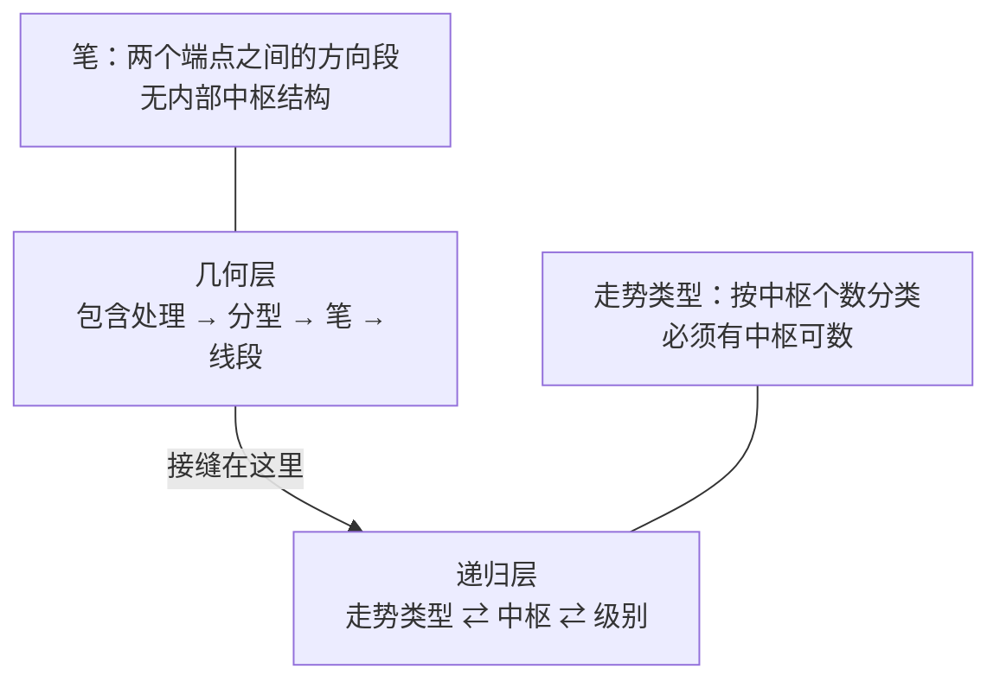
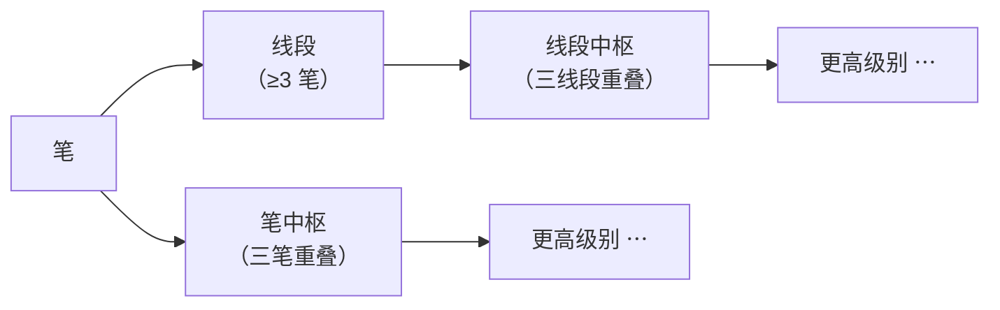

# 第 9 章 · 线段（上）：为什么笔不够用

> 笔已经是"够格的相邻顶底"了，为什么还要再抽象一层？
> 这一章给出两个理由：一个是量的（笔太碎），
> 另一个更根本——**笔和"走势类型"根本不是同一种东西**，
> 而中枢的定义要的是后者。
>
> 第二个理由涉及几何层与递归层之间的一处接缝，本书认为它值得挑明。

## 9.1 第一个理由：笔太碎

先看量级。按第 8 章"不共用 K 线"的标准，本书样本上得到 2053 笔，
平均每笔占 **7.3 根**合并后的 K 线；按老笔式是 9.0 根。

折算回原始 K 线（第 6 章合并率 24.9%，即 1 根合并 ≈ 1.33 根原始）：

```text
平均每笔  ≈  10 ~ 12 根原始日线
```

也就是说，在日线上一笔大约是**两周左右**的走势。

这个粒度本身不算太碎。问题在于**往上搭的时候**：
中枢要三段重叠，趋势要两个中枢——一路乘下去，
如果笔就是最底层的"段"，那么到了第三层、第四层，
每一级要求的 K 线数量会涨得很快，而**级别之间的层数会不够用**。

〔推论〕**中间需要一层缓冲**，让"段"的粒度能逐级放大，
而不是从笔一步跳到中枢。线段就是这一层。

但这只是量的理由。真正的理由在下一节。

## 9.2 第二个理由：笔不是"走势类型"

这一节是本章的核心，也是本书对这套体系的一处独立观察。

回看中枢的定义（第 1 章 1.5 节）：

> 中枢 = 某级别走势类型中，被至少三个连续**次级别走势类型**所重叠的区间。

注意里面的对象是**走势类型**，不是"线"也不是"段"。而走势类型是怎么定义的？

> 走势类型 = 按它**包含几个中枢**来分类（盘整 1 个，趋势 ≥ 2 个）。

于是问题来了：

〔推论〕**一个合格的"次级别走势类型"，自身必须含有次次级别的中枢。**
这是从定义直接读出来的——它按中枢个数分类，那它就得有中枢可数。

**而笔没有内部结构。**

一笔就是两个端点之间的一条方向段：起点一个底、终点一个顶（或反过来），
中间的所有波动按定义被明确忽略掉了（第 8 章 8.2 节）。
笔里面**数不出中枢**，因为笔的定义里根本没有"中枢"这个概念。

所以：



〔推论〕**几何层与递归层是两套不同的构造，缠论把它们接起来的方式，
是让笔（或线段）去"扮演"最低级别的走势类型。**

这是一个**近似**，不是一个恒等。它在原表述里是被默认的，很少被明说。

### 这处接缝意味着什么

三件事，都值得知道：

**一、原著给过另一个答案。** 第 35 课（这一课本书有原文）说的最低级别是
**每一笔成交**，连续三笔同价位成交构成最低级别中枢。
那个答案在理论上是自洽的——它让递归从一个真正的"中枢"起步。
但它需要逐笔数据，而逐笔数据在实践中基本拿不到（第 4 章实测：免费源不提供）。

**二、所以实践中的"级别"和原著定义的"级别"不是同一个东西。**
用笔中枢起步的级别链，和用逐笔成交起步的级别链，
起点不同、层数不同。这一点和第 3 章 3.2 节"周期不是级别"是同一类问题的两个侧面。

**三、线段让这个近似变好，但不能消除它。**
线段由**至少三笔**构成、且**前三笔必须有重叠**（第 65 课，见 9.3 节）——
而"至少三段"正是分解定理二对走势类型的要求（第 1 章 1.6 节），
"三段重叠"更是中枢的定义本身。所以线段在形式上比笔更像一个走势类型：
它至少由三个次级对象构成，而且可以数出笔中枢。

但线段依然不是按"中枢个数"定义的，它是按**破坏条件**定义的（第 10 章）。
所以接缝还在，只是变窄了。

> **本书的处理方式**：不回避这处接缝，但也不夸大它。
> 它不影响这套方法在实践中的可用性——事实上所有缠论实现都是这么接的。
> 挑明它，是为了让你在别人说"缠论是严格公理化的"时，
> 知道**严格的是递归层，而几何层与递归层的接口处有一个约定**。

## 9.3 线段是什么

〔定义〕**线段**（第 62、65 课）：
由**至少三笔**构成、且**前三笔必须有重叠部分**的更高一层方向段。

⚠️ **"前三笔必须有重叠"这一条经常被漏掉**，而原文特意强调过它
（第 65 课，转述）：

> 线段有一个最基本的前提，就是**线段的前三笔必须有重叠的部分**，
> 这个前提在前面可能没有特别强调，这里必须特别强调一次。
> 线段至少有三笔，但**并不是连续的三笔就一定构成线段**。

所以线段有**两个**下界条件，不是一个：

| # | 条件 | 漏掉它会怎样 |
|---|---|---|
| 1 | 至少三笔 | 段太碎 |
| 2 | **前三笔有重叠部分** | 会把"一路单边推进的三笔"误判成线段 |

〔推论〕**第 2 条与中枢的"三段重叠"是同一个结构**（第 12 章）——
三个连续对象要有共同重叠区间，才构成一个"有内部"的东西。
这不是巧合：线段与中枢都是"把三个次级对象收拢成一个上层对象"。

### 线段被"笔"破坏的精确定义

原文给了一个**可以直接写成代码**的定义（第 65 课，转述）：

对从**向上一笔**开始的线段，其中的分型构成序列
`d₁ g₁ d₂ g₂ … dₙ gₙ`（`dᵢ` 是第 i 个底，`gᵢ` 是第 i 个顶）。

```text
若存在 i 和 j，j ≥ i+2，使得  dⱼ ≤ gᵢ   →  向上线段被笔破坏
（向下线段对称：存在 gⱼ ≥ dᵢ）
```

⚠️ 注意 `j ≥ i+2` 这个下标条件——它要求破坏发生在**隔开至少两个位置**之后，
而不是紧邻的下一个。这一条本书初版完全没有，而它是把"被笔破坏"
从一句话变成判据的关键。

### 线段的破坏

〔定义〕**线段分解定理**（第 65 课，转述）：
线段被破坏，**当且仅当至少被有重叠部分的连续三笔中的其中一笔破坏**；
而只要构成有重叠部分的前三笔，**必然会形成一线段**。
换言之：**线段破坏的充要条件，就是被另一个线段破坏。**

⚠️ 流传中通常只引最后那一句。但前半句才是**可操作**的那部分——
它把"被另一个线段破坏"翻译成了"被有重叠的连续三笔之一破坏"，
而后者可以直接判定。

这个表述初看是循环的（要判断线段结束，得先有另一个线段），
但它其实给出了一个**可操作的递归**：判断一段是否结束，
就是去找"反方向上有没有攒够一个能称为线段的东西"。
第 10 章的特征序列，正是把这件事变成可计算的工具。

## 9.4 为什么不能"三笔就算一段"

一个自然的简化想法：既然线段至少三笔，那就每三笔算一段？

〔推论〕不行，会丢掉延伸。

理由和第 1 章 1.6 节讲"走势终完美"时是同一个：
**一个结构满足了最低要求，不等于它已经结束**。

原著在第 18 课（这一课有原文）讲中枢时说得很清楚：
三段重叠之后盘整**随时可以完成，也可以不断延伸下去**。
线段同理——攒够三笔只说明它**有资格**被称为线段，
不说明它**已经走完**。

如果机械地三笔一段，会发生什么：

| 问题 | 后果 |
|---|---|
| 把一个还在延伸的线段切成两段 | 方向相同的两段相连 → 违反"线段方向交替" |
| 段的端点落在走势内部 | 端点不是真正的转折，往上搭的中枢区间失真 |
| 段数虚增 | 中枢计数虚增 → 盘整被误判为趋势 |
| **漏掉"前三笔有重叠"** | 把一路单边推进的三笔也算成线段（9.3 节） |

第一条尤其明显：**线段和笔一样，方向必然交替**
（理由同第 8 章 8.6 节：端点必是一顶一底）。
机械三笔一段会直接违反这条〔推论〕，
这本身就是一个现成的自检信号。

## 9.5 两条递归路线

有了笔和线段，往上搭中枢就有两条路（第 3 章 3.4 节的路线 B 在这里落地）：



两条路线都在用，各有取舍：

| | 笔中枢 | 线段中枢 |
|---|---|---|
| 起步粒度 | 细 | 粗 |
| 对几何层约定的敏感度 | 高（直接吃笔的约定） | 较低（线段会吸收掉一部分笔的差异） |
| 实现复杂度 | 低 | 高（要实现特征序列） |
| 与"走势类型"的贴合度 | 低（见 9.2 节） | 较高 |

〔经验断言〕**线段会吸收掉一部分笔层面的差异**——
这正是公开资料里"老笔新笔的差异对分段影响不大"那个说法的机制。
本书第 8 章测出老笔新笔的笔数只差约 9%，
而它们**对线段数的影响有多大**，本书留到第 11 章一起测。

> ⚠️ 提醒：不管走哪条路线，**都要声明**。
> 说"这是一个 30 分钟中枢"而不说它是笔中枢还是线段中枢，
> 对方无法复核——这和第 3 章说的"不说近似方式就说 30 分钟级别"是同一类问题。

## 常见说法辨析

| 说法 | 证据强度 | 辨析 |
|---|---|---|
| "笔就是最小的走势类型" | ❌ 明确错误 | 走势类型按**中枢个数**分类，而笔内部没有中枢可数（9.2 节）。笔是在**扮演**最低级别的走势类型，这是一个约定，不是恒等 |
| "缠论是严格公理化的" | ⚠️ 有争议 | 递归层（中枢、走势类型、级别）确实做了形式化。但**几何层与递归层的接口处有一个约定**：让笔或线段去充当最低级别的走势类型。原著自己给的最低级别是逐笔成交（第 35 课），而那在实践中拿不到 |
| "三笔就构成一个线段" | ❌ 明确错误 | 两处都不对：① 三笔是**下界**不是完成条件，线段何时结束由破坏条件决定（第 10 章）；② 还要求**前三笔有重叠部分**——原文特意强调"并不是连续的三笔就一定构成线段"（第 65 课，9.3 节） |
| "线段破坏就是被另一个线段破坏，没别的说法" | ⚠️ 有争议 | 那只是原文的**后半句**。前半句更可操作：被**有重叠部分的连续三笔**中的其中一笔破坏（第 65 课）。流传中通常只引后半句，于是这条定理看起来循环而不可用 |
| "用笔中枢还是线段中枢无所谓" | ⚠️ 有争议 | 两条路线都有人用，本书不判优劣。但它们的起步粒度、对约定的敏感度都不同，**结论不可混用**。真正的问题不是选哪个，而是**有没有声明选了哪个** |
| "线段比笔准" | ⚠️ 缺乏证据 | "准"需要先定义评价目标，而那要到第六部分。能说的是：线段粒度更粗、更接近走势类型的形式要求、且会吸收一部分笔层面的差异。这些都不等于"准" |
| "既然接缝存在，说明缠论有根本缺陷" | ❌ 明确错误 | 接缝是**实践与理论定义之间的落差**，不是理论内部的矛盾。原著给出了理论上自洽的最低级别（逐笔成交），是数据可得性把实践推到了笔/线段上。挑明它是为了让人知道自己在用什么近似，不是为了否定 |

## 思考题

**Q1.** 用中枢和走势类型的定义，说明为什么"笔不是走势类型"。
请具体指出是定义里的哪个环节对不上。

**Q2.**【标签】"一个合格的次级别走势类型，自身必须含有次次级别的中枢"
属于哪一类命题？

**Q3.** 第 35 课给出的最低级别是"每一笔成交"。
这个答案在理论上是自洽的，为什么实践中几乎没人用？
结合第 4 章的实测回答，并说明改用笔/线段之后**失去了什么**。

**Q4.**【判读】某人的实现是"每三笔切一段"，理由是"原文说线段至少三笔"。
请指出这个做法会违反哪一条〔推论〕，以及为什么这条〔推论〕可以当自检用。

**Q5.** 9.5 节说线段会"吸收掉一部分笔层面的差异"。
请解释这个吸收是怎么发生的。（提示：想想一个线段由多少笔构成，
以及改变其中一笔会不会必然改变线段的端点。）

**Q6.**【查证】找一份公开的缠论实现或教程，
判断它构造中枢时用的是**笔中枢**还是**线段中枢**。
它有没有明确说明这一点？如果没说明，你是从哪里推断出来的？

> 📖 **参考答案**（想清楚再看）：
> [Q1](../../qa/09-segment-why-qa.md#q1) ·
> [Q2](../../qa/09-segment-why-qa.md#q2) ·
> [Q3](../../qa/09-segment-why-qa.md#q3) ·
> [Q4](../../qa/09-segment-why-qa.md#q4) ·
> [Q5](../../qa/09-segment-why-qa.md#q5) ·
> [Q6](../../qa/09-segment-why-qa.md#q6)

## 本章实操

两档都**不需要开户、不需要下单**。

### 🅐 手工版：数一数笔够不够用

**需要**：第 8 章 🅐 档划好笔的那段序列。

1. 数一下你那段里一共划出了几笔，平均每笔占几根合并 K 线。
   和本章 9.1 节的 7.3~9.0 根对照。
2. 试着**只用笔**去找"三段重叠"的区间（这是中枢的雏形，第三部分会正式讲）。
   找出几个？
3. 现在换一种数法：把连续的笔**每三笔一组**画个括号，
   看看这些括号的**方向**——相邻两组的方向交替吗？
4. 如果出现了两组同方向相连，把它标出来。
   按 9.4 节，这说明什么？
5. 最后回答一个问题（不用写代码）：
   你在第 2 步找到的那些"三笔重叠区间"，
   它们内部**还能再数出更小的重叠区间**吗？
   如果不能，那么按 9.2 节，它们够格称为"走势类型"吗？

第 5 步是本章的落点——它让 9.2 节那个抽象的接缝变成你亲手验证过的事。

### 🅑 代码版：把笔中枢和线段中枢的差别先量起来

**需要**：第 8 章实现的笔。本章还没实现线段（第 10 章才有），
所以这一档做的是**准备工作与基线测量**。

**第一步：先把"三笔重叠"算出来**

不需要等线段。按中枢区间公式，对每三个连续的笔算一次：

```text
ZG = min(三笔中向上笔的高点)
ZD = max(三笔中向下笔的低点)
构成重叠  ⟺  ZD ≤ ZG
```

⚠️ 这只是**中枢的雏形**，正式定义在第 12 章。这里算它是为了拿一个基线。

**第二步：统计基线**

1. 连续三笔能构成重叠的比例是多少？
2. 这些重叠区间的**宽度**（`ZG − ZD` 相对价格的比例）分布如何？
3. 平均每个重叠区间覆盖多少根合并 K 线？

**第三步：为第 10 章准备**

把笔序列以一个**稳定的数据结构**存下来（至少包含：起止索引、方向、
起止价格、是否已确认），第 10 章的特征序列要直接在它上面做。

⚠️ 顺便检查第 8 章那三条自检断言现在还成立吗（方向交替、端点一顶一底、
笔数 ≤ 分型数 − 1）。往上搭之前，先确认下面这层是干净的。

**第四步：登记**

把第二步的三个统计量、样本范围、复权方式、成笔标准一起登记进
[出处与资料](../../sources.md)第五节。它们是第三部分的对照基线。

## 🔎 看盘时的用处

1. **听到"某某级别中枢"，先问是笔中枢还是线段中枢。** 两者粒度差一层。
2. **不要机械地三笔一段。** 满足下界不等于已经完成——这是全书反复出现的同一个坑。
3. **看到同方向的两段相连，回去查。** 线段和笔都必然方向交替，违反了就是划错了。
4. **记住几何层和递归层之间有一个约定。** 别人说"严格公理化"时，
   你知道严格的是哪一半。
5. **线段会吸收笔层面的一部分差异。** 所以在线段以上的级别争论笔的细节，
   通常是把力气花错了地方。

> ⚖️ 本书只讲方法与检验，不推荐任何标的、不预测行情、不构成投资建议。
> 市场有风险，任何据此产生的后果由读者自负。
