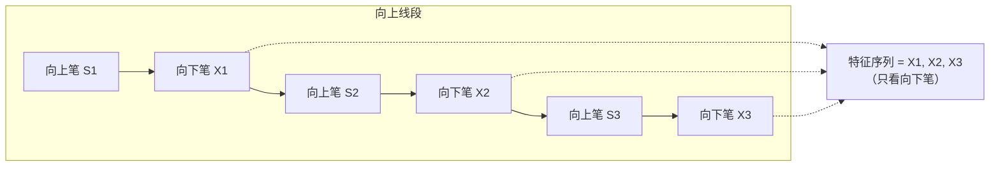
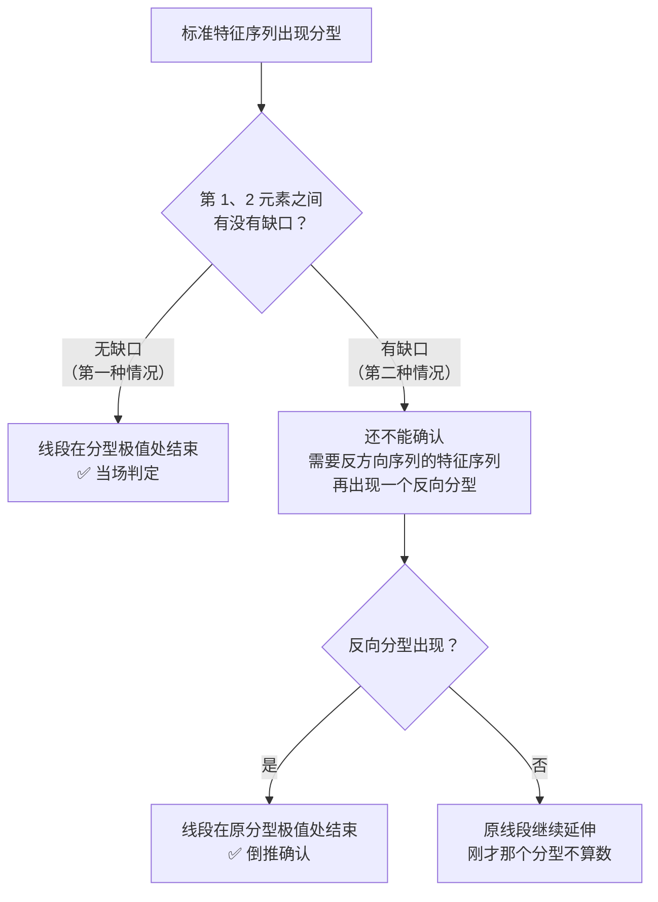

# 第 10 章 · 线段（下）：特征序列与"两种情况"

> 这是全书最难的一章，也是缠论所有程序化实现分歧最集中的地方。
> 核心问题只有一个：**一个线段什么时候结束？**
>
> 本章给出特征序列这套工具，讲清楚著名的"两种情况"，
> 并用实测回答一个从没见人给过数字的问题：
> **麻烦的那种情况到底多不多？**（答案：约四成。）

## 10.1 问题重述

第 9 章给了线段破坏的表述（第 65 课）：

> 线段被破坏，**当且仅当被另一个线段破坏**。

这句话初看循环，但它其实指了一条路：要判断当前线段是否结束，
就去看**反方向上有没有攒够一个能称为线段的东西**。

麻烦在于"攒够"怎么判。直接去数"反方向有没有三笔"不行——
第 9 章 9.4 节说过，三笔是下界不是完成条件。

特征序列就是把这件事变得可算的工具。

## 10.2 特征序列：为什么看反方向的笔

〔定义〕**特征序列**（第 67 课）：

- 以**向上笔开始**的线段，取其中**所有向下笔**，按顺序构成的序列；
- 以**向下笔开始**的线段，取其中**所有向上笔**。

也就是说：**向上的线段，看它内部向下的那些笔**。

为什么是反方向？原文给的理由是这样的：

在一个向上线段里，相邻两个**向上笔**之间**必然有重叠**
（它们被一个向下笔隔开，而那个向下笔没有跌破前一个向上笔的起点——
否则线段早就被破坏了）。
而相邻两个**向下笔**之间**不一定有重叠**。

〔推论〕**所以"有没有缺口"这个信息，只存在于反方向的笔序列里。**
同方向的笔序列必然互相重叠，看不出缺口，也就携带不了破坏信息。

这一步是整套工具的关键，值得停下来想清楚：
**特征序列不是"随便挑一半笔"，而是挑出唯一携带缺口信息的那一半。**



## 10.3 标准特征序列与缺口

〔定义〕**标准特征序列**（第 67 课）：
把特征序列的元素（每个元素是一笔，用它的价格区间表示）做一次**包含处理**，
得到的序列。

处理方式和第 6 章对 K 线的完全一样：找顶分型时向上处理（取高），
找底分型时向下处理（取低）。

〔定义〕**特征序列的缺口**：相邻两个元素的价格区间**没有任何重叠**。

### 第 1、2 元素分别是哪一笔

上面的"缺口"要判在**哪两个元素之间**？原文给了操作定义（第 71 课，转述）：

| 元素 | 是哪一笔 |
|---|---|
| **第一元素** | 假设的转折点**之前**那条线段的**最后一个特征元素** |
| **第二元素** | 从这个转折点**开始的第一笔** |

两者**同方向**（都是反方向笔），所以它们能构成同一个特征序列里的相邻两项。

⚠️ 这一条看起来琐碎，但缺了它，"第 1、2 元素之间有没有缺口"
就是一句无法执行的话——你不知道该拿哪两笔来比。
本书初版只给了"相邻两个元素"这个抽象说法。

```text
… 前一线段的特征元素  |  转折点  |  转折后的第一笔 …
        ↑ 第一元素                    ↑ 第二元素
        └────── 有没有缺口，判的是这两者 ──────┘
```

有了标准特征序列，就可以在它上面找**分型**（第 7 章那套东西直接复用）。
一个向上线段要结束，对应它的特征序列出现**顶分型**。

## 10.4 两种情况

这是本章的核心，也是分歧的源头。

原文（第 67 课；第 71 课有逐一再分辨）指出，
在标准特征序列里，构成分型的三个相邻元素**只有两种可能**，
区别在于**第 1 与第 2 元素之间有没有缺口**：

### 先说这两种情况是怎么用的：当下程序

两种情况不是用来"识别"的，是用来**验证一个假设**的。
原文给的是一个可以直接照做的程序（第 71 课，转述）：

```text
1. 假设：某个转折点是两线段的分界点
2. 用线段划分的两种情况去考察它是否满足
3. 满足其中一种  →  它就是真正的分界点
   一种都不满足  →  它不是，原线段依然延续
```

〔推论〕**所以线段划分天然是"先假设、后验证"的，
而不是"扫描一遍找出所有转折"。**

这条推论有两个实现上的后果：

| 后果 | 说明 |
|---|---|
| **要有回退** | 假设不成立时必须撤销，回到"原线段延续"的状态（11.3 节的状态机） |
| **假设点从哪来** | 候选就是特征序列上的每个分型位置——先假设它是，再拿两种情况去验 |

本书 10.1 节把线段划分描述成"判断一段有没有被破坏"，
和这个程序是等价的，但原文这个说法**更接近可执行代码**。

### 第一种情况：无缺口

〔定义〕特征序列的顶分型中，**第 1 与第 2 元素之间不存在缺口**，
那么该线段就在这个顶分型的**高点处结束**。

这种情况判定干脆：**分型成立，线段立刻结束**。
按原表述的说法，此时任何三笔其实都构成对前面线段的破坏。

### 第二种情况：有缺口

〔定义〕特征序列的顶分型中，**第 1 与第 2 元素之间存在缺口**，
那么还不能直接结束，**必须再等一个确认**：
从该分型最高点开始的向下一笔起，构成新的序列，
**它的特征序列出现底分型**，此时原线段才在那个顶分型的高点处结束。

换句话说：**有缺口时，要用"下一段的成立"来倒推"这一段的结束"。**



### 三条容易踩的细节

原文在给出两种情况之后专门强调了几点（第 67、71 课），
而它们在流传中经常被丢掉：

**一、第二种情况下，后一特征序列不一定封闭前一序列的缺口。**

原文（第 67 课，转述）：在第二种情况下，后一特征序列**不一定封闭**
前一特征序列相应的缺口。

⚠️ 这一条很容易被读反。**"缺口没被封闭"并不妨碍线段结束**——
判据是"后一序列出现了分型"，而不是"缺口被封上了"。

**二、第二个序列中的分型，不再分第一、第二种情况——有分型就可以。**

原文（第 67 课，转述）：第二个序列中的分型，**不分第一二种情况，
只要有分型就可以**。

〔推论〕**这一条直接简化了实现**：第二种情况只需要向后递归**一层**，
不会无限套娃。如果你的实现对"确认用的那个分型"又去判了一次有无缺口，
那就多做了一层，而且会漏掉一批本该成立的线段结束。

**三、假设的转折点前后那两个元素之间不做包含处理。**

原文（第 71 课，转述）：这两者已被假设不是同一性质的东西，
不一定属于同一特征序列；而**假设转折点之后**的那些元素之间，
包含处理照常应用——因为它们同属一类。

第三点是本书见过的实现里**出错率最高**的一条。

> ⚠️ **本书曾经写错过第一条。** 初版据网络转述写成"缺口最终被封闭时，
> 也肯定不是被第 1 个元素封闭的"——核对第 67 课原文后确认那是讹传，已更正；
> 第二条初版则**完全遗漏**。核对记录见[出处与资料](../../sources.md)第 1.4 节。

## 10.5 实测：麻烦的那种情况有多常见

前面都是定义。现在回答一个实际问题：**第二种情况占多大比例？**

如果它只占百分之几，那它是个边角，实现上可以先放一放；
如果它占三四成，那它就是**主干**，不实现就等于线段划分根本不能用。

本书没有找到公开的数字，所以自己测了一次。

**实测设定**：7 个匿名样本 × 2835 个交易日，2015-01-01 ~ 2026-09-01，
后复权日线；包含处理（两种包含都处理）→ 分型 → 笔（"不共用 K 线"标准，
共 2053 笔）→ 按方向分别取出特征序列 → 做标准化（包含处理）→ 找分型 →
判断第 1、2 元素之间有无缺口。
登记见[出处与资料](../../sources.md)第五节，运行日期 2026-09-12。

> ⚠️ **口径说明（重要）**：本测统计的是**所有出现在标准特征序列上的分型**，
> 而不是完整跑一遍顺序化的线段划分。
> 两者不完全等价——完整划分中，某个分型可能因为前一段尚未结束而根本轮不到判定。
> 所以下面的比例应理解为"**在候选判定点上**两种情况的分布"，
> 而不是"最终线段端点的分布"。换一种口径数字会变。

| 样本 | 笔数 | 特征序列分型 | 第一种（无缺口） | 第二种（有缺口） | 有缺口占比 |
|---|---|---|---|---|---|
| A | 300 | 53 | 35 | 18 | 34.0% |
| B | 286 | 47 | 31 | 16 | 34.0% |
| C | 293 | 56 | 31 | 25 | 44.6% |
| D | 280 | 47 | 28 | 19 | 40.4% |
| E | 294 | 46 | 23 | 23 | 50.0% |
| F | 294 | 53 | 32 | 21 | 39.6% |
| G | 306 | 49 | 32 | 17 | 34.7% |
| **合计** | **2053** | **351** | **212 (60.4%)** | **139 (39.6%)** | **39.6%** |

### 结论

〔经验断言〕**第二种情况约占四成（39.6%），各样本在 34.0%~50.0% 之间。**

这个数字回答了本节开头的问题：

> **第二种情况不是边角，是主干。**

它意味着：

1. **不实现第二种情况的线段划分，约有四成的判定点是错的**——
   那些本该"等确认"的地方被直接判成了结束。
2. **各家实现在这里分岔，会导致大面积分歧**，而不是偶发差异。
   这就是为什么线段划分被称为实现分歧的总源头（第 9 章、本章导言）。
3. 相比之下，第 8 章测出的老笔新笔差异只有 9%——
   **线段划分的分歧量级，比笔的分歧大得多。**

〔推论〕**所以排查两份分解结果不一致时，线段划分应该排在笔之前。**
第 8 章 Q4 给的排查顺序（复权 → 包含处理约定 → 硬条件 → 成笔失败处理 → 老笔新笔）
需要补上一条：**线段划分有没有实现第二种情况**，位置应排在"老笔新笔"之前。

## 10.6 为什么这里特别容易出错

把前面的东西汇总，线段划分需要做对的事情有一长串：

| # | 步骤 | 常见错法 |
|---|---|---|
| 1 | 取反方向的笔构成特征序列 | 取成了同方向 |
| 2 | 对特征序列做包含处理 | 忘了做，直接在原始特征序列上找分型 |
| 3 | 包含处理的方向 | 找顶分型时用了向下处理 |
| 4 | **转折点前后两元素不做包含处理** | 全都做了（10.4 节细节三） |
| 5 | 判断第 1、2 元素间有无缺口 | 判成了第 2、3 元素之间 |
| 6 | 第二种情况下等待反向分型确认；**确认用的分型不再分两种情况** | **直接当第一种处理**（占四成的判定点）；或对确认分型又判了一次缺口（多做一层） |
| 7 | 确认失败时回退 | 没有回退机制，线段一旦画出不再撤销 |

〔推论〕**这七步里任何一步不同，两份实现就会给出不同的线段。**
而其中第 4、6、7 步几乎从不在文档里声明。

第 7 步值得单独说：第二种情况下，**线段是"先假设、后确认"的**——
如果等来的不是反向分型，那么刚才那个分型不算数，原线段继续延伸。
这意味着实现必须支持**撤销已画出的线段**。
把第 7、8 章讲过的"待定 vs 已确认"往上推一层：

```text
分型：可能被后续包含处理取消（第 7 章 7.5 节）
笔  ：终点可能后移、端点可能被替换（第 8 章 8.7 节）
线段：整段可能被撤销（本章）
```

〔推论〕**几何层从上到下都是状态机，而不是一次性的计算。**
任何"算一遍就定死"的实现，在三个层面上都会错。

## 10.7 一条实用建议：标准统一优先于标准正确

看到这里，一个很自然的问题是："那到底哪套做法是对的？"

本书的回答和公开资料里的多数共识一致：

> **在划分与递归的全过程中始终使用同一套规则，
> 比争论哪套规则"正确"重要得多。**

理由有两条：

**一、多数细则没有唯一权威答案。** 第 67 课之后还有第 71 课的再分辨，
作者自陈第 67 课"用的是比较抽象的类数学语言，所以理解上可能还有困难"，
于是逐一再分辨——**说明原表述本身留了解释空间**。
在这种情况下声称某套落地"就是正确的"，本身就缺乏依据。

**二、统一的规则会让误差互相抵消。** 一套规则在某些形态下偏严、
在另一些形态下偏松，长样本上会部分抵消；
而**混用**规则（一会儿老笔一会儿新笔、一会儿处理后包含一会儿不处理）
会让偏差叠加放大。

所以本书的立场是：

| 做 | 不做 |
|---|---|
| 选定一套，写进约定清单（第 11 章） | 争论哪套"正确" |
| 全程不换 | 在不同函数里用不同规则 |
| 交流时交换约定清单 | 假定对方和你用的是同一套 |

## 常见说法辨析

| 说法 | 证据强度 | 辨析 |
|---|---|---|
| "线段就是三笔以上的组合" | ❌ 明确错误 | 三笔是下界。线段何时结束由破坏条件决定，而破坏条件要经过特征序列、缺口判断、两种情况这一整套（第 9 章 9.4 节、本章） |
| "第二种情况很少见，可以先不实现" | ❌ 明确错误 | 本书实测约占 **39.6%**（各样本 34.0%~50.0%）。不实现它，约四成的判定点会被直接判成结束——这是主干不是边角 |
| "特征序列就是把笔列出来" | ❌ 明确错误 | 是**反方向**的笔，而且要做包含处理得到标准特征序列。取成同方向就完全失去意义：同方向的笔必然互相重叠，携带不了缺口信息（10.2 节） |
| "线段画出来就固定了" | ❌ 明确错误 | 第二种情况下线段是"先假设、后确认"的，确认失败要撤销整段。几何层三层都是状态机（10.6 节） |
| "两个人线段划得不一样，说明缠论不严谨" | ⚠️ 有争议 | 更准确的说法是：**原表述留了解释空间，而各家实现选了不同的落地**。这和"理论不严谨"不是一回事。要批评的是各家**不声明自己的选择**，而不是存在选择 |
| "有唯一正确的线段划分法" | ⚠️ 有争议 | 原文其实说了"一切同一级别图上的走势都可以**唯一地**划分为线段的连接"（第 67 课）——所以**理论上**有唯一划分。但原文用的是"类数学语言"（第 71 课作者自述），落地时仍需一批解释性选择，各家因此分岔。本书的立场：标准统一优先于标准正确（10.7 节） |
| "缺口被封闭了，线段就不能在这里结束" | ❌ 明确错误 | 原文明说第二种情况下"后一特征序列**不一定封闭**前一序列的缺口"（第 67 课）。判据是**后一序列有没有出现分型**，与缺口封没封闭无关（10.4 节细节一） |
| "线段划分的分歧和笔的分歧差不多大" | ❌ 明确错误 | 实测量级差很多：老笔新笔的笔数差约 9%（第 8 章），而线段划分的分歧点覆盖约 39.6% 的判定。排查不一致时，线段应排在笔之前 |

## 思考题

**Q1.** 为什么特征序列要取**反方向**的笔？
请用"缺口信息在哪里"来回答，而不是背定义。

**Q2.**【判读】某人的实现在找顶分型时，对特征序列做了**向下**的包含处理。
请推断这会产生什么后果。（提示：回忆第 6 章 Q5 的思路。）

**Q3.** 本章实测"第二种情况约占 39.6%"。
这个结论的口径说明里提到"统计的是候选判定点，不是最终线段端点"。
请说明这两者为什么不同，以及如果改成后者，这个比例可能偏高还是偏低。

**Q4.** 原文（第 67 课）强调"第二个序列中的分型，不分第一二种情况，只要有分型就可以"。
这条对**实现**意味着什么？漏掉它会产生什么后果？

**Q5.** 10.6 节说几何层三层都是状态机。
请分别说出分型、笔、线段各自"可能被撤销"的触发条件，
并说明为什么线段那一层最难实现。

**Q6.**【查证】找一份公开的缠论实现，
定位它处理线段破坏的那段代码，逐项对照 10.6 节那张七步表，
看它**实现了几步**。特别检查第 4、6、7 步。

> 📖 **参考答案**（想清楚再看）：
> [Q1](../../qa/10-segment-how-qa.md#q1) ·
> [Q2](../../qa/10-segment-how-qa.md#q2) ·
> [Q3](../../qa/10-segment-how-qa.md#q3) ·
> [Q4](../../qa/10-segment-how-qa.md#q4) ·
> [Q5](../../qa/10-segment-how-qa.md#q5) ·
> [Q6](../../qa/10-segment-how-qa.md#q6)

## 本章实操

两档都**不需要开户、不需要下单**。

### 🅐 手工版：手工走一遍特征序列

**需要**：第 8 章 🅐 档划好的笔序列（至少 8 笔，不够就再划一段）。

1. 假设你的第一笔是向上的，那么这是一个**候选的向上线段**。
   把其中**所有向下笔**按顺序抄成一列，每笔记两个数：最高价、最低价。
   这就是特征序列。
2. 对这一列做**包含处理**（向上处理：高低点都取高），得到标准特征序列。
   记下合并掉了几个元素。
3. 在标准特征序列上找**顶分型**（方法和第 7 章完全一样）。
4. 找到之后，做本章最关键的一步判断：
   **第 1 与第 2 元素之间有没有缺口？**（两个区间有没有重叠）
   - 无缺口 → 第一种情况，线段在这里结束；
   - 有缺口 → 第二种情况，**还不能结束**，要往后再等一个反向确认。
5. 记录：你这一段里，遇到的是第一种还是第二种？
   如果同学之间对比，统计一下大家遇到第二种的比例，
   和本章实测的 39.6% 对照。

⚠️ 第 4 步如果你判成了"第 2、3 元素之间的缺口"，那就是 10.6 节的第 5 号错法——
很多人第一次做都会错在这里。

### 🅑 代码版：实现线段划分 + 测两种情况的比例

**需要**：第 8 章实现的笔序列。**先填[检验预登记表](../../forms/prereg-template.md)。**

**第一步：按 10.2~10.4 节实现**

把 10.6 节那张七步表当作实现清单，逐条对照着写。
**尤其不要漏掉第 4、6、7 步**——它们是最常见的缺失项。

**第二步：自检断言**

| 断言 | 检查什么 | 失败时怀疑谁 |
|---|---|---|
| 线段方向严格交替 | 相邻线段方向必不同 | **代码**（第 9 章的〔推论〕） |
| 每个线段至少 3 笔 | 计数 | **代码** |
| 线段首尾相接、不重叠不留空 | 索引连续性 | **代码** |
| 特征序列元素数 ≈ 该段笔数的一半 | 计数 | **代码** |

**第三步：复现本章的实测**

统计两种情况的比例，和本章的 60.4% / 39.6% 对照。
**如果差很远，先检查第 4 步（转折点前后不做包含处理）有没有实现**——
这一步做错会系统性地改变缺口判定。

**第四步（本章最有价值的一项）：测不实现第二种情况的代价**

写两个版本：

- 版本甲：完整实现两种情况；
- 版本乙：**所有分型都按第一种情况处理**（即分型成立就结束线段）。

然后统计：

1. 两个版本各划出多少线段？
2. **线段端点的重合率**是多少？（不是数量相同，是端点逐个对得上）
3. 不重合的那些，集中在什么样的形态里？

这个对照能把"第二种情况有多重要"从一个比例变成**直接的后果**。
把结果登记进[出处与资料](../../sources.md)第五节。

## 🔎 看盘时的用处

1. **看到"这一段结束了"，先问是哪种情况。** 有缺口的那四成需要等确认。
2. **特征序列看反方向的笔。** 记不住定义时，记住"缺口信息只在反方向里"。
3. **线段可能被整段撤销。** 实时工具画出的线段，在确认前都是假设。
4. **排查分歧时线段排在笔之前。** 39.6% 对 9%，量级差很多。
5. **别争哪套对，交换约定清单。** 原表述留了解释空间，统一比正确更可达。

> ⚖️ 本书只讲方法与检验，不推荐任何标的、不预测行情、不构成投资建议。
> 市场有风险，任何据此产生的后果由读者自负。
