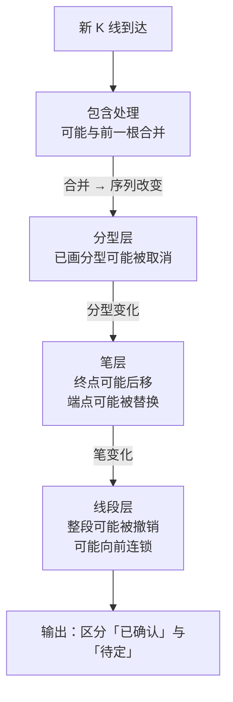

# 第 11 章 · 把几何层写成程序

> 第二部分的收口。这一章交付三样东西：
> **一份完整的约定清单**、**一个不一致率的实测**、**一套自检断言**。
>
> 其中那个实测给出了整个第二部分最重要的一个数字——
> 两份"都是缠论"的实现，笔端点最低只有 **17.3%** 对得上。
> 而影响最大的那项约定，恰恰是各家几乎从不声明的那一项。

## 11.1 完整的约定清单

把第 6 到 10 章散落的约定汇总起来。**这就是"你的缠论"和"别人的缠论"的全部差异来源。**

| # | 层 | 约定 | 常见选择 | 出处 |
|---|---|---|---|---|
| 1 | 数据 | 复权方式 | 后复权 / 前复权快照 / 不复权 | 第 2、4 章 |
| 2 | 数据 | 停牌与缺失如何处理 | 剔除 / 保留 / 填充 | 第 4 章 |
| 3 | 包含处理 | 初始方向 | 向上 / 向下 / 由前两根推断 | 第 6 章 |
| 4 | 包含处理 | **是否处理"后包含前"** | 两种都处理 / 只处理前包含后 | 第 6 章 |
| 5 | 包含处理 | 合并后如何记时间 | 取前 / 取后 / 取极值所在 | 第 6 章 |
| 6 | 包含处理 | 相等边界算不算包含 | 算 / 不算 | 第 6 章 |
| 7 | 分型 | 是否使用强弱判据 | 用 / 不用；阈值取多少 | 第 7 章 |
| 8 | 笔 | 间隔门槛 `g` | `g ≥ 3`（不共用）/ `g ≥ 4` / 更严 | 第 8 章 |
| 9 | 笔 | 在哪个序列上数根数 | 合并后（老笔）/ 原始（新笔） | 第 8 章 |
| 10 | 笔 | **成笔失败后怎么办** | 忽略第一个（第 65 课原文）/ 取极值（本书实现）/ 回退 | 第 8 章 |
| 11 | 线段 | 特征序列取哪个方向 | 反方向（唯一正确） | 第 10 章 |
| 12 | 线段 | 转折点前后是否做包含处理 | **不做**（第 71 课原文）/ 做 | 第 10 章 |
| 13 | 线段 | 是否实现第二种情况 | 实现 / 全按第一种处理 | 第 10 章 |
| 14 | 线段 | 确认失败是否回退 | 回退 / 不回退 | 第 10 章 |
| 15 | 递归 | 中枢建在笔上还是线段上 | 笔中枢 / 线段中枢 | 第 9 章 |
| 16 | 递归 | 最低级别是什么 | 某周期 K 线 / 笔 / 线段 | 第 3、9 章 |

〔推论〕**几何层的输出是「价格序列 + 这 16 项」的函数**（第 6 章 6.4 节）。
输入相同而输出不同，差异**必然**落在这张表里——所以对账时不用猜，逐项比对即可。

## 11.2 实测：不一致率到底有多大

前面各章测的都是单项影响。这一节把它们组合起来，回答一个更实际的问题：

> **两个人都说自己"按缠论划的笔"，结果能差多远？**

**实测设定**：7 个匿名样本 × 2835 个交易日，2015-01-01 ~ 2026-09-01，
后复权日线。固定其余约定，只让三项变化：

- **第 4 项**：两种包含都处理 / 只处理前包含后；
- **第 8 项**：`g ≥ 3` / `g ≥ 4`；
- **第 10 项**：丢弃 + 同类型取极值 / 纯丢弃。

共 2 × 2 × 2 = 8 种组合。比较的对象是**笔端点的集合**
（不是笔数——数量相同不代表位置相同），用交并比衡量重合度。
登记见[出处与资料](../../sources.md)第五节，运行日期 2026-09-12。

### 结果一：八种组合

基准取「两种包含 / `g ≥ 3` / 取极值」。

| 约定组合 | 笔端点数 | 与基准的端点重合率 |
|---|---|---|
| 两种包含 / `g ≥ 3` / 取极值（基准） | 2060 | 100.0% |
| 两种包含 / `g ≥ 3` / **纯丢弃** | 2893 | **26.2%** |
| 两种包含 / `g ≥ 4` / 取极值 | 1662 | 67.1% |
| 两种包含 / `g ≥ 4` / 纯丢弃 | 2430 | 23.7% |
| 只前包含 / `g ≥ 3` / 取极值 | 2091 | 68.5% |
| 只前包含 / `g ≥ 3` / 纯丢弃 | 2750 | 23.7% |
| 只前包含 / `g ≥ 4` / 取极值 | 1741 | 55.8% |
| 只前包含 / `g ≥ 4` / 纯丢弃 | 2380 | 21.9% |

**最不一致的一对**：「两种包含 / `g ≥ 4` / 取极值」与
「只前包含 / `g ≥ 3` / 纯丢弃」，端点重合率仅 **17.3%**。

〔经验断言〕**两份都自称"按缠论划的笔"的实现，端点可以只有不到两成对得上。**

### 结果二：单因子影响排序

只改一项、其余与基准相同：

| 改动的约定 | 端点重合率 | 端点数变化 |
|---|---|---|
| **第 10 项：成笔失败处理（取极值 → 纯丢弃）** | **26.2%** | 2060 → 2893 |
| 第 8 项：成笔门槛（`g ≥ 3` → `g ≥ 4`） | 67.1% | 2060 → 1662 |
| 第 4 项：包含处理（两种 → 只前包含） | 68.5% | 2060 → 2091 |

这个排序是本章、也是整个第二部分最重要的结论：

〔推论〕**影响最大的那项约定，恰恰是各家最少声明的那一项。**

三件事同时成立：

1. **成笔失败处理的影响最大**——端点重合率只有 26.2%，
   远高于门槛（67.1%）和包含处理（68.5%）带来的分歧；
2. **它几乎从不出现在任何文档里**（第 8 章 Q6）。它通常藏在
   一个 `for` 循环的分支里，几行代码，没有注释。
   ⚠️ 而**原文其实给过默认值**——第 65 课明确说"两个同类型分型之间
   没有其他顶底时，第一个的顶或底可以忽略不算"。
   所以这不是原文的空白，是**原文给了、流传中丢了**（第 8 章 8.5 节）；
3. **缠圈争论最多的老笔新笔，影响排在最后**——
   第 8 章测出笔数只差 9%，本章测出同类改动（门槛 `g`）的端点重合率仍有 67.1%。

> **这印证了第 8 章 Q5 的推理**：那里从"七成以上的分型会经过失败分叉点"
> 推出这个约定的影响"很可能比老笔新笔的 9% 大得多"。
> 现在有了数字——**大得多**。

### 为什么"纯丢弃"会让端点变多

有一个反直觉的细节值得解释：纯丢弃的端点数是 2893，**比基准的 2060 还多**。

原因：「同类型取极值」会把连续出现的同类型分型**合并成一个**（保留更极端的），
于是待定分型的位置被推后，后续配对时更难满足间隔门槛；
而「纯丢弃」每次只跳过一个不合格的分型，**保留了更多配对机会**。

〔推论〕**约定的影响不能只看"更严还是更松"**——
两项看似都是"筛选"的规则，一个让端点变少，一个让端点变多。
这也是为什么必须**实测**而不是凭直觉排序。

## 11.3 参考实现的结构：三层状态机

第 7、8、10 章各自指出了一层的"回撤重画"性质。合起来看：



〔推论〕**几何层必须实现成一个可回滚的增量状态机，不能是一次性的批量计算。**

这条推论有两个很实际的后果：

**一、每层都要暴露"已确认 / 待定"两种状态。**
只输出一条线而不告诉使用者"这条线还可能变"，
是实时工具最常见、也最有害的误导（第 8 章 8.7 节）。

**二、增量更新与全量重算必须给出相同结果。**
这是一条极好的集成测试：

```text
对同一段数据：
  结果甲 = 一次性全量计算
  结果乙 = 逐根 K 线增量喂入
  断言：甲 == 乙
```

不支持回退的实现，这两条路径**几乎必然不一致**——
因为全量计算时"未来"是已知的，增量时不是。
这个测试能一次性抓出第 10 章七步表里第 7 步的缺失。

## 11.4 自检断言总表

把第 6 到 10 章收获的断言汇总。**全部从定义推出，所以失败一定是实现问题。**

| 层 | 断言 | 依据 |
|---|---|---|
| 包含处理 | 输出不含任何包含关系 | 第 6 章 |
| 包含处理 | 幂等：再处理一次输出不变 | 第 6 章 |
| 包含处理 | 输出长度 ≤ 输入长度 | 第 6 章 |
| 分型 | 方向序列 `d` 中不含 0 | 第 7 章 |
| 分型 | 顶底严格交替 | 第 7 章 7.3 节 |
| 分型 | 顶分型数与底分型数相差 ≤ 1 | 第 7 章 |
| 笔 | 方向严格交替 | 第 8 章 8.6 节 |
| 笔 | 每笔端点一顶一底 | 第 8 章 |
| 笔 | 笔数 ≤ 分型数 − 1 | 第 8 章 |
| 线段 | 方向严格交替 | 第 9 章 9.4 节 |
| 线段 | 每段至少 3 笔 | 第 9 章 |
| 线段 | 首尾相接，不重叠不留空 | 第 10 章 |
| 线段 | 第二种情况的确认分型**不再判缺口**（有分型即可） | 第 10 章 Q4 |
| 全局 | 增量结果 == 全量结果 | 本章 11.3 节 |

〔推论〕**这 14 条断言跑一遍的成本极低（都是 O(n) 的遍历），
却能挡住几何层绝大多数实现错误。**

它们的价值不只是找 bug，更在于**把"我实现得对不对"从一个模糊的问题
变成一组可以逐条回答的问题**。

## 11.5 交付物：约定清单模板

第二部分的最终交付物。把它填完，你的分解结果就可以被别人复核了。

**几何层约定清单**

| # | 约定 | 我的选择 | 备注 |
|---|---|---|---|
| 1 | 复权方式 | | |
| 2 | 停牌与缺失处理 | | |
| 3 | 包含处理初始方向 | | |
| 4 | 是否处理"后包含前" | | ⚠️ 影响端点重合率约 31% |
| 5 | 合并后时间戳规则 | | |
| 6 | 相等边界是否算包含 | | |
| 7 | 是否用分型强弱判据 / 阈值 | | |
| 8 | 成笔间隔门槛 `g` | | ⚠️ 影响端点重合率约 33% |
| 9 | 在哪个序列上数根数 | | 老笔 / 新笔的真正差别 |
| 10 | **成笔失败处理** | | ⚠️ **影响最大：端点重合率仅 26.2%** |
| 11 | 特征序列方向 | 反方向 | 这一项没有选择余地 |
| 12 | 转折点前后是否包含处理 | | |
| 13 | 是否实现第二种情况 | | ⚠️ 覆盖约 39.6% 的判定点 |
| 14 | 确认失败是否回退 | | |
| 15 | 中枢建在笔还是线段上 | | |
| 16 | 最低级别 | | |

**使用方式**：

- 自己实现时，**先填表再写代码**。填不出来的项，就是你还没想清楚的地方；
- 和别人对账时，**交换清单而不是争论**。差异必然在这 16 行里；
- 发布结果时，**把清单一起发布**。没有清单的分解结果无法被复核，
  也就无法被当作证据（这一点在第六部分做检验时是硬要求）。

## 11.6 "标准统一优先于标准正确"的操作含义

第 10 章 10.7 节给了这个立场，这里把它变成三条可执行的规则：

**规则一：全程使用同一套约定。**
不要在不同函数、不同级别、不同时间用不同规则。
本章实测显示混用的代价是端点重合率可以低到 17.3%——
而混用发生在**同一份代码内部**时，你甚至没有第二份结果可以对照，
错误会完全隐形。

**规则二：约定一旦选定就写进配置，不要硬编码。**
硬编码的约定无法被声明、无法被切换、也无法做本章这样的敏感性测试。
第 6~10 章每一章的 🅑 档都要求把约定写成参数，原因就在这里。

**规则三：变更约定时，重跑所有下游结论。**
几何层的输出是中枢、背驰、买卖点的输入。改了第 10 项，
你之前所有基于旧约定得到的统计结论**全部作废**——
不是"略有偏差"，而是端点只有四分之一对得上。

## 常见说法辨析

| 说法 | 证据强度 | 辨析 |
|---|---|---|
| "缠论的分解是唯一的" | ❌ 明确错误 | 本章实测：仅改三项约定，八种组合之间端点重合率最低 17.3%。分解结果是「价格序列 + 约定集」的函数 |
| "分解不唯一，说明这就是缠论说的多义性" | ❌ 明确错误 | 两件事完全不同。**多义性**是同一套约定下、对同一段走势的不同**合法分解视角**（第 31 章会讲）；**约定分歧**是不同实现算出了不同的**笔和线段**。前者是理论特性，后者是工程问题 |
| "老笔新笔是最大的分歧来源" | ❌ 明确错误 | 实测排序：成笔失败处理（26.2% 重合）> 门槛 `g`（67.1%）≈ 包含处理（68.5%）。老笔新笔属于门槛这一类，排最后 |
| "只要按原文实现就不会有分歧" | ⚠️ 有争议 | 原表述在多处没有写死（第 6 章四项、第 10 章第 5/7 步）。⚠️ 但也有本以为"没写死"、核对后发现**原文其实给了**的（第 8 章失败处理，第 65 课）——所以"按原文实现"的第一步是**真的去看原文**，而不是照着流传的转述 |
| "自检断言意义不大，跑通了就行" | ❌ 明确错误 | 14 条断言全是 O(n) 遍历，成本极低。而几何层的错误**不会报错**——它会安静地输出一个看起来正常的结果，然后污染上面所有层 |
| "全量算一遍就够了，不用做增量" | ⚠️ 有争议 | 只做离线分析确实可以。但"增量 == 全量"这条测试能一次性抓出回退机制的缺失（第 10 章第 7 步），**即使你不打算实时使用，也值得跑一次** |

## 思考题

**Q1.** 本章实测中，"纯丢弃"的端点数（2893）反而**多于**基准的"取极值"（2060）。
请解释这个反直觉的结果，并说明它对"如何评估一项约定"有什么启示。

**Q2.**【标签】"几何层的输出是「价格序列 + 约定集」的函数"属于哪一类命题？

**Q3.** 本章给出的单因子影响排序是：成笔失败处理 > 成笔门槛 ≈ 包含处理。
请结合第 8 章 8.5 节的分析，解释**为什么**成笔失败处理的影响最大。

**Q4.**【判读】甲的实现和乙的实现跑同一段数据，笔端点重合率约 25%。
甲说："这就是缠论的多义性，不同视角本来就会有不同分解。"
请指出这句话混淆了什么，并说明正确的排查方式。

**Q5.** 11.3 节给出"增量结果 == 全量结果"这条测试。
请说明：为什么不支持回退的实现在这条测试上几乎必然失败？
（提示：想想全量计算时"未来"是不是已知的。）

**Q6.**【查证】拿你自己的实现（或任意一份公开实现），
把 11.5 节的约定清单**逐项填完**。
填不出来的项有几个？对每个填不出来的项，去代码里找出它实际的行为是什么。

> 📖 **参考答案**（想清楚再看）：
> [Q1](../../qa/11-implementation-qa.md#q1) ·
> [Q2](../../qa/11-implementation-qa.md#q2) ·
> [Q3](../../qa/11-implementation-qa.md#q3) ·
> [Q4](../../qa/11-implementation-qa.md#q4) ·
> [Q5](../../qa/11-implementation-qa.md#q5) ·
> [Q6](../../qa/11-implementation-qa.md#q6)

## 本章实操

两档都**不需要开户、不需要下单**。

### 🅐 手工版：填一份约定清单

**需要**：第 6~10 章 🅐 档的全部记录。

1. 把 11.5 节的清单抄下来，逐项填写**你在手工划图时实际用的选择**。
2. ⚠️ 关键：很多项你可能**没有意识到自己做了选择**
   （比如第 10 项——遇到不合格的分型对时你是怎么处理的？）。
   回去翻你的记录，找出你当时实际的做法，如实填上。
3. 填不出来的项，标成"未定"。
4. **找一个同学交换清单**，然后对比你们同一段图的分解结果。
   差异能不能用清单上的不同项解释？
5. 如果有差异解释不了，说明清单还缺项——**把它补上**。

第 5 步是这个实操的真正价值：约定清单是"活的"，
凡是能造成分歧而清单里没有的，都应该补进去。

### 🅑 代码版：做一次完整的敏感性测试

**需要**：第 6~10 章实现的全套几何层。
**先填[检验预登记表](../../forms/prereg-template.md)。**

**第一步：确认所有约定都是参数**

把 11.5 节 16 项里你实现了的，逐个检查是不是**可配置**的。
硬编码的改成参数——这是做后续所有测试的前提。

**第二步：跑 14 条自检断言**

把 11.4 节那张表写成测试。**全部通过之后再往下**。

**第三步：增量 == 全量**

按 11.3 节写这条集成测试。如果失败，去查第 10 章七步表的第 7 步。

**第四步：复现本章的敏感性测试**

选三项约定（建议就用本章的第 4、8、10 项），跑八种组合，
统计**端点集合的重合率**。和本章的结果对照：

- 你的单因子排序和本章一样吗？
- 最差组合的重合率是多少？

**第五步（本章没做，留给你）：把测试推到线段层**

本章只测到笔端点。把同样的方法用到**线段端点**上：

1. 固定几何层约定，只改第 13 项（是否实现第二种情况）；
2. 统计线段端点的重合率。

第 9 章 Q5 推理过"线段会吸收掉笔层面的一部分差异"，
所以**线段端点的重合率应该高于笔端点**——去验证这个推理对不对。
这是第二部分留下的最后一个待测量。

**第六步：登记**

把全部结果登记进[出处与资料](../../sources.md)第五节，
并把你的约定清单一并存档。

## 🔎 看盘时的用处

1. **看到任何缠论工具的输出，先问它的约定清单。** 没有清单的输出无法复核。
2. **对账时逐项比对，不要争论。** 差异必然在那 16 行里。
3. **最该问的一项是"成笔失败了怎么办"。** 影响最大，且几乎没人主动说。
4. **别把工程分歧说成"多义性"。** 那是两回事，混为一谈会让问题永远查不出来。
5. **改了约定，之前的结论全部作废。** 不是"略有偏差"——端点可能只剩四分之一对得上。

> ⚖️ 本书只讲方法与检验，不推荐任何标的、不预测行情、不构成投资建议。
> 市场有风险，任何据此产生的后果由读者自负。
