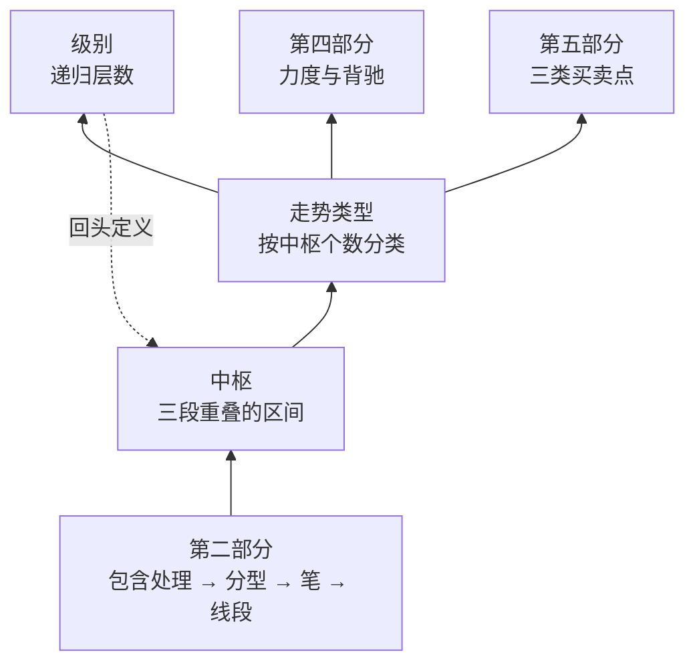

# 第三部分 · 中枢

这是整套理论的核心。前两部分都是在为它做准备。

## 中枢在整栋楼里的位置

注意那条虚线：**中枢定义走势类型，走势类型定义级别，而级别又回头定义中枢**。
第 1 章 1.5 节说过，这个环靠"最低级别"打破。第二部分给出的笔与线段，
就是实践中那个最低级别的承担者（第 9 章 9.2 节交代过这处接缝）。

## 这一部分的主线

中枢是一个**有生命周期**的对象。原著用佛家的说法叫"生、住、坏、灭"，
本书按它展开：

| 阶段 | 问题 | 在第几章 |
|---|---|---|
| **生** | 中枢怎么产生 | 第 12 章 |
| **住** | 中枢怎么维持（延伸） | 第 13 章 |
| **长** | 中枢怎么升级（扩张） | 第 15 章 |
| **传** | 中枢怎么接力（新生 → 趋势） | 第 14 章 |
| **坏** | 中枢怎么被破坏 | 第 16 章 |

然后把它们接回递归层（第 17 章），最后处理那句被引用最多的话（第 18 章）。

## 这一部分会给出的几个数字

本部分的每一章都在真实数据上测过。先把结论摆在这里，
它们中的几个**和圈内的直觉相反**：

| 结论 | 数值 | 在第几章 |
|---|---|---|
| 中枢有延伸的比例 | **76.5%** —— 延伸是常态，不是例外 | 第 13 章 |
| 相邻中枢**完全不重叠**（可构成趋势） | **仅 16.4%** —— 趋势是少数 | 第 14 章 |
| 相邻中枢**围绕波动重叠**（走向扩张） | **79.3%** —— 扩张才是常态 | 第 15 章 |
| 中枢区间宽度（相对价格） | 中位数 3.4% | 第 12 章 |

〔经验断言〕**在本书的样本上，市场绝大多数时间处在"中枢延伸"或"中枢扩张"状态，
真正构成趋势的相邻中枢对不到两成。**

这个结论会贯穿后面几部分——它解释了为什么背驰要求"必须是趋势"这个前提如此苛刻
（第 20 章），也解释了为什么第三类买卖点在实践中出现得那么频繁（第 27 章）。

## 本部分章节

| 章 | 标题 | 一句话 |
|---|---|---|
| 12 | [中枢的定义](12-pivot-def.md) | 三段重叠；`[ZD, ZG]` 与 `GG/DD` 两组记号 |
| 13 | 中枢的延伸 | 延伸是常态；延伸段数与多义性的由来 |
| 14 | 中枢的新生与趋势 | "绝对不重叠"有多严；趋势为什么是少数 |
| 15 | 中枢的扩张 | 级别提升的唯一通道 |
| 16 | 中枢三定理 | 生、住、坏的充要条件 |
| 17 | 走势类型与级别的递归 | 循环定义怎么被打破 |
| 18 | 走势终完美 | 原理与同义反复之间 |
| P2 | 🛠 给一段行情做完整中枢标注 | 交付一份可被复核的分解 |

## 读完这一部分，你应该能

- 在笔或线段序列上**算出**中枢区间，而不是凭眼睛圈；
- 分清 `[ZD, ZG]` 与 `GG/DD` 两组记号各自管什么（这是初学者最高频的错误）；
- 判断两个相邻中枢之间会走向**扩张**还是**趋势**，并知道后者有多罕见；
- 说清楚"走势终完美"为什么不能用来推方向。

> ⚖️ 本书只讲方法与检验，不推荐任何标的、不预测行情、不构成投资建议。
> 市场有风险，任何据此产生的后果由读者自负。
