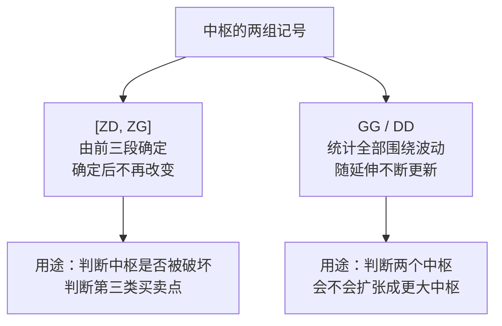

# 第 12 章 · 中枢的定义

> 整套理论的核心概念。定义本身只有一行，但它有两组容易混淆的记号，
> 而混淆它们是初学者最高频的错误。
> 本章把定义讲透，并给出中枢在真实数据上长什么样。

## 12.1 定义

〔定义〕**中枢**（第 17 课）：某级别走势类型中，
**被至少三个连续次级别走势类型所重叠的那段区间**。

把它写成可算的形式。设连续三个次级别走势类型 A、B、C，
各自的高、低点为 `(a1, a2)`、`(b1, b2)`、`(c1, c2)`：

```text
ZG = min(a1, b1, c1)      中枢上沿
ZD = max(a2, b2, c2)      中枢下沿

构成中枢  ⟺  ZD ≤ ZG
```

若算出 `ZD > ZG`，说明这三段没有共同重叠区间，**不构成中枢**。

〔推论〕**中枢的判定是一个布尔运算，不是一个程度量。**
这一点在第 4 章 Q4 已经用过：它意味着数据误差的影响是**非线性**的——
一次极端的坏数据就能让判定翻转，而不是"误差百分之零点几"。

### 为什么是"至少三个"

原著在第 17 课给了定义，第 18 课补充了计算口径：
**具体计算以前三个连续次级别走势类型的重叠为准**。

为什么是三个而不是两个？两个理由：

**一、两段无法形成"中心"。** 两段重叠只说明它们有交集，
而中枢要表达的是"价格在某个区间内**来回**"——来回至少要三段
（去、回、再去）。

**二、和分解定理二一致。** 任何走势类型至少由三段次级别走势类型构成
（第 1 章 1.6 节）。中枢作为走势类型的内核，用三段起步与之呼应。

〔推论〕**中枢的区间由前三段确定，之后的段只能让它延伸或破坏它，
不能改变 `[ZD, ZG]`。** 这是第 13 章的主题，也是下一节两组记号的由来。

## 12.2 两组记号：`[ZD, ZG]` 与 `GG/DD`

这一节请慢读。**混淆这两组是初学者最高频的错误**，
而且混淆之后算出来的一切都是错的。

设中枢由若干次级别走势段构成，取其中**与中枢形成方向一致**的那些段
（原著记为 `Zn`），它们的高低点分别为 `gn`、`dn`：

| 记号 | 定义 | 取值范围 | 管什么 |
|---|---|---|---|
| `ZG` | `min(g1, g2)` | 只看**前两段** | 中枢**上沿** |
| `ZD` | `max(d1, d2)` | 只看**前两段** | 中枢**下沿** |
| `GG` | `max(gn)` | 遍历**全部**段 | 围绕中枢波动的**最高点** |
| `G` | `min(gn)` | 遍历全部段 | 各段高点中的最低者 |
| `D` | `max(dn)` | 遍历全部段 | 各段低点中的最高者 |
| `DD` | `min(dn)` | 遍历全部段 | 围绕中枢波动的**最低点** |



〔推论〕**`DD ≤ ZD ≤ ZG ≤ GG` 必然成立。**
这是一条免费的自检断言——算出来不满足，一定是实现错了。

### 什么时候用哪一组

记住两句话就够：

> **判断中枢有没有被破坏，看 `[ZD, ZG]`。**
> **判断两个中枢会不会合成更大的中枢，看 `GG / DD`。**

理由在第 15 章会讲透：级别提升的条件是"围绕两个同级别中枢产生的**波动区间**
产生重叠"（第 20 课），而"波动区间"指的正是 `[DD, GG]`，不是 `[ZD, ZG]`。

用错的后果很具体：用 `[ZD, ZG]` 去判扩张，会把大量本该扩张的情形判成趋势——
按本书第 14、15 章的实测，这个误判的比例高达**八成**。

## 12.3 中枢的形成方向

〔定义〕中枢有两种形成方式（第 20 课）：

- **回升形成**：由向上的次级别走势段的区间重叠确定；
- **回调形成**：由向下的次级别走势段的区间重叠确定。

原著指出，无论哪种情况，中枢区间都可以简化为
`[max(a2, c2), min(a1, c1)]`——也就是说，
**中枢区间由与形成方向一致的那两段（第一段和第三段）决定**。

这个简化在实现时很有用：你不需要三段全算，
只要认出哪两段是"同向段"即可。

⚠️ 但要注意：这个简化成立的前提是三段**严格交替**（A 与 C 同向，B 反向）。
在笔或线段上这个前提天然满足（第 8、9 章：方向必然交替），
所以可以放心用。

## 12.4 实测：中枢长什么样

按本书的实现（几何层约定见第 11 章清单：后复权、两种包含都处理、
`g ≥ 3`、丢弃 + 取极值、笔中枢）在真实数据上跑一遍。

**实测设定**：7 个匿名样本 × 2835 个交易日，2015-01-01 ~ 2026-09-01，
后复权日线，共得到 2053 笔。
登记见[出处与资料](../../sources.md)第五节，运行日期 2026-09-12。

| 指标 | 数值 |
|---|---|
| 识别出的中枢数 | **336** |
| 平均每个中枢占用 | **6.1 笔** |
| 中枢区间宽度（相对价格） | 中位数 **3.4%**，均值 3.9%，90 分位 7.3% |
| 中枢跨度（合并 K 线根数） | 中位数 **28**，均值 32.8 |

折算一下感受量级：日线上一个中枢中位数跨 28 根合并 K 线，
按第 6 章的合并率约合 **37 根原始日线**，即差不多**一个半月**；
价格上下沿相差约 **3.4%**。

〔经验断言〕**日线级别的中枢，典型是"一个半月、3~4% 宽的横向区间"。**

这个量级感很有用。它意味着：

1. 一个中枢内的波动幅度（3.4%）在扣除交易成本后所剩不多——
   第 37 章会把这件事算清楚；
2. 中枢形成需要时间，所以"当下正在形成的中枢"总是不确定的
   （第 16 章会讲这个"当下性"）。

## 常见说法辨析

| 说法 | 证据强度 | 辨析 |
|---|---|---|
| "中枢就是横盘震荡区间" | ⚠️ 有争议 | 形态上常常像，但定义完全不同。中枢由**三段重叠**确定，与"看起来横不横"无关。一段陡峭的走势里同样可以有中枢，一段磨人的震荡也可能构不成中枢（三段不重叠时） |
| "`ZG` 就是中枢的最高点" | ❌ 明确错误 | `ZG` 是**上沿**，由前两段的高点取小；中枢期间价格可以远高于 `ZG`，那个最高点是 `GG`。混淆这两个是初学者最高频的错误（12.2 节） |
| "中枢区间越宽，级别越大" | ⚠️ 缺乏证据 | 级别由**递归层数**定义，与区间宽度无关（第 3 章）。宽度反映的是这三段的波动幅度。实测中枢宽度中位数 3.4%，但同一级别内分散很大（90 分位 7.3%） |
| "三段重叠就是中枢，很简单" | ⚠️ 有争议 | 判定确实简单，难的在于**这三段是什么**——它们必须是"次级别走势类型"，而这需要整个第二部分（而且还有第 9 章那处接缝）。中枢的复杂度都在它的输入里 |
| "中枢一旦形成就固定了" | ⚠️ 有争议 | `[ZD, ZG]` 由前三段确定后确实不再改变，这部分对。但 `GG/DD` 会随延伸不断更新，而且中枢可能被破坏、被扩张（第 13、15、16 章）。所以"固定"只对区间成立，不对中枢这个对象成立 |
| "判断中枢破坏和判断扩张用同一组数" | ❌ 明确错误 | 破坏看 `[ZD, ZG]`，扩张看 `GG/DD`（12.2 节）。用错会把约八成本该扩张的情形判成趋势 |

## 思考题

**Q1.** 为什么中枢要用"至少三段"而不是两段？请给出两条理由。

**Q2.**【标签】"`DD ≤ ZD ≤ ZG ≤ GG` 必然成立"属于哪一类命题？
如果你的实现算出 `GG < ZG`，该查什么？

**Q3.** 用一句话分别说明 `[ZD, ZG]` 和 `GG/DD` 各自管什么。
再说明：如果用 `[ZD, ZG]` 去判断两个中枢能否扩张，会系统性地犯什么错？

**Q4.**【判读】某人说："这段走势一直在横盘，所以是一个大中枢。"
请指出这句话跳过了哪些必要的判定步骤。

**Q5.** 本章实测中枢宽度中位数 3.4%、跨度约一个半月。
请据此推断：在中枢内部做"高抛低吸"，需要考虑什么？
（不需要给结论，指出要考虑的因素即可。）

**Q6.**【查证】找一份公开的缠论实现，看它算 `ZG` 时用的是
**前两段**的高点取小，还是**全部段**的高点取小。
如果是后者，说明这会导致什么。

> 📖 **参考答案**（想清楚再看）：
> [Q1](../../qa/12-pivot-def-qa.md#q1) ·
> [Q2](../../qa/12-pivot-def-qa.md#q2) ·
> [Q3](../../qa/12-pivot-def-qa.md#q3) ·
> [Q4](../../qa/12-pivot-def-qa.md#q4) ·
> [Q5](../../qa/12-pivot-def-qa.md#q5) ·
> [Q6](../../qa/12-pivot-def-qa.md#q6)

## 本章实操

两档都**不需要开户、不需要下单**。

### 🅐 手工版：手算三个中枢

**需要**：第 8 章 🅐 档划好的笔序列（至少 9 笔）、
[中枢标注表](../../forms/pivot-worksheet.md)。

1. 从第 1 笔开始，取连续三笔，按 12.1 节算 `ZG` 和 `ZD`。
2. 判断 `ZD ≤ ZG` 吗？
   - 是 → 构成中枢，填进标注表；
   - 否 → 向后挪一笔，重试。
3. 找到中枢后，继续算 `GG` 和 `DD`（把该中枢覆盖的所有笔都算进去）。
4. **验证** `DD ≤ ZD ≤ ZG ≤ GG`。不成立就是算错了，回去查。
5. 重复，直到找出至少 3 个中枢。
6. 最后算一下：每个中枢的**相对宽度** `(ZG − ZD) / ((ZG + ZD) / 2)`，
   和本章实测的中位数 3.4% 对照。

⚠️ 第 4 步是本章最重要的一步。很多人算完 `GG/DD` 从不验证，
于是把错误一路带到后面几章。

### 🅑 代码版：实现中枢识别

**需要**：第 11 章的几何层实现。

**第一步：按 12.1 节实现**

```text
输入：笔（或线段）序列
1. 从第 k 笔起取连续三笔，算 ZG = min(三段高点)、ZD = max(三段低点)
2. ZD > ZG → k += 1，继续
3. ZD ≤ ZG → 记录中枢，算 GG/DD（先只按这三段算，延伸留到第 13 章）
```

**第二步：自检断言**

| 断言 | 依据 |
|---|---|
| `DD ≤ ZD ≤ ZG ≤ GG` | 12.2 节〔推论〕 |
| 中枢的构成段数 ≥ 3 | 定义 |
| 中枢之间不重叠（同一层上按顺序切分） | 实现约定 |

**第三步：复现本章的四个统计量**

先填[检验预登记表](../../forms/prereg-template.md)，然后统计：
中枢数、平均笔数、区间宽度分布、跨度分布。和本章对照。

⚠️ 如果你的中枢数明显多于本书（336 个），先检查第二步第三条：
是不是把重叠的中枢重复计数了。

**第四步：登记**

结果登记进[出处与资料](../../sources.md)第五节，
并在约定清单（第 11 章 11.5 节）第 15 项注明你用的是笔中枢还是线段中枢。

## 🔎 看盘时的用处

1. **"横盘"不等于中枢。** 判定要数三段重叠，不是看形状。
2. **听到 `ZG`，确认对方指的是上沿还是最高点。** 这是最高频的口误。
3. **判破坏看 `[ZD, ZG]`，判扩张看 `GG/DD`。** 两句话记住就不会用错。
4. **日线中枢的量级感：约一个半月、3~4% 宽。** 这个数能帮你判断别人说的中枢
   在不在合理范围。
5. **算完 `GG/DD` 一定验证四个不等式。** 三秒钟的事，能挡住一整类错误。

> ⚖️ 本书只讲方法与检验，不推荐任何标的、不预测行情、不构成投资建议。
> 市场有风险，任何据此产生的后果由读者自负。
