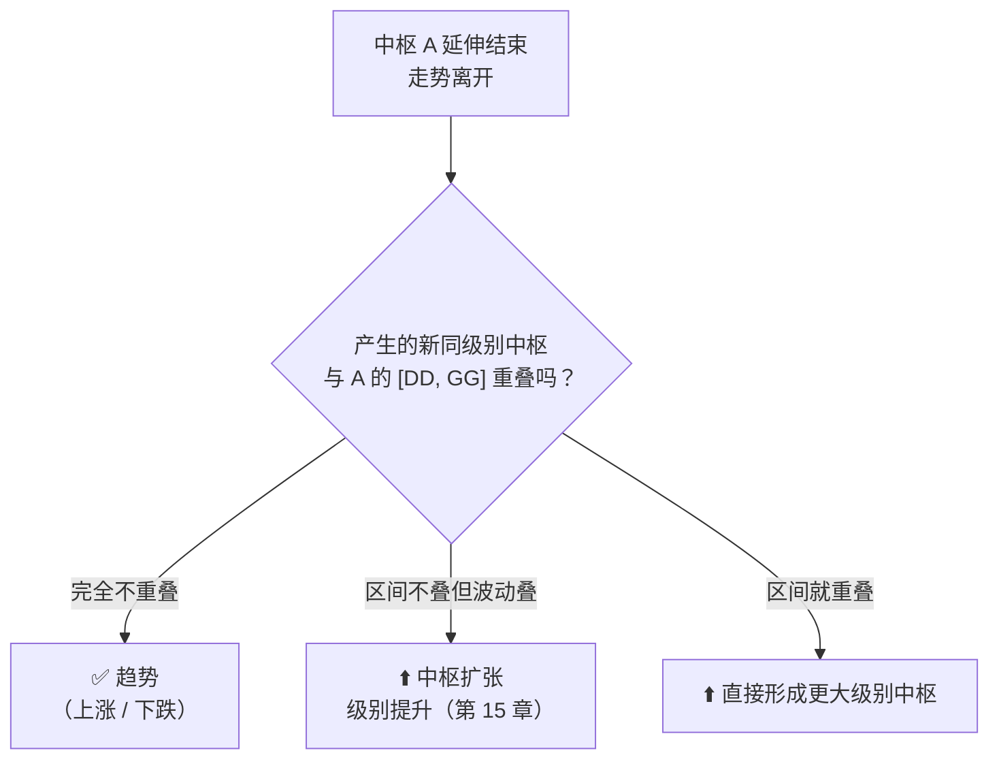

# 第 14 章 · 中枢的新生与趋势

> 中枢延伸结束之后，走势去了哪里？
> 如果产生了一个**不与它重叠**的同级别新中枢，就构成趋势。
>
> 这一章的重点是"不重叠"这个条件**有多严**——
> 实测结果可能和你的直觉相反：**趋势是少数**。

## 14.1 趋势的严格定义

〔定义〕**趋势**（第 17 课）：某完成的走势类型，
包含**两个及以上依次同向的同级别中枢**，方向向上称上涨，向下称下跌。

〔定义〕**不重叠条件**（第 18 课）：趋势中的中枢之间，
**必须绝对不存在重叠**。原著在第 20 课把这一条说得更死：
这包括**任何围绕走势中枢产生的任何瞬间波动之间的重叠**。

这句话的分量必须掂清楚。它意味着：

```text
判"趋势"用的不是  [ZD, ZG] 不重叠
而是             [DD, GG] 不重叠
```

也就是**围绕中枢的全部波动区间**都不能碰。这就是第 12 章 12.2 节
反复强调"判扩张看 `GG/DD`"的原因——判趋势用的也是这一组。

〔推论〕**"不重叠"是一个比直觉严格得多的条件。**
两个中枢的核心区间离得很开，但只要各自的波动触须碰上了，
就**不构成趋势**，而是走向扩张（第 15 章）。



## 14.2 连接两个中枢的是什么

〔推论〕**走势中枢定理一**（第 18 课）：在趋势中，
连接两个同级别中枢的**必然是次级别以下级别的走势类型**。

原著用反证法给出证明，并指出三个要点：

1. **不必然是趋势**——任何走势类型都可能，最极端的是跳空缺口后直接形成新中枢；
2. **不一定是次级别**——只要是次级别**以下**即可；
3. **连接段的级别越低，表示力度越大**——
   这正是"缺口在技术分析里有较强含义"的理论依据。

第 3 点值得停一下：它把"缺口有意义"这件事从经验观察变成了**结构推论**——
缺口是连接段级别最低的极端情形，所以力度最大。

⚠️ 但要接上第 2 章的提醒：这说的是**交易造成的**跳空。
除权跳空、停牌跳空不是交易造成的，**不带力度含义**。

## 14.3 实测：趋势有多罕见

这是本章、也是第三部分最反直觉的一个结果。

**实测设定**：7 个匿名样本 × 2835 个交易日，后复权日线，2053 笔，336 个中枢。
对每一对**相邻中枢**，按三种关系分类。
登记见[出处与资料](../../sources.md)第五节，运行日期 2026-09-12。

| 相邻中枢的关系 | 对数 | 占比 |
|---|---|---|
| 区间 `[ZD,ZG]` 不叠，但波动 `[DD,GG]` 重叠 → **扩张** | 261 | **79.3%** |
| 完全不叠（含波动）→ **趋势** | 54 | **16.4%** |
| 区间 `[ZD,ZG]` 就重叠 → 直接形成更大中枢 | 14 | 4.3% |

〔经验断言〕**按严格定义，相邻中枢里只有 16.4% 能构成趋势；
79.3% 走向扩张。**

### 这个结果意味着什么

**一、"趋势"这个词在缠论里比日常用法窄得多。**
日常说"上涨趋势"指的是价格在涨；缠论里它要求两个同级别中枢**连触须都不碰**。
实测告诉我们，后者是一个**少数事件**。

**二、大量被口头称为"趋势"的走势，按定义其实是扩张。**
而扩张意味着**级别在升高**，不是"同一级别上的推进"。
这两者的技术含义完全不同——扩张中的走势，本级别上并没有走出新的走势类型。

**三、这解释了为什么背驰的前提这么苛刻。** 第 20 章会讲：
背驰要求"必须是趋势，且两个中枢同级别"（第 37 课）。
如果趋势只占 16.4%，那么**大部分时候根本没有资格谈背驰**——
这直接限定了背驰判据的适用范围。

**四、它也解释了第三类买卖点为什么那么常见。** 第 27 章会讲：
第三类买卖点是中枢扩张或新生时在中枢之上产生的（第 21 课）。
扩张占了 79.3%，那么与扩张相关的结构自然频繁出现。

### 一个必要的限定

⚠️ 这个 16.4% 依赖于**用 `[DD, GG]` 判重叠**这个严格口径。
如果按宽松口径（只看 `[ZD, ZG]` 是否重叠），
那么"不重叠"的比例会变成 `79.3% + 16.4% = 95.7%`——
**几乎全都是趋势**。

〔推论〕**判据口径的一个字之差，能让"趋势"的占比从 16% 变成 96%。**

这是本书见过的**约定影响最大**的一处。它应当加进第 11 章的约定清单：

| # | 约定 | 常见选择 |
|---|---|---|
| 18 | 判断中枢"不重叠"用哪个区间 | `[DD, GG]`（严格，原文口径）/ `[ZD, ZG]`（宽松） |

而在实际的缠论社群讨论里，这一项**几乎从不被声明**。
两个人说"这是上涨趋势"，可能指的根本不是同一件事。

## 14.4 趋势也会延伸

〔推论〕**趋势和中枢一样，形成两个同向中枢后随时可以结束，也可以继续延伸。**

原著在第 18 课明确说过：形成两个依次同向的中枢后，
任何趋势都可以随时结束而完美，但也可以不断延伸下去，形成更多中枢。

这是本书第四次遇到"下界 ≠ 完成"（第 13 章 Q1 列了前三次）。

原著还补了一句很实际的观察（第 27 课）：
对于日线以上级别，**在第二个中枢之后就出现背驰的情况占绝大多数**；
四五个中枢以后才背驰的相当罕见。

⚠️ 这是一条〔经验断言〕，而且是作者基于自己经验给的比例，
**本书未作检验**。要检验它需要先定义背驰（第 20 章）并选定判据——
留给第六部分。

## 常见说法辨析

| 说法 | 证据强度 | 辨析 |
|---|---|---|
| "价格一直在涨，就是上涨趋势" | ❌ 明确错误 | 缠论的"趋势"要求两个同级别中枢且**波动区间都不重叠**。实测只有 16.4% 的相邻中枢对满足。日常语义和术语差得很远 |
| "判趋势看两个中枢区间有没有重叠" | ⚠️ 有争议 | 取决于口径。原文口径是**连围绕波动都不能重叠**（第 20 课），按此只有 16.4%；若只看 `[ZD,ZG]`，比例升到 95.7%。**差一个字，结论差六倍**——所以这一项必须声明（14.3 节） |
| "缠论里趋势很常见" | ❌ 明确错误 | 按严格口径实测 16.4%。多数被口头称为趋势的走势，按定义是**扩张**——而扩张意味着级别在升高，技术含义完全不同 |
| "两个中枢就构成趋势，第三个就是延伸" | ⚠️ 有争议 | 前半句对（两个是下界），后半句把"延伸"这个词用串了。趋势中继续产生同向不重叠中枢，通常称为**趋势的延伸**；而"中枢的延伸"指的是单个中枢内部的段数增加（第 13 章）。两个"延伸"不是一回事，交流时要说清 |
| "缺口说明力度大" | ⚠️ 有争议 | 在本体系内这是〔推论〕（14.2 节：连接段级别越低力度越大，缺口是极端情形）。但前提是**交易造成的**跳空——除权跳空、停牌跳空不带力度含义（第 2 章） |
| "第二个中枢之后就该背驰了" | ⚠️ 有争议 | 原著第 27 课确实说日线以上级别绝大多数在第二个中枢后背驰。但这是作者给的经验比例，**本书未检验**，且"背驰"本身要到第 20 章才定义。当作参考可以，当作判据不行 |

## 思考题

**Q1.** 用一句话说明：判"趋势"时用 `[ZD, ZG]` 和用 `[DD, GG]` 的区别，
以及实测中这个区别会让趋势占比差多少。

**Q2.**【标签】"连接两个同级别中枢的必然是次级别以下的走势类型"属于哪一类？

**Q3.** 14.3 节的实测显示趋势只占 16.4%。
请说明这个结果对**背驰判据的适用范围**意味着什么。（提示：第 20 章的前提。）

**Q4.**【判读】甲说"这是上涨趋势"，乙说"这是中枢扩张"，两人对着同一张图。
请给出**三个**可能导致分歧的具体原因，并按你认为的可能性排序。

**Q5.** 本书已经四次遇到"下界 ≠ 完成"。请说出第四次是什么，
并解释为什么"中枢的延伸"和"趋势的延伸"是两个不同的概念。

**Q6.**【查证】在你自己的实现里，把判"不重叠"的区间从 `[DD, GG]` 换成 `[ZD, ZG]`，
统计**被判为趋势的相邻中枢对**的比例变化，与本章的 16.4% / 95.7% 对照。

> 📖 **参考答案**（想清楚再看）：
> [Q1](../../qa/14-pivot-new-qa.md#q1) ·
> [Q2](../../qa/14-pivot-new-qa.md#q2) ·
> [Q3](../../qa/14-pivot-new-qa.md#q3) ·
> [Q4](../../qa/14-pivot-new-qa.md#q4) ·
> [Q5](../../qa/14-pivot-new-qa.md#q5) ·
> [Q6](../../qa/14-pivot-new-qa.md#q6)

## 本章实操

两档都**不需要开户、不需要下单**。

### 🅐 手工版：判一次趋势还是扩张

**需要**：第 12、13 章 🅐 档找到的中枢（至少两个相邻的）、
[中枢标注表](../../forms/pivot-worksheet.md)。

1. 取相邻的两个中枢，分别写出它们的 `[ZD, ZG]` 和 `[DD, GG]`。
2. **先用 `[ZD, ZG]` 判**：两个区间重叠吗？记下结论。
3. **再用 `[DD, GG]` 判**：两个波动区间重叠吗？记下结论。
4. 两次结论**一样吗**？如果不一样，按原文口径（第 3 步）为准，
   并在标注表的"中枢链"一行写清楚你用的是哪个口径。
5. 最后填"推出的走势类型"：趋势 / 扩张 / 更大中枢。

第 4 步是本章的落点——很多人从没意识到自己一直在用宽松口径。

### 🅑 代码版：复现三分类，并测口径的影响

**需要**：第 13 章实现的中枢（含延伸）。

**第一步：实现三分类**

对每一对相邻中枢，按 14.1 节的图判：

```text
if [ZD,ZG] 重叠            → 直接形成更大中枢
elif [DD,GG] 重叠          → 扩张
else                       → 趋势
```

**第二步：复现本章的分布**

统计三类的占比，和 79.3% / 16.4% / 4.3% 对照。

⚠️ 如果你的"趋势"比例远高于 16.4%，先查是不是用了 `[ZD, ZG]` 判重叠。

**第三步：测口径的影响（本章最重要的一项）**

先填[检验预登记表](../../forms/prereg-template.md)。加一个参数
`overlap_on = "GG_DD" | "ZG_ZD"`，跑两次，报告：

1. 被判为趋势的对数与占比（本书：16.4% vs 95.7%）；
2. 由此产生的**走势类型序列**有多大比例不同；
3. **级别链层数**的差异。

第 2、3 项才是关键——口径不同不只是一个统计数字变了，
而是**整个分解的结构变了**。

**第四步：登记**

把结果登记进[出处与资料](../../sources.md)第五节，
并在约定清单里补上第 18 项。

## 🔎 看盘时的用处

1. **听到"趋势"，先确认口径。** 严格口径下它只占 16.4%，宽松口径下 95.7%。
2. **默认更可能是扩张。** 实测 79.3%——这是当下最可能的状态。
3. **扩张意味着级别在升，不是同级别推进。** 两者别混着说。
4. **区分"中枢的延伸"和"趋势的延伸"。** 同一个词，两个层次。
5. **看到缺口先问是不是交易造成的。** 是，才有力度含义。

> ⚖️ 本书只讲方法与检验，不推荐任何标的、不预测行情、不构成投资建议。
> 市场有风险，任何据此产生的后果由读者自负。
