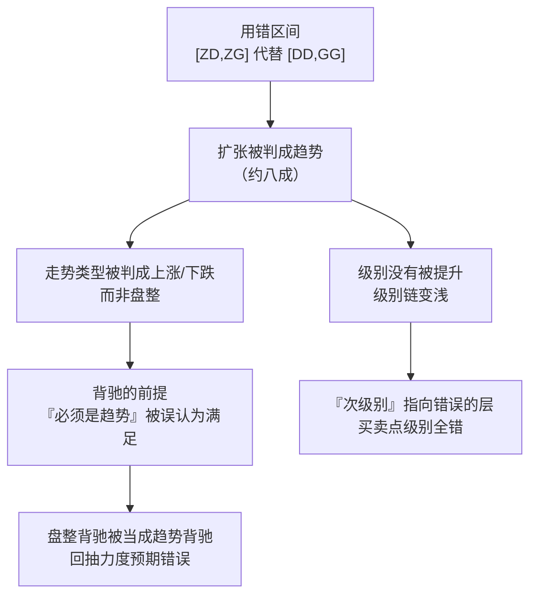

# 第 15 章 · 中枢的扩张

> 上一章测出相邻中枢里 **79.3%** 走向扩张。这一章讲扩张是什么、怎么判，
> 以及为什么它是**级别提升的唯一通道**。
>
> 如果说中枢是这套理论的核心概念，那扩张就是它的核心机制——
> 没有扩张，级别链就长不上去。

## 15.1 三条路，只有一条通向更高级别

中枢形成之后，走势只有三种去向。原著在第 20 课把它们分得很清楚：

| 去向 | 发生了什么 | 级别 |
|---|---|---|
| **延伸** | 继续围绕原中枢波动，不产生新的同级别中枢 | **不变**（第 13 章） |
| **新生** | 产生新的同级别中枢，且与原中枢完全不重叠 → 趋势 | **不变**（第 14 章） |
| **扩张** | 围绕两个同级别中枢的波动区间发生重叠 | **提升** |

〔推论〕**延伸与新生都不会提升级别；要形成更大级别的中枢，
必然走扩张这条路。**

原著把这条说成一个定理（第 20 课）：

〔推论〕**走势级别延续定理二**：更大级别的中枢产生，
**当且仅当**围绕连续两个同级别中枢产生的**波动区间产生重叠**。

注意"当且仅当"——这是一个充要条件，不是一条经验规律。

原著还给了一个很好的比喻：中枢像恒星，围绕它波动的走势像行星，
两个恒星系统要合成更大的系统，**首先必须是外围的行星之间先发生关系**。
"外围行星"对应的就是 `[DD, GG]`，不是 `[ZD, ZG]`。

## 15.2 判据

把 15.1 节写成可算的形式。设相邻两个同级别中枢为 `X`（先）、`Y`（后）：

```text
若  [X.ZD, X.ZG] 与 [Y.ZD, Y.ZG] 重叠
      →  这两个"中枢"其实属于同一个更大中枢（或划分有误）

否则若  [X.DD, X.GG] 与 [Y.DD, Y.GG] 重叠
      →  中枢扩张，级别提升

否则
      →  趋势
```

原著还给了一个等价的表述（第 20 课，走势中枢中心定理二）：

> 后 `GG` < 前 `DD`，等价于下跌及其延续；
> 后 `DD` > 前 `GG`，等价于上涨及其延续；
> 后 `ZG` < 前 `ZD` 且 后 `GG` ≥ 前 `DD`，
> 或 后 `ZD` > 前 `ZG` 且 后 `DD` ≤ 前 `GG`，
> 则等价于形成更高级别的走势中枢。

〔推论〕两种表述等价，用哪个看实现方便。
本书用前一种，因为它的分支结构更直白。

## 15.3 扩张之后，新中枢的区间是什么

这是实现时必须回答、而各家做法不一的一个问题。

扩张产生了一个更大级别的中枢，那么**它的 `[ZD, ZG]` 怎么算**？

按中枢的定义（第 12 章），更大级别中枢应当由**三个连续的次级别走势类型**
的重叠确定。而在扩张的场景里，参与的次级别对象是：

```text
X（原中枢 1）+ 连接段 + Y（原中枢 2）+ 后续 …
```

所以严格做法是：**把这些次级别对象当作新一层的"段"，
按标准公式重新算一次 `[ZD, ZG]`**。

〔推论〕**更大级别中枢的区间，不等于两个原中枢区间的并集，
也不等于它们的交集。** 它是按同一套公式在**更高一层**上重新算出来的。

⚠️ 实践中一个常见的简化是直接取 `[max(X.ZD, Y.ZD), min(X.ZG, Y.ZG)]`
或两者的包络。这两种都是简化，可以用，但：

| # | 约定 | 常见选择 |
|---|---|---|
| 19 | 扩张后更大级别中枢的区间怎么算 | 按定义在高一层重算 / 取两中枢区间的交 / 取包络 |

这是本书为约定清单补的第三项（前两项见第 13、14 章）。

## 15.4 实测：扩张是常态

第 14 章那张表在这里换个角度读：

**实测设定**：7 个匿名样本 × 2835 个交易日，后复权日线，336 个中枢，
共 329 对相邻中枢。登记见[出处与资料](../../sources.md)第五节，
运行日期 2026-09-12。

| 去向 | 对数 | 占比 |
|---|---|---|
| **扩张**（区间不叠、波动叠） | **261** | **79.3%** |
| 趋势（完全不叠） | 54 | 16.4% |
| 区间就重叠（直接更大中枢） | 14 | 4.3% |

〔经验断言〕**接近八成的相邻中枢走向扩张，即级别提升。**

### 这个结果怎么理解

初看有点奇怪：如果八成的相邻中枢都在提升级别，
那级别岂不是一路涨上天？

不是。因为**级别提升之后，计数重新开始**：

```text
本级别：中枢 X → 扩张 → 合成一个 L+1 级别的中枢
L+1 级别：这个中枢 → 与下一个 L+1 中枢比较 → 再判延伸/新生/扩张
```

每升一级，参与比较的对象就少一批。所以级别链的高度是**对数式**增长的，
而不是线性的。

〔推论〕**"八成走向扩张"与"级别链只有有限层"并不矛盾**——
前者说的是**每一层内部**相邻中枢的关系，后者说的是**层与层之间**的数量衰减。

### 它与原著一句话的呼应

原著在第 27 课有一句（据原文）：**站在最大的级别看，
所有股票其实都只有一个中枢**，所以在超大级别里绝大多数走势都是盘整。

本章的实测给了这句话一个机制上的解释：
如果每一层都有约八成走向扩张，那么不断往上合成，
最终在足够高的级别上**万物归于一个中枢**是自然的结果。

## 15.5 扩张为什么容易被误判成趋势

这是本章最实用的一节。

第 14 章说过，如果用 `[ZD, ZG]` 而不是 `[DD, GG]` 去判重叠，
**79.3% 的扩张会被误判为趋势**。

误判的后果是级联的，而且方向很一致：



〔推论〕**用错区间的危害不是"偏差"，而是系统性地把盘整读成趋势。**

而这个错误**不会报错**——它输出的结构完全自洽，只是错的。
这正是第 11 章说的："几何层的错误不会报错，它会安静地输出一个看起来正常的结果。"

**怎么自查**：算一下你的实现里趋势的占比。
如果远高于 16.4%（比如接近 95%），几乎可以断定用错了区间。

## 常见说法辨析

| 说法 | 证据强度 | 辨析 |
|---|---|---|
| "扩张就是中枢变宽了" | ❌ 明确错误 | 扩张指的是**两个同级别中枢**的波动区间重叠，从而合成一个**更高级别**的中枢。不是单个中枢的区间变宽——单个中枢的 `[ZD, ZG]` 定了就不变（第 12、13 章） |
| "级别提升有很多种方式" | ❌ 明确错误 | 原著第 20 课的定理二是**当且仅当**：更大级别中枢产生，当且仅当围绕连续两个同级别中枢的波动区间重叠。延伸和新生都不提升级别 |
| "扩张后的大中枢区间就是两个小中枢的并集" | ⚠️ 有争议 | 这是一种**简化**。按定义应当在高一层上重新算 `[ZD, ZG]`（15.3 节）。简化可以用，但属于必须声明的约定（第 19 项） |
| "八成都在扩张，那级别不就无限升上去了" | ❌ 明确错误 | 每升一级，参与比较的对象数量就衰减一批，所以级别链的高度是对数式增长（15.4 节）。两件事不矛盾 |
| "我的实现里趋势很多，说明市场趋势性强" | ❌ 明确错误 | 更可能是**用错了判重叠的区间**。严格口径实测趋势只占 16.4%；若你测出接近 95%，那是宽松口径的特征值（15.5 节） |
| "扩张比趋势弱" | ⚠️ 缺乏证据 | "强弱"在这里没有定义。能说的是：扩张意味着级别提升、本级别走势类型尚未完成；趋势意味着本级别在同一层上推进。这是**结构差异**，不是强弱差异 |

## 思考题

**Q1.** 为什么说扩张是级别提升的唯一通道？请说明延伸和新生为什么都不提升级别。

**Q2.**【标签】"更大级别中枢产生，当且仅当围绕两个同级别中枢的波动区间重叠"
属于哪一类命题？

**Q3.** 如果八成的相邻中枢都走向扩张，为什么级别链不会无限升高？

**Q4.**【判读】某人的实现统计出"趋势占 94%"。
请给出你的第一判断，以及验证它的具体方法。

**Q5.** 15.3 节说更大级别中枢的区间"不等于两个原中枢区间的并集，也不等于交集"。
请说明按定义应该怎么算，以及为什么简化做法需要声明。

**Q6.**【查证】在你的实现里，把扩张后大中枢区间的算法在三种做法之间切换
（按定义重算 / 取交 / 取包络），统计级别链层数与中枢总数的差异。

> 📖 **参考答案**（想清楚再看）：
> [Q1](../../qa/15-pivot-expand-qa.md#q1) ·
> [Q2](../../qa/15-pivot-expand-qa.md#q2) ·
> [Q3](../../qa/15-pivot-expand-qa.md#q3) ·
> [Q4](../../qa/15-pivot-expand-qa.md#q4) ·
> [Q5](../../qa/15-pivot-expand-qa.md#q5) ·
> [Q6](../../qa/15-pivot-expand-qa.md#q6)

## 本章实操

两档都**不需要开户、不需要下单**。

### 🅐 手工版：判一次扩张并画出大中枢

**需要**：第 14 章 🅐 档判过的那对相邻中枢。

1. 确认它们的关系是**扩张**（区间不叠、波动叠）。如果不是，另找一对。
2. 把两个中枢覆盖的**全部笔**按顺序列出来。
3. 现在把这些笔**按三笔一组**打包（这是在往上升一层），
   每组算出一个"高一层的段"的高低点。
4. 在这些高一层的段上，按第 12 章的公式算 `[ZD, ZG]`——
   这就是扩张后大中枢的区间（按定义的算法）。
5. 对照：这个区间和"两个小中枢区间的交集"一样吗？和"包络"一样吗？
   把三者都写下来。

第 5 步能让你亲眼看到 15.3 节说的"三种做法不等价"。

### 🅑 代码版：实现扩张与级别提升

**需要**：第 13、14 章实现的中枢与三分类。

**第一步：实现向上合成**

```text
1. 在 L 级别上得到中枢序列
2. 逐对判断：延伸 / 新生 / 扩张
3. 遇到扩张 → 把参与的次级别对象打包，在 L+1 级别上重新构造中枢
4. 递归，直到 L+1 级别上不足三段
```

**第二步：自检断言**

| 断言 | 依据 |
|---|---|
| 每升一级，中枢数量严格减少 | 15.4 节 |
| 级别链层数有限（不死循环） | 定义 |
| 高一级中枢的时间跨度 ≥ 它包含的低级中枢 | 构造 |
| 各级别上 `DD ≤ ZD ≤ ZG ≤ GG` 均成立 | 第 12 章 |

**第三步：复现本章分布**

统计三分类占比，对照 79.3% / 16.4% / 4.3%。
**若趋势占比远高于 16.4%，先查判重叠用的区间**（15.5 节）。

**第四步：测第 19 项约定**

先填[检验预登记表](../../forms/prereg-template.md)。
把 15.3 节三种区间算法各跑一遍，报告：

1. 级别链层数；
2. 各级别的中枢总数；
3. 最高级别中枢的区间差异。

登记进[出处与资料](../../sources.md)第五节，并补上约定清单第 19 项。

## 🔎 看盘时的用处

1. **级别只能靠扩张升。** 延伸和新生都不升级——这是判断"级别有没有变"的唯一钥匙。
2. **默认是扩张。** 实测 79.3%，这是相邻中枢最可能的关系。
3. **趋势占比是个体检指标。** 远高于 16.4% 就去查判重叠的区间。
4. **扩张后的大中枢区间要按定义重算。** 图省事取交或取包络可以，但要说。
5. **"外围先接触"这个比喻很好用。** 判扩张看触须（`GG/DD`），不看核心（`ZG/ZD`）。

> ⚖️ 本书只讲方法与检验，不推荐任何标的、不预测行情、不构成投资建议。
> 市场有风险，任何据此产生的后果由读者自负。
