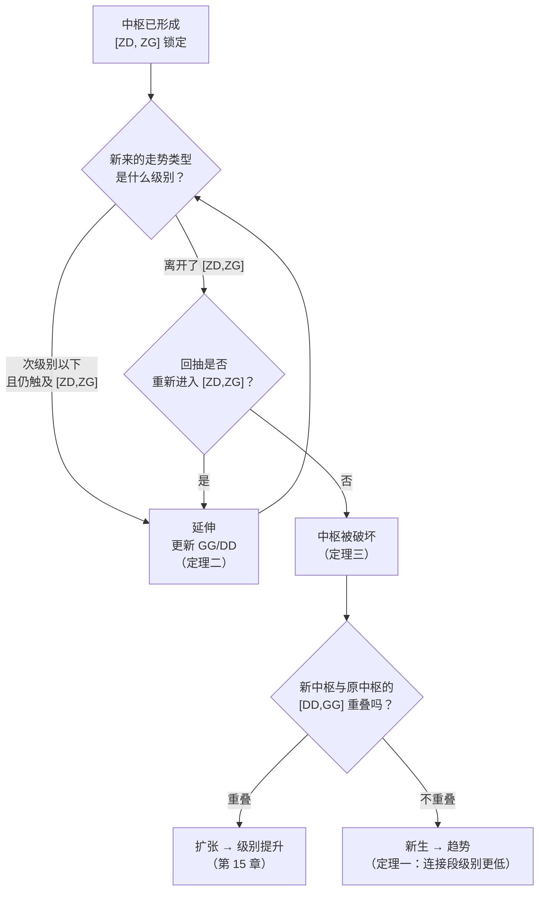

# 第 16 章 · 中枢三定理

> 前四章分别讲了中枢的生（第 12 章）、住（第 13 章）、长（第 15 章）、
> 传（第 14 章）。这一章补上最后一块：**坏**——中枢怎么被破坏，
> 并把三条定理汇总成一张可查的表。

## 16.1 三条定理

原著在第 18 课给出了三条关于中枢的定理。本书按"生住坏"的顺序排列：

### 定理一（生·连接）

〔推论〕**在趋势中，连接两个同级别中枢的必然是次级别以下级别的走势类型。**

这一条第 14 章 14.2 节讲过，这里只补一句它的用途：
它给了"缺口力度大"一个结构性的解释——
连接段的级别越低，力度越大，而缺口是级别最低的极端情形。

### 定理二（住·维持）

〔推论〕**在盘整中，无论是离开还是返回中枢的走势类型，必然都是次级别以下的。**

这一条第 13 章 13.2 节讲过。它是**延伸的充要条件**：
一旦出现同级别的走势类型离开，延伸就结束了。

原著给的证明很简洁：无论离开还是返回，只要是同级别走势类型，
就意味着形成了新的同级别中枢，这与"原中枢在维持"的前提矛盾。

### 定理三（坏·破坏）

〔推论〕**某级别中枢的破坏，当且仅当：
一个次级别走势离开该中枢后，其后的次级别回抽走势不重新回到该中枢内。**

这是本章的新内容。注意三个要点：

1. **"当且仅当"**——充要条件，可以双向使用；
2. **判据用的是 `[ZD, ZG]`**，不是 `[DD, GG]`（第 12 章 12.2 节的分工）；
3. **需要两步**：先离开，再回抽不回来。**只离开不算破坏。**

第 3 点最容易被忽略。价格冲出中枢区间不等于中枢被破坏——
按定义，必须等到**回抽走完且没有回到区间内**，破坏才成立。

## 16.2 破坏的三种组合

原著在第 18 课把定理三里"离开 + 回抽"这两个次级别走势的组合列了出来，
一共三种：

| 组合 | 含义 |
|---|---|
| **趋势 + 盘整** | 离开是趋势，回抽是盘整 |
| **趋势 + 反趋势** | 离开是趋势，回抽是反方向趋势 |
| **盘整 + 反趋势** | 离开是盘整，回抽是反方向趋势 |

其中的"趋势"分上涨与下跌，分别对应从上方突破与从下方跌破。

〔经验断言〕原著指出：**站在实用的角度，最有力的破坏是"趋势 + 盘整"**。
例如在上涨中，一个次级别走势向上突破后，
以一个盘整走势进行整理回抽，那么其后的上涨往往比较有力，
特别是当这种突破发生在底部区间时。

⚠️ 这条要标成〔经验断言〕——"往往比较有力"是一个关于市场的断言，
从定义推不出来。本书未检验它；要检验需要先定义"有力"
（涨幅？持续时间？后续中枢的级别？），属于第六部分的工作。

## 16.3 三定理的用途：一张判定表

把三条定理合起来，就得到了中枢全生命周期的判定流程：



〔推论〕**这张流程图覆盖了中枢的全部去向，没有第四种可能。**

理由：新来的走势类型要么是次级别以下、要么是同级别（更高级别的走势类型
必然包含同级别的，归入同级别处理）；前者只能延伸，后者必然离开中枢，
离开之后回抽要么回来（仍是延伸）要么不回来（破坏）。破坏之后要么重叠要么不重叠。
穷尽了。

**这是一个很好的自检**：如果你的实现里出现了"不知道该归到哪一类"的情形，
那一定是某一步的判据写错了，而不是"遇到了特殊情况"。

## 16.4 破坏的"当下性"

〔推论〕**定理三的判据需要等待回抽走完，所以"中枢被破坏"这个判定天然滞后。**

把它和第二部分的结论串起来，就得到了一条完整的滞后链：

| 层 | 确认需要等什么 |
|---|---|
| 分型 | 第三根 K 线（第 7 章） |
| 笔 | 终点分型 + 间隔条件（第 8 章） |
| 线段 | 特征序列分型；第二种情况还要等反向确认（第 10 章） |
| 中枢形成 | 前三段全部走完（第 12 章） |
| **中枢破坏** | **离开段 + 回抽段全部走完** |

〔推论〕**所以在任何一个"当下"，你能确定的都是过去的结构，
而不是正在发生的结构。**

这一点原著在第 32 课讲"走势的当下与思维方式"时反复强调过
（第 30 章会展开）。这里先记住一个操作性的结论：

> **凡是听到"中枢已经被破坏了"，先问一句"回抽走完了吗？"**

如果回抽还在进行中，那么按定理三，**破坏尚未成立**——
价格完全可能回到区间内，延伸继续。

## 16.5 盘整的高低点是怎么来的

第 13 章 13.5 节讲过这个问题，这里把它挂到定理二上，逻辑会更清楚。

定理二说：延伸中，离开与返回都是次级别以下的走势类型。
把这些走势一路降到最低级别看，连接处只有两种可能（第 18 课）：

1. 三根以上最低级别 K 线来回重叠震荡后回头——
   这几根中最极端那根的极端位置构成高低点（较少见）；
2. 最低级别上不足三根重叠的 V 型走势——
   V 型尖顶那根的极端位置构成高低点（**十分常见**）。

〔推论〕**这解释了为什么真正的高低点总是盘中一闪而过。**

原著把这件事当作理论解释力的一个例证。本书同意这个论证成立，
但要补两条限定（第 13 章 Q5 已经讲过一条）：

- 它解释的是**形态成因**，不能推出"可以在尖顶成交"——
  恰恰相反，一闪而过意味着那个价位几乎没有成交；
- 它依赖"最低级别"的选取（第 9 章那处接缝）。
  用日线做最低级别和用逐笔做最低级别，"V 型尖顶"指的不是同一个东西。

## 常见说法辨析

| 说法 | 证据强度 | 辨析 |
|---|---|---|
| "价格跌破中枢下沿，中枢就被破坏了" | ❌ 明确错误 | 定理三要求**两步**：离开 + 回抽不回来。只离开不算破坏，回抽完全可能回到区间内（那仍是延伸） |
| "判破坏看 `GG/DD`" | ❌ 明确错误 | 破坏看 `[ZD, ZG]`，扩张才看 `GG/DD`（第 12 章 12.2 节）。用错会让中枢极难被判为破坏 |
| "突破加盘整回抽后必然大涨" | ⚠️ 有争议 | 原著说的是"往往比较有力"，是〔经验断言〕不是定理，而且带条件（特别是底部区间）。本书**未检验**它。把"往往"读成"必然"是典型的误读 |
| "中枢破坏了就该走了" | ⚠️ 有争议 | 破坏只说明中枢这个对象结束了，接下来是扩张还是趋势要看下一步（16.3 节的流程图）。而且这里已经进入操作层面，超出了分类工具能给的信息（第 1 章 Q5 讲过这个越界） |
| "定理三很简单，就是跌破不回来" | ⚠️ 有争议 | 表述简单，但"离开"和"回抽"都必须是**走势类型**（有级别的对象），不是随便一段波动。判定它们本身要用到整个第二部分 |
| "中枢的去向有很多种情况" | ❌ 明确错误 | 只有三种：延伸、破坏后扩张、破坏后新生（16.3 节的流程图穷尽了）。遇到"归不了类"的情形，是判据写错了 |

## 思考题

**Q1.** 定理三说破坏"当且仅当"离开后回抽不回中枢。
请说明"当且仅当"在这里可以怎样**双向**使用。

**Q2.** 为什么"只离开不算破坏"？请从定理二的角度解释。

**Q3.**【标签】"突破后以盘整回抽，其后的上涨往往比较有力"属于哪一类？
如果要检验它，你需要先定义什么？

**Q4.**【判读】某人说："刚跌破中枢，中枢破了，走势类型结束。"
请指出他至少跳过了哪两步。

**Q5.** 16.4 节列出了一条从分型到中枢破坏的滞后链。
请说明这条链对"实时使用缠论"意味着什么。

**Q6.**【查证】在你的实现里，把定理三的判据从"离开 + 回抽不回来"
简化成"只要离开就算破坏"，统计中枢数量、平均构成段数、
以及三分类占比的变化。

> 📖 **参考答案**（想清楚再看）：
> [Q1](../../qa/16-pivot-theorems-qa.md#q1) ·
> [Q2](../../qa/16-pivot-theorems-qa.md#q2) ·
> [Q3](../../qa/16-pivot-theorems-qa.md#q3) ·
> [Q4](../../qa/16-pivot-theorems-qa.md#q4) ·
> [Q5](../../qa/16-pivot-theorems-qa.md#q5) ·
> [Q6](../../qa/16-pivot-theorems-qa.md#q6)

## 本章实操

两档都**不需要开户、不需要下单**。

### 🅐 手工版：走一遍判定流程图

**需要**：第 13 章 🅐 档跟踪过的那个中枢、
[中枢标注表](../../forms/pivot-worksheet.md)。

1. 把 16.3 节的流程图抄在纸上。
2. 从你那个中枢形成之后的第一段开始，**逐段走流程图**，
   每一步记下走了哪个分支。
3. 走到"破坏"时，**特别确认两件事**：
   - 离开的那一段走完了吗？
   - 回抽的那一段走完了吗？**没走完就不能判破坏。**
4. 破坏之后，按 `[DD, GG]` 判扩张还是新生，填进标注表的"状态"列。
5. 回看全过程：有没有出现"不知道该走哪个分支"的时刻？
   如果有，那是你某一段的级别判错了——回去重判。

### 🅑 代码版：实现三定理并做穷尽性检查

**需要**：第 15 章实现的中枢与三分类。

**第一步：把定理三实现对**

⚠️ 最常见的错法是只判"离开"。正确的实现需要一个状态机：

```text
状态：延伸中 → 已离开（等待回抽）→ 已破坏 / 回到延伸中
```

**第二步：穷尽性断言（本章最重要的自检）**

按 16.3 节，中枢的每一段后续都必须能归入某个分支。加一条断言：

| 断言 | 含义 |
|---|---|
| 每个中枢的结局必属于 {延伸中, 破坏→扩张, 破坏→新生} | 16.3 节的穷尽性 |
| 不存在"未分类"的中枢 | 同上 |

如果出现未分类的，**去查级别判定**，不要加 `else` 分支糊弄过去。

**第三步：测判据简化的影响**

先填[检验预登记表](../../forms/prereg-template.md)。
加一个参数 `break_rule = "leave_and_fail_return" | "leave_only"`，
跑两次，报告：

1. 中枢总数；
2. 平均构成段数（简化后中枢会变短变多）；
3. 三分类占比的变化；
4. **级别链层数**的变化。

**第四步：滞后统计**

统计每个中枢从"前三段走完"到"破坏确认"之间隔了多少根合并 K 线——
这是 16.4 节那条滞后链在中枢这一层的具体数值。
登记进[出处与资料](../../sources.md)第五节。

## 🔎 看盘时的用处

1. **听到"中枢破了"，问回抽走完没有。** 这是定理三的两步判据。
2. **破坏看 `[ZD, ZG]`，扩张看 `GG/DD`。** 第三次强调，因为它错得最多。
3. **中枢只有三种去向。** 归不了类就是判据错了，不是市场特殊。
4. **任何"当下"的判定都是滞后的。** 从分型到中枢破坏，每一层都要等。
5. **"突破 + 盘整回抽"是经验断言。** 可以留意，但别当定理用。

> ⚖️ 本书只讲方法与检验，不推荐任何标的、不预测行情、不构成投资建议。
> 市场有风险，任何据此产生的后果由读者自负。
