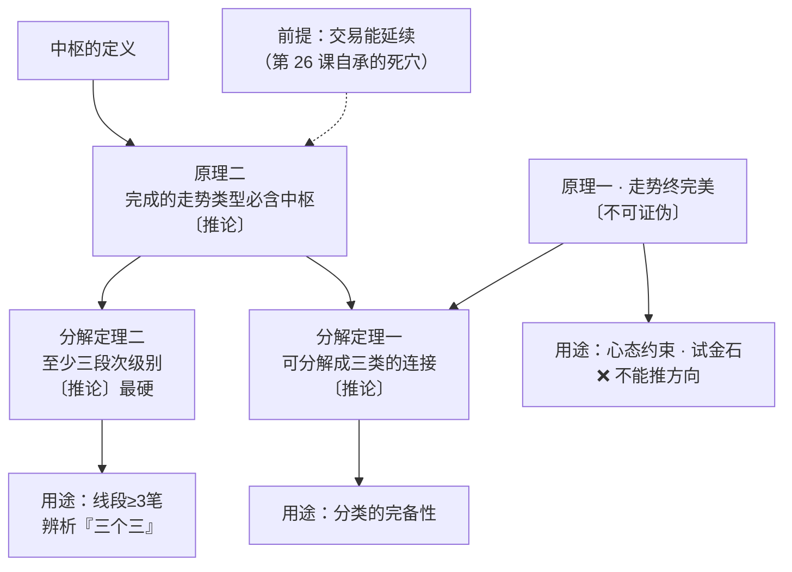

# 第 18 章 · 走势终完美

> 缠论里被引用最多、也被误用最多的一句话。
> 第 1 章 1.6 节已经把结论给过了——它是〔不可证伪〕的。
> 这一章补上完整的推导：把两条原理、两条定理逐条过一遍，
> 说清楚哪些是真定理、哪些不是，以及那句话到底有什么用。

## 18.1 四条命题，四种性质

原著在第 17 课一口气给了四条。本书逐条标注：

| # | 命题 | 标签 |
|---|---|---|
| 原理一 | 任何级别的任何走势类型**终要完成**（"走势终完美"） | 〔不可证伪〕 |
| 原理二 | 任何级别任何**完成的**走势类型，必然包含一个以上中枢 | 〔推论〕 |
| 分解定理一 | 任何级别的任何走势，都可以分解成同级别盘整、上涨、下跌的连接 | 〔推论〕 |
| 分解定理二 | 任何级别的任何走势类型，至少由三段以上次级别走势类型构成 | 〔推论〕 |

四条里只有一条不是推论。下面逐条看。

## 18.2 原理二：可以证明

〔推论〕**任何完成的走势类型，必然包含至少一个中枢。**

**原著的证明**（反证法，转述）：

假设某段走势一个中枢都没有。那么图上任意"向上 + 向下 + 向上"
或"向下 + 向上 + 向下"的组合都不会产生重叠——
而这样的组合必然产生某一级别的中枢。
所以不含中枢的走势图只有两种可能：**一次向下后永远向上**，
或**一次向上后永远向下**。
要出现这两种情况，该交易品种必然在某个时刻之后**永远停止交易**。
与"走势可以延续下去"的前提矛盾。∎

**这个证明成立，但它明确依赖一个前提**：

> **交易能够延续。**

原著自己在第 26 课承认这是理论的死穴——
突然停止交易、退市、甚至交易被判作废，理论就不适用了。

〔推论〕**所以原理二的准确表述是：**
**在"交易延续"的前提下**，任何完成的走势类型必然包含至少一个中枢。

第 36 章会把这个前提放到 A 股的现实规则里逐条检查。

**它的实用价值**：这是第 11 章那张自检表里的一条——
如果你的实现判定某段走势"已完成"却数不出中枢，那是实现的 bug。

## 18.3 分解定理一、二

**定理一**（任何走势可分解成同级别三类走势类型的连接）：

从原理一 + 原理二可以推出。原理一保证每一段走势类型终将完成，
完成后必然含有中枢（原理二），于是可以按中枢个数归类为三类之一。
一段接一段，整个走势就被分解成了三类的连接。

⚠️ 注意这条定理**用到了原理一**——而原理一是不可证伪的。
所以定理一的地位比定理二弱一些：它的"必然性"部分来自一个事后永真的前提。
本书仍标它为〔推论〕，但要知道这个依赖关系。

**定理二**（任何走势类型至少由三段以上次级别走势类型构成）：

这一条不依赖原理一，推导更干净：
任何走势类型至少含一个中枢（原理二），
而中枢按定义由三段连续次级别走势类型的重叠构成——
那三段本身就是次级别走势类型。所以至少三段。∎

〔推论〕**定理二是四条里最硬的一条**：它只依赖原理二和中枢的定义。
它也是最实用的一条——第 9 章用它说明"三笔是线段的下界"，
第 17 章用它辨析"三个三"。

## 18.4 原理一：为什么不可证伪

现在回到那句话。

**问：什么样的观测会推翻"任何级别的任何走势类型终要完成"？**

要推翻它，需要观测到一个**永远不完成**的走势类型。
但在任何一个有限的当下，一个还没完成的走势类型，
都可以被解释成"**还在延伸中**"——
而原著第 18 课**明确允许**延伸"直到无穷都是可以的"。

于是不存在任何有限长度的观测能证伪它。

〔不可证伪〕**原理一在任何有限观测下都为真，因而不给出任何事前约束。**

### 本书的实测给了这句话一个量化的注脚

第 13 章测出：**76.5% 的中枢会延伸到三段以上**。
第 17 章测出：**盘整占 84.0%**。

两个数合起来说明：**在任何一个当下，"还没完"是最可能的答案**。

这恰恰是原理一无法被证伪的现实基础——
"还在延伸"这个解释，在数据上有压倒性的先验支持。

### 它是不是同义反复

严格讲，它**不是**纯粹的同义反复（那要求它在逻辑上必然为真），
而是**在给定的观测能力下不可证伪**。区别在于：

- 同义反复：`A 或 非A`——不需要任何前提就为真；
- 原理一：它断言了一件关于未来的事，只是**没有任何观测能反驳它**。

这个区别对实践没影响（两者都不能用来推结论），但对理解有影响：
原理一**不是废话**，它表达了一个真实的世界观——
**任何结构最终都会走完**。只是这个世界观无法被检验。

## 18.5 那它有什么用

不可证伪不等于无用。原理一有三个正当用途，**没有一个是预测**：

**一、分类完备性的宣告。**
它保证不存在"第四种走势"——任何图形最终都会落进盘整 / 上涨 / 下跌里。
这是整个分类体系能闭合的前提（第 1 章 1.1 节说的"穷尽"）。

**二、心态约束。**
它提醒你：当下看到的永远是**未完成**的一段。
所以任何"已经确定"的判断都自带未完成的风险。
这和第 16 章那条滞后链是同一件事的两面——
正因为结构必然滞后、正因为当下总是未完成，所以才要放弃预测。

**三、试金石。**
听到有人用它推出方向性结论（"走势终完美，所以会涨回来"），
立刻知道对方把不可证伪的句子当推论用了。

### 最常见的误用

> **"走势终完美，所以跌下去一定会涨回来。"**

错在把"走势**类型**会完成"偷换成了"**价格**会回到某个位置"。

走势类型的完成**完全可以是向下完成**——
一个下跌走势类型走完了，接下来可以是盘整，也可以是更大级别的下跌
（第 16 章 16.3 节的流程图）。"完成"说的是结构，不是方向，更不是价位。

〔推论〕**从原理一推不出任何关于方向或价位的结论。**

## 18.6 四条命题的依赖关系

把本章汇总成一张图：

〔推论〕**整个顶层里，真正能用来下判断的是原理二和定理二，
它们都只依赖中枢的定义（加上"交易延续"这个前提）。**

## 常见说法辨析

| 说法 | 证据强度 | 辨析 |
|---|---|---|
| "走势终完美，所以跌下去会涨回来" | ❌ 明确错误 | 把"走势类型完成"偷换成"价格回到某位置"。完成完全可以是向下完成。这是本书从第 1 章讲到这里的同一个误用 |
| "走势终完美是缠论的第一原理，最重要" | ⚠️ 有争议 | 它是**第一条**，但**不是最能用的一条**。真正能下判断的是原理二和定理二。原理一的价值在完备性宣告与心态约束，不在推理 |
| "原理二是经验总结" | ❌ 明确错误 | 它有完整的反证法证明（18.2 节），是〔推论〕。⚠️ 但它依赖"交易能延续"这个前提，停牌退市会使前提失效 |
| "既然不可证伪，这套理论就不科学" | ⚠️ 有争议 | 一个体系里有不可证伪的**世界观陈述**，不影响其中可证伪部分的地位。问题从来不是"存在这样的句子"，而是**有人拿它当推论用**。本书的做法是标出来、不当依据 |
| "分解定理一和定理二差不多" | ❌ 明确错误 | 定理二只依赖原理二和中枢定义，是四条里最硬的；定理一还依赖原理一（不可证伪），所以必然性更弱。引用时要知道自己站在哪块地上 |
| "走势终完美可以用来判断底部" | ❌ 明确错误 | 它不给任何事前约束（18.4 节）。判底部要用背驰（第四部分）与买卖点（第五部分），而那些是可检验的〔经验断言〕，性质完全不同 |

## 思考题

**Q1.** 原理二的证明依赖一个前提。请说出这个前提，
并举一个 A 股中会使它失效的具体情形。

**Q2.**【标签】分解定理一和定理二都标〔推论〕，但本章说定理二"更硬"。
请说明为什么。

**Q3.** 为什么"走势终完美"无法被有限观测证伪？
请结合第 13、17 章的实测数据说明它的现实基础。

**Q4.** 18.4 节说原理一"不是纯粹的同义反复"。请说明区别在哪，
以及这个区别对实践有没有影响。

**Q5.**【判读】某人说："这段跌得太多了，按走势终完美，
下跌走势类型该结束了。"请指出这句话里有几处问题。

**Q6.**【查证】用第 11 章的自检断言检查你的实现：
是否存在"被判为完成的走势类型，却数不出中枢"的样本？
如果有，按第 3 章 Q3 的纪律，你该改什么？

> 📖 **参考答案**（想清楚再看）：
> [Q1](../../qa/18-perfection-qa.md#q1) ·
> [Q2](../../qa/18-perfection-qa.md#q2) ·
> [Q3](../../qa/18-perfection-qa.md#q3) ·
> [Q4](../../qa/18-perfection-qa.md#q4) ·
> [Q5](../../qa/18-perfection-qa.md#q5) ·
> [Q6](../../qa/18-perfection-qa.md#q6)

## 本章实操

两档都**不需要开户、不需要下单**。

### 🅐 手工版：给听到的话打标签

**需要**：任意缠论社群、教程或视频的文字内容（自己的笔记也行）。

1. 收集 **10 句**包含"走势终完美"或"必然完成""终将完美"这类表述的句子。
2. 对每一句，做两件事：
   - 判断它是在**陈述完备性**（"任何走势都会走完"）
     还是在**推方向**（"所以会涨回来"）；
   - 如果是后者，写出它偷换了哪两个概念。
3. 统计：10 句里有几句是误用？
4. 再找 **3 句**用到原理二或定理二的表述，
   判断使用者有没有意识到"交易延续"这个前提。

这个实操训练的是第 1 章 1.7 节那个打标签的流程。
做完你会发现：**误用的比例相当高**，而且几乎都是同一种误用。

### 🅑 代码版：验证原理二与定理二

**需要**：第 17 章实现的完整递归。

**第一步：验证原理二**

遍历所有被判定为"完成"的走势类型，检查每一个是否至少含一个中枢。

| 期望 | 反例意味着 |
|---|---|
| 违例数 = 0 | 出现违例 → **实现有 bug**（这是〔推论〕） |

**排查方向**：走势类型的完成判定是否写松了；
中枢识别是否漏了；级别是否混用。

**第二步：验证定理二**

遍历所有走势类型，检查每一个是否至少由三段次级别走势类型构成。

同样，违例数应为 0；有违例查实现。

**第三步：量化"还没完"的先验**

先填[检验预登记表](../../forms/prereg-template.md)。统计：

1. 中枢延伸到三段以上的比例（对照第 13 章的 76.5%）；
2. 走势类型中盘整的占比（对照第 17 章的 84.0%）；
3. **把两者结合**：在随机选取的一个时点上，
   "当前结构尚未完成"的概率大约是多少？

第 3 项就是 18.4 节说的"原理一无法被证伪的现实基础"——
把它算出来，那句话就从一个哲学论断变成了一个可感的数字。

**第四步：登记**

结果登记进[出处与资料](../../sources.md)第五节。

## 🔎 看盘时的用处

1. **听到"走势终完美"后面跟着方向，立刻停。** 那是误用。
2. **默认"还没完"。** 实测：76.5% 的中枢会延伸，84% 的走势类型是盘整。
3. **要下判断就用原理二和定理二。** 它们才是能推东西的那两条。
4. **记住原理二的前提。** 停牌、退市会让它失效——第 36 章会展开。
5. **"完成"说的是结构，不是方向，更不是价位。** 这三样别混。

> ⚖️ 本书只讲方法与检验，不推荐任何标的、不预测行情、不构成投资建议。
> 市场有风险，任何据此产生的后果由读者自负。
