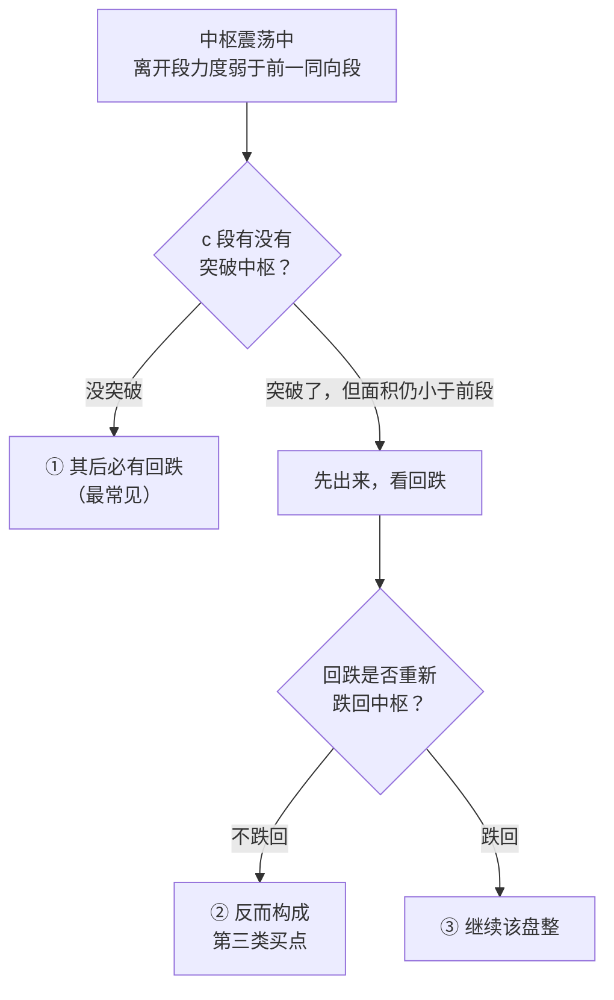

# 第 21 章 · 盘整背驰

> 第 20 章测出趋势背驰在日线上只有 8 个实例。
> 而盘整背驰的候选有 **332 个**——**这才是日常真正遇到的那一种**。
>
> 这一章讲它和趋势背驰的区别，以及原著为什么用它去找大级别底部。

## 21.1 定义

〔定义〕**盘整背驰**（第 24 课）：在围绕**单个中枢**的震荡中，
离开中枢的那一段，其力度弱于此前的同向段。

与趋势背驰的结构对照：

| | 趋势背驰 | 盘整背驰 |
|---|---|---|
| 结构 | `a+A+b+B+c`，**两个**同级别中枢 | 单个中枢 `A` 及围绕它的波动 |
| 比较的两段 | `a` 与 `c` | 中枢内首个同向段 与 离开段 |
| 前提 | 必须是趋势（第 20 章三条） | 只需是盘整 |
| 实测候选数 | 54 | **332** |

〔推论〕**盘整背驰的适用范围比趋势背驰宽得多**，
因为盘整占走势类型的 **84.0%**（第 17 章），而趋势只占 16.4%。

## 21.2 三种去向

原著（第 24 课，转述）把盘整背驰的处理分成几种情况。以向上的情形为例：



〔推论〕**盘整背驰之后不必然下跌**——情形 ② 恰恰是买点。
这是盘整背驰与趋势背驰最重要的区别之一。

原著对此有明确表述（第 27 课，转述）：多数的第二、三类买点
其实都由盘整背驰构成，而第一类买点多数由趋势背驰构成。

〔推论〕**所以"背驰"这个词在两种语境下指向完全不同的操作含义**：

| | 趋势背驰 | 盘整背驰 |
|---|---|---|
| 通常导向 | 第一类买卖点 | 第二、三类买卖点 |
| 回抽力度 | **至少回到 `B` 的中枢里**（第 24 课） | 不确定，可能直接转成第三类买卖点 |

⚠️ 混用这两个概念，会让你对"背驰之后该期待什么"产生系统性的错误预期。

## 21.3 实测

**实测设定**：7 个匿名样本 × 2835 个交易日，后复权日线，336 个中枢。
对每个中枢，取其**离开段**与中枢内**首个同向段**比较 MACD 面积
（参数 12/26/9）。登记见[出处与资料](../../sources.md)第五节，
运行日期 2026-09-12。

| 指标 | 数值 |
|---|---|
| 盘整背驰**候选**（可完整判定的中枢） | **332** |
| 判为盘整背驰 | **41** |
| 占比 | **12%** |

〔经验断言〕**在这批样本上，约 12% 的中枢在离开时表现出力度衰减。**

对照趋势背驰：候选 27、判出 8（约 30%）。

两组数字放在一起看：

| | 候选数 | 判出数 | 判出率 |
|---|---|---|---|
| 趋势背驰 | 27 | 8 | 30% |
| **盘整背驰** | **332** | **41** | 12% |

〔推论〕**盘整背驰的样本量是趋势背驰的 5 倍**（41 对 8）。

这意味着：**如果要对背驰做任何统计检验，应该从盘整背驰入手**——
它是唯一样本量勉强够看的那一个。

⚠️ 但 41 仍然很小。要做有统计意义的检验，还是得降级别换样本量
（第 20 章 20.2 节）。

## 21.4 为什么原著用它找大级别底部

原著在第 27 课专门讲了这个用法（转述）：
盘整背驰最有用的地方，是用在**大级别**上，特别是周线级别以上——
这种盘整背驰所发现的，往往就是历史性的大底部。

〔推论〕**这个用法的合理性，可以从第三部分的实测直接解释。**

原著自己给了理由（第 27 课，转述）：在超大级别里，
往往不会出现明显的趋势；站在最大的级别看，绝大多数标的其实就是一个盘整。
既然如此，**趋势背驰在大级别上根本没有机会出现**，
能用的只有盘整背驰。

本书第三部分的两个实测给了这句话量化的支撑：

| 实测 | 数值 | 出处 |
|---|---|---|
| 相邻中枢完全不重叠（可构成趋势） | 16.4% | 第 14 章 |
| 走势类型中盘整的占比 | 84.0% | 第 17 章 |
| 级别链每层衰减到约 1/4，共 3~4 层 | —— | 第 17 章 |

在高层级上中枢数只有个位数（第 17 章实测：49 → 11 → 2），
根本凑不出"两个同级别不重叠中枢"来构成趋势。

〔推论〕**级别越高，趋势越不可能出现，盘整背驰的相对重要性越高。**

⚠️ 但同一组实测也给出了一个限制：**大级别的样本量是个位数**。
所以"用盘整背驰找大底"这个方法，
**在任何单个标的上都只能产生极少数几次信号，无法被统计检验**。
原著说"这个方法足以让你终生受用"——
从样本量角度看，这句话的另一面是：**你一生也用不了几次**。

## 21.5 判定的实现要点

盘整背驰的实现比趋势背驰简单，但有两处容易错：

**一、"前一个同向段"取哪一段。**

中枢内可能有多个同向段。原著（第 27 课，转述）的表述是
把第一段与第三段看成两个走势类型来比较力度。
本书实现取**中枢内首个同向段**。

⚠️ 这是一个选择，不是唯一解。也有实现取"离开段的前一个同向段"。
两种做法在中枢延伸较长时会给出不同结果——
而实测 76.5% 的中枢会延伸（第 13 章），所以这个差异影响面很大。

补进约定清单：

| # | 约定 | 常见选择 |
|---|---|---|
| 21 | 盘整背驰比较的"前一同向段"取哪一段 | 中枢内首个同向段 / 离开段的前一个同向段 |

**二、离开段的界定。**

"离开"的判据来自第 16 章定理三，需要"离开 + 回抽"两步。
但盘整背驰要在**离开段走完时**就做判断——
此时回抽还没走完，中枢是否真的被破坏尚不可知。

〔推论〕**盘整背驰的判定天然早于中枢破坏的确认。**
这不是缺陷，而是它的用途所在：它给的是一个**更早但更不确定**的信号。
代价是：判定时你不知道这是 21.2 节三种去向中的哪一种。

## 常见说法辨析

| 说法 | 证据强度 | 辨析 |
|---|---|---|
| "背驰就是背驰，分什么盘整不盘整" | ❌ 明确错误 | 两者的**前提、比较对象、后续预期**全都不同。趋势背驰后回抽至少回到 `B` 的中枢里；盘整背驰后可能直接转成第三类买点（21.2 节） |
| "盘整背驰后会下跌" | ❌ 明确错误 | 三种去向里只有第一种是回跌；第二种反而构成第三类买点（第 24 课）。这正是它与趋势背驰的关键区别 |
| "盘整背驰不重要，是趋势背驰的简化版" | ❌ 明确错误 | 实测候选 332 vs 27、判出 41 vs 8。盘整占走势类型的 84%，**盘整背驰才是日常**。原著用它找大级别底部（第 27 课） |
| "用盘整背驰找大底很可靠" | ⚠️ 缺乏证据 | 原著给的是〔经验断言〕，本书**未检验**。而且大级别中枢数是个位数（第 17 章），**样本量根本不支持检验**。这不是"还没测"，是"在可得数据上测不了" |
| "比较对象随便取一个同向段就行" | ⚠️ 有争议 | 取首个还是取前一个，在长延伸中枢里结果不同，而 76.5% 的中枢会延伸。这是必须声明的约定（第 21 项） |
| "盘整背驰判定后要等中枢破坏确认" | ⚠️ 有争议 | 那是两个不同的判定。盘整背驰在离开段走完时判，中枢破坏要等回抽走完（第 16 章）。前者更早、更不确定——这是它的用途，也是它的代价 |

## 思考题

**Q1.** 列出趋势背驰与盘整背驰在**结构、比较对象、前提、后续预期**四方面的区别。

**Q2.** 为什么盘整背驰之后不必然下跌？请说出第 24 课给的三种去向。

**Q3.** 原著说盘整背驰最适合用在大级别找底部。
请用第三部分的实测数据解释这个说法的合理性，
并指出同一组数据给出的**限制**是什么。

**Q4.**【判读】某人说："我用盘整背驰在月线上找底，十几年来只出现过两次，
两次都对了，所以这个方法很可靠。"请指出这个推理的问题。

**Q5.** 21.5 节说盘整背驰的判定"天然早于中枢破坏的确认"。
请说明这带来什么好处和什么代价。

**Q6.**【查证】在你的实现里，把"前一同向段"的取法在两种选择间切换，
统计盘整背驰判出数量与位置的差异。

> 📖 **参考答案**（想清楚再看）：
> [Q1](../../qa/21-consolidation-divergence-qa.md#q1) ·
> [Q2](../../qa/21-consolidation-divergence-qa.md#q2) ·
> [Q3](../../qa/21-consolidation-divergence-qa.md#q3) ·
> [Q4](../../qa/21-consolidation-divergence-qa.md#q4) ·
> [Q5](../../qa/21-consolidation-divergence-qa.md#q5) ·
> [Q6](../../qa/21-consolidation-divergence-qa.md#q6)

## 本章实操

两档都**不需要开户、不需要下单**。

### 🅐 手工版：在中枢震荡里找盘整背驰

**需要**：第 13 章 🅐 档跟踪过的那个中枢、
[背驰记录表](../../forms/divergence-log.md)。

1. 找出该中枢内的**所有同向段**，编号。
2. 找出**离开段**（第一次走出 `[ZD, ZG]` 的那一段）。
3. 量出离开段与**首个同向段**的 MACD 大致面积，算比值。
4. 判定：构成盘整背驰吗？填进记录表。
5. **换一种取法**：改用"离开段的前一个同向段"再算一次。
   结论一样吗？如果不一样，把它记进「歧义」列（约定第 21 项）。
6. 继续跟踪：回抽有没有跌回中枢？对照 21.2 节的三种去向，
   判断这次属于哪一种。

第 5 步是本章的落点——在延伸较长的中枢里，两种取法很容易给出不同答案。

### 🅑 代码版：实现盘整背驰并对照两条漏斗

**需要**：第 20 章实现的趋势背驰判定。

**第一步：实现**

```text
对每个中枢 Z：
    离开段 = Z 之后的第一段
    同向段 = Z 内部与离开段同向的那些段
    若同向段为空 → 跳过并计数
    比较 Area(离开段) 与 Area(同向段[0])
    面积更小 → 盘整背驰
```

**第二步：把"前一同向段"参数化**（约定第 21 项）。

**第三步：复现本章统计**

对照：候选 332、判出 41、占比 12%。

**第四步：两条漏斗并排**

把趋势背驰与盘整背驰的漏斗放在一起报告：

| | 候选 | 判出 | 判出率 |
|---|---|---|---|
| 趋势背驰 | 27 | 8 | 30% |
| 盘整背驰 | 332 | 41 | 12% |

然后回答：**如果只能对其中一个做统计检验，你会选哪个？为什么？**

**第五步：测第 21 项约定的影响**

先填[检验预登记表](../../forms/prereg-template.md)。两种取法各跑一次，
报告判出数量与**位置重合率**。
⚠️ 重点看**延伸段数多的中枢**上差异是否更大——
这是 21.5 节的推理，去验证它。

登记进[出处与资料](../../sources.md)第五节，并补上约定清单第 21 项。

## 🔎 看盘时的用处

1. **日常遇到的多半是盘整背驰。** 盘整占 84%，别张口就说"背驰"。
2. **盘整背驰后不一定跌。** 三种去向里有一种是买点。
3. **它给的是更早但更不确定的信号。** 判定时回抽还没走完。
4. **大级别上只有它能用。** 因为大级别几乎没有趋势。
5. **"十几年只出现两次"不是可靠，是样本量为 2。** 见本章 Q4。

> ⚖️ 本书只讲方法与检验，不推荐任何标的、不预测行情、不构成投资建议。
> 市场有风险，任何据此产生的后果由读者自负。
