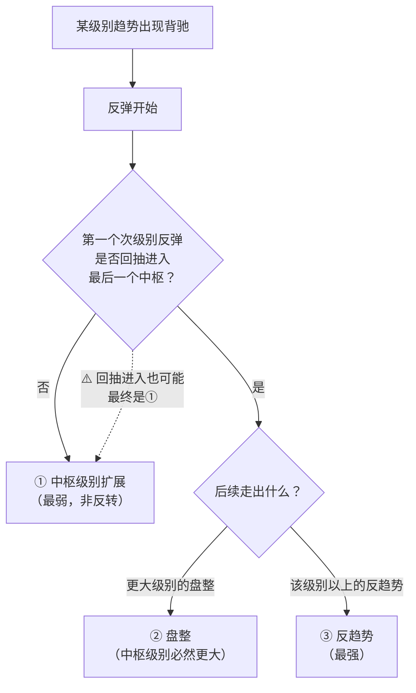

# 第 23 章 · 背驰—转折定理

> 背驰之后会发生什么？原著在第 29 课给了一个**完全分类**：三种，没有第四种。
> 这一章讲清楚这三种，以及一件很重要的事——
> **其中最弱的那一种，算不上"反转"。**

## 23.1 定理

〔推论〕**背驰—转折定理**（第 29 课）：某级别趋势的背驰，将导致以下三者之一：

| # | 演化 | 强度 |
|---|---|---|
| ① | 该趋势**最后一个中枢的级别扩展** | 最弱 |
| ② | 该级别**更大级别的盘整** | 中 |
| ③ | 该级别**以上级别的反趋势** | 最强 |

〔推论〕**这是一个完全分类：背驰之后只可能是这三种，没有第四种。**

原著给的论证思路（以 5 分钟级别下跌背驰为例，转述）：

背驰段跌破最后一个中枢后，该背驰段必然是次级别以下的
（否则它就不是"最后一个中枢"了）。此后的反弹：

- **至少会触及**最后一个中枢的 `DD`（围绕该中枢震荡的最低点）——
  否则等于在下方又形成了一个新的同级别中枢，
  与"该中枢是最后一个"矛盾；
- 若**仅**触及 `DD` 而不重新进入中枢区间 → 情形 ①；
- 若**重新触及/进入**中枢区间 → 发生转折，即 ② 或 ③。

## 23.2 为什么 ① 算不上反转

这一节是本章最实用的部分。

情形 ① 的特征：反弹**只触及最后一个中枢的外围**（`DD`），
不重新进入中枢区间。其结果是**把最后一个中枢扩展成更大级别的中枢**
（第 15 章：扩张是级别提升的唯一通道）。

〔推论〕**情形 ① 的本质是"级别提升"，不是"方向反转"。**

具体说：

- 价格确实反弹了，但反弹的幅度只够触及中枢外围；
- 原来的下跌走势类型**并未完成**，它被吸收进了一个更大级别的中枢里；
- 站在更大级别上看，**什么都还没发生**——仍在一个中枢内部。

原著对此有明确提示（第 29 课，转述）：即使是这种最低级别的反弹，
也有足够空间让第一类买点获利；但这种情况出现得很少，
一旦碰到，在资金利用率的要求下应当找机会退出，否则会浪费时间。

⚠️ 本书要在这里加一句提醒：**"有足够空间获利"是一条〔经验断言〕**，
它依赖幅度是否覆盖交易成本（第 37 章会算）。本书未检验。

## 23.3 ② 与 ③ 的区别

两者都构成转折，区别在**转折之后走出来的是什么**。

〔推论〕原著（第 29 课）给了一条很重要的级别约束：

| 转折后 | 级别要求 |
|---|---|
| **盘整**（情形 ②） | 其中枢级别**必然大于**原下跌中的中枢级别 |
| **反趋势**（情形 ③） | 其中枢级别**不一定**大于原下跌中的中枢级别 |

**为什么盘整必须更大级别**：

原著给了两个理由（转述）：

**一、结构上的**：如果盘整的级别与原趋势相同，
那它只可能是"原趋势的延伸"或"最后一个中枢的扩展"（情形 ①），
**与"两个走势类型的连接"不是一回事**。

**二、数量上的**：一个 5 分钟下跌 `a+A+b+B+c`，
若把 `a`、`b`、`c` 都按 1 分钟走势类型计量，
`A`、`B` 各至少 3 段，合计约 9 段。
而一个 30 分钟盘整至少有 3 个 5 分钟走势类型，
每个至少 3 个 1 分钟走势类型，同样约 9 段——**数量上才匹配**。

〔推论〕**所以"下跌 + 盘整"这种连接，隐含要求盘整的级别更高。**

这条约束在实践中很有用：如果你判定"下跌之后进入盘整"，
但那个盘整的中枢和原下跌的中枢是同级别的，
那么**你的判定一定有问题**——它要么是延伸，要么是扩展，不是连接。

## 23.4 怎么分辨三种情形

原著（第 29 课，转述）给了一个判别方法：

> 关键看**反弹中第一个次级别走势**（对 5 分钟下跌就看 1 分钟级别的第一次反弹），
> 是否重新回抽到最后一个中枢里。
> 如果不能，那么情形 ① 的可能就很大，而且反弹力度值得怀疑。

⚠️ 原著同时注明：**这种判别不是绝对的，但有效性很大**。
本书据此标〔经验断言〕。

⚠️ 另有一处补充（原文附注，转述）：**第一次次级别回抽即使回到中枢，
也仍有可能是级别扩展**——所以这个判别是概率性的，不是充要条件。



## 23.5 实测：样本量不够

**实测设定**：7 个匿名样本 × 2835 个交易日，后复权日线。
对第 20 章判出的趋势背驰，跟踪其后 3~4 笔的回抽位置，
按 23.4 节的判据分类。
登记见[出处与资料](../../sources.md)第五节，运行日期 2026-09-12。

| 演化 | 个数 | 占比 |
|---|---|---|
| ① 仅触及最后中枢外围（最弱） | 5 | 56% |
| ② 回抽进入最后中枢（盘整 / 反趋势） | 2 | 22% |
| ③ 一路回到前一个中枢（反趋势较强） | 2 | 22% |

**样本量 n = 9。**

〔经验断言〕⚠️ **本书不从这组数字得出任何结论。**

理由：9 个样本上的比例，置信区间会宽到几乎覆盖整个 0~100%。
报告它只有一个用途——**说明这个问题在日线层面无法被回答**。

〔推论〕**要检验背驰—转折定理的三种演化分布，必须降级别换样本量。**
按第 3 章实测，30 分钟级别的对象数约是日线的 8 倍，
5 分钟约 48 倍——但后者的历史深度只到 2020 年（第 4 章）。
这是一个真实的约束，第六部分会再遇到。

⚠️ 还要注意：**定理本身是〔推论〕，不需要数据验证**。
需要数据的是"三种演化各占多少"这个〔经验断言〕——
两者性质不同，不要混为一谈（第 1 章 Q4 的纪律）。

## 常见说法辨析

| 说法 | 证据强度 | 辨析 |
|---|---|---|
| "背驰之后会反转" | ❌ 明确错误 | 三种演化里**只有 ③ 是反趋势**，① 本质是级别提升而非方向反转（23.2 节）。把"转折"读成"反转"是最常见的误读 |
| "背驰后至少会有一波反弹" | ⚠️ 有争议 | 按定理，反弹**至少触及**最后一个中枢的 `DD`——这一点是〔推论〕。但幅度是否覆盖交易成本是另一回事（第 37 章），原著说"有足够空间"是〔经验断言〕，本书未检验 |
| "看第一次回抽就能判断是哪一种" | ⚠️ 有争议 | 原著自己注明这个判别"不是绝对的，但有效性很大"，且补充说第一次回抽进入中枢也可能最终是扩展。它是概率性判据，不是充要条件（23.4 节） |
| "下跌之后的盘整可以是同级别的" | ❌ 明确错误 | 原著给了结构与数量两方面的论证：同级别的话只能是延伸或扩展，不构成"两个走势类型的连接"（23.3 节） |
| "本书实测 56% 是情形 ①，所以背驰多数不反转" | ❌ 明确错误 | **样本量 9**。这个比例的置信区间宽到没有信息量。本书报告它只是为了说明该问题在日线层面答不了 |
| "定理需要用数据验证" | ❌ 明确错误 | 定理本身是〔推论〕，由定义决定，数据推翻不了。需要数据的是"三种演化各占多少"这个〔经验断言〕。两者性质不同 |

## 思考题

**Q1.** 写出背驰之后的三种演化，并说明为什么第一种"算不上反转"。

**Q2.** 为什么"下跌 + 盘整"里的盘整必然是更高级别的？
请给出结构和数量两方面的理由。

**Q3.**【标签】本章里，"背驰—转折定理"和"三种演化各占多少"
分别属于哪一类命题？为什么必须分开？

**Q4.**【判读】某人引用本章的实测说"56% 的背驰不构成反转"。
请指出这个引用的问题。

**Q5.** 23.4 节的判别方法被标为〔经验断言〕而不是〔推论〕。
请说出原著自己给的两处限定。

**Q6.**【查证】在你的实现里，把背驰后的演化分类跑一遍。
报告样本量与分布，并回答：这个样本量支持你下结论吗？

> 📖 **参考答案**（想清楚再看）：
> [Q1](../../qa/23-divergence-turn-qa.md#q1) ·
> [Q2](../../qa/23-divergence-turn-qa.md#q2) ·
> [Q3](../../qa/23-divergence-turn-qa.md#q3) ·
> [Q4](../../qa/23-divergence-turn-qa.md#q4) ·
> [Q5](../../qa/23-divergence-turn-qa.md#q5) ·
> [Q6](../../qa/23-divergence-turn-qa.md#q6)

## 本章实操

两档都**不需要开户、不需要下单**。

### 🅐 手工版：跟踪一次演化

**需要**：第 20 或 21 章 🅐 档判出的一次背驰、
[背驰记录表](../../forms/divergence-log.md)的「演化跟踪」部分。

1. 记下最后一个中枢的 `[ZD, ZG]` 和 `[DD, GG]`。
2. 从背驰点开始，逐段跟踪反弹：
   - 第一个次级别反弹触及 `DD` 了吗？
   - 它有没有**进入** `[ZD, ZG]`？
3. 按 23.4 节的流程图判断属于哪一种演化，填进记录表。
4. 继续跟踪，看最终走出来的是什么：
   - 若是盘整 → **验证它的中枢级别是否更高**（23.3 节）；
   - 若是反趋势 → 记录它的级别。
5. 回头检查：第 3 步的初判和第 4 步的结果**一致吗**？
   不一致就把它记进「歧义」列——这正是原著说"判别不是绝对的"的实例。

### 🅑 代码版：实现演化分类

**需要**：第 20、21 章实现的背驰判定。

**第一步：实现分类**

```text
对每个背驰点：
    Z = 最后一个中枢
    跟踪其后 N 段：
        若全部未触及 Z.[ZD, ZG]  → ① 级别扩展
        若进入 Z.[ZD, ZG] 但未回到前一中枢 → ②
        若一路回到前一个中枢     → ③
```

⚠️ `N` 取多少是一个约定，**必须声明**。本书取 3~4 笔。

**第二步：自检**

| 断言 | 依据 |
|---|---|
| 每个背驰点都被归入三类之一 | 23.1 节的完全分类 |
| 情形 ② 之后若走出盘整，其中枢级别 > 原中枢级别 | 23.3 节〔推论〕 |
| 反弹至少触及 `DD` | 23.1 节的论证 |

第二条是一条很好的结构检验——**如果发现同级别的盘整，
说明你的级别判定或演化分类有问题**。

**第三步：报告样本量（本章最重要的一条）**

先填[检验预登记表](../../forms/prereg-template.md)。
在报告的**第一行**写出样本量，然后才写分布。

如果样本量 < 30，在结论处明确写：
"样本量 ⟨n⟩，不足以支持关于分布的推断。"

**第四步：降级别重做（选做，但很有价值）**

把同样的分析放到 30 分钟级别上重跑，看样本量能涨到多少。
⚠️ 注意第 4 章的数据约束：分钟线的历史深度有限，
且必须确认复权方式。

登记进[出处与资料](../../sources.md)第五节。

## 🔎 看盘时的用处

1. **"转折"不等于"反转"。** 三种演化里只有一种是反趋势。
2. **看第一次次级别回抽。** 这是分辨三种情形最快的线索——但不是充要条件。
3. **判到"下跌 + 同级别盘整"就是判错了。** 盘整必然更高级别。
4. **最弱的那一种最常被误读成买点。** 它本质是级别提升，价格可能久久不动。
5. **小样本上的比例不要引用。** 本章的 56% 就是一个不该被引用的数字。

> ⚖️ 本书只讲方法与检验，不推荐任何标的、不预测行情、不构成投资建议。
> 市场有风险，任何据此产生的后果由读者自负。
