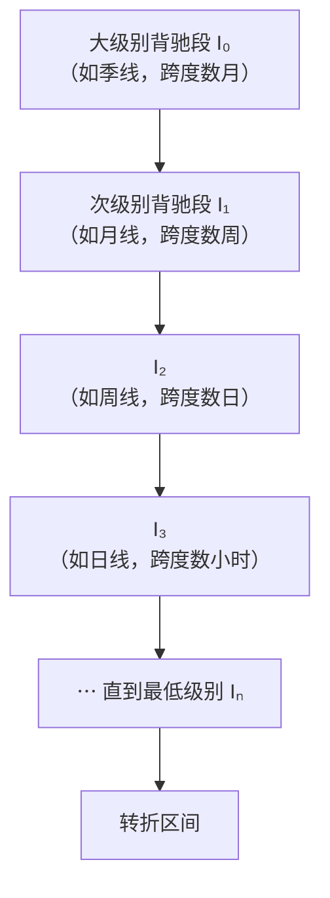

# 第 24 章 · 区间套

> 原著借用了数学分析里的区间套定理，给出一套**逐级收缩**定位转折区间的方法。
> 这一章讲它的原理、它能做到什么、以及它**做不到什么**——
> 后者比前者重要。

## 24.1 方法

〔定义〕**区间套式定位**（第 27 课）：
某大级别的转折点，可以通过**不同级别背驰段的逐级收缩**来确定。

具体做法：

```text
1. 在大级别上找到背驰段        → 得到一个区间 I₀
2. 在次级别图上，找出 I₀ 内部的背驰段 → 得到区间 I₁ ⊂ I₀
3. 在次次级别上重复            → I₂ ⊂ I₁
⋯
直到最低级别，得到 Iₙ
```

〔推论〕**每一层的背驰段必然包含在上一层的背驰段之内**，
所以 `I₀ ⊃ I₁ ⊃ I₂ ⊃ ⋯`，区间**单调收缩**。

原著给的例子（第 27 课，转述）：从季线图上的背驰段出发，
在月线上找出对应的背驰段，再到周线、日线、30 分钟、5 分钟、1 分钟——
区间不断缩小。



## 24.2 为什么它能收缩

〔推论〕**区间套成立的依据，是背驰—买卖点定理**（第 24 课，第 20 章 20.4 节）：
任一级别的买卖点都源自某级别走势的背驰。

具体推理：

1. 大级别的转折点，必然对应某个大级别的背驰段；
2. 大级别背驰段的内部，走势仍在继续，仍可以分解为次级别的走势类型；
3. 大级别的转折点也是次级别意义上的转折，所以在次级别上同样对应一个背驰段；
4. 而次级别的背驰段必然**落在**大级别背驰段的时间范围内。

所以每降一级，定位区间就收窄一次。

〔推论〕**收缩的速度由级别阶梯决定**——
每降一级，区间大致缩小到上一级的若干分之一。
按第 3 章的周期阶梯（5、6、8…），
从日线降到 30 分钟大约缩小到八分之一。

## 24.3 它做不到什么

这一节是本章的重点。原著自己也讲了限制，本书再补两条。

### 限制一：级别不是无限可分的（原著自陈）

原著明确说（第 27 课，转述）：由于级别不是无限往下的，
理论上并不能证明会出现一个**如极限一样的点状**情况；
但用这种方法确认一个**十分精确的历史底部区间**是不难的。

〔推论〕**区间套逼近的是一个区间，不是一个点。**

数学上的区间套定理要求区间长度趋于零才能收敛到一点；
而缠论的级别有最低层（第 3 章 3.1 节），
所以收缩在 `Iₙ` 处**停止**，`Iₙ` 有非零的长度。

### 限制二：每降一级，约定的不确定性叠加一次（本书补）

第 11 章测出：仅三项几何层约定不同，笔端点重合率可以低到 17.3%。
而区间套要在**每一个级别**上重新做一次几何层划分与背驰判定。

〔推论〕**区间套的每一层都会引入一次约定不确定性，
而这些不确定性是累积的。**

这意味着：

- 层数越多，最终区间的位置对约定越敏感；
- 两个人用不同约定做区间套，**越往下分歧越大**——
  这与"区间越收越窄"的直觉恰好相反。

⚠️ 所以区间套给出的"精确"是**相对于某一套约定的精确**，
不是绝对意义上的精确。

### 限制三：低级别的数据与执行约束（本书补）

要降到 5 分钟、1 分钟，需要：

| 要求 | 现实 |
|---|---|
| 低级别历史数据 | 免费源 5 分钟线最早只到 2020 年；逐笔不提供（第 4 章实测） |
| 低级别复权 | 分钟线的复权支持普遍弱于日线（第 2 章 2.5 节） |
| 执行能力 | A 股 T+1，日内级别的完整结构不可执行（第 2 章 2.4 节） |

〔推论〕**区间套在"看"的层面可以一直降下去，
在"做"的层面受 T+1 与数据可得性限制。**

原著自己也说了一句很实在的话（第 27 课，转述）：
1 分钟的背驰段一般就是以分钟计的事情，
对大级别转折点已经足够精确，对大资金基本没什么用处。

## 24.4 它真正的价值

说了这么多限制，区间套的价值在哪？

〔推论〕**它把"判断一个点"这个不可能的任务，
转化成了"逐级收窄一个区间"这个可操作的任务。**

这是一个方法论上的转换，值得单独指出：

| | 直接判点 | 区间套 |
|---|---|---|
| 目标 | 命中转折点 | 收窄转折区间 |
| 可行性 | 不可能（极值一闪而过，第 13 章 13.5 节） | 可行 |
| 失败方式 | 要么中要么不中，二值 | 区间宽一点窄一点，连续 |
| 可验证性 | 难 | 可以报告区间宽度 |

第 13 章 13.5 节推出过"真正的高低点总是一闪而过"，
并指出这意味着那个价位**几乎不可能被成交**。
区间套正是对这个事实的正面回应：**既然点抓不住，那就收窄区间**。

〔推论〕**所以用区间套时，正确的期待是"我把范围缩小到了 X"，
而不是"我找到了那个点"。**

## 24.5 实现要点

**一、每层都要声明约定。**
区间套要在每个级别上重跑几何层 + 中枢 + 背驰判定。
约定清单（第 11 章 16 项 + 第 13/14/15/19/21 章 5 项）
**在每一层都要声明，而且应当保持一致**（第 11 章 11.6 节规则一）。

**二、报告区间宽度，不只报位置。**
区间套的产出是一个区间。只报中点等于丢掉了它最重要的信息。
建议报告格式：

```text
层数：n
最终区间：[t₁, t₂]（时间）× [p₁, p₂]（价格）
区间宽度：相对价格的百分比
每层的收缩比
```

**三、低级别停在哪要声明。**
降到 30 分钟、5 分钟还是 1 分钟，是一个约定。
补进清单：

| # | 约定 | 常见选择 |
|---|---|---|
| 22 | 区间套降到哪一级停止 | 按数据可得性 / 按执行能力 / 固定层数 |

## 常见说法辨析

| 说法 | 证据强度 | 辨析 |
|---|---|---|
| "区间套能精确到一笔成交" | ⚠️ 有争议 | 原著说"理论上"可以达到逐笔，但同时明说级别不是无限可分的，**不能证明会出现点状情况**（24.3 节）。而实践中逐笔数据拿不到（第 4 章） |
| "降的级别越多越精确" | ⚠️ 有争议 | 区间确实越窄，但**每层都叠加一次约定不确定性**（24.3 节限制二）。对同一套约定越精确，跨约定则越发散 |
| "区间套是用来抄底的" | ❌ 明确错误 | 它是**定位方法**，产出是一个区间。而且第 13 章已推出极值点几乎不可能成交。把它当"抄底工具"是对它的误解 |
| "区间套很难，普通人用不了" | ⚠️ 有争议 | 原理不难（逐级找背驰段），难的是每层都要把几何层做对。真正的门槛在实现的一致性，不在概念 |
| "1 分钟区间套对大资金最有用" | ❌ 明确错误 | 原著自己说对大资金"基本没什么用处"——1 分钟的精度对大级别转折已经过剩，而大资金无法在那个尺度上成交 |
| "找到了区间套的最低点就是买点" | ❌ 明确错误 | 区间套定位的是**转折区间**，而买点是另一套定义（第五部分）。而且本书不给操作建议 |

## 思考题

**Q1.** 区间套为什么能逐级收缩？请用背驰—买卖点定理说明。

**Q2.** 原著说区间套"不能证明会出现点状情况"。请说明原因，
并指出它与数学上的区间套定理差在哪。

**Q3.** 本书补的"限制二"说每层会叠加约定不确定性。
请说明为什么这会导致"区间越窄、跨约定分歧越大"这个反直觉的结果。

**Q4.**【标签】"区间套把判断一个点转化成收窄一个区间"属于哪一类命题？

**Q5.**【判读】某人说："我用区间套一路降到 1 分钟，
把底部精确到了某一分钟，所以可以挂单在那里。"
请指出至少三处问题。

**Q6.**【查证】在你的实现里做一次三层的区间套，
报告每层的区间宽度与收缩比。然后换一组几何层约定重做，
比较两次的最终区间——它们重合吗？

> 📖 **参考答案**（想清楚再看）：
> [Q1](../../qa/24-interval-nesting-qa.md#q1) ·
> [Q2](../../qa/24-interval-nesting-qa.md#q2) ·
> [Q3](../../qa/24-interval-nesting-qa.md#q3) ·
> [Q4](../../qa/24-interval-nesting-qa.md#q4) ·
> [Q5](../../qa/24-interval-nesting-qa.md#q5) ·
> [Q6](../../qa/24-interval-nesting-qa.md#q6)

## 本章实操

两档都**不需要开户、不需要下单**。

### 🅐 手工版：手工做两层区间套

**需要**：行情软件（能切周期）、第 21 章 🅐 档判出的一次背驰。

1. 在你原来的周期上，标出**背驰段**的起止（时间与价格范围），记为 `I₀`。
2. 切到**更小一档周期**，找到 `I₀` 时间范围内的走势。
3. 在这一段里，按同样的方法找出**背驰段**，记为 `I₁`。
4. 验证：`I₁` 确实包含在 `I₀` 里吗？
5. 量出两个区间的**价格宽度**（相对价格的百分比），算收缩比。
6. 回答一个问题：`I₁` 的宽度，还够不够覆盖一次买卖的交易成本？
   （不需要算准，估个量级即可。第 37 章会算清楚。）

第 6 步是本章最该带走的一问——**收窄区间是有极限的**。

### 🅑 代码版：实现区间套并测约定敏感性

**需要**：第 21、22 章实现的背驰判定，且需支持多个级别。

**第一步：实现逐级收缩**

```text
I = 大级别背驰段的 [t₁, t₂]
for level in 降序的级别序列:
    在 I 的时间范围内，用 level 重跑几何层 + 中枢 + 背驰
    找出该级别的背驰段 I'
    断言 I' ⊆ I
    I = I'
```

**第二步：自检**

| 断言 | 依据 |
|---|---|
| 每层的区间包含在上一层内 | 24.2 节〔推论〕 |
| 区间宽度单调不增 | 同上 |
| 层数有限（受最低级别限制） | 第 3 章 |

⚠️ 第一条断言失败通常意味着某一层的背驰判定跨出了上层区间——
去查该层的级别判定。

**第三步：报告收缩曲线**

报告每层的**区间宽度**（相对价格）与**收缩比**，
而不只是最终位置。

**第四步：约定敏感性（本章最重要的一项）**

先填[检验预登记表](../../forms/prereg-template.md)。
用**两组不同的几何层约定**（比如第 11 章里"成笔失败处理"的两种取法）
各做一次完整的区间套，然后比较：

1. 两次的最终区间**重合吗**？
2. 重合度随层数增加是**上升**还是**下降**？

本书的推理是**下降**（24.3 节限制二）——去验证它。
如果你的结果相反，那是一个值得报告的发现。

**第五步：登记**

结果登记进[出处与资料](../../sources.md)第五节，并补上约定清单第 22 项。

## 🔎 看盘时的用处

1. **区间套的产出是区间，不是点。** 报结论时带上宽度。
2. **越降越窄，但也越依赖约定。** 精确是相对于你那套约定的精确。
3. **降到哪一级要有理由。** 数据可得性与执行能力，两者都是硬约束。
4. **问一句：这个区间够覆盖成本吗？** 收窄是有极限的。
5. **别把它当抄底工具。** 极值点几乎不可能成交（第 13 章）。

> ⚖️ 本书只讲方法与检验，不推荐任何标的、不预测行情、不构成投资建议。
> 市场有风险，任何据此产生的后果由读者自负。
