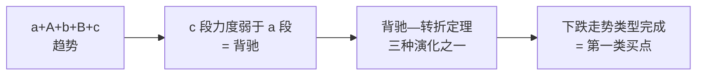

# 第 25 章 · 第一类买卖点

> 三类里最"正宗"的一类——它直接对应趋势的终结。
> 也是最稀少的一类：本书实测 11 年 7 个样本只有 **8 个**。
> 这一章讲它的定义、它与背驰的关系，以及**它为什么必然稀少**。

## 25.1 定义

〔定义〕**第一类买点**（第 17 课）：
一个**下跌走势类型**完成的那一刻所构成的买点。

原著给的理由很直接：某种类型的走势完成之后必然转化为其他类型
（原理一）；对下跌而言，完成之后只能转化为**上涨或盘整**。
因此，把握住下跌走势转化的那个关节点，就占据了最有利的位置。

第一类卖点反之：上涨走势类型完成的那一刻。

〔推论〕**第一类买卖点 = 某级别走势类型的完成点。**

## 25.2 它与背驰的关系

原著在第 27 课明确了（转述）：**第一类买点多数由趋势背驰构成**。

把第四部分接上来：



〔推论〕**所以第一类买卖点继承了背驰的全部前提**（第 20 章三条）：

1. 必须是趋势；
2. 两个中枢必须同级别；
3. `c` 必须是次级别的。

任何一条不满足，就没有趋势背驰，也就没有（由趋势背驰构成的）第一类买卖点。

⚠️ 原著的措辞是"**多数**由趋势背驰构成"，不是"全部"。
第 27 课同时指出：在**大级别**上往往不出现趋势，
此时由**盘整背驰**构成的买点也起到类似第一类买点的作用。
所以严格说，第一类买卖点的构成方式不止一种。

## 25.3 为什么它必然稀少

把前面各部分的实测串起来，第一类买卖点的稀少是**结构性**的，不是偶然：

| 环节 | 实测 | 出处 |
|---|---|---|
| 相邻中枢构成趋势 | 16.4% | 第 14 章 |
| 趋势结构中判为背驰 | 约 30% | 第 19 章 |
| 结果：趋势背驰 | **8 个**（11 年 × 7 样本） | 第 20 章 |

〔推论〕**第一类买卖点的稀少，是"趋势稀少"与"背驰是强筛选"两个因素相乘的结果。**

这条推论有一个很实用的推论的推论：

> **如果有人说他经常抓到第一类买点，那么他用的判据一定比原文松。**

松在哪里？按第 20 章 Q3 的排查顺序：

1. 把盘整背驰当成了趋势背驰；
2. 判"不重叠"用了 `[ZD, ZG]`（趋势占比从 16.4% 飙到 95.7%）；
3. 跳过前提直接看 MACD 柱子。

## 25.4 度量方式的影响

一个值得单独指出的实测结果。

**实测设定**：7 个匿名样本 × 2835 个交易日，后复权日线，336 个中枢。
同样是"趋势结构中 `c` 段力度弱于 `a` 段"，换两种力度度量：
登记见[出处与资料](../../sources.md)第五节，运行日期 2026-09-12。

| 力度度量 | 判出的第一类买卖点 |
|---|---|
| MACD 面积（12/26/9） | **8** |
| 价格幅度 | **31** |

〔经验断言〕**同一个定义、同一批数据，换一种力度度量，数量差近 4 倍。**

〔推论〕**所以"第一类买卖点的数量"首先是约定的函数，其次才是市场的函数。**

这与第 11 章 Q2 那条〔推论〕是同一件事的又一个实例：
几何层（乃至整个判定链）的输出是「价格序列 + 约定集」的函数。

⚠️ **实践含义**：两个人说"这里是第一类买点"，
在核对约定之前，**他们可能在说完全不同的事**。
约定清单第 20 项（力度度量）必须声明。

## 25.5 它的结构含义

抛开操作不谈，第一类买卖点在结构上意味着什么？

〔推论〕**它标记的是"某级别走势类型的边界"。**

按第 16 章的判定流程，走势类型完成之后，只有三种去向
（延伸已结束，所以是扩张或新生）。所以第一类买卖点之后：

| 之后是什么 | 结构上 |
|---|---|
| 上涨（反趋势） | 新的同级别走势类型，方向相反 |
| 盘整 | 更大级别的中枢开始形成 |
| 最后一个中枢扩展 | 级别提升，原走势类型被吸收 |

这正是第 23 章那三种演化。

⚠️ 注意第三种：**它意味着"第一类买点"之后价格可能久久不动**——
因为级别提升了，新的更大级别中枢需要时间形成。
第 23 章 23.2 节已经指出这一点：情形 ① 本质是级别提升而非方向反转。

〔推论〕**"第一类买点"这个名字容易让人期待一次反转，
但按定理，它之后最常见的演化（本书样本上）恰恰是最弱的那一种。**

⚠️ "最常见"这个判断来自 n = 9 的样本（第 23 章 23.5 节），
**本书不据此下结论**，这里只是提醒不要有过强的预期。

## 常见说法辨析

| 说法 | 证据强度 | 辨析 |
|---|---|---|
| "第一类买点就是最低点" | ❌ 明确错误 | 它是**走势类型的完成点**，不是价格极值点。而且第 13 章已推出真正的极值一闪而过、几乎不可能成交 |
| "看到 MACD 背驰就是第一类买点" | ❌ 明确错误 | 跳过了背驰的三个前提（第 20 章）。实测 11 年只有 8 个，频繁看到说明判据用松了 |
| "第一类买点最安全" | ⚠️ 有争议 | 原著确实说它是"最有利的位置"。但按第 23 章，它之后有三种演化，最弱的一种只是级别提升——价格可能久久不动。"安全"需要先定义 |
| "第一类买点都由趋势背驰构成" | ⚠️ 有争议 | 原著说的是"**多数**"。大级别上往往没有趋势，此时由盘整背驰构成的买点起类似作用（第 27 课、第 21 章） |
| "我常抓到第一类买点" | ❌ 明确错误 | 按实测的稀少程度，这几乎一定意味着判据比原文松。三个常见的松法见 25.3 节 |
| "第一类买卖点的数量是客观的" | ❌ 明确错误 | 实测：换一种力度度量，数量从 8 变成 31。**它首先是约定的函数**（25.4 节） |

## 思考题

**Q1.** 用一句话给出第一类买卖点的结构定义，
并说明它继承了背驰的哪三个前提。

**Q2.** 为什么第一类买卖点必然稀少？请用两个实测数字支持。

**Q3.**【判读】某人说他每个月都能在日线上抓到两三个第一类买点。
请按可能性列出三个解释。

**Q4.** 25.4 节实测显示换度量方式数量从 8 变成 31。
这个结果对"两个人讨论买卖点"意味着什么？

**Q5.**【标签】"第一类买点之后必然反转"属于哪一类？
按第 23 章，正确的表述应该是什么？

**Q6.**【查证】在你的实现里，用三种力度度量各统计一次第一类买卖点，
报告数量与**位置重合率**。

> 📖 **参考答案**（想清楚再看）：
> [Q1](../../qa/25-first-point-qa.md#q1) ·
> [Q2](../../qa/25-first-point-qa.md#q2) ·
> [Q3](../../qa/25-first-point-qa.md#q3) ·
> [Q4](../../qa/25-first-point-qa.md#q4) ·
> [Q5](../../qa/25-first-point-qa.md#q5) ·
> [Q6](../../qa/25-first-point-qa.md#q6)

## 本章实操

两档都**不需要开户、不需要下单**。

### 🅐 手工版：标出一个第一类买卖点

**需要**：第 20 章 🅐 档判出的那次趋势背驰、
[背驰记录表](../../forms/divergence-log.md)。

1. 确认三个前提都通过了（如果没有，这不是第一类买卖点）。
2. 标出背驰点的位置——那就是候选的第一类买卖点。
3. 往后跟踪，判断走势类型**是否真的完成了**：
   按第 16 章的定理三，需要看中枢破坏与后续演化。
4. 记录：完成了吗？如果完成了，之后是三种演化中的哪一种？
5. 回答：这个点是价格的**极值点**吗？
   如果不是，差多远？（这一问对应 25.5 节的提醒。）

### 🅑 代码版：实现第一类买卖点判定

**需要**：第 20 章实现的趋势背驰判定。

**第一步：实现**

```text
第一类买点 = 下跌走势类型完成的位置
判定：
  1. 存在 a+A+b+B+c 趋势结构（向下）
  2. 三个前提全部通过
  3. Area(c) < Area(a)
  4. 记录背驰点位置
```

**第二步：自检**

| 断言 | 依据 |
|---|---|
| 每个第一类买卖点都对应一个通过三前提的趋势结构 | 25.2 节 |
| 第一类买点与卖点方向相反、交替出现 | 走势类型交替 |
| 数量 ≤ 趋势背驰数 | 定义 |

**第三步：复现度量敏感性**

先填[检验预登记表](../../forms/prereg-template.md)。
用 MACD 面积、价格幅度、斜率三种度量各跑一次，报告：

1. 数量（本书：MACD 8、幅度 31）；
2. **位置重合率**——这才是关键。

⚠️ 数量差 4 倍已经很惊人，但**位置重合率可能更低**：
两种度量判出的可能是不同的 8 个和不同的 31 个。

**第四步：登记**

结果登记进[出处与资料](../../sources.md)第五节。

## 🔎 看盘时的用处

1. **它是走势类型的完成点，不是价格最低点。** 这两件事经常被混同。
2. **它很稀少。** 常看到就是判据松了。
3. **它之后不一定反转。** 最弱的演化只是级别提升（第 23 章）。
4. **先问对方用什么度量。** 换度量数量差 4 倍。
5. **大级别上它可能由盘整背驰构成。** 原著说的是"多数"由趋势背驰构成。

> ⚖️ 本书只讲方法与检验，不推荐任何标的、不预测行情、不构成投资建议。
> 市场有风险，任何据此产生的后果由读者自负。
