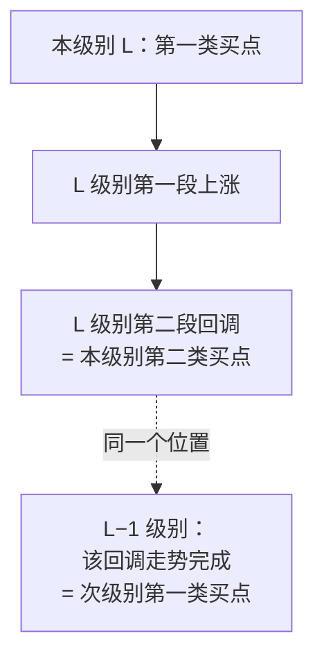

# 第 26 章 · 第二类买卖点

> 第一类之后的第一次次级别回抽。这一章的核心是一条**级别转换定律**——
> 它把三类买卖点全部归结到了不同级别的第一类上，
> 是整个体系里最优雅的一步。

## 26.1 定义

〔定义〕**第二类买点**（第 17 课）：
第一类买点出现后，**第一次次级别回调**所制造的低点。

原著给的论证（转述）很干净：

1. 第一类买点出现后，走势只能转化为**上涨或盘整**（原理一 + 三分类）；
2. 而上涨与盘整**都必须**由三个以上的次级别走势类型构成（分解定理二）；
3. 所以在第一段次级别上涨、第二段次级别回调之后，
   **必然还有第三段向上的次级别走势**；
4. 因此第二段回调的低点是一个"被结构保证"的位置。

〔推论〕**第二类买点的安全性来自分解定理二**，而不是来自力度比较。

这一点很重要：**第一类依赖背驰（力度），第二类依赖计数（结构）**。
两者的依据完全不同。

## 26.2 买卖点定律：三类归一

原著在第 14、17 课给了一条定律（转述）：

〔推论〕**买卖点定律**：任何级别的第二类买卖点，
都由**次级别相应走势的第一类买卖点**构成。

例如：周线上的第二类买点，对应日线上的第一类买点。



〔推论〕**由此，所有买卖点都可以归结到不同级别的第一类买卖点。**

原著顺势给了另一条（第 17 课，转述）：

〔推论〕**趋势转折定律**：任何级别的上涨转折，
都由**某级别**的第一类卖点构成；任何下跌转折，
都由**某级别**的第一类买点构成。

⚠️ 注意"**某级别**"三个字。原著特意说明：这个级别**不一定是次级别**——
因为次级别里也可以是第二类买卖点，而且还存在不同级别同时出现买卖点的
"共振"情形。

〔推论〕**所以这条定律的正确读法是"存在某个级别"，而不是"就是次级别"。**
把它读成后者，是一个常见的误读。

## 26.3 一个必须澄清的循环

看到 26.2 节，很容易产生一个疑问：

> 第二类归结到次级别的第一类，次级别的第二类又归结到次次级别的第一类……
> **这会不会无限递归下去？**

〔推论〕**不会，因为级别有最低层**（第 3 章 3.1 节、第 17 章 Q3）。

递归到最低级别时，第一类买卖点由该级别的背驰直接给出，不再往下归结。

⚠️ 但这带来一个实践上的后果：

〔推论〕**把第二类归结到次级别的第一类，需要在次级别上重做一遍
几何层 + 中枢 + 背驰判定**——也就是说，**它继承了下一层的全部约定不确定性**。

这与第 24 章区间套遇到的是同一个问题（24.3 节限制二）：
**每降一级，约定的影响叠加一次**。

所以"第二类 = 次级别第一类"在理论上优雅，**在实现上是有成本的**。

## 26.4 第二类与中枢的位置关系

原著在第 21 课讨论完备性时给了一个细致的分类（转述）：

〔经验断言〕**第二类买点不必然出现在中枢的上方或下方，可以在任何位置**：

| 出现位置 | 原著的评价（转述） |
|---|---|
| 中枢**下方** | 其后的力度值得怀疑，出现中枢扩张的可能极大 |
| 中枢**之中** | 出现中枢扩张与新生的机会对半 |
| 中枢**上方** | 中枢新生（即形成趋势）的机会就很大了 |

⚠️ 这三条标〔经验断言〕——原著给的是倾向性判断，**本书未检验**，
而且要检验需要先定义"力度"与"机会"。

但它的**结构逻辑**是可以理解的：第二类买点的位置越高，
说明第一段上涨走得越远，越容易在原中枢之上形成新的、不重叠的中枢
（即趋势，第 14 章）。

〔推论〕**位置越高 → 越可能新生（趋势）；位置越低 → 越可能扩张。**
这与第 15 章"扩张占 79.3%"的实测方向一致——
大多数情况下走不出那么高。

## 26.5 第二类与第三类的重合

原著在第 21 课专门讨论了一个情形（转述）：

〔推论〕**第一类与第二类不可能重合**（前后出现）；
**第一类与第三类也不可能重合**（一个在中枢下、一个在中枢上）；
**只有第二类与第三类可能重合**。

重合的条件：第一类买点出现后，一个次级别走势**凌厉地直接上破**
前面下跌的最后一个中枢，然后在其上产生一个次级别回抽**不触及该中枢**——
此时第二类与第三类重合。

〔经验断言〕原著说这种情况一旦出现，往往会有一个大级别的上涨；
但同时诚实地补充：**理论上没有任何必然的理由**确定重合之后
一定不会只构成一个更大级别的中枢扩张。

⚠️ 这是原著中少见的、**作者自己标注不确定性**的地方，值得注意。
本书据此标〔经验断言〕并注明作者自己的保留。

## 常见说法辨析

| 说法 | 证据强度 | 辨析 |
|---|---|---|
| "第二类买点就是回踩不破前低" | ⚠️ 有争议 | 形态上常常如此，但定义是"第一类之后**第一次次级别回调**的低点"——关键在"第一次"和"次级别"，不在"破不破前低" |
| "第二类买点由次级别第一类构成，所以次级别就是下一个周期" | ❌ 明确错误 | 周期不是级别（第 3 章）。而且趋势转折定律里原著特意说是"**某级别**"，不一定是次级别 |
| "第二类买点的安全性来自背驰" | ❌ 明确错误 | 第一类依赖**力度**（背驰），第二类依赖**计数**（分解定理二保证后面还有第三段）。两者依据不同（26.1 节） |
| "把第二类归结到次级别第一类更准确" | ⚠️ 有争议 | 理论上等价，但实现上要在次级别重做全套判定，**继承下一层的全部约定不确定性**（26.3 节）。优雅不等于更稳 |
| "中枢上方的第二类买点更好" | ⚠️ 缺乏证据 | 原著给的是倾向性判断（〔经验断言〕），本书未检验。其结构逻辑可以理解，但"更好"需要先定义 |
| "二三类重合后必然大涨" | ❌ 明确错误 | 原著自己说"理论上没有任何必然的理由"排除它只构成更大级别中枢扩张（26.5 节）。这是作者自己标注了保留的地方 |

## 思考题

**Q1.** 第一类与第二类买点的"安全性"分别来自什么？
请指出两者依据的不同。

**Q2.** 买卖点定律说第二类由次级别第一类构成。
这会不会无限递归？为什么？它在实现上有什么代价？

**Q3.** 趋势转折定律里的"某级别"三个字为什么重要？
把它读成"次级别"会产生什么问题？

**Q4.**【标签】"中枢下方的第二类买点其后力度值得怀疑"属于哪一类？
它的结构逻辑是什么？

**Q5.** 为什么第一类与第三类不可能重合？请用它们与中枢的位置关系说明。

**Q6.**【查证】在你的实现里，统计第二类买卖点出现在中枢**下方 / 之中 / 上方**
的比例，并分别统计其后是**扩张**还是**新生**。与 26.4 节的倾向性判断对照。

> 📖 **参考答案**（想清楚再看）：
> [Q1](../../qa/26-second-point-qa.md#q1) ·
> [Q2](../../qa/26-second-point-qa.md#q2) ·
> [Q3](../../qa/26-second-point-qa.md#q3) ·
> [Q4](../../qa/26-second-point-qa.md#q4) ·
> [Q5](../../qa/26-second-point-qa.md#q5) ·
> [Q6](../../qa/26-second-point-qa.md#q6)

## 本章实操

两档都**不需要开户、不需要下单**。

### 🅐 手工版：验证一次"二类 = 次级别一类"

**需要**：第 25 章 🅐 档标出的第一类买卖点、能切周期的行情软件。

1. 从第一类买点开始，往后找**第一段次级别上涨**和**第二段次级别回调**。
2. 标出第二段回调的低点——这是候选的第二类买点。
3. 记下它与最近那个中枢的**位置关系**（上方 / 之中 / 下方）。
4. **切到更小一档周期**，找到同一个时间位置。
5. 在这个更小的周期上，判断该位置是否构成**第一类买点**
   （即：该回调走势类型在这一层上完成了吗？）。
6. 记录：两者**对得上吗**？如果对不上，可能是什么原因？

第 6 步答不上来时，回看 26.3 节——
在次级别重做判定会引入新的约定不确定性。

### 🅑 代码版：实现第二类判定

**需要**：第 25 章实现的第一类买卖点判定。

**第一步：实现**

```text
第二类买点 = 第一类买点之后，第一个次级别回调的低点
判定：
  1. 找到第一类买点
  2. 向后取第一段同向（向上）走势
  3. 再取第二段（向下回调）
  4. 该回调的低点即第二类买点
  5. 记录它与最近中枢的位置关系
```

**第二步：自检**

| 断言 | 依据 |
|---|---|
| 每个第二类买点之前必有一个第一类买点 | 定义 |
| 第二类买点在时间上晚于对应的第一类 | 定义 |
| 第一类与第二类**不重合** | 第 21 课（26.5 节） |
| 第一类与第三类**不重合** | 同上 |

后两条是很好的结构检验——**出现重合说明判定有误**。

**第三步：验证买卖点定律**

在次级别上重跑全套判定，检查**每个本级别第二类买点的位置，
在次级别上是否构成第一类买点**。

⚠️ 报告**匹配率**而不是"是否成立"。
按 26.3 节，次级别重做会引入新的约定不确定性，
所以匹配率不会是 100%——**这个偏差本身就是一个值得报告的量**。

**第四步：复现 26.4 节的分类**

先填[检验预登记表](../../forms/prereg-template.md)。
统计第二类买点出现在中枢下方 / 之中 / 上方的比例，
以及各自之后是扩张还是新生。与原著的倾向性判断对照。

⚠️ 这是一次**对〔经验断言〕的检验**，所以必须：
规则先定、报告全部结果、写明样本量。

**第五步：登记**

结果登记进[出处与资料](../../sources.md)第五节。

## 🔎 看盘时的用处

1. **第二类靠计数，不靠力度。** 它的依据是"后面还必须有第三段"。
2. **"某级别"不等于"次级别"。** 转折定律的原文很讲究。
3. **归结到次级别是有成本的。** 要在下一层重做全套判定。
4. **记下它与中枢的位置关系。** 这是原著给的一个倾向性线索。
5. **一类与二类、一类与三类不可能重合。** 出现了就是判错了。

> ⚖️ 本书只讲方法与检验，不推荐任何标的、不预测行情、不构成投资建议。
> 市场有风险，任何据此产生的后果由读者自负。
