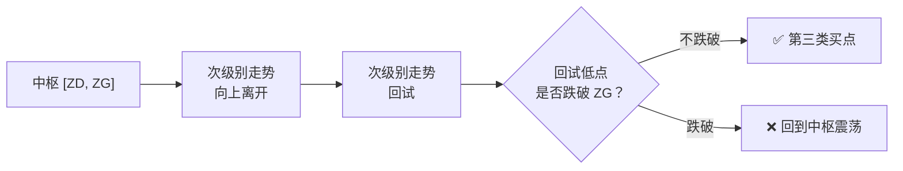
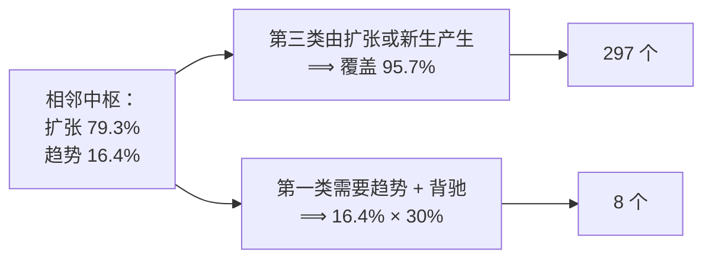

# 第 27 章 · 第三类买卖点

> 数量最多的一类——本书实测 **297 个**，是第一类的 37 倍。
> 这一章讲它的定义、它为什么这么常见，
> 以及一个**带对照组**的观察，和这个观察还缺什么才能成为结论。
>
> 后半部分是全书最重要的一次方法论演示。

## 27.1 定义

〔定义〕**第三类买点**（第 20 课）：
一个次级别走势类型**向上离开**中枢，然后以一个次级别走势类型**回试**，
其低点**不跌破 `ZG`**（中枢上沿），即构成第三类买点。

第三类卖点反之：向下离开中枢后回抽，高点不升破 `ZD`。



三个要点：

1. **判据用 `ZG`（上沿），不是 `GG`**——这是第 12 章 12.2 节说的分工：
   判破坏/回试用 `[ZD, ZG]`；
2. **必须是第一次回试**。原著明确说（第 20 课，转述）：
   并不是任何回调回抽都是第三类买卖点，**必须是第一次**；
3. **离开与回试都必须是次级别走势类型**，不是随便一段波动。

## 27.2 它的结构含义

原著在第 21 课给了一个很清晰的解释（转述）：

第三类买点是**中枢扩张或新生**时产生的。中枢之后有三种可能：
延伸、扩张、新生。而中枢延伸时不可能有买点（延伸要求所有中枢上的走势
都转折向下）；所以中枢之上的买点，只能来自**扩张或新生**。

〔推论〕**第三类买点之后必然是两种情况之一**：

| 之后 | 意味着 |
|---|---|
| **中枢新生** | 形成上涨趋势 |
| **中枢扩张** | 产生一个更大级别的中枢 |

原著据此说：无论哪种情况，只要第三类买点的条件符合，其后都必然要赢利；
只是扩张那种情况"肯定没有马上出现上涨趋势的情况诱人"。

⚠️ 本书对"必然要赢利"这句话要加一个重要的限定，见 27.5 节。

## 27.3 实测：它为什么这么多

**实测设定**：7 个匿名样本 × 2835 个交易日，后复权日线，336 个中枢。
登记见[出处与资料](../../sources.md)第五节，运行日期 2026-09-12。

| 类型 | 数量 |
|---|---|
| 第三类**买点** | 160 |
| 第三类**卖点** | 137 |
| **合计** | **297** |
| 对照：第一类买卖点（MACD 口径） | 8 |
| 对照：第一类买卖点（幅度口径） | 31 |

〔经验断言〕**第三类买卖点的数量是第一类（MACD 口径）的 37 倍。**

**为什么这么多**——这完全在第三部分的预料之内：



〔推论〕**第三类买卖点的高频，是"扩张是常态"这个结构事实的直接后果。**

这印证了第 14 章 Q3 与第 17 章 Q4 留下的推理——那两处是**先推理后验证**，
现在数字对上了。

## 27.4 一个带对照组的观察

下面是全书第一次给出**带对照组**的数据。请连同 27.5 节一起读。

**问题**：第三类买点之后，走势是否比"随便一个同向段之后"更容易继续推进？

**操作化**：

| 项 | 定义 |
|---|---|
| 处理组 | 第三类买点（按 27.1 节判定） |
| 对照组 | **全部**"向上笔 + 向下笔"的三元组（不加任何条件） |
| 观察量 | 紧接着的那一笔，是否**超越前一同向笔的极值** |

**结果**：

| | n | 命中 | 比例 |
|---|---|---|---|
| **第三类买点** | 160 | 106 | **66%** |
| 对照：任意向上笔 | 1020 | 503 | **49%** |
| **第三类卖点** | 137 | 92 | **67%** |
| 对照：任意向下笔 | 1019 | 444 | **44%** |

**差值**：买点 **+17 个百分点**，卖点 **+24 个百分点**。

## 27.5 这个数字还缺什么

〔推论〕**上面这组数字不是胜率，不是收益率，不是有效性证明。**

本书把它放在这里，正是因为它是一个**教学价值极高的例子**：
一个看起来相当漂亮的结果（+17pp、+24pp，样本 160/137，还有对照组），
距离一个可靠的结论仍然很远。缺的东西如下：

### 缺口一：观察量不是收益

"下一笔是否超越前一同向笔的极值"是一个**纯结构性**的二元事件。它不包含：

- **幅度**：超越 0.1% 和超越 10% 记作同一件事；
- **失败时的损失**：没超越时跌了多少，完全没有计入；
- **时间**：一笔可能是两周，也可能是两个月。

〔推论〕**一个只统计"方向对不对"的指标，无法推出盈亏。**
一个 66% 命中但每次赢一点、输很多的规则，是亏钱的。

### 缺口二：没有交易成本

佣金（双边）、印花税（卖出）、买卖价差与冲击成本，一项都没扣。
而第 12 章实测**中枢区间宽度中位数只有 3.4%**——
在这个量级上，成本占比不可忽略。第 37 章会算清楚。

### 缺口三：不是预登记的

本书是**先看了数据、再选定这个观察量**的。
这正是第六部分要讲的**数据窥探**：在同一批数据上反复试不同的观察量，
总能试出一个看起来显著的。

〔推论〕**没有预登记的"显著结果"，其可信度无法评估。**
正确的做法是：在**独立的样本**上，用**事先写死的**规则重做一遍。

### 缺口四：样本不独立

7 个标的、同一时期。同期的市场共同因素会让它们同涨同跌——
名义样本 160，**有效样本远小于此**。
标准误差按 160 算会被严重低估。

### 缺口五：约定依赖

整条判定链依赖 22 项约定。换任何一项（尤其第 18 项：判不重叠的区间），
处理组的构成都会变。**本书没有测过这个结果对约定的敏感性。**

### 缺口六：对照组的构造也是本书定的

"全部向上笔+向下笔的三元组"是一个合理的对照，但不是唯一的。
换一个对照组（比如"所有离开中枢但回试跌破 `ZG` 的情形"），
差值可能完全不同——而那个对照其实更贴近"第三类买点的反面"。

## 27.6 所以该怎么看这个结果

〔推论〕**它是一个"值得进一步检验的线索"，不是一个结论。**

把它放到本书的标签体系里：

| 陈述 | 标签 |
|---|---|
| 第三类买点的定义 | 〔定义〕 |
| 第三类买点之后必是扩张或新生 | 〔推论〕 |
| "其后都必然要赢利"（原著） | 〔经验断言〕——**本书未检验**，且 27.5 节列出了六个缺口 |
| "66% vs 49%" | **一个带对照组的描述性观察**，不足以支持结论 |

第六部分会用这个例子走一遍**完整的检验流程**：
预登记 → 定义收益与成本 → 样本外验证 → 多重检验校正。
到那时才能说它究竟意味着什么。

⚠️ 在此之前，**任何人（包括本书）引用"66%"去论证第三类买点有效，
都是越界的**。

## 常见说法辨析

| 说法 | 证据强度 | 辨析 |
|---|---|---|
| "第三类买点胜率 66%" | ❌ 明确错误 | 那不是胜率，是"下一笔是否超越前一同向笔极值"的比例，不含幅度、不含成本、不是预登记的（27.5 节六个缺口） |
| "第三类买点必然赢利" | ⚠️ 有争议 | 原著确实这么说，依据是"即使是扩张，盘整中也会有高点出现"。但这是〔经验断言〕，且未计成本——中枢宽度中位数只有 3.4% |
| "任何回试不破中枢都是三买" | ❌ 明确错误 | 原著明确要求**必须是第一次**回试（第 20 课）。后续的回试不算 |
| "三买判据用 `GG`" | ❌ 明确错误 | 用 `ZG`（上沿）。`GG` 用于判扩张（第 12 章 12.2 节） |
| "三买最容易抓，所以最好用" | ⚠️ 有争议 | 数量多（297 个）是事实，但"好用"需要先定义并检验。数量多本身也意味着**单个信号的信息量更低** |
| "有对照组就说明有效" | ❌ 明确错误 | 对照组解决的是"和什么比"的问题，但还有另外五个缺口（27.5 节）。对照组是必要条件，不是充分条件 |

## 思考题

**Q1.** 写出第三类买点的判定条件，并指出三个容易写错的地方。

**Q2.** 为什么第三类买卖点的数量远多于第一类？请用第三部分的实测解释。

**Q3.** 27.4 节给出了 66% vs 49%。请列出**至少四个**它还不能成为结论的理由。

**Q4.**【判读】某人引用本章说"第三类买点胜率 66%，远高于随机的 49%"。
请指出这句话的两处错误。

**Q5.** 缺口六说"对照组的构造也是本书定的"。
请设计一个**更严格**的对照组，并说明为什么它更贴近"第三类买点的反面"。

**Q6.**【查证】在你的实现里复现 27.4 节的对照实验，
并**额外**报告：处理组与对照组在"超越幅度"上的分布差异。

> 📖 **参考答案**（想清楚再看）：
> [Q1](../../qa/27-third-point-qa.md#q1) ·
> [Q2](../../qa/27-third-point-qa.md#q2) ·
> [Q3](../../qa/27-third-point-qa.md#q3) ·
> [Q4](../../qa/27-third-point-qa.md#q4) ·
> [Q5](../../qa/27-third-point-qa.md#q5) ·
> [Q6](../../qa/27-third-point-qa.md#q6)

## 本章实操

两档都**不需要开户、不需要下单**。

### 🅐 手工版：找出三个第三类买卖点

**需要**：第 12~16 章 🅐 档标注的中枢、
[中枢标注表](../../forms/pivot-worksheet.md)。

1. 对每个中枢，找出它之后**第一次**"离开 + 回试"的组合。
2. 判断：回试的极值有没有越过 `ZG`（买点）或 `ZD`（卖点）？
3. 记下所有符合的位置。数一数：你这段数据里有几个？
4. 和第一类买卖点的数量对比——**比例接近 37 倍吗？**
   （小样本上不会准，但方向应该一致。）
5. 对每个第三类买点，往后看一步：
   之后是**扩张**还是**新生**（第 15 章的判据）？
   统计两者的比例，和第 15 章的 79.3% / 16.4% 对照。

第 5 步会让你看到 27.2 节那条〔推论〕的实际分布。

### 🅑 代码版：复现对照实验（本书最重要的实操之一）

**需要**：第 17 章实现的中枢与三分类。

**第一步：实现判定**

```text
第三类买点：
  1. 中枢 Z 之后的第一段向上走势，其高点 > Z.ZG（离开）
  2. 紧接的一段向下走势，其低点 >= Z.ZG（回试不破）
  3. 必须是第一次（后续回试不计）
```

⚠️ 注意索引：在"中枢延伸到最后一段"的实现里，
**离开段往往是中枢的最后一段**，回试段才是下一段。
写错一位会得到 0 个第三类买点——这是本书在实测时真实踩过的坑。

**第二步：自检**

| 断言 | 依据 |
|---|---|
| 每个三买的回试低点 ≥ 对应中枢的 `ZG` | 定义 |
| 每个中枢最多产生一个三买（第一次） | 第 20 课 |
| 第一类与第三类不在同一位置 | 第 26 章 Q5 |
| 三买之后必是扩张或新生 | 27.2 节〔推论〕 |

**第三步：建立对照组**

⚠️ **这一步是本章的核心。**

```text
对照组 = 全部 (向上笔, 向下笔, 下一笔) 三元组，不加任何条件
观察量 = 第三笔是否超越第一笔的高点
```

**第四步：报告完整的对照表**

| | n | 命中 | 比例 |
|---|---|---|---|
| 处理组（三买） | | | |
| 对照组（任意向上笔） | | | |
| 差值 | —— | —— | |

**第五步：把六个缺口逐条写进报告**

先填[检验预登记表](../../forms/prereg-template.md)。
在结论处**逐条列出** 27.5 节的六个缺口，说明你的实验分别处理了哪些、
没处理哪些。

⚠️ **这一步不是形式主义。** 一个报告了差值却不说明缺口的实验，
读者无法判断它值多少——而这正是第六部分要解决的问题。

**第六步：登记**

结果登记进[出处与资料](../../sources.md)第五节。

## 🔎 看盘时的用处

1. **它是最常见的一类。** 297 vs 8——看到"三买"不稀奇。
2. **必须是第一次回试。** 后面的不算。
3. **判据用 `ZG` 不用 `GG`。** 又一次记号分工。
4. **它之后可能是扩张。** 而扩张意味着级别提升、价格可能久久不动。
5. **看到任何"胜率"数字，先问六个缺口占了几个。** 这是本章最该带走的习惯。

> ⚖️ 本书只讲方法与检验，不推荐任何标的、不预测行情、不构成投资建议。
> 市场有风险，任何据此产生的后果由读者自负。
