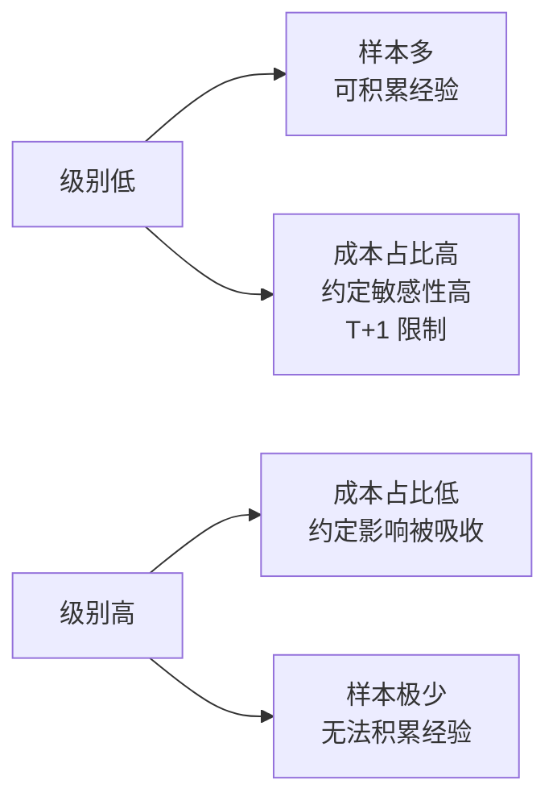

# 第 29 章 · 同级别分解

> 三类买卖点讲完了，但还有一个实际问题没解决：
> **我到底该在哪个级别上做判断？**
>
> 这一章讲原著给的答案——同级别分解——以及它依赖的结合律，
> 和它带来的一个必须回答的问题：**分解的唯一性。**

## 29.1 结合律与多义性的由来

〔定义〕**走势类型连接的结合律**（第 36 课）：
走势类型的连接满足结合律，即 `A+B+C = (A+B)+C = A+(B+C)`，
而且 `A`、`B`、`C` 的级别**可以不同**。

原著据此指出（转述）：任何一段走势，都可以根据不同的级别进行分解——
用 `An-m` 表示按 `n` 级别对 `A` 段做的第 `m` 段分解，就有：

```text
A = A₁₋₁ + A₁₋₂ + ⋯          （按最低级别分解）
  = A₅₋₁ + A₅₋₂ + ⋯          （按另一级别分解）
  = A日₋₁ + A日₋₂ + ⋯         （按更高级别分解）
```

〔推论〕**同一段走势有多种都合法的分解方式。** 这就是**多义性**的来源
（第 31 章会专门讲）。

⚠️ 本书已经在第 20 章 Q5 用过一次结合律：
当 `A` 的级别大于 `B` 时，把 `a+A+b+B+c` 改写成 `a+A+(b+B+c)`。
那正是结合律的一个应用。

## 29.2 同级别分解

〔定义〕**同级别分解**：把一段走势完全拆成**同一级别**的走势类型的连接。

原著（第 36 课，转述）指出：按某级别进行操作，
站在纯理论的角度，无非等价于**选择上面等式列中的某一个子式**来操作。

〔推论〕**选择操作级别 = 选择一种分解方式。**

这句话把"我该看哪个周期"这个含糊的问题，变成了一个明确的选择：
你在选**用哪一层的走势类型来组织你的判断**。

## 29.3 分解必须唯一

原著在第 38 课强调了一件事（转述）：
多义性**不是**含糊性；对已完成走势类型的连接进行分解，
就像解题时设定不同的参数——参数的设定有一定随意性，
但一个好的参数设定会让问题变简单。
而且，**一个好的分解，其分解规则下必须保证分解的唯一性**。

〔推论〕**"多义性"允许的是"选择哪一套分解规则"，
不允许的是"同一套规则下有多种结果"。**

这是一个非常重要的区分，本书在第 11 章 Q4 已经遇到过：

| | 多义性 | 约定分歧 |
|---|---|---|
| 是什么 | 同一段走势可按不同**级别**分解 | 同一级别下算出了不同的笔和线段 |
| 允许吗 | **允许**（结合律保证都合法） | **不允许**（说明约定不同或实现有 bug） |
| 层次 | 走势类型的组合层 | 几何层 |

〔推论〕**凡是能通过统一约定消除的分歧，都不是多义性。**

### 几何层的唯一性，原文是直接断言的

第 38 课讲的是**走势类型组合层**的唯一性要求。而在更下面的几何层，
作者说得更硬（转述）：

- **笔**：所有的图形，都可以**唯一地**分解为上下交替的笔的连接（第 65 课）；
- **线段**：一切同一级别图上的走势都可以**唯一地**划分为线段的连接（第 67 课）。

也就是说，唯一性在原文里**不是对分解规则提的要求，而是被断言的性质**。

⚠️ 但要读准它的范围。第 11 章实测显示，两份都自称"按缠论划的笔"的实现，
端点重合率可以只有 17.3%。这与原文的断言并不冲突：

```text
原文的"唯一"  ：给定完整规则后，结果唯一（算法是确定性的）
本书的 17.3%  ：不同规则之间的差异
```

〔推论〕**原文保证的是"同一约定集内部无歧义"，
它不保证"不同人会选到同一个约定集"。**
后者正是第 11 章那张 16 项清单存在的理由。

## 29.4 操作级别怎么选

原著给了几条考虑（第 15、26、31 课，转述），本书归纳如下：

| 考虑 | 说明 |
|---|---|
| **资金量** | 大资金在小级别上买不到足够的量 |
| **时间投入** | 级别越低，需要盯的频率越高 |
| **性格** | 能不能承受中枢震荡期间的来回 |
| **资金期限** | 钱必须是长期无压力的（第 34 章） |

本书要补三条**结构性**的考虑，它们来自前面各部分的实测：

**一、级别越高，样本越少。**
第 17 章实测：级别链只有 3~4 层，顶层中枢只有个位数。
所以**在高级别上，你一生遇到的信号可能只有几次**——
这既意味着机会稀少，也意味着**你无法通过经验积累来改进判断**。

**二、级别越低，约定敏感性越高。**
第 24 章 24.3 节的限制二：每降一级，约定的影响叠加一次。
低级别上两个人的分解差异更大。

**三、级别越低，成本占比越高。**
第 12 章实测中枢宽度中位数 3.4%（日线）。
更低级别的中枢更窄，而交易成本是固定的——
**存在一个级别，低于它之后成本会吃掉全部波动**。第 37 章会算这个临界点。

〔推论〕**操作级别的选择，本质上是在"样本量"与"成本 / 约定敏感性"之间取舍。**



## 29.5 换档：小级别操作升级为大级别

原著在第 40 课讨论了一个实际情形（转述）：
一个小级别的介入，结果出现了大级别的上涨，这时候怎么办？

两个选择：

1. **继续按小级别操作**——代价是相当累，
   而且小级别对精度要求比大级别高、资金容纳度低；
2. **升级为大级别操作，同时部分保持小级别操作**——
   对较大资金更实用。

原著指出（转述）：在同级别分解下，
**小级别的操作可以按一个自动模式换档成高级别的操作**——
因为若干连续的小级别走势类型累加起来，恰好构成一个大级别的走势类型。

〔推论〕**换档的可行性来自级别的递归结构本身**：
`A = A₅₋₁ + A₅₋₂ + ⋯` 这个等式列意味着，
小级别的分解与大级别的分解描述的是**同一段走势**，
所以可以在任何时候切换视角。

⚠️ 但换档有一个代价，原著没有强调而本书要指出：

〔推论〕**换档意味着换一套判据，而两套判据的信号位置不同。**
在小级别上"已经卖出"的位置，在大级别上可能"还没到卖点"。
所以换档的时机本身是一个**需要事先规定**的约定——
临时换档等于事后改规则，那是第六部分要讲的典型错误。

## 常见说法辨析

| 说法 | 证据强度 | 辨析 |
|---|---|---|
| "多义性意味着怎么分都行" | ❌ 明确错误 | 原著明说"多义性不是含糊性"，而且要求**同一套规则下分解必须唯一**（第 38 课）；几何层更是直接断言唯一（第 65、67 课）。允许的是选规则，不是选结果 |
| "原文说分解唯一，所以不同实现结果应该一样" | ❌ 明确错误 | 混淆了两个层次。原文的"唯一"是**给定规则后结果唯一**；不同实现选了不同规则，端点重合率实测可低至 17.3%（第 11 章）。唯一性保证的是确定性，不是跨实现的一致性 |
| "两个人分解不同，这是多义性" | ⚠️ 有争议 | 要看差在哪一层。若差在**级别选择**上，可能都合法；若差在**同一级别的笔和线段**上，那是约定分歧或 bug（29.3 节） |
| "级别越低越精确" | ❌ 明确错误 | 低级别的约定敏感性更高（第 24 章）、成本占比更高（第 37 章）。"精确"和"可靠"不是一回事 |
| "级别越高越可靠" | ⚠️ 缺乏证据 | 大级别噪声占比低，这个直觉有道理；但实测顶层中枢只有个位数（第 17 章），**样本量小到无法验证可靠性**，也无法积累经验 |
| "可以随时换档" | ⚠️ 有争议 | 结构上可行（29.5 节），但换档等于换一套判据。**换档时机必须事先规定**，临时换档是事后改规则 |
| "选好级别就一劳永逸" | ⚠️ 有争议 | 级别选择是在样本量与成本/敏感性之间取舍（29.4 节）。取舍的前提（资金量、时间、成本水平）会变，所以这个选择需要复核 |

## 思考题

**Q1.** 结合律说什么？它为什么会带来多义性？

**Q2.** 原著说"多义性不是含糊性"。请说明它允许什么、不允许什么，
并举一个"看起来像多义性、其实是约定分歧"的例子。

**Q3.** 本书补的三条结构性考虑是什么？请说明它们如何构成一个取舍。

**Q4.**【判读】某人说："我本来做 30 分钟级别，看到日线也涨就改成日线持有了。"
请指出这个做法的问题。

**Q5.**【标签】"小级别操作可以自动换档成大级别"属于哪一类命题？

**Q6.**【查证】在你的实现里，对同一段数据分别按两个级别做同级别分解，
统计两种分解下买卖点的数量与位置差异。

> 📖 **参考答案**（想清楚再看）：
> [Q1](../../qa/29-decomposition-qa.md#q1) ·
> [Q2](../../qa/29-decomposition-qa.md#q2) ·
> [Q3](../../qa/29-decomposition-qa.md#q3) ·
> [Q4](../../qa/29-decomposition-qa.md#q4) ·
> [Q5](../../qa/29-decomposition-qa.md#q5) ·
> [Q6](../../qa/29-decomposition-qa.md#q6)

## 本章实操

两档都**不需要开户、不需要下单**。

### 🅐 手工版：同一段走势，两种分解

**需要**：第 27 章 🅐 档标过买卖点的那段图、
[走势分解记录表](../../forms/decomposition-log.md)。

1. 用**你原来的级别**，把这段走势做一次完整的同级别分解，
   列出走势类型序列（盘整/上涨/下跌）。
2. 换到**高一档**的近似级别，重做一次。
3. 填两行记录表，级别列分别注明。
4. 对比：
   - 两种分解的**段数**差多少？
   - 第 1 步里的一个完整走势类型，在第 2 步里是什么？
   - 两种分解下，**买卖点的位置一样吗**？
5. 关键一问：如果有人问你"这段走势是什么"，
   你会怎么回答才**既准确又不含糊**？

第 5 步的正确答案不是选一个，而是**两个都说，并各自注明级别**——
这与第 3 章 🅐 档的落点是同一个。

### 🅑 代码版：分解唯一性检验

**需要**：第 17 章实现的递归与第 25~27 章的买卖点判定。

**第一步：实现同级别分解**

```text
给定级别 L：
  把走势完全拆成 L 级别走势类型的连接
  输出：[(类型, 起, 止), ...]
```

**第二步：唯一性断言（本章的核心）**

| 断言 | 依据 |
|---|---|
| **同一级别、同一套约定下，分解结果唯一** | 第 38 课 |
| 分解覆盖全部区间，不重叠不留空 | 定义 |
| 相邻走势类型不同向 | 第 1 章 |

⚠️ 第一条怎么测：**用不同的起点扫描同一段数据**
（比如从第 1 笔开始 vs 从第 3 笔开始），看落在公共区间上的分解是否一致。
不一致说明你的分解规则**不满足唯一性**——按第 38 课，那是一个坏的规则。

**第三步：跨级别对比**

先填[检验预登记表](../../forms/prereg-template.md)。
对 L 与 L+1 两个级别分别分解，报告：

1. 走势类型的段数；
2. 三类买卖点的数量；
3. 买卖点的**位置重合率**。

**第四步：换档规则**

如果你要实现换档（29.5 节），**把换档条件写成参数**：

```text
upgrade_rule = "never" | "on_L+1_signal" | "on_position_size" | ...
```

⚠️ 换档条件必须**事先写死**。运行中根据结果决定换不换，
就是事后改规则（第六部分）。

**第五步：登记**

结果登记进[出处与资料](../../sources.md)第五节。

## 🔎 看盘时的用处

1. **选级别 = 选一种分解。** 不是"看哪个周期顺眼"。
2. **多义性只允许选规则，不允许同规则下多结果。**
3. **低级别：样本多但成本高、约定敏感。** 高级别反之。
4. **换档条件要事先定。** 临时换档 = 事后改规则。
5. **回答"这段是什么"时，把级别带上。** 两个级别都说也没关系。

> ⚖️ 本书只讲方法与检验，不推荐任何标的、不预测行情、不构成投资建议。
> 市场有风险，任何据此产生的后果由读者自负。
