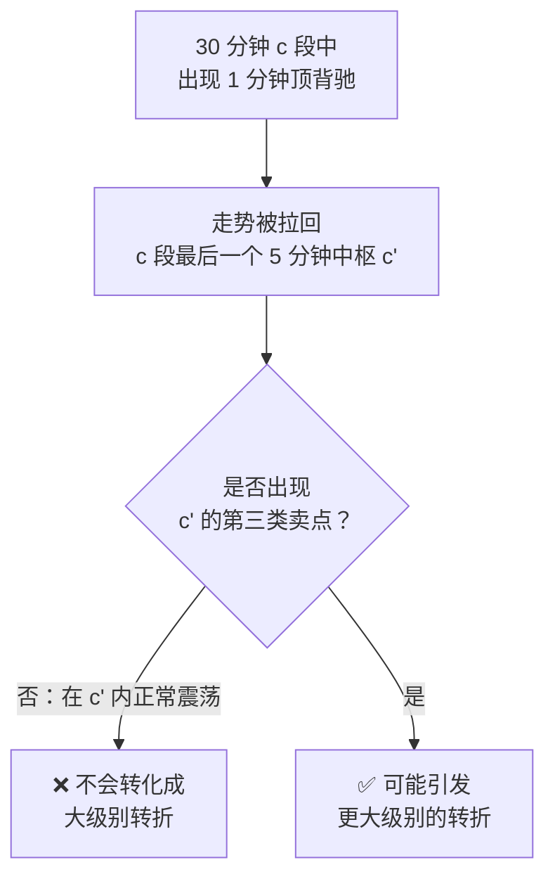

# 第 33 章 · 小级别背驰引发大级别转折

> 第 25 章 Q5 留了一个扣子：
> "5 分钟背驰所以日线要转折"是错的，但"小级别背驰引发大级别转折"
> 又确实是原著讨论过的现象（第 44 课）。
>
> 这一章把条件讲清楚——**它成立，但条件相当苛刻。**

## 33.1 先分清三种情况

原著在第 43 课先做了一个分类（转述）：
转折必然由背驰导致，但背驰导致的转折**不一定是同一级别的**。

| 情况 | 背驰级别 vs 当下走势级别 | 难度 |
|---|---|---|
| 一 | 相等 | 最一般，好把握 |
| 二 | 背驰级别**小于**走势级别 | **本章的主题** |
| 三 | 背驰级别大于走势级别 | 由第 23 章的定理处理 |

〔推论〕**第二种是唯一需要额外条件的情况**——
因为它看起来像"小的推动了大的"，与直觉相反。

## 33.2 条件

原著（第 44 课，转述）以一个向上的 30 分钟级别 `a+A+b+B+c` 为例，
分析 `c` 段里出现 1 分钟级别顶背驰的情形：

**第一步：`c` 里必然包含更小级别的中枢。**

`c` 至少要包含一个 5 分钟中枢——否则中枢 `B` 根本不可能完成，
因为那样不可能形成对 `B` 的第三类买卖点（这正是第 20 章前提三）。

设 `c'` 是 `c` 中**最后一个** 5 分钟中枢。

**第二步：1 分钟顶背驰只能出现在 `c'` 之后。**

**第三步：这个顶背驰必然把走势拉回 `c'` 里。**

于是整个运动可以看成**围绕 `c'` 的一次震荡**。

**第四步：关键条件。**

〔推论〕要让这次震荡演变成大级别的向下变动，
**必须出现 `c'` 的第三类卖点**。

也就是说：

> **对于那些小级别背驰后，能在最后一个次级别中枢里正常震荡的走势，
> 都不可能转化成大级别的转折。**



〔推论〕**所以"小级别背驰引发大级别转折"不是一个自动发生的事，
它需要一个明确的、可判定的后续条件。**

## 33.3 为什么这个条件是这样

这一节说明条件的**结构逻辑**，不是死记。

第三类卖点的含义是：**一个次级别走势向下离开中枢，
回抽的高点不升破 `ZD`**（第 27 章）。它标志着**中枢被有效跌破**。

所以"出现 `c'` 的第三类卖点"意味着：

```text
c' 这个 5 分钟中枢被跌破
  ⟹ c 段的最后一个次级别结构失效
    ⟹ c 段本身可能没走完/走坏
      ⟹ 30 分钟这一层的结构受到影响
```

反过来，如果只是在 `c'` 里震荡：

```text
c' 仍然有效
  ⟹ c 段的结构完好
    ⟹ 30 分钟层面什么都没发生
```

〔推论〕**级别之间的影响必须通过"下一层结构被破坏"来传导**，
不能跳级。一个 1 分钟的背驰，要影响 30 分钟，
必须先影响 5 分钟（把 `c'` 跌破），才能往上走。

这条推论比具体条件更值得记住，因为它给了一个通用的判断框架：

> **小级别的事件要影响大级别，必须逐层破坏中间层的结构。**

## 33.4 常见的误用

〔推论〕**误用的根源是跳过了"逐层传导"这一步。**

三个典型：

**一、直接跨级别下结论。**
"5 分钟背驰 → 日线转折"——中间隔了 30 分钟这一层，
跳过了对中间层结构是否被破坏的检查。这是第 25 章 Q5 处理过的错误。

**二、把"可能"读成"必然"。**
原著给的是一个**条件**，满足条件才可能；不满足则**不可能**。
而流传中常被简化成"小级别背驰可以引发大级别转折"——
省掉了条件，就变成了一句永远不会错的话。

**三、把小级别背驰本身当成信号。**
第 22 章 22.3 节引过原著的话：日线上涨中段刚开始时，
即使 5 分钟出现背驰，其下跌力度显然有限，甚至可以不管。

〔推论〕**同一个小级别背驰，在大级别结构的不同位置上，含义完全不同。**
所以判断它之前，必须先知道**大级别走到哪了**——
而这又回到第 3 章：不说级别，什么都判不了。

## 33.5 本书能测什么、不能测什么

按本书前面的实测状况：

| 要测的 | 样本量状况 |
|---|---|
| 30 分钟级别的 `a+A+b+B+c` 结构 | 可以有一定数量（30 分钟对象数约是日线的 8 倍，第 3 章） |
| 其中 `c` 段出现 1 分钟背驰的 | 需要 1 分钟数据——**可得性受限**（第 4 章） |
| 其中满足"出现 `c'` 第三类卖点"的 | 更少 |

〔推论〕**这条断言在本书的数据条件下无法被有意义地检验。**

理由链：

1. 日线上的趋势背驰只有 8 个（第 20 章）；
2. 降到 30 分钟能增加约 8 倍，但需要 1 分钟数据来判"小级别背驰"；
3. 而免费源的分钟线历史深度受限（第 4 章实测：5 分钟线最早到 2020 年），
   1 分钟数据更难获得且通常不复权（第 2 章 2.5 节）。

⚠️ 所以本章**没有实测**。这不是疏漏，是数据约束——
本书按纪律**明说**，而不是用一个样本量为个位数的统计充数。

**但有一件事是可以做的**，留给读者（🅑 档）：
测"小级别背驰之后，是否出现了次级别中枢的第三类卖点"这个**条件本身**的频率。
这不需要判断大级别转折，只需要判断条件满没满足，样本量会大得多。

## 常见说法辨析

| 说法 | 证据强度 | 辨析 |
|---|---|---|
| "小级别背驰可以引发大级别转折" | ⚠️ 有争议 | 省掉了条件就变成一句永远不错的话。原著给的是**有条件**的结论：必须出现最后一个次级别中枢的第三类买卖点（33.2 节） |
| "5 分钟背驰所以日线要转折" | ❌ 明确错误 | 跳过了逐层传导。要影响日线，必须先破坏 30 分钟层的结构（33.3 节） |
| "小级别背驰后在中枢里震荡，说明还要再跌" | ❌ 明确错误 | 恰恰相反。原著明说：能在最后一个次级别中枢里**正常震荡**的，**都不可能**转化成大级别转折 |
| "小级别背驰都要重视" | ❌ 明确错误 | 同一个小级别背驰，在大级别结构的不同位置含义完全不同。日线上涨中段的 5 分钟背驰，原著说甚至可以不管（第 25 课） |
| "这条断言已经被验证了" | ⚠️ 缺乏证据 | 本书**未检验**，且说明了为什么在当前数据条件下测不了（33.5 节）。"未检验"不等于"错" |
| "级别之间可以直接影响" | ❌ 明确错误 | 必须逐层传导（33.3 节的〔推论〕）。这是本章最该带走的通用框架 |

## 思考题

**Q1.** 原著把"背驰导致的转折"分成哪三种情况？哪一种需要额外条件？

**Q2.** 写出"小级别背驰引发大级别转折"的条件，并说明它的结构逻辑。

**Q3.**【标签】"能在最后一个次级别中枢里正常震荡的，都不可能转化成大级别转折"
属于哪一类命题？

**Q4.** 33.3 节给出一个通用框架。请用一句话概括它，
并说明它如何解释第 25 章 Q5 那个错误。

**Q5.** 本章为什么没有实测？请说出理由链，
并指出本书在这种情况下遵循了什么纪律。

**Q6.**【查证】在你的实现里，测一个**本书没测**的量：
在次级别背驰之后，出现"最后一个次次级别中枢的第三类买卖点"的频率是多少？

> 📖 **参考答案**（想清楚再看）：
> [Q1](../../qa/33-small-triggers-large-qa.md#q1) ·
> [Q2](../../qa/33-small-triggers-large-qa.md#q2) ·
> [Q3](../../qa/33-small-triggers-large-qa.md#q3) ·
> [Q4](../../qa/33-small-triggers-large-qa.md#q4) ·
> [Q5](../../qa/33-small-triggers-large-qa.md#q5) ·
> [Q6](../../qa/33-small-triggers-large-qa.md#q6)

## 本章实操

两档都**不需要开户、不需要下单**。

### 🅐 手工版：走一遍传导链

**需要**：能切周期的行情软件、[背驰记录表](../../forms/divergence-log.md)。

1. 在**较大周期**上找一段 `a+A+b+B+c` 结构（第 19 章 🅐 档做过）。
2. 切到**小一档周期**，在 `c` 段内部找出**最后一个中枢** `c'`，
   标出它的 `[ZD, ZG]`。
3. 再切到**更小一档**，在 `c'` 之后找一个背驰点。
4. 从背驰点往后跟踪，判断：
   - 走势有没有被拉回 `c'` 里？（按 33.2 节，应该会）
   - 有没有出现 `c'` 的**第三类卖点**？
5. 记录结论：
   - **没有**第三类卖点 → 按原著，这次不可能引发大级别转折；
   - **有** → 继续跟踪大级别结构是否真的变化。

第 5 步的两种情形都要记——**尤其是"没有"的那些**，
它们才是这条判据的主要输出（第 20 章 P3 的同一条纪律）。

### 🅑 代码版：测条件本身的频率

**需要**：至少两个级别的数据。⚠️ 注意第 4 章的分钟线约束。

**第一步：实现传导链的判定**

```text
对每个次级别背驰点：
  1. 找到它所在的 c 段
  2. 找出 c 段内最后一个次次级别中枢 c'
  3. 判断背驰后走势是否被拉回 c' 内
  4. 判断是否出现 c' 的第三类卖点
输出：(拉回?, 第三类卖点?)
```

**第二步：自检**

| 断言 | 依据 |
|---|---|
| 背驰点必在 `c'` 之后 | 33.2 节第二步 |
| `c` 段内必含至少一个次次级别中枢 | 33.2 节第一步（否则 `B` 无法完成） |
| 每个背驰点都能归入"拉回/未拉回" | 完整性 |

⚠️ 第二条断言很有价值：如果测出"`c` 段内没有中枢"的情形，
说明 `B` 的完成判定有问题（回到第 20 章前提三）。

**第三步：统计条件频率（本章的核心）**

先填[检验预登记表](../../forms/prereg-template.md)。报告：

1. 次级别背驰点总数；
2. 其中"被拉回 `c'`"的比例（预期：接近 100%，这是〔推论〕）；
3. 其中**出现 `c'` 第三类卖点**的比例 ← **这是本书没测的量**。

第 3 项的意义：它告诉你这个条件**有多容易满足**。

- 如果比例很高（比如 > 50%），说明这个条件筛选力弱，
  "小级别背驰引发大级别转折"会是常见事件；
- 如果很低，说明它确实是一个罕见的、需要特别识别的情形。

**第四步：诚实报告限制**

⚠️ 在报告里明写：本实验测的是**条件的频率**，
**不是**"条件满足后大级别是否真的转折"。后者需要更长的数据与更多样本，
按 33.5 节在当前数据条件下测不了。

**第五步：登记**

结果登记进[出处与资料](../../sources.md)第五节。

## 🔎 看盘时的用处

1. **级别之间必须逐层传导。** 这是本章最通用的一条。
2. **小级别背驰后在中枢里震荡 = 不会掀翻大级别。** 记反了会很麻烦。
3. **看条件，不看现象。** 关键是有没有出现次级别中枢的第三类买卖点。
4. **同一个小背驰在不同位置含义不同。** 先看大级别走到哪了。
5. **省掉条件的断言等于没说。** "可以引发"是一句永远不错的话。

> ⚖️ 本书只讲方法与检验，不推荐任何标的、不预测行情、不构成投资建议。
> 市场有风险，任何据此产生的后果由读者自负。
