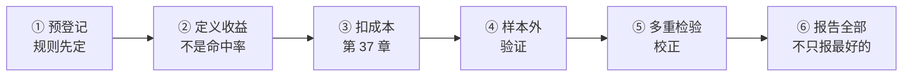

# 🛠 项目 P5 · 一次诚实的检验

> 全书的方法论落点。第 27 章留了一个 66%，并列出它的六个缺口。
> 这个项目把它**按完整流程重做一遍**。
>
> ⚠️ **本项目不保证得到正面结论。**
> 检验之后发现原来的观察站不住，同样是一个完整的、值得报告的结果——
> 而且在本书的样本条件下，这很可能就是结局。

## 为什么这个项目值得做

前面五个部分积累了大量"看起来有意思"的观察：

| 观察 | 出处 | 状态 |
|---|---|---|
| 三买后下一笔超越前高 66% vs 对照 49% | 第 27 章 | 六个缺口 |
| 前三根 K 线决定全天 97% vs 基准 61% | 第 32 章 | ✅ 被支持，但只是描述性的 |
| 第三类买卖点数量是第一类的 37 倍 | 第 27 章 | 描述性事实 |

〔推论〕**观察不等于结论。** 从观察到结论之间，隔着一整套流程。
这个项目就是走完那套流程。

## 流程



六步，一步都不能省。下面逐步说明。

## ① 预登记：规则先定

**这是最重要的一步，也是第 27 章那个 66% 缺得最狠的一步。**

填完[检验预登记表](../../forms/prereg-template.md)，**填完之后不许改**。

必须写死的内容：

| 项 | 说明 |
|---|---|
| 要检验的命题 | 一句话，且必须是〔经验断言〕 |
| **什么结果会推翻它** | 填不出来就说明它不可证伪，别检验 |
| 样本范围 | 标的、时间区间、**怎么选的**（规则先定还是事后挑的） |
| 22 项约定 | 全部取值 |
| 收益定义 | 见第 ② 步 |
| 成本假设 | 见第 ③ 步 |
| **一共会试多少组规则/参数** | 多重检验要用 |

⚠️ **为什么"不许改"这么重要**：

在同一批数据上反复试不同的规则，总能试出一个看起来显著的。
这就是**数据窥探**。预登记的唯一作用，就是**剥夺你事后微调的余地**——
而这正是它的价值所在。

## ② 定义收益：不是命中率

〔推论〕**"方向命中率"推不出盈亏**（第 27 章缺口一）。

必须定义一次完整的买卖：

```text
入场：信号出现后的哪一个时点、什么价格？
出场：什么条件下出场？（另一个信号？固定持有期？）
收益：(出场价 − 入场价) / 入场价
```

三个容易出错的地方：

| 坑 | 说明 |
|---|---|
| **前视偏差** | 用了信号确认时点**之后**才知道的信息。第 16 章那条滞后链在这里必须严格遵守 |
| **出场条件不对称** | 盈利用一套规则、亏损用另一套 → 结果无意义 |
| 用收盘价入场 | 收盘价是集合竞价产物（第 2 章 2.4 节），实际成交未必是它 |

⚠️ **前视偏差是最隐蔽的**。举例：第三类买点的确认需要"回试走完"，
所以入场最早只能在**回试段结束之后**——
如果你用回试段的最低价入场，那是**未来函数**。

## ③ 扣成本

按第 37 章的口径。⚠️ **费率以当前实际为准，本书不写死数字**
（规则会变，见[出处与资料](../../sources.md)第二节的纪律）。

要扣的至少包括：

| 项 | 说明 |
|---|---|
| 佣金 | 双边 |
| 印花税 | 单边（卖出） |
| 买卖价差 | 至少一个最小变动单位 |
| 冲击成本 | 按你的资金量估 |

**参照量级**（本书实测的中枢宽度）：

| 级别 | 中枢宽度中位数 |
|---|---|
| 日线 | 2.9% ~ 3.4% |
| 30 分钟 | **0.87%** |

〔推论〕**级别越低，成本占可捕获波动的比例越高。**
所以成本假设必须和你选的级别匹配着报。

## ④ 样本外验证

把数据分成两段：

```text
样本内（In-sample）   ← 允许在这里探索、观察、形成假设
样本外（Out-of-sample）← 只允许跑一次，用预登记的规则
```

⚠️ **三条硬规则**：

1. 样本外**只跑一次**。跑完不满意就回去改规则，那样本外就污染了；
2. 划分**按时间**，不要随机打乱（时间序列的样本不独立）；
3. 划分比例**事先定**，写进预登记表。

〔推论〕**样本外验证的价值，完全来自"只跑一次"这条纪律。**
跑第二次，它就退化成了样本内。

## ⑤ 多重检验校正

〔推论〕**试的规则越多，"最好的那个"越可能只是运气。**

**最简单的做法**（Bonferroni）：

```text
若一共试了 m 组规则/参数
显著性阈值从 α 调整为 α / m
```

⚠️ 这个校正**很保守**，但它的好处是**算法简单、不可能作弊**。

更重要的是**诚实报告 `m`**：

| 情况 | `m` 应该是多少 |
|---|---|
| 只试了 1 组 | 1 |
| 试了 3 种力度度量 | ≥ 3 |
| 试了 3 种度量 × 4 组 MACD 参数 | ≥ 12 |
| **试了但没记下来的** | **也要算进去** |

〔推论〕**`m` 应当包含你试过的**全部**组合，
而不只是最终报告的那些。** 这一点无法被外人核查，
所以它完全依赖你的诚实——这也是为什么预登记表要求事先写下 `m`。

## ⑥ 报告全部结果

**最后一条，也是最容易被违反的一条。**

必须报告：

| 内容 | 为什么 |
|---|---|
| **全部** `m` 组规则的结果 | 只报最好的那组，等于没做检验 |
| 样本内与样本外的结果**分开报** | 两者差距本身就是信息 |
| 与预期不符的结果 | 尤其是这些 |
| 所有已知的局限 | 第 27 章那七个缺口逐条对照 |

**报告模板**：

```text
【命题】⟨一句话⟩（〔经验断言〕）
【推翻条件】⟨什么结果会推翻它⟩

【预登记】日期 ⟨…⟩，m = ⟨…⟩ 组
【样本】标的 ⟨匿名⟩，区间 ⟨…⟩，选取方式 ⟨规则先定 / 事后挑⟩
【约定】22 项取值 ⟨…⟩
【收益定义】入场 ⟨…⟩，出场 ⟨…⟩
【成本假设】⟨…⟩

【样本内结果】全部 m 组：⟨表⟩
【样本外结果】⟨表⟩（只跑了一次）
【多重检验】Bonferroni 校正后：⟨…⟩

【局限】
  ① 样本量 ⟨n⟩，有效样本量可能更小（样本不独立）
  ② 未按市场环境分组（第 34 章的第七个缺口）
  ③ 约定敏感性未测 / 已测：⟨…⟩
  ④ ⟨其他⟩

【结论】⟨支持 / 不支持 / 样本量不足以判断⟩
```

⚠️ 最后一行**允许**是第三个选项。
"样本量不足以判断"是一个**完整的结论**，不是失败。

## 🅐 手工版：不跑代码也能做

**需要**：纸笔、行情软件、[检验预登记表](../../forms/prereg-template.md)。

手工版做不了大样本，但可以**完整走一遍流程**——
而流程本身才是这个项目要教的。

1. **选一条小命题**。建议从第 32 章那条开始（"前三根决定全天"），
   因为它**每天都有一个样本**，手工也能攒到几十个。
2. 填预登记表，**特别是"什么结果会推翻它"和"基准是多少"**。
3. 定收益 / 观察量（这条命题的观察量是"极值在不在前三根"，很简单）。
4. 取**样本内** 20 天做观察，**样本外** 20 天只判一次。
5. 算两段的比例，与基准 61% 对照。
6. 按 ⑥ 的模板写报告，**包括你试过但没采用的判法**。

第 6 步是重点。手工做的时候，你会发现自己**试过好几种判法**
（比如"最高点在前三根"和"至少一个在前三根"）——
**那就是 `m > 1`**，必须报告。

## 🅑 代码版

**需要**：项目 P4 冻结导出的信号序列。

### 第一步：确认输入是冻结的

⚠️ 检查 `config_hash`。**整个检验期间不许重新生成信号**——
那等于事后改规则。

### 第二步：按六步流程实现

每一步都要有对应的代码与输出，不能跳。

### 第三步：三个必须避开的陷阱

| 陷阱 | 检查方法 |
|---|---|
| **前视偏差** | 逐个信号检查：入场时点用到的信息，在那个时点**都已知**吗？ |
| **样本外污染** | 加一个标志位：样本外数据**只允许被读取一次** |
| **`m` 漏计** | 每次运行都记录参数组合，最后统计**去重后的组合数** |

第三条建议用代码强制：把每次实验的参数写进一个日志文件，
最后 `m` 直接从日志统计——**而不是凭记忆填**。

### 第四步：把第 27 章那个观察重做一遍

具体到那个 66%：

| 缺口 | 这次怎么补 |
|---|---|
| ① 观察量不是收益 | 改成完整买卖的收益率 |
| ② 未扣成本 | 按第 37 章口径扣 |
| ③ 非预登记 | 这次先填表 |
| ④ 样本不独立 | 报告有效样本量的估计，或按标的分组报 |
| ⑤ 未测约定敏感性 | 至少测第 18、20 项 |
| ⑥ 对照组构造 | 用第 27 章 Q5 设计的**严格对照组** |
| ⑦ 未分市场环境 | 按时间段分组报（第 34 章 Q4） |

### 第五步：登记

结果登记进[出处与资料](../../sources.md)第五节，
**无论结论是什么**。

## 验收标准

- [ ] 预登记表在动手**之前**填完，且没有修改过？
- [ ] "什么结果会推翻它"填出来了？
- [ ] 收益定义包含入场、出场、且**无前视偏差**？
- [ ] 成本扣了，且成本假设与级别匹配？
- [ ] 样本外**只跑了一次**？
- [ ] `m` 包含了**全部试过的**组合？
- [ ] 报告了**全部** `m` 组结果，不只是最好的？
- [ ] 局限逐条列出（至少七条，对照上表）？
- [ ] 结论允许是"样本量不足以判断"？

## 最后一句

〔推论〕**这个项目的产出不是一个结论，是一个**能被别人复核的过程**。**

如果做完之后你的结论是"在本样本上不支持"，
或者"样本量不足以判断"——**那是一个好结果**。
它意味着你**没有**从一堆不足以支撑结论的数据里硬挤出一个结论，
而这正是本书从第 1 章讲到这里的全部纪律所指向的地方。

> ⚖️ 本书只讲方法与检验，不推荐任何标的、不预测行情、不构成投资建议。
> 市场有风险，任何据此产生的后果由读者自负。
