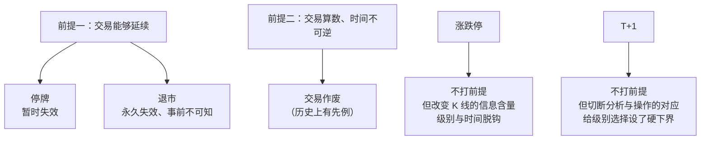

# 第 36 章 · A 股制度约束

> 原著第 26 课自己指出了理论的"死穴"：
> **成立的前提是交易能够延续且算数。**
>
> 这一章把 A 股的四条制度逐一对照这个前提，
> 说清楚各自打在哪里、后果是什么。

## 36.1 前提是什么

〔推论〕整套理论依赖两个前提（第 26、30 课）：

| # | 前提 | 用在哪 |
|---|---|---|
| 一 | **交易能够延续** | 原理二的证明（第 18 章 18.2 节） |
| 二 | **交易是算数的、时间不可逆** | 第 30 课：本理论以交易时间不可逆为前提 |

原著对第二条说得很直白（转述）：如果今天的交易可以变成昨天的、
或者干脆不算了，那理论马上土崩瓦解。

下面四条制度，分别打在这两个前提上。

## 36.2 停牌：序列断裂

**机制**：停牌期间没有成交，价格序列出现空档。

〔推论〕**停牌使"正在进行的走势类型"冻结在未完成状态**——
它既没有延伸，也没有结束。

三个具体后果：

**一、复牌跳空不带力度含义。**
复牌后第一根 K 线与停牌前最后一根之间的跳空，
**不是**第 18 课讨论的那种"级别极低、力度极大"的快速运动，
而是**根本没有交易**（第 2 章 2.4 节）。

**二、几何层的索引错位。**
如果用自然日期做位置计算，停牌会让索引错位。
所以本书全程要求用**交易日序号**（第 5 章 🅑 档、第 11 章）。

**三、中枢判定可能被跨越。**
一个中枢的三段构成段，如果中间隔了长期停牌，
那么"重叠"这个判断跨越了一段没有交易的时间——
它在形式上仍然成立，但**含义已经改变**。

〔推论〕**停牌打的是前提一，但只是暂时失效**——复牌后交易恢复。

## 36.3 退市：前提永久失效

**机制**：交易永久终止。

〔推论〕**退市使前提一永久失效**，而且是**事前不可知**的。

这比停牌严重得多：

| | 停牌 | 退市 |
|---|---|---|
| 前提失效 | 暂时 | **永久** |
| 事前可知 | 通常有公告 | **不可知** |
| 对分析的影响 | 序列断裂 | 最后一段走势类型**永远不会完成** |

〔推论〕**所以"交易能延续"这个前提，在任何具体标的上都只是一个假设**——
而且是一个你无法验证的假设。

⚠️ 这不是一个纯理论的问题。它有一个很实际的后果：

**回测中的幸存者偏差。** 如果你的样本只包含**今天还在交易**的标的，
那么你已经系统性地排除了那些退市的——
而按第 26 课，那些恰恰是理论不适用的样本。

〔推论〕**一个只用现存标的做的回测，会高估这套方法的适用范围。**

⚠️ **本书自己的实测也有这个问题**：7 个样本都是至今仍在交易的标的。
这是本书的一个局限，在此明说。

## 36.4 涨跌停：级别与时间脱钩

**机制**：触及涨跌停后价格被锁住。极端情形是一字板——全天只在一个价位成交。

⚠️ 具体的涨跌幅档位因板块而异，且会调整——
以沪深北交易所现行规则为准（见[出处与资料](../../sources.md)第二节）。
本书只讲机制。

〔推论〕**涨跌停使"级别"与"时间"脱钩**（第 2 章 2.4 节、第 3 章 3.3 节）。

本书已经在三处遇到它的后果：

| 后果 | 出处 |
|---|---|
| 一字板只构成最低级别中枢的延伸，连续多日也不升级 | 第 2 章（第 20 课） |
| 用周期近似级别的做法在此失真 | 第 3 章 3.3 节 |
| **最强的日内走势反而被判为"有中枢"** | 第 32 章实测 |

第三条最反直觉，也最能说明问题：
涨跌停锁住价格后，K 线区间完全重叠，
按中枢定义**必然构成中枢**——而中枢意味着"没有推进"。

〔推论〕**制度把最极端的走势，变成了在形式上最"平静"的形态。**

这不打在前提上，但它**改变了 K 线所携带的信息**——
所以它影响的是整个几何层的输入（第 2 章 2.1 节）。

## 36.5 T+1：分析级别与可执行级别分离

**机制**：当日买入的股票次日才能卖出。

〔推论〕**对只能做多的账户，日内级别的完整买卖结构不可执行。**

这一条不影响**分析**，但它切断了**分析与操作之间的对应**：

```text
分析：可以在任何级别上识别买卖点
操作：低于某个级别的完整结构做不了
```

**具体后果**：

**一、小级别分析的用途被限定。**
它仍然可以用来给大级别的介入点定位（区间套，第 24 章），
但**不能**直接当成小级别的操作计划。

**二、级别选择的下界被制度设定。**
第 29 章 29.4 节说操作级别是"样本量 vs 成本/敏感性"的取舍——
T+1 在这个取舍上加了一个**硬下界**：
无论你多想降级别换样本量，日内那一层都是做不了的。

**三、区间套的"做"与"看"分离。**
第 24 章 24.3 节限制三说过这一点：
区间套在看的层面可以一直降，在做的层面受 T+1 限制。

## 36.6 汇总：四条制度对照两个前提



〔推论〕**四条制度里，只有停牌与退市直接打在前提上；
涨跌停与 T+1 打在"输入"和"输出"上。**

这个区分很实用：

| 类型 | 影响 | 应对 |
|---|---|---|
| **打前提**（停牌、退市） | 理论**不适用** | 识别并排除这些样本，或明确标注 |
| **打输入**（涨跌停） | 分析**失真** | 识别并单独处理（第 22 章的失效标记） |
| **打输出**（T+1） | 分析**不可执行** | 调整级别选择，接受下界 |

## 36.7 本书实测中的制度痕迹

回看前面各部分，制度的影响其实一直在数据里：

| 实测发现 | 制度来源 |
|---|---|
| 一字线占比是数据体检的一项 | 涨跌停（第 4 章 P1） |
| 交易日缺口 = 疑似停牌 | 停牌（第 4 章） |
| 每交易日恰好 8 根 30 分钟 K 线 | 交易时长规定（第 3、4 章） |
| **无中枢日占 0%** | 涨跌停 + 8 根 K 线的结构限制（第 32 章） |
| 免费源不提供逐笔 | 数据供给，非制度（第 4 章） |

〔推论〕**制度不是一个需要单独考虑的"外部因素"，
它已经内嵌在每一根 K 线里了。**

## 常见说法辨析

| 说法 | 证据强度 | 辨析 |
|---|---|---|
| "缠论是普适的，不分市场" | ⚠️ 有争议 | 定义层确实与市场无关。但**前提**（交易延续、时间不可逆）与**输入**（K 线的信息含量）都受制度影响，所以"普适"要限定在定义层 |
| "停牌就是一个缺口" | ❌ 明确错误 | 缺口是**交易造成的**快速运动，停牌是**根本没有交易**。把它当力度信号读是把噪声当信号（第 2 章） |
| "退市是小概率，可以不管" | ⚠️ 有争议 | 概率大小不是重点，重点是它**事前不可知**，且会造成回测的**幸存者偏差**——只用现存标的做的回测会高估适用范围（36.3 节） |
| "T+1 只影响操作不影响分析" | ⚠️ 有争议 | 对分析确实不直接影响，但它**切断了分析与操作的对应**，并给级别选择设了硬下界（36.5 节） |
| "涨跌停时理论失效" | ❌ 明确错误 | 更准确：涨跌停**不打前提**，它改变的是 K 线的信息含量。理论仍然适用，只是输入退化了 |
| "只要交易不停，理论就一直成立" | ⚠️ 有争议 | 前提一确实是这样。但还有前提二（交易算数、时间不可逆），以及输入是否失真、输出是否可执行——四件事要分开看 |

## 思考题

**Q1.** 原著给出的两个前提是什么？四条制度分别打在哪里？

**Q2.** 为什么说退市比停牌严重？请给出两条理由。

**Q3.** 什么是幸存者偏差？它如何影响本书自己的实测？

**Q4.**【标签】"涨跌停使级别与时间脱钩"属于哪一类命题？

**Q5.** 36.6 节把四条制度分成"打前提 / 打输入 / 打输出"三类。
请说明这个分类的实用价值。

**Q6.**【查证】去交易所官网，查一条本章没有具体展开的规则
（退市标准、ST 规则、临时停牌、盘后交易等任选），
说明它作用在两个前提中的哪一个，或作用在输入/输出上。

> 📖 **参考答案**（想清楚再看）：
> [Q1](../../qa/36-market-rules-qa.md#q1) ·
> [Q2](../../qa/36-market-rules-qa.md#q2) ·
> [Q3](../../qa/36-market-rules-qa.md#q3) ·
> [Q4](../../qa/36-market-rules-qa.md#q4) ·
> [Q5](../../qa/36-market-rules-qa.md#q5) ·
> [Q6](../../qa/36-market-rules-qa.md#q6)

## 本章实操

两档都**不需要开户、不需要下单**。

### 🅐 手工版：找一次前提失效

**需要**：行情软件。

1. 找一只**有过长期停牌**的标的（在 K 线图上表现为日期不连续）。
2. 停牌前后各取一段，观察：
   - 停牌前最后一根 K 线与复牌第一根之间，价格差多少？
   - 如果不看日期，你能分辨这是"跳空"还是"停牌"吗？
3. 尝试在跨越停牌的区间上划一个中枢：
   - 三段的重叠在形式上成立吗？
   - 它的**含义**和不跨停牌的中枢一样吗？
4. 记录结论。
5. **加做一步**：查一下这只标的停牌的原因与时长
   （交易所公告或行情软件的信息栏）。

第 2 步的第二问是重点——**光看 K 线分辨不出来**，
这正是为什么数据体检要单独检查交易日连续性（第 4 章）。

### 🅑 代码版：把制度痕迹标出来

**需要**：项目 P1 的数据底座。

**第一步：给每根 K 线打制度标记**

```text
is_limit       一字线（开=高=低=收）
gap_before     前一个交易日与本日的日历间隔（识别停牌）
is_suspended   成交量为 0 或数据缺失
```

**第二步：统计**

| 指标 | 说明 |
|---|---|
| 一字线占比 | 对照第 4 章 P1 的体检项 |
| 疑似停牌次数与总时长 | 按交易日间隔判定 |
| 跨越停牌的中枢数量 | **这是本书没统计过的量** |

第三项值得单独做：**有多少中枢的三段构成段之间跨越了停牌？**
这些中枢的"重叠"在形式上成立，但含义可疑。

**第三步：敏感性**

先填[检验预登记表](../../forms/prereg-template.md)。
把"跨越停牌的中枢"剔除，重跑第三、四部分的关键统计
（中枢数、趋势占比、背驰数），看结果变化多少。

**第四步：幸存者偏差（本章最重要的一项）**

如果你能拿到**已退市标的**的历史数据：

1. 把它们加入样本，重跑关键统计；
2. 对比只用现存标的的结果。

⚠️ 大多数免费数据源**不提供已退市标的的数据**——
如果拿不到，**在报告里明写这个局限**，
就像本书在 36.3 节做的那样。

**第五步：登记**

结果登记进[出处与资料](../../sources.md)第五节。

## 🔎 看盘时的用处

1. **看到日期不连续，先查停牌。** 跳空和停牌看起来一样。
2. **退市的风险在于事前不可知。** 所以"交易能延续"永远只是假设。
3. **一字板不是强，是信息塌缩。** 最极端的走势形态上最平静。
4. **T+1 给级别选择设了硬下界。** 想降级别换样本量，到日内就到头了。
5. **制度已经内嵌在 K 线里。** 它不是需要额外考虑的因素，是输入的一部分。

> ⚖️ 本书只讲方法与检验，不推荐任何标的、不预测行情、不构成投资建议。
> 市场有风险，任何据此产生的后果由读者自负。
