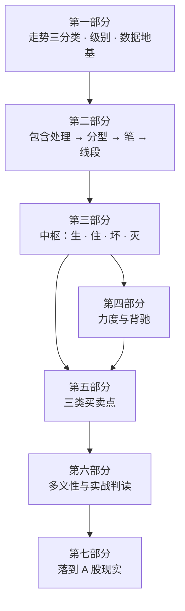

# 学习路线图

这是一份**活的大纲**。写作过程中发现结构不合理会改，改动记进文末「调整记录」。

## 为什么不按原著的课号顺序

原著《教你炒股票》是**按时间顺序**发表的博客合集，不是一本按依赖关系编排的书。
照课号顺序读有三个坑：

1. **前 14 课讲的是被作者自己取代的框架**。那一段整套建立在两条均线的"吻"上；
   到第 25 课，作者自己写道：均线系统本质上和 MACD 是一回事，只能当辅助工具，
   不要和中枢混在一起。照课号顺序学，等于先花大力气学一套后来被废弃的东西。
2. **理论真正的地基在第 17 课**（走势中枢的定义 + 两条基本原理 + 两条分解定理），
   而它依赖的"高低点怎么算"却要到第 62 课以后才严格定义。
3. **理论与解盘、议论混排**。原文里大量篇幅是当日行情点评、具体标的操作、
   人身议论与自我评价——这些对学定义毫无帮助，且本书出于合规与版权考虑一律不收录。

所以本书**按定义的依赖关系重排**：先把"图上的点怎么来"讲清楚（第二部分），
再讲中枢（第三部分），才有资格讲力度与买卖点。

## 进度总览

| 部分 | 章节 | 状态 |
|---|---|---|
| 第一部分 · 入门与地基 | 1–5 + P1 | ✅ **已完成** |
| 第二部分 · 可计算的几何层 | 6–11 | ✅ **已完成** |
| 第三部分 · 中枢 | 12–18 + P2 | ✅ **已完成** |
| 第四部分 · 力度与背驰 | 19–24 + P3 | ⬜ 未开始 |
| 第五部分 · 三类买卖点 | 25–30 + P4 | ⬜ 未开始 |
| 第六部分 · 多义性与实战判读 | 31–35 + P5 | ⬜ 未开始 |
| 第七部分 · 落到 A 股现实 | 36–39 | ⬜ 未开始 |

全书 **7 部分 · 39 章 · 5 个实战项目**。

---

## 第一部分 · 入门与地基

把"看图各说各话"这个真问题摆出来，说明缠论想解决什么，并把数据地基打好。

| 章 | 标题 | 主要内容 | 状态 |
|---|---|---|---|
| 1 | 走势只有三类 | 上涨 / 下跌 / 盘整；六种两段组合；两条基本原理与两条分解定理；为什么必须引入中枢 | ✅ |
| 2 | [你在看的到底是什么](chapters/01-foundation/02-what-you-see.md) | K 线是有损压缩；**复权**为什么是第一坑；前复权历史会被重写；制度如何塑形 K 线 | ✅ |
| 3 | [级别](chapters/01-foundation/03-levels.md) | 递归定义与最低级别；**周期 ≠ 级别**；周期阶梯与级别阶梯对不上；两条实现路线 | ✅ |
| 4 | [拿到可复现的行情](chapters/01-foundation/04-data.md) | **实测**数据源能力；可得性取决于网络出口；未复权的危害不在多在极端 | ✅ |
| 5 | [均线与「吻」：被取代的早期框架](chapters/01-foundation/05-ma-kiss.md) | 早期体系；**实测**参数是事件密度旋钮；滤波 vs 序关系；不要混用的三条理由 | ✅ |
| P1 | [🛠 搭一个可复现的行情底座](chapters/01-foundation/project-P1-data-foundation.md) | 口径声明 + 冻结快照 + 体检报告 + 环境实测报告，四样缺一不可 | ✅ |

## 第二部分 · 可计算的几何层

⚠️ **本部分的严格定义不在已掌握的第 1–48 课里**（在第 62 / 65 / 67 课）。
写作时必须另找公开出处并在 [出处登记](sources.md) 里标明，不许凭记忆补。

| 章 | 标题 | 主要内容 | 状态 |
|---|---|---|---|
| 6 | [K 线的包含处理](chapters/02-geometry/06-inclusion.md) | 为什么必须合并；向上/向下处理；四项约定；**实测**合并率 24.9%、初始方向影响很小 | ✅ |
| 7 | [分型](chapters/02-geometry/07-fractal.md) | **分型 = 方向序列的变号点**；顶底必然交替（可证）；确认滞后与回撤重画；强弱判据是可选层 | ✅ |
| 8 | [笔](chapters/02-geometry/08-stroke.md) | 硬条件「不共用 K 线」筛掉 70.7%；**老笔新笔实测只差 9%**；被忽略的「成笔失败怎么办」 | ✅ |
| 9 | [线段（上）：为什么笔不够用](chapters/02-geometry/09-segment-why.md) | **笔不是走势类型**（几何层与递归层的接缝）；三笔是下界不是完成；笔中枢 vs 线段中枢 | ✅ |
| 10 | [线段（下）：特征序列与「两种情况」](chapters/02-geometry/10-segment-how.md) | 缺口信息只在反方向笔里；**实测第二种情况占 39.6%，是主干不是边角**；七步实现清单 | ✅ |
| 11 | [把几何层写成程序](chapters/02-geometry/11-implementation.md) | 16 项约定清单；**实测端点重合率最低 17.3%**，影响最大的一项最少被声明；14 条自检断言 | ✅ |

## 第三部分 · 中枢

理论的核心。这一部分讲完，缠论的骨架就立起来了。

| 章 | 标题 | 主要内容 | 状态 |
|---|---|---|---|
| 12 | [中枢的定义](chapters/03-pivot/12-pivot-def.md) | 三段重叠；两组记号的分工；**实测**区间宽度中位数 3.4% | ✅ |
| 13 | [中枢的延伸](chapters/03-pivot/13-pivot-extend.md) | **实测 76.5% 的中枢会延伸**；9 段升级是人为约定，影响约 12% | ✅ |
| 14 | [中枢的新生与趋势](chapters/03-pivot/14-pivot-new.md) | 「绝对不重叠」有多严；**实测趋势仅占 16.4%**，换口径变 95.7% | ✅ |
| 15 | [中枢的扩张](chapters/03-pivot/15-pivot-expand.md) | 级别提升的唯一通道；**实测 79.3% 走向扩张** | ✅ |
| 16 | [中枢三定理](chapters/03-pivot/16-pivot-theorems.md) | 破坏需「离开 + 回抽不回来」两步；判定流程图穷尽三种去向 | ✅ |
| 17 | [走势类型与级别的递归](chapters/03-pivot/17-recursion.md) | 三个「三」的辨析；**实测盘整占 84%、级别链仅 3~4 层** | ✅ |
| 18 | [走势终完美](chapters/03-pivot/18-perfection.md) | 四条命题逐条标注；原理一不可证伪但有三个正当用途 | ✅ |
| P2 | [🛠 给一段行情做完整中枢标注](chapters/03-pivot/project-P2-pivot-annotation.md) | 交付可被复核的分解：19 项约定 + 标注表 + 敏感性测试 | ✅ |

## 第四部分 · 力度与背驰

| 章 | 标题 | 主要内容 | 状态 |
|---|---|---|---|
| 19 | 力度 | "力度"怎么落到可计算的定义上；`a+A+b+B+c` 结构 | ⬜ |
| 20 | 背驰的严格条件 | 必须是趋势；两中枢必须同级别；没有趋势就没有背驰 | ⬜ |
| 21 | 盘整背驰 | 与趋势背驰的区别；它为什么常转化成第三类买卖点 | ⬜ |
| 22 | MACD 作为辅助 | 它在算什么；为什么"大致能用"；它在哪些情形下骗人 | ⬜ |
| 23 | 背驰—转折定理 | 背驰之后的三种演化：中枢扩展 / 更大级别盘整 / 反趋势 | ⬜ |
| 24 | 区间套 | 逐级收缩定位转折点；这个方法的精度极限在哪 | ⬜ |
| P3 | 🛠 背驰识别与记录 | 🅐 手工填背驰记录表 / 🅑 代码批量标注并统计 | ⬜ |

## 第五部分 · 三类买卖点

| 章 | 标题 | 主要内容 | 状态 |
|---|---|---|---|
| 25 | 第一类买卖点 | 趋势背驰构成；它与中枢的位置关系 | ⬜ |
| 26 | 第二类买卖点 | 第一类之后的次级别回抽；"大级别第二类 = 次级别第一类" | ⬜ |
| 27 | 第三类买卖点 | 离开中枢后回试不回中枢；它为什么后知后觉 | ⬜ |
| 28 | 完备性 | 原著为什么说"只有三类"；这个主张属于哪一类命题 | ⬜ |
| 29 | 同级别分解 | 操作级别怎么选；结合律与分解的唯一性要求 | ⬜ |
| 30 | 持股与持币 | 等待也是操作；走势的"当下性" | ⬜ |
| P4 | 🛠 把三类买卖点写成信号函数 | 🅐 用判定清单人工走一遍 / 🅑 写成可复现的函数 | ⬜ |

## 第六部分 · 多义性与实战判读

| 章 | 标题 | 主要内容 | 状态 |
|---|---|---|---|
| 31 | 走势的多义性 | 结合律；同一段图的多种合法分解；多义性不是含糊性，但它代价是什么 | ⬜ |
| 32 | 每日走势的分类 | 用当日中枢数量给一天的走势分类 | ⬜ |
| 33 | 小级别背驰引发大级别转折 | 什么时候小级别的背驰会掀翻大级别 | ⬜ |
| 34 | 资金管理 | 原著里最经得起推敲的一部分：钱必须是长期无压力的 | ⬜ |
| 35 | 常见说法辨析总表 | 缠圈话术逐条标注证据强度，说明它为什么流传 | ⬜ |
| P5 | 🛠 一次诚实的检验 | 规则先定、样本后取；预登记表；报告全部结果而非最好结果 | ⬜ |

## 第七部分 · 落到 A 股现实

扩展部分，篇幅上不喧宾夺主，但缺了它这本书就是悬空的。

| 章 | 标题 | 主要内容 | 状态 |
|---|---|---|---|
| 36 | A 股制度约束 | T+1 / 涨跌停 / 停牌 / 退市 / ST；原著自己承认的"理论死穴"在哪里被触发 | ⬜ |
| 37 | 交易成本与执行摩擦 | 佣金、印花税、冲击成本；小级别操作被成本吃掉的临界点 | ⬜ |
| 38 | 学术界怎么看技术分析 | 数据窥探问题；多重检验；综述性结论与它的适用边界 | ⬜ |
| 39 | 边界与天花板 | 这套工具的合理用法；合规与法律边界 | ⬜ |

---

## 调整记录

| 日期 | 改动 | 原因 |
|---|---|---|
| 2026-09-11 | 建立七部分 39 章骨架，**刻意不采用原著课号顺序** | 原著是时间序博客合集，前 14 课的均线体系已被作者自己取代；按定义依赖关系重排 |
| 2026-09-11 | 第二部分标注"原文未掌握" | 手上材料只到第 48 课，分型 / 笔 / 线段的严格定义在其后 |
| 2026-09-12 | 第一部分完成。第 4、5 章改为**实测驱动**，不再只做定性讨论 | 这本书与姊妹书的根本差异就是行情数据可跑；能算的就不该只用形容词 |
| 2026-09-12 | 第二部分完成。第 11 章从"参考实现"改为**约定清单 + 敏感性实测** | 实测发现不同约定下笔端点重合率最低仅 17.3%，且影响最大的一项（成笔失败处理）几乎从不被声明——"列清单"比"给一份实现"对读者更有用 |

> ⚖️ 本书只讲方法与检验，不推荐任何标的、不预测行情、不构成投资建议。
> 市场有风险，任何据此产生的后果由读者自负。
