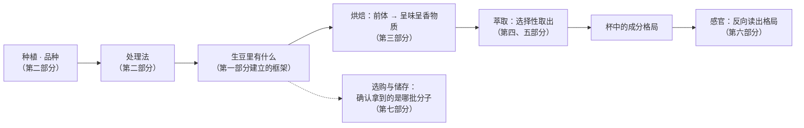

# 第一部分 · 咖啡的物质基础（导读）

> **这一部分不碰任何器具**，却是全书唯一不能跳过的部分。
> 因为后面六个部分——处理法、烘焙、萃取、冲煮、杯测、选购——
> 讲的全是同一件事的不同环节，而这件事需要先在这里被定义清楚。

## 为什么从"成分"开始，而不是从"怎么冲"开始

初学咖啡最常见的路径是这样的：买器具 → 找一个网红配方 → 照着做 →
好喝就继续，不好喝就换个配方。这条路能走通，但会卡在一个地方：

> **换一支豆，配方就不管用了；而你不知道该往哪个方向改。**

原因是配方记录的是**手法**，而手法只是手段。真正在变的是三件事：

1. 这支豆里**有哪些成分**（上游 + 烘焙决定）；
2. 这些成分**有多容易被水带走**（分子性质决定）；
3. 你的操作**把哪些成分带走了多少**（冲煮决定）。

一旦你用这三件事的语言来想问题，"该往哪个方向改"就不再是玄学。
所以本书的组织方式是：

中间那一格「**生豆里有什么**」就是第一部分的任务。

## 这一部分的五章各自解决什么

| 章 | 它回答的问题 | 它为哪些后续章节埋线 |
|----|------------|---------------------|
| 1 · 一颗咖啡豆里有什么 | 苦、酸、甜、body 各自来自哪些分子？生豆成分在烘焙中会变成什么？ | 几乎所有后续章节。第 16、17 章的烘焙化学、第 21~24 章的萃取原理都直接接在这一章上 |
| 2 · 咖啡果与咖啡豆的结构 | 一颗果子从外到内有哪几层？哪些层在处理法里被处理掉？ | 第 10、11 章（处理法）、第 18 章（豆内结构与萃取） |
| 3 · 水 | 一杯咖啡里 98% 是水，它是溶剂还是参与者？ | 第 21、22 章（萃取）、第 24 章（水温） |
| 4 · 风味是怎么被感知的 | 为什么"风味"不等于"味觉"？描述能力是可训练的吗？ | 第六部分（杯测与感官）全部 |
| 5 · 咖啡与健康 | 怎么读一项关于咖啡的研究？机构结论说了什么、没说什么？ | 独立成章，不与技术章节耦合 |

> **关于第 5 章的一句预先声明**：本书**不做任何医疗或健康建议**。
> 那一章只讲"怎么判断一项研究的证据等级"，以及各机构的公开结论**原话与适用范围**。
> 不会出现摄入量建议，也不会出现疗效或风险承诺。

## 读这一部分时的三个提示

**第一，数字只用来建立量级感，不要背。**
本书所有成分含量都写成区间，并标注出处与波动原因（品种、产地、采收年份、
分析方法都会让数字漂移）。你要带走的是"谁多谁少、多在哪一头"，不是小数点。

**第二，"某成分对应某味道"永远是简化。**
真实的味觉是混合物中多种成分的相互作用（协同、抑制、掩盖）。
本书凡是用"A 对应 B"的说法时，都会注明这个对应关系的**证据强度**——
有些是实验室分离验证过的，有些只是相关性，还有些是流传甚广但没有依据的。

**第三，遇到"常见说法辨析"表请慢读。**
那是每一章信息密度最高的地方。咖啡圈的说法大多不是凭空来的——
它们通常在某个特定场景下确实成立，然后被过度推广了。
理解"它为什么流传"比记住"它是错的"更有用。

---

**从这里开始**：[第 1 章 · 一颗咖啡豆里有什么：成分与风味的对应](01-bean-composition.md)
