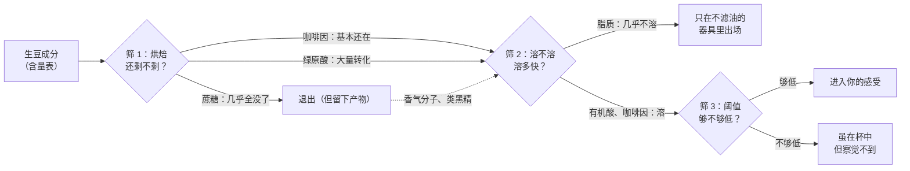
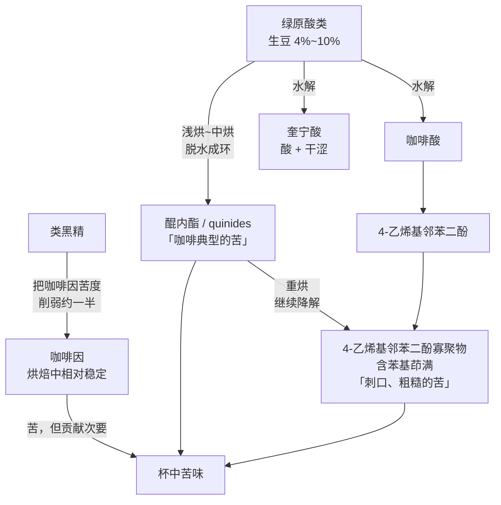

# 第 1 章 一颗咖啡豆里有什么：成分与风味的对应

> **本章目标**：把"苦、酸、甜、body"这四个日常词，换成分子的名字。学完这一章，
> 你能说出一杯咖啡的苦**主要不是**咖啡因贡献的、能说出生豆里的蔗糖到哪儿去了、
> 能解释为什么滤纸冲和法压壶的口感差别不是心理作用。
>
> 更重要的是：本章最后会从"成分的溶解与转化"推出一条**冲煮第一原理**——
> 它是后面第四、五部分所有调参动作的依据。
>
> **这是全书唯一不能跳过的一章**。它不需要任何器具。

## 1.1 先看一张成分表，然后解释它为什么长这样

先看生豆的组成。下表是**干基**[^1]质量百分比，取自一篇 2026 年的烘焙建模论文对文献区间的汇总[^2]，
并用另一篇 2021 年综述的实测数据做交叉验证[^3]：

| 成分 | 阿拉比卡[^4] | 罗布斯塔[^5] | 交叉验证的实测值 |
|------|------------|------------|----------------|
| **多糖 + 纤维**（细胞壁为主） | 干重的**过半** | 同左 | 仅单一来源，见下方说明 |
| **脂质**（咖啡油） | 10~17% | 约 11% | 罗布斯塔实测 8.60~12.03% |
| **蛋白质** | — | — | 11.16~15.94%（乌干达阿拉比卡）/ 15.3~16.4%（罗布斯塔） |
| **绿原酸类**（CGA） | 4.0~8.0% | 7.0~10.0% | 阿拉比卡 4.89~7.60% / 罗布斯塔 5.84~9.57% |
| **蔗糖** | 6.0~9.0% | 0.9~4.0% | 阿拉比卡 4.43~9.31% / 罗布斯塔 3.15~4.85% |
| **咖啡因** | 0.8~1.4% | 1.7~4.0% | 阿拉比卡 1.05~1.53% / 罗布斯塔 1.81~2.61% |
| **葫芦巴碱** | 0.6~1.3% | 0.3~0.9% | 阿拉比卡 0.64~1.40% / 罗布斯塔 0.75~0.87% |
| **柠檬酸** | 0.2~0.6% | 0.2~0.7% | — |
| **游离氨基酸** | 约 0.5% | 0.8~1.0% | 0.27~0.48%（阿）/ 0.35~0.60%（罗） |
| **葡萄糖 / 果糖** | 各约 0.05% | 各约 0.2% | 0.02~0.33%，总之**极少** |
| **乙酸 / 酒石酸** | 0.02% 量级 | 0.02% 量级 | — |

含水率另算：**充分干燥后的生豆通常在 10%~12%**[^6]。
矿物质里**钾约占矿物质总量的 40%**，其余分散在约 30 种元素里[^6]。

> **⚠️ 读这张表的四条纪律**（本书所有成分表都适用）：
>
> 1. **看的是区间，不是数字**。同一物种内，产地与环境能让成分显著漂移——
>    有研究用主成分分析把埃塞俄比亚样品单独分离出来，特征正是"高蔗糖、低咖啡因"[^7]。
> 2. **多糖那一行只有一个来源**（"碳水化合物占生豆干重 50% 以上"[^6]），
>    本书按纪律标注"仅见于此"，不做更精确的表述。
> 3. **咖啡因区间存在明显分歧**：另一份乌干达阿拉比卡的参考值给到 **1.94~3.0 g/100 g**[^8]，
>    远高于上表。所以本书**不给单点数字**，只写量级关系。分歧已登记在
>    [出处与资料登记 §六](../../standards.md)。
> 4. **蛋白质、苹果酸、类黑精占比等几项，本书暂时给不出两个独立来源**，
>    所以表里留空或只写实测值，不补"看起来合理"的数字。

[^1]: [干基](../../glossary.md#dry-basis)（dry basis）——扣除水分后再算百分比。
[^2]: 本书编号 [C1]：Bruno 等 (2026), *Scientific Reports* 16:15857, Table 1「Representative literature ranges or mean chemical composition of green Arabica and Robusta coffee」。完整信息见[出处与资料登记 §4.1](../../standards.md)。
[^3]: 本书编号 [C2]：Bastian 等 (2021), *Foods* 10(11):2827, Table 1（按产地与处理法列出实测值）。
[^4]: [阿拉比卡](../../glossary.md#arabica)（*Coffea arabica*）。
[^5]: [罗布斯塔 / 卡内弗拉](../../glossary.md#canephora)（*Coffea canephora*）。
[^6]: 同 [C1]，正文部分。
[^7]: 本书编号 [C4]：Pettazzoni 等 (2026), *Plant Biology* 28(2):520–534。
[^8]: 本书编号 [C3]：Mbihayeimaana 等 (2026), *Plants* 15(14):2117。

### 这张表最重要的一条信息，不在任何一行里

它在**排序**里。

按含量从大到小：**多糖 ≫ 脂质 ≈ 蛋白质 > 绿原酸 ≈ 蔗糖 ≫ 咖啡因 ≈ 葫芦巴碱 > 游离糖 ≈ 有机酸**。

而按"对你嘴里那杯的贡献"排序，顺序**几乎完全不同**。
最多的多糖大部分是不溶的细胞壁；最少的那些有机酸却直接决定了你说"这豆酸不酸"。

> **所以第一章真正要教的不是含量表，而是这三个筛子**：
>
> 1. **它在烘焙中还剩不剩**（转化筛）；
> 2. **它溶不溶于水、多快溶**（溶解筛）；
> 3. **它的感知阈值有多低**（感官筛）。
>
> 一个成分要进到你的感受里，得**连过三关**。含量只决定它有没有资格参赛。

## 1.2 转化筛：生豆成分在烘焙里各自去了哪

这一节是**给后面第三部分（烘焙）埋的线**，所以只讲去向，不讲反应条件。

| 成分 | 烘焙中发生什么 | 留下什么 | 证据情况 |
|------|--------------|---------|---------|
| **蔗糖** | 一部分直接焦糖化[^9]，一部分水解成还原糖[^10]后参与美拉德反应[^11] | 大量香气分子 + 褐色高分子；**蔗糖本身"只剩痕量"**[^2] | 方向有共识 |
| **蛋白质 / 游离氨基酸** | 提供美拉德反应的**氨基一侧**；经斯特雷克降解[^12]生成醛类 | 香气分子；成品里游离氨基酸剩得很少 | 方向有共识 |
| **绿原酸类** | 异构化、差向异构化，并降解成**内酯**[^13]与咖啡酸[^14]等小分子 | **主要苦味物质的整条链条**（见 §1.4） | 强，见 §1.4 |
| **葫芦巴碱** | 热不稳定，"受到持续的降解"[^2] | 烟酸（niacin）+ N-甲基吡啶阳离子 + 吡啶类/吡咯类挥发物 | 两个来源方向一致[^2][^3] |
| **咖啡因** | **相对耐热** | 基本还是咖啡因 | 🔁 **有分歧**，见 §1.6 |
| **脂质** | 基本不挥发，但受豆内压力推动**向豆表迁移** | 咖啡油（含咖啡醇、咖啡豆醇等双萜） | 迁移方向有共识，定量弱 |
| **多糖** | 部分被解聚成可溶片段，其余仍是骨架 | 可溶多糖片段 + 类黑精[^15]的糖骨架 | 方向有共识 |

一组具体数字（**单一来源，按纪律标注**）：一项跨三个埃塞俄比亚产区的研究报告，
中度烘焙时绿原酸损失约 30%~55%（因产区而异），**深烘平均损失约 90%**[^3]。

> **这张表的要点，用一句话说**：
>
> **烘焙不是"把风味烤出来"，而是把一批"不好吃的前体"换成另一批"好吃的产物"。**
>
> 生豆几乎不能喝——它的可溶成分里酸和酚类占绝对优势，甜和香几乎为零。
> 蔗糖与氨基酸在生豆里**几乎不贡献风味**，它们贡献的是**一次交易的本金**。
> 所以第 10 章讲处理法、第 16 章讲美拉德，本质上都是在问同一个问题：
> **这笔本金有多少、能换到什么。**

[^9]: [焦糖化](../../glossary.md#caramelization)（caramelization）——糖自身受热，**不需要氨基参与**。
[^10]: [还原糖](../../glossary.md#reducing-sugar)（reducing sugars）。
[^11]: [美拉德反应](../../glossary.md#maillard)（Maillard reaction）。
[^12]: [斯特雷克降解](../../glossary.md#strecker)（Strecker degradation）。
[^13]: [绿原酸内酯](../../glossary.md#cql)（chlorogenic acid lactones, CQL）。
[^14]: [咖啡酸](../../glossary.md#caffeic-acid)（caffeic acid）——**不是**咖啡因，注意别混。
[^15]: [类黑精](../../glossary.md#melanoidin)（melanoidins）。

## 1.3 酸：来自哪些分子，以及一个诚实的空白

**酸味是咖啡里唯一"分子身份很清楚、但主次关系很不清楚"的味觉维度。**

生豆里的酸以**柠檬酸**（0.2~0.7%）、苹果酸为主，另有少量乙酸、酒石酸[^2]。
烘焙过程中，一部分酸被分解，另一部分被**生成**——包括甲酸、乙酸、乳酸，
以及绿原酸水解释放出的**奎宁酸**[^16]。

到了杯子里，一篇 2024 年的研究按"风味性质"挑了四种酸来测定：
**奎宁酸、乳酸、苹果酸、柠檬酸**[^17]。它对感知酸度的表述值得原样复述一遍（本书改写复述）：

> 该文写道，感知酸度**"被认为"**由一组有机酸引起——绿原酸、柠檬酸、苹果酸、乳酸、奎宁酸；
> 并且它与**可滴定酸度**[^18]的相关性，**"各项研究得出的结果互相冲突"**[^17]。

也就是说：

| 说法 | 文献实际支持的程度 |
|------|------------------|
| 咖啡的酸来自有机酸 | ✅ 有共识 |
| 主要是柠檬酸、苹果酸、乳酸、奎宁酸、绿原酸这几类 | ✅ 有共识（这几个名字被反复列出） |
| **其中哪一种主导感知酸度** | ⚠️ **文献没有指认**，本书不写 |
| "柠檬酸 = 明亮/柑橘感，苹果酸 = 柔和/苹果感" | ⚠️ 在纯溶液里成立，在咖啡这样的复杂基质里**缺乏可引用的验证** |
| "肯尼亚豆的酸来自磷酸" | ⚠️ 本书读到的文献里**未出现磷酸**，留到第 3、14 章再查 |

> **诚实说明**：这是本书第一次遇到"圈内说得很细、文献说得很粗"的情况，后面还会遇到很多次。
> 处理方式固定：**照文献的粗糙程度写**，把细的说法放进辨析表并标注证据强度。
> 你会失去一点"讲起来很顺"的爽感，换来的是不会把假知识当真知识用。

关于**奎宁酸**要单独说一句，因为它解释了一个常见现象：

> 奎宁酸是绿原酸降解的产物，它既酸又带**干、涩**的收口感。
> 由此可以理解为什么**烘过头的豆、或者在保温壶里放久了的咖啡**，
> 那股酸不讨喜——它不是"水果的酸"，而是"降解产物的酸"。
> 第 17 章会把这条链条讲完。

[^16]: [奎宁酸](../../glossary.md#quinic-acid)（quinic acid）。
[^17]: 本书编号 [A1]：Bratthäll 等 (2024), *Heliyon* 10(5):e26625（开放获取）。
[^18]: [可滴定酸度](../../glossary.md#titratable-acidity)（titratable acidity）——与 pH 不是一回事。

## 1.4 苦：本章最重要的一节

先说结论，再给证据：

> **咖啡的苦，主要不是咖啡因贡献的；主要贡献者是绿原酸在烘焙中生成的一系列产物。
> 而且"浅烘的苦"和"深烘的苦"在化学上是两拨不同的分子。**

### 证据链（这是本书迄今引用最密集的一段）

**第一步：感官导向的分离直接指向绿原酸产物，而不是咖啡因。**
2006 年一项"生物响应导向"（bioresponse-guided）的研究，把烘焙咖啡液逐级拆解并让人尝，
最终把主要苦味驱动者定位在**羟基肉桂酰奎宁酸（即绿原酸类）的烘焙产物**上——
即各种**醌内酯 / quinides**；所鉴定苦味物的苦味识别阈值低到 9.8~180 μmol/L（水中）[^19]。

**第二步：深烘的苦有另一套分子。**
2007 年的研究把咖啡酸加热，得到的苦味被描述为**"令人想起重烘意式咖啡的苦"**；
结构鉴定出 10 种苦味物（阈值 23~178 μmol/L），
其中**8 种是多羟基苯基茚满**[^20]，推定由 4-乙烯基邻苯二酚寡聚而来[^21]。

**第三步：两拨分子的生成/消失有先后。**
2010 年的定量研究直接把烘焙参数和苦味物浓度对起来：
**醌内酯在浅烘到中烘生成**，呈现"咖啡典型的苦味特征"；
而在**重烘**条件下它们**降解**成"刺口的、苦味粗糙的 4-乙烯基邻苯二酚寡聚物"[^22]。
同一篇还有一个对第四部分很关键的观察：**不同类别化合物的萃取行为不一样**。

**第四步：还有别的苦味物，而且都不是咖啡因。**
绿原酸/奎宁酸与斯特雷克醛形成的缩醛加成物（阈值 48~658 μmol/L）[^23]、
（呋喃-2-基）甲基取代的苯二酚与苯三酚（阈值 100~537 μmol/L）[^24]，都被鉴定为熟豆苦味物。

**第五步：咖啡因当然是苦的，但它的贡献还被基质削弱。**
苦味受体侧的研究确认 **TAS2R43** 是识别咖啡苦味的关键受体，咖啡因与咖啡醇都是其苦味配体[^25]。
但 2026 年一项 NMR + 感官研究发现：咖啡因与绿原酸成络**对咖啡因的苦味没有影响**，
而咖啡因会与**高分子类黑精级分**相互作用——在两者的**天然浓度**下，
类黑精把咖啡因的苦味强度**削弱了约一半**[^26]。该文在引言里直言：
自 1819 年 Runge 发现咖啡因以来，它在咖啡感官中的角色**"至今仍不清楚"**[^26]。

### 所以"咖啡因占苦味的 10%~30%"这个流传说法呢

**本书不引用任何百分比。**

咖啡圈广泛流传"咖啡因只占咖啡苦味的 10%~30%"。这个说法**方向是对的**
（咖啡因不是主要苦源），但本书**没有找到任何给出该百分比的一手文献**；
而最新的专门研究反而说咖啡因的感官角色"至今不清楚"[^26]。

> **按查证纪律，方向可以写，数字不能写。**
> 所以本书的写法是："主要苦味驱动者是绿原酸的烘焙产物[^19][^22]，
> 咖啡因虽苦但贡献次要，且会被类黑精削弱约一半[^26]"——
> 每一句都能追到具体文献，且没有一个编出来的百分比。

> **这张图值 5000 块器具钱**：它解释了为什么"把深烘豆冲淡一点"不能把它变成浅烘豆的口感。
> 你稀释的是浓度，而分子种类**已经在烘焙时被决定了**。

[^19]: 本书编号 [B1]：Frank、Zehentbauer & Hofmann (2006), *European Food Research and Technology* 222(5–6):492–508。
[^20]: [苯基茚满](../../glossary.md#phenylindane)（phenylindanes）。
[^21]: 本书编号 [B2]：Frank 等 (2007), *J. Agric. Food Chem.* 55(5):1945–1954。
[^22]: 本书编号 [B3]：Blumberg、Frank & Hofmann (2010), *J. Agric. Food Chem.* 58(6):3720–3728。
[^23]: 本书编号 [B6]：Gigl 等 (2021), *J. Agric. Food Chem.* 69(3):1027–1038；以及 [B4]：Frank 等 (2008), *J. Agric. Food Chem.* 56(20):9581–9585（3-O-咖啡酰-epi-γ-醌内酯，阈值 58 μmol/L）。
[^24]: 本书编号 [B5]：Kreppenhofer、Frank & Hofmann (2011), *Food Chemistry* 126(2):441–449。
[^25]: 本书编号 [B8]：Kim 等 (2026), *Nature Structural & Molecular Biology*（开放获取）。
[^26]: 本书编号 [B7]：Gigl、Kreissl & Frank (2026), *J. Agric. Food Chem.* 74(23):18243–18252（开放获取）。

## 1.5 甜与 body：两个最容易被误解的维度

### 甜：杯子里几乎没有糖

顺着 §1.2 的转化表往下推就会得到一个反直觉的结论：

- 生豆里蔗糖有 6%~9%（阿拉比卡）[^2]；
- 游离葡萄糖、果糖**本来就极少**（0.02%~0.33% 量级）[^2][^3]；
- 烘焙后蔗糖"只剩痕量"[^2]。

**所以你在一杯黑咖啡里感到的"甜"，基本不是糖的味道。**

那它是什么？本书能诚实说的只有：

| 可能的来源 | 证据情况 |
|-----------|---------|
| 残余的糖 | ❌ 量级上说不通（只剩痕量[^2]） |
| **苦与酸较低时的"相对甜感"**（对比效应） | ⚠️ 机理上合理，但本书未找到咖啡上的专门验证 |
| **香气诱导的甜感**（焦糖、坚果、水果类气味经回气嗅觉被读成"甜"） | ⚠️ 在食品科学里是成熟概念，咖啡专门研究本书尚未读到 |
| 类黑精等大分子带来的圆润口感被描述为"甜" | ⚠️ 同上 |

> **所以本书对"甜"的处理是**：把它当成一个**感知结果**，而不是一个成分。
> 第 4 章（感知）和第 36 章（描述语言）会接着讲。
> 现在只需要建立一个警觉：**当有人说"这支豆甜度高"，他描述的是感受，不是含糖量。**
>
> 顺便，这也是**加糖和"喝出甜"是两件完全不同的事**的原因。

### body：这是触觉，不是味觉

**body**[^27]（醇厚度）是舌面的**重量感与黏稠感**，属于触觉。它的物质基础有几条，
本书按证据强弱分开写：

| 贡献者 | 机理 | 证据情况 |
|-------|------|---------|
| **脂质**（咖啡油） | 几乎不溶于水，以微小油滴/乳浊形式存在；**能不能进杯子取决于滤材** | ✅ 有定量证据，见下 |
| **类黑精** | 由"多糖、蛋白质和多酚构成的褐色聚合物"[^28]，是**质地改良剂**，会提高体系黏度[^28] | ✅ 有直接研究 |
| 被解聚的**可溶多糖片段** | 提高黏度 | ⚠️ 方向有共识，咖啡上的定量弱 |
| **悬浮细粉**（不溶固体） | 物理上的颗粒感 | ⚠️ 机理清楚，本书未找到咖啡专门定量研究 |

**脂质那条有非常漂亮的定量证据**。一项 2025 年研究测了不同冲煮方式里咖啡醇与咖啡豆醇
（咖啡油的双萜成分，可作为油脂进入杯中的指示物）的浓度[^29]：

| 冲煮方式 | 咖啡醇 | 咖啡豆醇 |
|---------|-------|---------|
| 家用**滤纸**冲煮 | 12（4~24）mg/L | 8（3~19）mg/L |
| **煮沸**咖啡（不过滤） | **939 mg/L** | **678 mg/L** |
| 同一煮沸咖啡，**经布滤** | 28 mg/L | 21 mg/L |
| 部分意式样品 | 最高至 **2447 mg/L** | — |

> ⚠️ **该研究每组样本量只有 3~11 个，且意式样品的"部分"二字是原文措辞**——
> 意式的变异非常大，不要把 2447 当成"意式的典型值"。

但即便如此，这组数字说明的事非常硬：

> **滤纸和金属滤网/不过滤之间，进入杯中的脂质量差了约两个数量级。**
> 所以"法压壶更厚、滤纸更干净"**不是心理作用，是物质构成的差异**。
> 这也直接给出第 26 章（滤材）和第 30 章（意式）的一条主线。

还有一条来自类黑精的证据，恰好把 body 和涩[^30]连起来：
一项 2025 年研究分离出富酚类的类黑精级分，作者称这是
**"类黑精参与咖啡触觉风味的首个证据"**，该级分在"咖啡相关浓度"下产生**可感知的涩感**[^31]。
另一项冷萃研究也观察到，随烘焙度加深、液中类黑精显著上升，
感官上**坚果味、涩、苦、body、余韵同时增强**[^32]。

> **要带走的判断**：body 和涩**共用一部分物质基础**。
> 所以"想要更厚的 body"这个愿望，物理上经常同时带来"更涩"——
> 这不是你手法不好，是同一批大分子既增稠又结合唾液蛋白。

[^27]: [body](../../glossary.md#body)（醇厚度）。
[^28]: 本书编号 [A4]：Feng 等 (2024), *Food Hydrocolloids* 139。
[^29]: 本书编号 [A5]：Orrje 等 (2025), *Nutrition, Metabolism & Cardiovascular Diseases*。
[^30]: [涩](../../glossary.md#astringency)（astringency）——触觉/化学感受，不是味觉。
[^31]: 本书编号 [A3]：Linne 等 (2025), *Food & Function* 16(7):2870–2880。
[^32]: 本书编号 [A6]：Shi 等 (2024), *Foods* 13(19):3119（开放获取）。

## 1.6 常见说法辨析

按本书约定，逐条标注**证据强度**：✅ 有共识 / ⚠️ 有争议 / ❌ 明确错误 / **缺乏证据**。

| 说法 | 判定 | 说明 |
|------|------|------|
| "咖啡的苦主要来自咖啡因" | ❌ **明确错误** | 感官导向分离把主要苦味驱动者定位在绿原酸的烘焙产物（醌内酯等）[^19][^22]；咖啡因的苦还会被类黑精削弱约一半[^26] |
| "深烘更苦是因为咖啡因更多" | ❌ **明确错误**（两处都错） | ①没有来源认为烘焙会**增加**咖啡因；②深烘的苦来自醌内酯降解生成的 4-乙烯基邻苯二酚寡聚物（含苯基茚满）[^22]，是**另一类分子** |
| "浅烘的苦和深烘的苦不是一种苦" | ✅ **有共识**（本章少数能直接支持的圈内说法） | 醌内酯在浅中烘生成、呈"咖啡典型的苦"；重烘时降解为"刺口、粗糙"的寡聚物[^22] |
| "浅烘咖啡因比深烘高" | ⚠️ **有争议，且要先问"按什么量"** | 文献本身分歧：一源称咖啡因"相对耐热、烘焙中不显著降解"[^2]，另一源转引的研究报告下降 40%~60%[^3]（已登记[分歧 §六 #1](../../standards.md)）。**但更要紧的是计量基准**：烘焙会失重并膨胀（一爆前后约失重 5%，到中烘再失约 13%[^2]），**密度下降**——所以"一勺"深烘豆的**质量**比一勺浅烘豆小。按体积量和按重量量会得出方向不同的结论。本书的写法：**这不是化学问题，是计量问题** |
| "生豆没什么味道，风味全是烘出来的" | ⚠️ **一半对** | 风味分子确实几乎都在烘焙中生成，但它们的**本金**（蔗糖、氨基酸、绿原酸）由品种/产地/处理法决定[^2][^4]。准确说法：**烘焙决定兑换率，上游决定本金** |
| "咖啡里的甜来自残留的糖" | ❌ **明确错误** | 蔗糖烘焙后"只剩痕量"[^2]，游离糖本来就极少[^2][^3]。"甜"是感知结果，成因尚未有咖啡专门验证（§1.5） |
| "豆表出油说明豆子新鲜" | **缺乏证据** | 本书**未找到任何一手文献**支持"出油量 ↔ 新鲜度"。行业通行解释是出油与**烘焙度**和**放置/排气**相关（深烘豆很新鲜时就可能出油，浅烘豆放很久也可能不出油），但本书连这条解释也**只能标 ⚠️**——没查到可交叉验证的文献。已列入[不采信清单](../../standards.md) |
| "法压壶比滤纸厚，是心理作用" | ❌ **明确错误** | 咖啡油双萜浓度在滤纸冲煮与不过滤之间差约两个数量级（12 vs 939 mg/L）[^29]。是物质差异 |
| "罗布斯塔咖啡因大约是阿拉比卡的两倍" | ✅ **有共识（量级上）** | 两个独立来源都支持这个方向与量级[^2][^3]。但**不要记死数字**——区间重叠且报告间有分歧（[§六 #2](../../standards.md)） |
| "罗布斯塔更苦，是因为咖啡因多" | ⚠️ **归因可疑** | 罗布斯塔的咖啡因确实更高，但它的**绿原酸也更高**（7%~10% vs 4%~8%）[^2]——而绿原酸产物才是主要苦源[^19]。所以更可能是绿原酸这条链的贡献。本书标⚠️，第 6 章再查 |
| "同浓度的咖啡，味道就该差不多" | ❌ **明确错误** | 有直接实验：把冷冲与热冲**全部稀释到 2% TDS、并在同一温度供样**后，热冲的苦、酸、橡胶味仍显著更高，花香则冷冲更高[^33]。**浓度相同 ≠ 成分格局相同** |
| "涩是萃取过度的必然结果" | ⚠️ **不完整** | 涩与 body 共用一部分物质基础（类黑精等大分子）[^31][^32]，且随烘焙度上升同步增强[^32]。所以涩**可能**来自萃取，也可能来自豆本身与烘焙度 |
| "咖啡喝多了怎样怎样" | 本书**不评价** | 按纪律，咖啡与健康**只讲证据等级**，不给摄入量建议、不做疗效或风险承诺。留到第 5 章 |

[^33]: 本书编号 [A2]：Batali 等 (2022), *Foods* 11(16):2440（开放获取）。3×3×3 设计（3 产地×3 烘焙度×3 冲煮温度 4/22/92 ℃），全部样品统一稀释到 2% TDS 并在 4 ℃ 供样。

## 1.7 把三个筛子合起来：一条冲煮第一原理

现在把 §1.1 的三个筛子、§1.2 的转化去向、§1.3~1.5 的对应关系合起来推一遍。

**已经站得住的四个事实**：

1. **成分的溶解性天差地别**：有机酸与咖啡因等小分子易溶；苦味的醌内酯与寡聚物是较大的分子；
   脂质"几乎不溶于水"，能否进杯子取决于**滤材**而不是你怎么注水[^29]；
   大部分多糖是不溶的细胞壁骨架[^2]。
2. **不同类别化合物的萃取行为不同**——这是定量研究的直接观察[^22]，不是推测。
3. **浓度相同不代表成分格局相同**：统一稀释到 2% TDS 并统一供样温度后，
   不同冲煮温度的咖啡在苦、酸、花香上仍显著不同[^33]。
4. **成分之间会互相改写感受**：在天然浓度下，类黑精把咖啡因的苦度削掉约一半[^26]。

由这四条可以推出：

> ### 冲煮第一原理
>
> **你不能独立地给一杯咖啡"加甜"或"减苦"。**
>
> 你只有两件事可做：
>
> **(A) 改变这杯里有哪些分子可供溶出** —— 靠品种、处理法、烘焙度、以及滤材
> （滤材决定脂质与细粉这一整类能不能进来）。这一步在你拿到豆和器具时就已经基本定了。
>
> **(B) 在"哪些分子已经出来多少"这条时间序列上，选择停在哪一点** —— 靠研磨粒径、
> 水温、时间、搅拌。**这四个旋钮调的全都是同一件事：传质速率与路径长度。**
>
> **凡是 (A) 里不存在的东西，(B) 无论怎么调都拿不出来。**

这条原理立刻给出三个可执行的推论：

| 推论 | 为什么 | 在哪一章展开 |
|------|--------|------------|
| **"太苦"先问是哪种苦**：入口就苦 vs 尾段粗糙地苦，指向的分子不同，对策也不同（前者更可能是浓度/粉水比，后者更可能是烘焙度或萃取过度） | 醌内酯与寡聚物是不同分子、不同生成条件[^22] | 第 17、22 章 |
| **换器具（尤其换滤材）不是"调参数"，是换 (A)** | 滤纸 vs 不过滤的脂质差约两个数量级[^29] | 第 26、28、30 章 |
| **调参数时一次只动一个**，并且要预测方向再验证 | 因为 (B) 的四个旋钮调的是同一个物理量，互相可替代，一次动两个就无法归因 | 第 24 章、[冲煮记录表](../../forms/brew-log.md) |

> **一句话版的第一原理**（值得抄在手冲台上）：
>
> **豆和滤材决定"有什么"，研磨水温时间搅拌决定"取多少、取到哪一段"。
> 想要杯子里出现新东西，要换的是前者。**

## 1.8 🔎 买豆与冲煮时的用处

把这一章压缩成 5 个立刻能用的动作：

1. **买豆时先看"本金"字段**：品种、处理法、海拔、烘焙日期。
   这些决定 §1.7 的 (A)；而风味描述词是卖家对 (A) 的**解读**，不是 (A) 本身。
2. **看到"咖啡因低/高"的卖点，先问按什么量**。按重量还是按体积（勺）会得出不同结论——
   烘焙失重加膨胀会让密度下降（§1.6）。
3. **喝到苦，先分类再动手**：是"整杯都重"（浓度问题，改粉水比），
   还是"尾段刺口发粗"（更像烘焙度深或萃取过度，改研磨/时间）。
4. **想要更厚的口感，先换滤材再调参数**——滤纸、金属网、不过滤之间是**量级差**，
   而注水手法只是微调。同时预期它会**带来一点涩**（共用物质基础）。
5. **听到"这支豆甜度很高"，翻译成"它的苦与酸较低、香气偏向甜味联想"**。
   这不是挑刺——这样翻译之后，你才知道该怎么冲它（别把它冲得更苦）。

> 这五个动作全部**不需要任何器具**，也不需要你已经喝得很准。
> 后面 43 章讲的，本质上都是把这一章的三个筛子在各个环节上算得更细。

## 1.9 思考题

1. 生豆里蔗糖占 6%~9%（阿拉比卡），烘焙后"只剩痕量"。
   请说明：这些蔗糖**去了哪里**，以及为什么"蔗糖含量高的生豆"仍然值得多花钱。
2. 罗布斯塔的咖啡因大约是阿拉比卡的两倍，绿原酸也更高。
   有人据此说"罗布斯塔更苦是因为咖啡因多"。请指出这个归因的问题，并说明更可能的解释是什么。
3. 为什么本书**拒绝**写"咖啡因占咖啡苦味的 10%~30%"这个数字，
   却愿意写"咖啡因不是主要苦源"？请用本书的查证纪律解释这两者的区别。
4. 一项研究把冷冲和热冲的咖啡**全部稀释到 2% TDS，并在同一温度下供样**，
   结果热冲仍然更苦更酸。请说明这个实验设计**排除了哪两个混淆因素**，
   以及它为什么能支持"浓度与成分格局是两件事"。
5. 滤纸冲煮的咖啡醇约 12 mg/L，不过滤的煮沸咖啡约 939 mg/L，同一杯经布滤后降到 28 mg/L。
   请从这三个数字推出**两条**关于器具选择的实际结论。
6. **【案例】** 一位朋友说："我这支浅烘豆喝起来又酸又涩还发苦，我把水温从 92 ℃ 降到 85 ℃、
   同时把研磨调粗了两格、还把粉水比从 1:15 改成 1:17，结果更淡了但还是涩。"
   请指出他的操作在方法上有什么问题，并给出一个**只动一个变量**的排查顺序。
7. **【案例】** 某豆袋文案写着：*"深度烘焙，保留蔗糖带来的天然甜感，咖啡因含量低于浅烘，
   油光饱满证明极致新鲜。"*
   请逐句判断这段文案，指出哪几处与本章的化学事实矛盾、哪几处属于"本书也说不清"的灰区。
8. **【辨识】** 去[出处与资料登记 §六](../../standards.md)读完那张"来源分歧"表，
   然后挑出其中一条，说明：如果你在某篇自媒体文章里看到该条的**某一侧**被当成定论陈述，
   你会如何判断这篇文章的可靠性？

> 📖 **参考答案**（想清楚再看）：[Q1](../../qa/01-bean-composition-qa.md#q1) ·
> [Q2](../../qa/01-bean-composition-qa.md#q2) · [Q3](../../qa/01-bean-composition-qa.md#q3) ·
> [Q4](../../qa/01-bean-composition-qa.md#q4) · [Q5](../../qa/01-bean-composition-qa.md#q5) ·
> [Q6](../../qa/01-bean-composition-qa.md#q6) · [Q7](../../qa/01-bean-composition-qa.md#q7) ·
> [Q8](../../qa/01-bean-composition-qa.md#q8)

## 1.10 本章实操

本章的实操**主菜在 🅐 档**——它不需要任何器具，而且是全书性价比最高的练习之一。

### 🅐 无器具版 · 任务一：把三包豆的营销词翻译成成分/工艺语言

找**三包豆**（自己家里的、或者电商详情页的都行，最好烘焙度不同），
把文案里的每一个形容词抄下来，按下表翻译。

| 豆 | 文案原词（照抄） | 它在说 §1.7 的 (A) 还是 (B)？ | 翻译成成分/工艺语言 | 本章能支持吗 |
|----|----------------|---------------------------|-------------------|------------|
| A | 例：「甜感突出」 | (A) 的结果 | 苦与酸较低、香气偏甜味联想；**不是**含糖量高 | ✅ 可支持（§1.5） |
| A | 例：「油光饱满，极致新鲜」 | 混淆了 (A) 与新鲜度 | 出油与烘焙度/放置时间相关；与新鲜度**无可靠对应** | ❌ 不支持（§1.6） |
| B | | | | |
| C | | | | |

然后统计：

| 统计项 | 数量 |
|-------|------|
| 能翻译成**具体成分或工艺**的词有几个？ | |
| 只能翻译成**感受**的词有几个？ | |
| 与本章化学事实**矛盾**的词有几个？ | |
| 属于本书也说不清的**灰区**的词有几个？ | |

> **这个练习最常见的结果**：三包豆的文案加起来，能落到成分/工艺上的词往往不到三分之一。
> 这不是说卖家在骗人——描述性语言本来就是给感受用的。
> 但你现在知道了：**要判断一支豆值不值这个价，看的是字段，不是形容词。**
> 完整版的字段核对见[豆袋核对清单](../../forms/bag-checklist.md)。

### 🅐 无器具版 · 任务二：把"苦"拆成两种

不需要买任何东西。找**任意两杯**咖啡（便利店的、公司的、朋友的都行），
最好一杯偏浅一杯偏深，按下表只填两列：

| | 杯 1 | 杯 2 |
|---|-----|-----|
| 大概烘焙度（浅/中/深，或"不知道"） | | |
| **苦的强度**（弱/中/强） | | |
| **苦出现的位置**（入口 / 中段 / 尾段 / 咽下后回上来） | | |
| **苦的质感**（清晰的苦 / 粗糙刺口的苦 / 说不清） | | |
| 有没有"干、收紧"的涩感？在哪个阶段出现？ | | |

> 这个练习训练的是本章最实用的一项能力：**把"苦"这一个字拆成强度 + 位置 + 质感三个维度**。
> 一旦拆开，你在第 17、22 章就能把"尾段粗糙的苦"直接对应到化学链条上（§1.4 的图），
> 而不是笼统地"调细一点试试"。

### 🅐 无器具版 · 任务三：查一次分歧

去[出处与资料登记 §六](../../standards.md)挑一条分歧（推荐第 1 条：烘焙会不会大量损失咖啡因），
然后去搜三篇中文自媒体文章，填：

| # | 文章怎么说的（照抄一句） | 它给出处了吗 | 出处是一手的吗 | 它承认有分歧吗 |
|---|----------------------|------------|--------------|--------------|
| 1 | | | | |
| 2 | | | | |
| 3 | | | | |

> **这个练习的目的不是嘲笑自媒体**，而是建立一个长期有用的筛子：
> **一篇文章有没有承认自己不确定，往往比它说了什么更能预测它的可靠性。**

### 🅑 有条件版 · 任务四：滤材对照（备齐后再做）

> **所需器具**：同一支豆 + 磨豆机 + 秤 + 手冲滤杯与**滤纸** + **法压壶或金属滤网滤杯**。
> **替代方案**：没有法压壶，可以用"聪明杯 + 金属滤网"，或者干脆用挂耳包 vs 便利店的
> 不滤油咖啡做粗略对照（不严格，但方向能看出来）。

固定粉量、水温、粉水比、研磨度、总时间，**只换滤材**，冲两杯：

| | 滤纸 | 金属网 / 不过滤 |
|---|-----|---------------|
| 粉量 / 水量 / 粉水比（必须一致） | | |
| 研磨刻度（必须一致） | | |
| 水温 / 总时间（必须一致） | | |
| 杯中有无可见油膜？ | | |
| **body**（厚薄、顺滑 vs 粗糙） | | |
| 口腔是否有"包裹感"或残留的油润感？ | | |
| 有无涩感？强度与出现阶段 | | |
| 余韵长度与干净度 | | |

预测与验证（**先写预测再喝**）：

| 我的预测（依据 §1.5 的数字） | 实际结果 | 预测对不对 |
|---------------------------|---------|-----------|
| 例：金属网那杯 body 明显更厚、可能带一点涩 | | |

> **为什么这个实验值得做**：它是本章唯一一个**你能亲身验证到数量级差异**的结论
> （脂质双萜在滤纸与不过滤之间差约两个数量级[^29]）。
> 亲口尝到一次，"器具决定 (A)"这句话就不再是书上的话。
>
> 结果记进[冲煮记录表](../../forms/brew-log.md)，注意在"下一次改什么"一栏写清
> **这次你故意只动了滤材**。

### 🅑 有条件版 · 任务五：同一支豆、两个烘焙度（备齐后再做）

> **所需器具**：同一产地/处理法、**只有烘焙度不同**的两支豆（很多烘焙商提供同豆不同烘焙度）
> + 秤 + 磨 + 任意一种冲煮器具。**替代方案**：买两支不同烘焙度的豆也能做，
> 但要在记录里注明"产地/处理法不同，结论只能当方向"。

参数全部固定，只换豆，然后专注填一件事——**苦的质感变化**：

| | 浅的那支 | 深的那支 |
|---|--------|---------|
| 苦的强度 | | |
| 苦的位置 | | |
| **苦的质感**（清晰 vs 粗糙刺口） | | |
| 酸的强度与质感 | | |
| 涩 | | |
| body | | |

> **预期（来自 §1.4 的化学链条）**：深的那支更可能出现"粗糙、持久、咽下后回上来"的苦
> （醌内酯降解产物一侧[^22]），而浅的那支的苦更"清晰"。
> **如果你的结果与预期相反，那非常值得记下来**——可能是烘焙商的曲线不同，
> 也可能是你的萃取在其中一支上偏了。这正是第三、四部分要回答的问题。

---

## 1.11 本章依据

本章的每个数字与机理都来自下列文献，完整书目信息（含 PMID / PMCID / 开放获取状态）
登记在[出处与资料登记 §4](../../standards.md)。

**成分与烘焙转化**

- **[C1]** Bruno 等 (2026), *Scientific Reports* 16:15857。用到：**Table 1** 生豆干基成分区间
  （阿拉比卡/罗布斯塔分列）；正文关于含水率 10%~12%、碳水化合物占干重 50% 以上、
  钾约占矿物质 40%、咖啡因"相对耐热"、蔗糖烘焙后"只剩痕量"、失重（一爆约 5%、中烘再约 13%）
  的表述。开放获取，已读全文。
- **[C2]** Bastian 等 (2021), *Foods* 10(11):2827。用到：**Table 1** 按产地/处理法的实测值
  （咖啡因、葫芦巴碱、绿原酸、蔗糖、蛋白质、脂质）作为 [C1] 的交叉验证；
  烘焙中绿原酸损失（中烘约 30%~55%、深烘平均约 90%）与葫芦巴碱降解产物。开放获取，已读全文。
- **[C3]** Mbihayeimaana 等 (2026), *Plants* 15(14):2117。用到：乌干达阿拉比卡蛋白质
  11.16%~15.94%、葫芦巴碱 0.94~1.23 g/100 g；其咖啡因参考区间（1.94~3.0 g/100 g）
  作为**分歧证据**。已读摘要。
- **[C4]** Pettazzoni 等 (2026), *Plant Biology* 28(2):520–534。用到：同物种内成分随产地环境变化，
  PCA 把埃塞俄比亚样品分离为"高蔗糖、低咖啡因"。已读摘要。

**苦味化学（§1.4 的证据链，按引用顺序）**

- **[B1]** Frank、Zehentbauer & Hofmann (2006), *Eur. Food Res. Technol.* 222(5–6):492–508
  —— 感官导向分离，主要苦味驱动者 = 绿原酸类的烘焙产物（醌内酯），阈值 9.8~180 μmol/L。
- **[B2]** Frank 等 (2007), *J. Agric. Food Chem.* 55(5):1945–1954 —— 4-乙烯基邻苯二酚寡聚物
  与 8 种多羟基苯基茚满，阈值 23~178 μmol/L，苦味"令人想起重烘意式"。
- **[B3]** Blumberg、Frank & Hofmann (2010), *J. Agric. Food Chem.* 58(6):3720–3728
  —— 醌内酯浅中烘生成、重烘降解为"刺口粗糙"的寡聚物；并观察到不同类化合物萃取行为不同。
- **[B4]** Frank 等 (2008), *J. Agric. Food Chem.* 56(20):9581–9585 —— 3-O-咖啡酰-epi-γ-醌内酯，
  阈值 58 μmol/L。
- **[B5]** Kreppenhofer、Frank & Hofmann (2011), *Food Chemistry* 126(2):441–449
  —— （呋喃-2-基）甲基苯二酚/苯三酚，阈值 100~537 μmol/L。
- **[B6]** Gigl 等 (2021), *J. Agric. Food Chem.* 69(3):1027–1038 —— 奎宁酸/绿原酸与斯特雷克醛
  的缩醛加成物，阈值 48~658 μmol/L。
- **[B7]** Gigl、Kreissl & Frank (2026), *J. Agric. Food Chem.* 74(23):18243–18252
  —— 类黑精把咖啡因苦度削弱约一半；咖啡因与绿原酸成络对其苦味无影响；
  并明言咖啡因的感官角色"至今不清楚"。开放获取。
- **[B8]** Kim 等 (2026), *Nature Structural & Molecular Biology* —— TAS2R43 是识别咖啡苦味的
  关键受体；咖啡因与咖啡醇为其苦味配体。开放获取。

**酸、口感与萃取**

- **[A1]** Bratthäll、Figueira & Nording (2024), *Heliyon* 10(5):e26625 —— 按风味性质选测
  奎宁/乳/苹果/柠檬酸；感知酸度归因的措辞与"各研究结果互相冲突"的表述。开放获取，已读全文。
- **[A2]** Batali 等 (2022), *Foods* 11(16):2440 —— 统一稀释到 2% TDS 与统一供样温度后，
  热冲仍更苦更酸、冷冲更花香。开放获取。
- **[A3]** Linne 等 (2025), *Food & Function* 16(7):2870–2880 —— 富酚类黑精级分产生可感知涩感，
  "类黑精参与咖啡触觉风味的首个证据"。
- **[A4]** Feng 等 (2024), *Food Hydrocolloids* 139 —— 类黑精的定义（多糖+蛋白质+多酚的褐色聚合物）
  与"质地改良剂、提高黏度"的作用。
- **[A5]** Orrje 等 (2025), *Nutr. Metab. Cardiovasc. Dis.* —— 各冲煮方式的咖啡醇/咖啡豆醇浓度
  （滤纸 12/8、煮沸 939/678、布滤 28/21、部分意式最高 2447 mg/L；n = 3~11）。
- **[A6]** Shi 等 (2024), *Foods* 13(19):3119 —— 随烘焙度加深，冷萃液类黑精上升，
  坚果味/涩/苦/body/余韵同步增强。开放获取。

**香气（本章只点一句）**

- **[V1]** Chen 等 (2025), *Foods*（PMCID PMC12469716）—— 共鉴定 85 种香气化合物。
- **[V2]** Guo & Cao (2026), *Food Chemistry*（PMID 42102456）—— 检出 111 种挥发物，
  其中 OAV > 1 的仅 32 种。

**本章明确**没有**引用的**（避免"引了但没真读"）

*The Craft and Science of Coffee*（Folmer 主编, 2017）与 *Espresso Coffee: The Science of Quality*
（Illy & Viani 主编, 2005 第 2 版）是咖啡科学的标准参考书，其书目信息已登记在
[§三](../../standards.md)，后续章节会持续引用。
但**本章的每个数字都取自上面列出的、本书实际读到全文或摘要的期刊文献**，
不从这两本书"凭印象"取值。第 2、3 章会在取得可核对的页码内容后正式引用它们。

**本章刻意没写的数字**（见[不采信清单](../../standards.md)）：
咖啡因占苦味的百分比、熟豆挥发物总数、类黑精占干重比例、成分溶出先后顺序表、
"浅烘咖啡因高 X%"的具体幅度。

---

**下一章**：第 2 章 咖啡果与咖啡豆——一颗果子从外到内有哪几层，
哪些层会在处理法那一章回来找你。这一章解决了"里面有什么"，
下一章解决"它被包在什么里面"。
