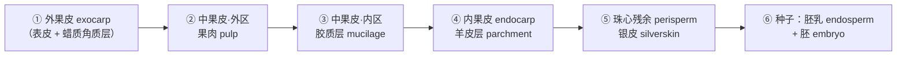
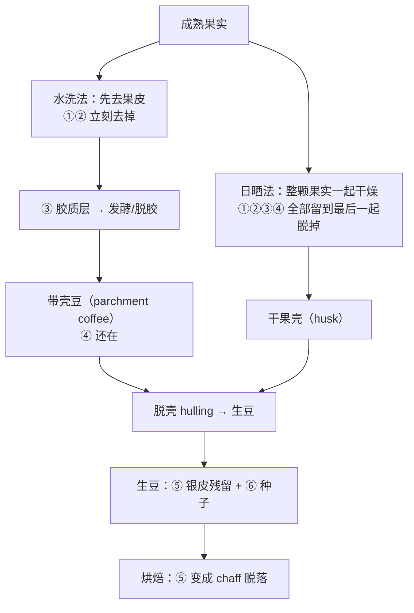

# 第 2 章 咖啡果与咖啡豆：植物学结构与它的工艺含义

> **本章目标**：把一颗咖啡果从外到内拆成六层，并给每一层贴上一个标签——
> **它会在后面哪一章回来找你**。
>
> 第 1 章回答了"豆子里有什么"，这一章回答"它原本被包在什么里面、那些包装去哪了"。
> 处理法（第 10、11 章）、干燥与储存（第 12 章）、生豆分级（第 13 章）、
> 烘焙时豆内的结构变化（第 18 章），本质上都是在处理这几层的去留。
>
> 本章仍然**不需要任何器具**。

## 2.1 先把果子切开：六层结构

咖啡的花是**双室子房、每室一枚胚珠**；受精后发育成一颗**球形核果**，
里面通常有**两粒种子**[^1]。这句话里已经藏了三个后面会用到的事实：
两粒、对生、所以每粒都是**一面凸一面平**——平的那面上有一道纵向的沟，
就是你在豆子上看到的**[中央线](../../glossary.md#center-cut)**（center cut）[^1]。

从外到内，六层：

一张"结构 + 数字"的总表。**所有百分比都是成熟果实的干重占比**，来自一篇 2025 年
《*Plants*》上的阿拉比卡花果物候综述[^1]（它逐项引用了解剖学原始文献）：

| 层 | 中文 / 英文 | 厚度或尺度 | 占果实干重 | 已核对的成分特征 |
|----|------------|-----------|-----------|----------------|
| ① | [外果皮](../../glossary.md#exocarp) / exocarp（epicarp） | 单层表皮细胞（约 15 µm）+ 蜡质角质层 | 计入果肉 | 未成熟时富含叶绿素，成熟时**花青素**积累而变红[^1] |
| ② | [果肉](../../glossary.md#pulp) / pulp（外中果皮） | 成熟时软化到约 **5 mm** | **约 29%** | 碳水 44~50%、蛋白 10~12%、纤维 18~21%、多酚 1.48%、咖啡因 1.3%[^1] |
| ③ | [胶质层](../../glossary.md#mucilage) / mucilage（内中果皮） | 2~3 层栅状细胞，**0.5~2.0 mm** | **约 4%** | 水 84.2%、蛋白 8.9%、糖 4.1%、**果胶物质 0.91%**、灰分 0.7%[^1] |
| ④ | [羊皮层](../../glossary.md#parchment) / parchment（内果皮） | **约 100~150 µm** | **约 12%** | α-纤维素 40~49%、半纤维素 25~32%、**木质素 33~35%**、灰分 0.5~1.0%[^1] |
| ⑤ | [银皮](../../glossary.md#silverskin) / silverskin（珠心残余 perisperm） | 成熟时缩成**约 70 µm** 的薄膜 | 计入种子 | 膳食纤维 71.8~76.9 g/100 g，其中不溶性 54.0~60.6[^2] |
| ⑥ | 种子（[胚乳](../../glossary.md#endosperm) + 胚） | 长 12.6~13.1 mm、宽 9.1~9.3 mm、厚 5.5~5.6 mm | **约 55%** | 单粒质量 **0.265~0.310 g**（含水率 12% 时）[^1] |

> **⚠️ 一个必须说明的来源分歧**（这是本章最重要的一条纪律示范）：
>
> 另一篇 2026 年的咖啡副产物综述给出的数字是"果肉约占果实质量 39%""羊皮层约占 39%"
> "胶质层约占果实干重 14%"[^3]。这三个数加起来已经 92%，**种子就放不下了**——
> 而同一篇又写"咖啡壳（果皮 + 羊皮层）约占果实干重 45%"[^3]，
> 这条反而与上表自洽（29 + 4 + 12 ≈ 45，剩下 55% 是种子）。
>
> 最可能的解释是：39/22/39 那一组原本是"**占副产物总量**"的比例，被层层转引后变成了
> "占果实"。本书采用能自洽的那一套（上表），**并把这条分歧登记进**
> [出处与资料登记 §六](../../standards.md)。
>
> **要带走的不是数字，是习惯**：看到一组百分比，先加一遍看它加不加得起来。

[^1]: 本书编号 [F1]：Unigarro、Cayón Salinas、León-Burgos & Flórez-Ramos (2025), *Plants* 14(21):3396（开放获取）。该综述按 BBCH 物候尺度逐段描述了花与果的形态、各组织的发育与组成。
[^2]: 本书编号 [F4]：Candela-Salvador 等, *Foods* 15(1):97（PMCID PMC12785734，开放获取）。样品为两个物种、六个产国的银皮。
[^3]: 本书编号 [F2]：Maia、Ferreira、Oliveira & Alves (2026), *Molecules* 31(10):1768（开放获取）。

### 顺便解决两个称呼问题

- **咖啡豆不是"豆"**。它是**种子**（seed），不是豆科植物的荚果。
  之所以叫 bean，是形状像。这不只是抠字眼——你在第 12 章会看到，
  它作为"活的种子"还会呼吸、还有含水率与生命力的问题。
- **"生豆"其实是"去壳的种子"**。贸易里的 green coffee 已经脱掉了①~④层，
  只剩⑤银皮（部分残留在中央线里）和⑥种子。

## 2.2 每一层会在哪一章回来找你

这是本章真正的骨架。**先记这张表，后面六个部分会反复回来对照**：

| 层 | 在哪个环节被处理 | 它决定了什么 | 回来找你的章节 |
|----|----------------|------------|--------------|
| ① 外果皮 | 采收时判断成熟度；日晒法里它**整颗留在豆上**一起干燥 | 采收标准、日晒/蜜处理的发酵环境 | 第 9、10、11 章 |
| ② 果肉 | 水洗/蜜处理里被**去果皮机**刮掉 | 微生物可利用的糖与酸的总量；副产物 cascara | 第 10、11 章 |
| ③ 胶质层 | 发酵 / 机械脱胶 / 保留（蜜处理） | **发酵的底物**——这是"处理法"这三个字的核心战场 | 第 10、11 章 |
| ④ 羊皮层 | 干燥**之后**才脱壳（hulling） | 干燥速度与储存保护；带壳储存的物理基础 | 第 12、13 章 |
| ⑤ 银皮 | 烘焙时脱落成**银皮屑**（chaff），中央线里会残留 | 烘焙机的排屑；深烘时残留银皮的焦化 | 第 15、18 章 |
| ⑥ 胚乳 | 烘焙的对象；萃取的对象 | 第 1 章那张成分表**就是它** | 第三、四部分全部 |
| ⑥ 胚 | 一直在里面 | 生豆是活的：发芽力、陈化 | 第 12 章 |

> **这张图解释了一件常被搞混的事**：日晒与水洗的差别，**不在于"晒不晒"**
> （两者最后都要把含水率降下来），而在于**③胶质层和②果肉在干燥过程中在不在豆子旁边**。
> 详细机理是第 10 章的内容，这里只要记住结构上的差异。

## 2.3 胶质层：被误解最深的一层

咖啡圈对胶质层的默认印象是"**一层糖**"——蜜处理就是"给豆子裹糖"。
但把上表那一行读一遍：

> 胶质层的组成是**水 84.2%、蛋白质 8.9%、糖 4.1%、果胶物质 0.91%、灰分 0.7%**[^1]。

换句话说：

- 它**绝大部分是水**；
- 糖只有 4% 上下，而且这还是**湿基**（新鲜胶质层的组成）；
- 那个让它"黏"的果胶，只占 0.91%——**"黏"不等于"多"**，
  果胶少量就能形成凝胶网络，这是它的物理性质，不是含量。

所以蜜处理/日晒的甜感来源，**不可能是"糖渗进豆子里"**这么简单的图景。
真正发生的是：这层富含水、蛋白与少量糖的基质，成了**微生物的培养基**，
发酵产物（有机酸、醇、酯等）以及干燥过程中的物质迁移才是变量。
第 10、11 章会把这条链条展开，本章只负责把**"胶质层 = 糖"这个前提拆掉**。

> **诚实说明**：上表那一组胶质层组成数字在本书读到的文献里是**单一来源转引**
> （[F1] 引自更早的解剖化学文献[^1]），本书按纪律标注"仅见于此"，
> 并**不**在此基础上做任何进一步换算。

## 2.4 羊皮层与银皮：两层"不进杯子"的东西，为什么还要讲

### 羊皮层：一件木质化的雨衣

羊皮层的成分表很有说服力：**木质素占 33~35%**，纤维素与半纤维素占绝大部分，
可溶糖极低[^1]。另一项对六种咖啡副产物的蛋白质分析里，羊皮层的蛋白含量是
**全部副产物里最低的（1.49% 干重）**，作者明确把它排除在"可做蛋白来源"之外[^4]。

一层高木质素、低可溶物、约 100~150 µm 的壳，物理上意味着三件事：

1. **硬**——脱壳要专门的机器，而且脱壳过程会产生机械损伤（第 13 章的瑕疵之一）；
2. **疏水且多孔**——它在干燥时是水分必须穿过的一道阻力（第 12 章的干燥曲线）；
3. **是个保护壳**——所以产地常常把咖啡**带壳储存**（en pergamino / parchment coffee），
   出口前才脱壳。

> ⚠️ **但"带壳储存更保鲜"这句话，本书只能给到机理层面**。
> 结构上完全说得通（一层木质化外壳减少氧气与水分交换），
> 但本书**没有找到可交叉验证的对照实验**（带壳 vs 脱壳，同批豆、同条件、测感官或成分）。
> 所以本章把它标注为 ⚠️，留到第 12 章去查。

### 银皮：唯一跟着豆子进烘焙机的那层

银皮是**珠心（perisperm）**被胚乳挤压后剩下的残余，成熟时只有约 **70 µm** 厚[^1]。
它跟着生豆一路进烘焙机，在烘焙中脱落成**[银皮屑](../../glossary.md#chaff)（chaff）**，
但**中央线的沟里总会残留一部分**——这就是为什么你在深烘豆的中央线里常看到一条白边。

银皮的成分特征很鲜明[^2]：

- **膳食纤维 71.8~76.9 g/100 g**，其中不溶性占 54.0~60.6 g/100 g；
- 咖啡因 0.81~7.32 mg/g（跨物种与产地，变异很大）；
- 富含绿原酸类，另一项按组织分离的研究测得银皮的绿原酸为 3.58~4.69 mg/g[^5]。

> **要带走的判断**：银皮**不是"脏东西"，但也不是风味来源**——
> 它是一层高纤维、低可溶物的膜。关于"银皮没吹干净会发苦"的说法，
> 见 §2.6 的辨析表：方向上有一点道理（它确实带绿原酸），
> 但本书没有读到任何做过对照的感官研究。

[^4]: 本书编号 [F5]：*Journal of Food Science* (2026), doi:10.1111/1750-3841.71304（PMCID PMC13366559）。该研究分析六种咖啡副产物（干果肉、果壳、羊皮层、瑕疵豆、筛分残余、银皮）的氨基酸组成，蛋白含量从羊皮层 1.49% 到银皮 14.34%。
[^5]: 本书编号 [F3]：Ran 等 (2026), *Foods* 15(2):269（开放获取）。该研究把七个品种的咖啡果实解剖成外果皮、羊皮层、银皮、外胚乳、内胚乳五部分分别测定。

## 2.5 由结构直接推出的四个结论

### 结论一：咖啡因主要在**种子里**，不在果皮里

一项把七个品种的果实解剖成五部分分别测定的研究给出了组织间的排序[^5]：

| 物种 | 各组织咖啡因含量排序 |
|------|-------------------|
| 阿拉比卡（该研究的 DR 系列） | 胚乳（豆）> 外果皮 > 银皮 > 羊皮层 |
| 罗布斯塔（该研究的 RY 系列） | 胚乳（豆）> 银皮 > 外果皮 > 羊皮层 |

同一研究里，阿拉比卡生豆的咖啡因为 **1.0%~1.3%**，罗布斯塔为 **2.0%~2.6%**，
作者指出后者"是前者的两倍"[^5]——这与第 1 章用另外两篇文献建立的量级关系**互相独立地对上了**。
本书到这里已有三组独立来源支持"罗布斯塔咖啡因约为阿拉比卡两倍"这个**量级**。

而**羊皮层在两个物种里都垫底**。这很合理：它是结构件，不是储藏组织。

### 结论二：果实成熟时蔗糖达峰，而且量级与第 1 章对得上

[F1] 综述指出，**蔗糖在果皮与胚乳中积累，在果实完全成熟时达到最大浓度**，
阿拉比卡成熟果实的蔗糖为 **7%~10%（干基）**[^1]。
第 1 章从另一篇文献取到的生豆蔗糖区间是 6%~9%（阿拉比卡）——**两者高度一致**。

这条把"采收成熟度"和"风味本金"直接连了起来：
**摘青的果实，蔗糖还没攒够**。第 9 章会展开采收，这里只要建立因果方向。

### 结论三：环境通过"成熟期长短"影响豆子，而不是直接"变好喝"

[F1] 里有两条可以直接引用的观察[^1]：

- 在**凉爽的高海拔**产区，果实成熟可能比温暖低海拔产区**晚 2~3 个月**（与品种无关）；
- 在海拔较低、温度较高的地块，成熟期缩短，**胚乳填充时间减少，种子变小**；
  温度高于 23 ℃ 会加速果实发育，产出**质量更低的豆**。

> 这是本书第一次碰到"高海拔更好"这句话的**机理版本**：
> 起作用的不是海拔这个数字，而是**温度 → 成熟期长度 → 胚乳填充是否充分**。
> 完整讨论（包括哪些部分只是相关而非因果）在第 7 章。
> 但你已经可以看出：**海拔是代理变量，温度和成熟期才是机制。**

### 结论四：你可以自己算一杯咖啡里有多少颗豆子

单粒生豆在 12% 含水率下约 **0.265~0.310 g**[^1]。所以：

> 15 g 咖啡粉 ÷ 约 0.29 g/粒 ≈ **50 粒豆左右**（烘焙会失重，熟豆单粒更轻，
> 所以实际颗数还要更多一些）。

这个数字没有任何技术用途，但它对建立"手感"极有用：
**你每次冲煮的原料，是五十来颗种子；每一颗都来自一颗果实里的两个位置之一。**

## 2.6 常见说法辨析

按本书约定标注**证据强度**：✅ 有共识 / ⚠️ 有争议 / ❌ 明确错误 / **缺乏证据**。

| 说法 | 判定 | 说明 |
|------|------|------|
| "咖啡豆是一种豆子" | ❌ **明确错误** | 它是核果的**种子**（胚乳 + 胚），与豆科无关[^1]。叫 bean 是因为形状 |
| "一颗咖啡果里有两粒豆，所以豆子都是一面平的" | ✅ **有共识** | 双室子房、每室一枚胚珠，受精后成为含两粒种子的核果；种子一面凸一面平，平面上有纵沟（中央线）[^1] |
| "[圆豆](../../glossary.md#peaberry)（peaberry）更甜/更浓/更好喝" | **缺乏证据** | 本书检索到的圆豆研究是**用紫外可见光谱把圆豆与平豆区分开**这类分类研究[^6]，**没有找到任何做过盲测对照的感官研究**。圆豆的成因是一室胚珠败育，它确实**形状不同、受热更均匀**，但"更好喝"这一步缺乏一手依据 |
| "胶质层富含糖分，蜜处理就是给豆子裹糖" | ❌ **明确错误** | 胶质层是水 84.2%、蛋白 8.9%、糖 4.1%、果胶 0.91%[^1]。**黏不等于甜**。蜜处理改变的是发酵与干燥环境，不是"加糖"（第 10、11 章） |
| "日晒豆更甜是因为果肉的糖渗进了豆子" | ⚠️ **机理未经证实** | 结构上果肉与胶质层确实在干燥时贴着豆子，但"糖分子穿过羊皮层进入胚乳"这一步本书**未读到直接证据**。留到第 10 章 |
| "带壳储存更保鲜" | ⚠️ **机理合理、缺对照实验** | 羊皮层木质素 33~35%、约 100~150 µm 的壳[^1]，作为屏障说得通；但本书未找到带壳 vs 脱壳的对照研究。第 12 章再查 |
| "银皮没吹干净会发苦" | ⚠️ **方向有依据、无感官验证** | 银皮确实富含绿原酸（3.58~4.69 mg/g[^5]）与纤维；但"残留银皮 → 杯中苦"这条**没有对照实验**。而且它在中央线里的残留量极小 |
| "果实越红越熟越甜" | ⚠️ **不完整** | 红色来自**花青素积累**与叶绿素降解[^1]；但存在**黄果**的自然突变型（成熟时不变红[^1]），也存在只有外皮变色而胚乳未填充完成的情况（[F1] 提到用乙烯利催熟只加速果皮、不改变种子发育[^1]）。**颜色是成熟度的代理指标，不是成熟度本身** |
| "咖啡果肉是废料" | ❌ **明确错误**（至少在法规上已不成立） | 欧盟层面，咖啡果肉（[cascara](../../glossary.md#cascara)）已按《新食品法规》(EU) 2015/2283 第 14 条**作为"第三国传统食品"被通报**，EFSA 发布了相应技术报告[^7]。这说明它在监管上是有身份的食品原料，不是垃圾 |
| "5~6 公斤鲜果出 1 公斤生豆" | **行业经验值** | 本书**未找到可核对的一手出处**。用本章的干重比例自己粗算（种子占干重 55%、生豆含水率约 11%、鲜果含水量高）只能落到**同一量级**，得不到同一个数。差异可能来自基准不同（是否计入瑕疵豆与加工损耗）。**本书不写死这个比值**，并把它做成 §2.9 的一道练习 |

[^6]: *International Journal of Food Properties* (2017), doi:10.1080/10942912.2017.1296861。该研究用紫外可见光谱 + SIMCA / PLS-DA 把圆豆与普通豆 100% 正确分类——它证明的是"两者化学上可分"，**不是**"哪个更好喝"。
[^7]: EFSA 技术报告（2021）：关于把 *Coffea arabica* L. 与 *Coffea canephora* Pierre ex A. Froehner 的（干）果肉按 (EU) 2015/2283 第 14 条作为第三国传统食品通报，doi:10.2903/sp.efsa.2021.en-6808 与 doi:10.2903/sp.efsa.2021.en-6657。本书编号 [F6]。

## 2.7 🔎 买豆与冲煮时的用处

1. **看到"蜜处理""日晒"，脑子里换成"③胶质层留了多少、②果肉在不在旁边"**，
   而不是"甜度高低"。这样你才有办法问下一个问题：**它发酵了多久、怎么干燥的**（第 10、11 章）。
2. **看到"带壳储存""parchment"字样，知道它在说④这一层**——
   这通常意味着这批豆在产地的后处理链条被记录得比较细，**是信息量的信号**
   （但不是品质保证，见 §2.6）。
3. **看到中央线里的白边，别当成缺陷**——那是⑤银皮的残留，正常现象。
   真正值得看的是中央线**是否发黑、是否有裂痕**（第 13 章的瑕疵判据）。
4. **听到"高海拔所以更好"，追问一句"那里的温度和成熟期是多久"**。
   机制在温度和成熟期上（§2.5 结论三），海拔只是它的代理。
5. **看到"圆豆 / peaberry"的溢价，知道你买的是"形状一致、受热均匀"这个可验证的点**，
   而不是"更好喝"这个本书查不到依据的点。

## 2.8 思考题

1. 请用本章的干重比例表解释：为什么"水洗处理"会产生**比日晒处理多得多的湿废料**，
   而日晒处理的副产物主要是**干果壳**。
2. 胶质层的组成是水 84.2%、蛋白 8.9%、糖 4.1%、果胶 0.91%。
   有人据此说"既然糖这么少，那蜜处理根本不可能影响甜感"。
   请指出这个反驳**同样有问题**，并说明正确的问法应该是什么。
3. 羊皮层的木质素占 33~35%、可溶糖极低、蛋白仅 1.49%。
   请从这三个数字推出**两条**关于干燥与储存的实际预期，
   并说明为什么本书仍然把"带壳储存更保鲜"标成 ⚠️ 而不是 ✅。
4. 本章给了两组互相冲突的"各层占果实比例"。请说明你会用什么方法**在不查新文献的前提下**
   判断哪一组更可信，以及这个方法能不能保证结论正确。
5. 一项研究测得阿拉比卡生豆咖啡因 1.0%~1.3%、罗布斯塔 2.0%~2.6%。
   第 1 章已经用另外两篇文献给过类似量级。请说明：这算不算"三个独立来源"？
   以及在什么情况下"多个来源一致"**仍然可能全都错**？
6. **【案例】** 一份豆袋文案写着：*"厌氧日晒，整颗果实带皮发酵 72 小时，
   果肉中丰富的天然糖分充分渗入豆体，赋予浓郁的热带水果甜感；
   高海拔 1800 米慢速生长，豆质紧实。"*
   请逐句判断：哪些是结构/工艺上说得通的描述，哪些是把机理讲错了，
   哪些是本书也只能标 ⚠️ 的灰区。
7. **【案例】** 你收到一包豆，中央线里有明显白色残留，朋友说"这家烘焙商没吹干净银皮，
   所以这豆子会苦"。请给出你的判断，并设计一个**在家能做、能排除期待效应**的最小验证。
8. **【辨识】** 用本章 §2.5 结论四的单粒质量（0.265~0.310 g，12% 含水率），
   估算你常用粉量对应多少粒生豆。然后说明：**为什么熟豆的实际颗数会更多**，
   以及这个估算在什么环节会失真。

> 📖 **参考答案**（想清楚再看）：[Q1](../../qa/02-cherry-anatomy-qa.md#q1) ·
> [Q2](../../qa/02-cherry-anatomy-qa.md#q2) · [Q3](../../qa/02-cherry-anatomy-qa.md#q3) ·
> [Q4](../../qa/02-cherry-anatomy-qa.md#q4) · [Q5](../../qa/02-cherry-anatomy-qa.md#q5) ·
> [Q6](../../qa/02-cherry-anatomy-qa.md#q6) · [Q7](../../qa/02-cherry-anatomy-qa.md#q7) ·
> [Q8](../../qa/02-cherry-anatomy-qa.md#q8)

## 2.9 本章实操

### 🅐 无器具版 · 任务一：把豆袋上的每个字段映射回六层结构

拿**任意一包豆**（或电商详情页），把下表填完。重点不是填满，而是**看清哪些字段缺失**。

| 豆袋字段 | 它在描述哪一层 / 哪个环节 | 本章能推出什么 | 缺失的话意味着什么 |
|---------|------------------------|--------------|------------------|
| 处理法（水洗/日晒/蜜…） | ②③ 的去留与时机 | | |
| 发酵时长 / 方式 | ③ 作为底物被怎么用 | | |
| 干燥方式（日晒床/棚/机械） | ④ 外面的水分怎么走 | | |
| 是否提到带壳储存 / parchment | ④ | | |
| 海拔 | 通过温度影响成熟期（§2.5） | | |
| 采收方式（手选/一次性） | ① 的成熟度判断 | | |
| 品种 | 与本章无关，但决定第 1 章的"本金" | | |

### 🅐 无器具版 · 任务二：自己算一次"鲜果 → 生豆"的换算

用本章的数字自己推一遍，**过程比答案重要**：

| 步骤 | 你用的数字 | 结果 |
|------|----------|------|
| 1 kg 鲜果里，干物质大约多少？（假设一个含水量，并写明你为什么这么假设） | | |
| 其中种子占干重多少？（本章给了） | | |
| 换算成含水率 11% 的生豆是多少？ | | |
| 你算出的"鲜果:生豆"比是多少？ | | |
| 它与行业常说的 5~6:1 差多少？**你认为差在哪个假设上？** | | |

> **这道题没有标准答案，但有标准姿势**：当你算出的数和流传的数对不上时，
> **先怀疑基准（含水率？含不含瑕疵豆？含不含加工损耗？），而不是先怀疑自己算错**。
> 参考推理见[答案册 Q8](../../qa/02-cherry-anatomy-qa.md#q8) 的思路。

### 🅐 无器具版 · 任务三：观察十粒豆

抓**十粒生豆或熟豆**（熟豆也行），放在白纸上，只填三列：

| # | 是平豆还是圆豆？ | 中央线：直/弯/发黑/有白色残留？ | 豆体：有无缺角、虫蛀孔、裂纹？ |
|---|----------------|------------------------------|---------------------------|
| 1 | | | |
| … | | | |

> 这个练习是**第 13 章（生豆分级与瑕疵）的预热**。
> 现在你只需要建立一个习惯：**看豆子时看三件事——形状、中央线、完整性**。
> 完整的瑕疵判据要等第 13 章，本章不下结论。

### 🅑 有条件版 · 任务四：称出你自己的"单粒质量"（备齐后再做）

> **所需器具**：**0.1 g 精度的电子秤**（厨房秤多为 1 g 精度，误差会太大）。
> **替代方案**：用 1 g 精度的秤称 **100 粒**，再除以 100——精度就够了。

| 步骤 | 记录 |
|------|------|
| 数出 100 粒**熟豆**，称总质量 | ____ g |
| 单粒平均质量 | ____ g |
| 与本章给的生豆 0.265~0.310 g 相比，**轻了多少百分比**？ | ____ % |
| 这个差值里，**烘焙失重**占多少、**品种/筛目差异**占多少？你怎么判断？ | |

> **为什么值得做**：第 1 章说过烘焙会失重（一爆前后约 5%，到中烘再约 13%），
> 这个练习让你**亲手量出那个失重**，而不是记住一个数字。
> 如果你算出的失重明显超出这个范围，那更可能是**品种或筛目不同**，
> 而不是烘焙商烘得特别深——这正是"控制变量"的第一课。

### 🅑 有条件版 · 任务五：收集一次 chaff（备齐后再做）

> **所需器具**：手冲或任何冲煮器具 + **深浅两种烘焙度的豆各一份**。
> 若你有**家用小型烘豆机**，直接观察烘焙时排出的银皮屑效果更好。
> **替代方案**：没有烘豆机，就在研磨后观察粉里的**浅色薄片**（银皮碎屑），
> 或在手冲注水时观察漂浮在粉层表面的浅色碎片。

| 观察项 | 浅烘那支 | 深烘那支 |
|-------|---------|---------|
| 磨粉后能否看到浅色薄片？多不多？ | | |
| 注水后表面漂浮物的量 | | |
| 中央线里的白色残留（放大看） | | |
| 这两支的**筛目/豆型**是否可比？（不可比就别下结论） | | |

> **注意这个实验能证明什么、不能证明什么**：它能让你**看见**⑤这一层确实存在、
> 确实会跟着豆子走；它**不能**证明"银皮多所以更苦"——
> 那需要控制其他所有变量并做盲测（第 39 章会教怎么做）。
> 本章的辨析表把这条标成 ⚠️，就是这个原因。

---

## 2.10 本章依据

完整书目信息（含 PMID / PMCID / 开放获取状态）登记在
[出处与资料登记 §4.5](../../standards.md)。

- **[F1]** Unigarro、Cayón Salinas、León-Burgos & Flórez-Ramos (2025), *Plants* 14(21):3396。
  本章的**主干来源**。用到：花与果的形态（双室子房、每室一胚珠、球形核果含两粒种子）；
  外果皮/中果皮/内果皮/珠心/胚乳/胚各组织的发育、厚度与占干重比例
  （果肉 29%、胶质层 4%、羊皮层 12%、种子 55%）；胶质层组成（水 84.2%、蛋白 8.9%、
  糖 4.1%、果胶物质 0.91%、灰分 0.7%）；羊皮层组成（α-纤维素 40~49%、半纤维素 25~32%、
  木质素 33~35%）与厚度 100~150 µm；银皮约 70 µm；种子尺寸与单粒质量
  （12% 含水率下 0.265~0.310 g）；成熟果实蔗糖 7%~10%（干基）；颜色变化来自花青素积累与
  黄果突变型；高海拔成熟晚 2~3 个月、>23 ℃ 加速发育导致豆更小。开放获取，已读全文相关章节。
- **[F2]** Maia、Ferreira、Oliveira & Alves (2026), *Molecules* 31(10):1768。
  用到：副产物的化学组成表；以及**与 [F1] 冲突的那组占比数字**（果肉 39%、羊皮层 39%、
  胶质层 14%、果壳约占果实干重 45%）——本书用它作为"来源分歧"的实例。开放获取，已读全文相关章节。
- **[F3]** Ran 等 (2026), *Foods* 15(2):269。用到：把果实解剖成外果皮/羊皮层/银皮/外胚乳/内胚乳
  五部分后的组织间比较——咖啡因排序（胚乳 > 外果皮/银皮 > 羊皮层）、
  阿拉比卡生豆咖啡因 1.0%~1.3% 与罗布斯塔 2.0%~2.6%、银皮绿原酸 3.58~4.69 mg/g、
  羊皮层可溶糖 1.83%~5.43%。开放获取，已读全文相关章节。
- **[F4]** Candela-Salvador 等, *Foods* 15(1):97（PMCID PMC12785734）。用到：六个产国、
  两个物种的银皮膳食纤维 71.81~76.86 g/100 g（不溶性 54.02~60.58）、咖啡因 0.81~7.32 mg/g。
  开放获取，已读摘要。
- **[F5]** *Journal of Food Science* (2026), doi:10.1111/1750-3841.71304。用到：六种副产物的蛋白质
  含量范围，**羊皮层最低 1.49%、银皮最高 14.34%**（干重）。已读摘要。
- **[F6]** EFSA 技术报告（2021），doi:10.2903/sp.efsa.2021.en-6808 与 en-6657。用到：
  咖啡果肉按 (EU) 2015/2283 第 14 条作为"第三国传统食品"通报这一**法规事实**
  （本书只复述其存在与适用条款，不做任何健康或安全评价）。书目已核对。

**本章刻意没写的东西**：

- 各层占比的**另一套数字**（[F2] 的 39/14/39）——已说明为什么不采信，并登记进分歧表；
- "鲜果:生豆"的具体比值——查不到一手出处，改成练习；
- 胶质层里糖分"渗入豆体"的机理——没有直接证据；
- 圆豆的风味差异、银皮残留对风味的影响、带壳储存的保鲜效果——三条都缺对照实验。

---

**下一章**：第 3 章 水——一杯咖啡里 98% 是水。
它到底只是溶剂，还是参与者？这一章会遇到本书第一个"**流传极广但现行标准里查无此文**"的例子。
