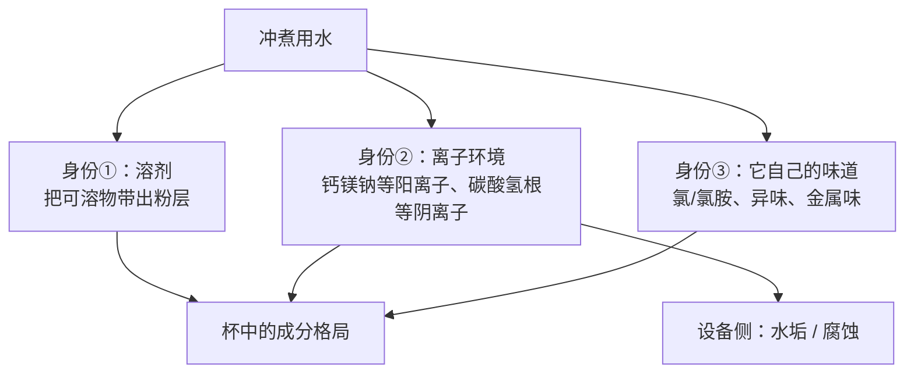

# 第 3 章 水：被忽略的 98%

> **本章目标**：把"用什么水"这件事从玄学拉回到三个可以分开讨论的问题——
> **水里有什么、它在萃取里做什么、哪些说法有证据**。
>
> 这一章会遇到本书第一个**"流传极广、但在现行官方页面上查无此文"**的例子，
> 所以它同时是一堂查证方法课。
>
> **本章的诚实预告**：水是全书查证体验最差的一章。
> 咖啡圈关于水的说法极多、极具体（"多少 ppm 最优""镁比钙好"），
> 而能追到的一手实验**少、小、且互相不完全一致**。
> 本章不会给你一份配方，它会告诉你**哪些能确定、哪些不能**。

## 3.1 先确定量级：98% 以上是水

第 1 章引过的那项冷冲/热冲对照研究，为了排除浓度差异，把所有样品
**统一稀释到 2% TDS**[^1]。反过来读这句话：

> 一杯被认为"偏浓"的咖啡，也有 **98% 是水**。

这个量级决定了本章的基本立场：

- 水**是这杯里含量最高的物质**，所以它本身的味道、气味、离子组成都直接进入你的感受；
- 但它同时是**溶剂**——它影响的不只是"自己什么味"，还有"能把什么东西带出来"。

这两件事必须分开讨论，因为**它们的证据强度完全不同**。

[^1]: 本书编号 [A2]：Batali 等 (2022), *Foods* 11(16):2440（开放获取）。见[出处与资料登记 §4.3](../../standards.md)。

## 3.2 水的三个身份

三个身份的证据强度差别极大，这是本章最该记住的一张表：

| 身份 | 有多少证据 | 本书怎么写 |
|------|-----------|-----------|
| ③ 水自己的味道（氯味、异味） | ✅ 强，且不需要咖啡研究——感官上直接可验 | 正常写 |
| ② 离子 → **设备**（水垢、腐蚀） | ✅ 强，是基础化学与工程常识 | 正常写 |
| ② 离子 → **风味** | ⚠️ **弱且不一致**：能找到的实验少、样本小、结论互相打架 | 只写各来源分别说了什么，不给配方 |
| ① 溶剂效率（水质影响萃出多少） | ⚠️ **有直接实验反对流行说法**（见 §3.4） | 明确标注分歧 |

## 3.3 硬度和碱度是两件事（先把词理清）

咖啡圈把"水质"讨论得很热闹，但常常把两个正交的量混在一起：

| | [硬度](../../glossary.md#hardness)（hardness） | [碱度](../../glossary.md#alkalinity)（alkalinity） |
|---|------|------|
| **它衡量什么** | 水里**钙、镁等二价阳离子**的总量 | 水**中和酸的能力**（缓冲能力），主要由碳酸氢根 HCO₃⁻ 贡献 |
| **常用单位** | 以 mg/L CaCO₃ 计（也写作 ppm as CaCO₃） | 同样以 mg/L CaCO₃ 计——**单位一样，所以最容易混** |
| **在咖啡里管什么** | 与咖啡中的有机分子配位、影响萃取与口感（证据见 §3.4） | 把咖啡里的酸**缓冲掉**，改变酸的表现 |
| **在设备里管什么** | 与碱度一起决定结垢倾向 | 加热时 HCO₃⁻ 分解是**水垢的直接来源** |
| **能不能互相推算** | **不能**。高硬度低碱度、低硬度高碱度都存在 | 同左 |

> **为什么要专门强调"单位一样"**：因为你会在不同资料里看到"硬度 50"和"碱度 40"这样的数，
> 两个都以 CaCO₃ 计，看起来像同一个尺子上的两个刻度，其实测的是**完全不同的东西**——
> 一个测阳离子，一个测缓冲能力。**看到 ppm 先问"as CaCO₃ 的哪一项"。**

### 水垢：这一条是纯化学，没有争议

加热含碳酸氢钙的水时，碳酸氢根分解、碳酸钙析出，沉积在加热面上——
这就是锅炉、热水壶、咖啡机里的**水垢**。它带来的后果是工程上的：
传热变差、流道变窄、温控失准、极端时堵塞。

所以关于水的**第一条可执行建议**与风味无关：

> **碱度高的水会更快结垢**。有加热部件的设备（意式机、全自动机、热水壶）
> 需要按水质安排除垢或前处理——这一条不依赖任何咖啡研究就成立。

## 3.4 文献到底说了什么（本章最重要的一节）

咖啡圈流传最广的一条是"**镁离子萃取效率高于钙离子，所以高镁水更出风味**"。
本书去追这条说法的源头，追到了一篇 2014 年的论文[^2]：

**第一步：那篇论文是计算研究，不是感官实验。**
该文用**密度泛函理论（DFT）**计算了 Na⁺、Mg²⁺、Ca²⁺ 与五种咖啡中的酸、咖啡因、
以及一个代表性风味成分（丁香酚）的**热力学结合能**，并据此讨论"理想的矿物组成"[^2]。
它的贡献是给出了一个**分子层面的机理假说**——
但它**没有做萃取实验，也没有做感官评价**。

**第二步：后来做了实验的那篇，结论方向相反。**
第 1 章引用过的 2024 年研究[^3]直接测了这件事：向水里加镁盐与钙盐，
测定咖啡液中奎宁酸、乳酸、苹果酸、柠檬酸的含量。结果是：

> 在**饮用水常见浓度**下，加盐只造成酸含量的**有限变化**；
> 把盐浓度提高**十倍**才出现比较明显的差异。
> 更关键的是，**冲煮前加盐**与**冲煮后加盐**得到的酸含量在多数情况下**相近**——
> 作者据此认为"酸的萃取过程与水的组成无关"，
> 而水造成的风味差异**更可能发生在冲煮之后**（杯中/口中的相互作用）[^3]。

这条结论对整个"水配方"话语体系的冲击很大，所以本书把它**原样标注**，
并已登记在[不采信清单](../../standards.md)里——
**本书不写任何"某个钙镁比最优"的结论。**

**第三步：确实有实验看到水质改变了感官，但样本小、方向不一。**

| 研究 | 做了什么 | 看到什么 |
|------|---------|---------|
| 土耳其咖啡 × 水硬度[^4] | 软水 / 中硬水 / 硬水各煮一次，测挥发物 + 感官 | **中等硬度**水的挥发物种类最多（检出 30 种）；**软水**样品的**甜与酸评分更高** |
| 滤泡冲煮 × 水性质 × 烘焙度[^5] | 多种水 × 多种咖啡配对，测呈味物萃取 + 感官，并做分子动力学模拟 | 高硬度水配**深烘**、低硬度水配**浅烘**分别更有利；机理归因于两点——水**渗入颗粒**的能力，以及水把呈味物**从咖啡蛋白上解离下来**的能力 |
| 碳酸氢根 × 茶（**不是咖啡**）[^6] | 用不同 HCO₃⁻ 含量的配方水泡不同发酵度的茶 | 低 HCO₃⁻（≤21.97 mg/L）增香、减苦；高 HCO₃⁻（≥40.27 mg/L）汤色变暗、香气变钝 |

> **怎么读这三行**：
>
> - 三者都支持"**水会影响感官**"这个大方向——这一点可以写成 ✅；
> - 但它们**给不出一致的处方**：一个说中硬水挥发物多，一个说要按烘焙度配硬度，
>   第三个干脆是在茶上做的；
> - 而 [^3] 又指出，至少对有机酸而言，**差异可能不在萃取环节**。
>
> 所以本书的写法是：**"水会影响味道"可以写；"这样配水最好"不能写。**

[^2]: 本书编号 [W1]：Hendon, Colonna-Dashwood & Colonna-Dashwood (2014). The role of dissolved cations in coffee extraction. *Journal of Agricultural and Food Chemistry* 62(21):4947–4950。**密度泛函理论计算**，非萃取或感官实验。
[^3]: 本书编号 [A1]：Bratthäll、Figueira & Nording (2024), *Heliyon* 10(5):e26625（开放获取）。
[^4]: 本书编号 [W2]：Dadalı, C. (2021). Influence of water hardness on volatile compounds and sensory properties of Turkish coffee. *Gıda* 46(5):1183–1194。**单一研究、样本量小**。
[^5]: 本书编号 [W3]：Liu、Lin、Hu、Wang & Yang (2025), *Journal of Food Composition and Analysis* 146:107987。本书**仅读到摘要**。
[^6]: 本书编号 [W4]：Gao 等 (2026), *Foods* 15(11):1958（开放获取）。**该研究做的是茶，不是咖啡**，本书只把它当作"碳酸氢根影响感官"的**旁证**，不外推到咖啡的具体阈值。

## 3.5 "SCA 的水质标准"——一次完整的查证记录

咖啡圈里引用率最高的水质依据，是一份被称作"SCA 水质标准"的表格
（通常会给出一组 TDS、硬度、碱度、钠、pH 的推荐值）。本书去核对了它：

> **核对过程（2026 年 9 月）**：
>
> 1. 打开 SCA 官网的标准页（`sca.coffee` → Research → Standards）。
>    页面上列出的**已发布标准**是：
>    **SCA-102 / 103 / 104 / 105**（Coffee Value Assessment 的四份：样品制备与品尝机制、
>    描述性评价、情感性评价、外在评价）与 **SCA-710**（Coffee Evaluator 专业能力）；
>    以及仅对会员开放的**认证类**标准 **SCA-310 / 320 / 350 / 510**
>    （家用冲煮器、家用磨豆机、半自动与自动意式机、培训场地）。
> 2. **在研标准**列出的是 **SCA-110**（生豆分级与贸易用规格与试验方法）、
>    **SCA-131**（烘焙度试验方法）、**SCA-315**（商用批量冲煮机）、
>    **SCA-352**（全自动意式机）。
> 3. **整页没有任何水质标准**，也没有出现"Water for Brewing"之类的条目；
>    Research 页面上同样没有。

**所以本书的处理是**：

- **不复述**那份流传表格里的任何数值——因为本书**无法在现行官方页面上核对它的效力状态**
  （它可能来自已不再列出的旧版文件，也可能在转引中被改写过）；
- 也**不复制**任何官方表格的版式与条文（这是本书的[版权红线](../../standards.md)）；
- 如果你需要权威水质参数，**去 SCA 官网看当时列出的现行文件**，
  而不是相信任何二手转载（包括本书）。

> **诚实说明**：本书**不能**据此断言"SCA 从来没有过水质标准"——
> 本书能核对的只有"**查证当日，官网标准页与研究页上没有列出水质标准**"这一件事。
> 这两句话的区别，正是本书反复在教的东西。

**那有没有权威资料可读？有，而且本书核对过书目**：
《*The Craft and Science of Coffee*》里有一整章专讲冲煮水——
Wellinger、Smrke 与 Yeretzian 写的 "Water for Extraction—Composition, Recommendations, and
Treatment"，第 381–398 页[^7]。本书**只核对了它的书目信息，没有读到全文**，
因此**不引用其中任何数值**；这里给出它的准确位置，是为了让你知道该去读什么。

另外要分清一件容易混的事：

> **饮用水标准管的不是"好不好喝咖啡"。**
> 世界卫生组织的《饮用水水质准则》（第四版，含第一、二增补本，2022）
> 有一章叫"Acceptability aspects: Taste, odour and appearance"（可接受性：味、嗅与外观）[^8]——
> 也就是说，饮用水标准在"味道"这件事上关心的是**不难喝、无异味**，
> 而不是**适合萃取咖啡**。这是两套不同的目标函数。

[^7]: 本书编号 [W5]：Wellinger, M., Smrke, S., & Yeretzian, C. (2017). Water for Extraction—Composition, Recommendations, and Treatment. In *The Craft and Science of Coffee* (pp. 381–398). Academic Press. doi:10.1016/B978-0-12-803520-7.00016-5。**书目已核对，正文未读。**
[^8]: 本书编号 [W6]：World Health Organization (2022). *Guidelines for drinking-water quality: fourth edition incorporating the first and second addenda*. ISBN 978-92-4-004506-4。其第 10 章为"Acceptability aspects: Taste, odour and appearance"。

## 3.6 三件不需要争议就能做的事

把上面这些分歧放一边，有三件事在机理上清楚、在实践上可执行：

### ① 先解决"水自己的味道"

自来水常见的异味来源是**余氯与氯胺**。活性炭过滤对它们有效，这属于水处理常识，
不需要咖啡研究支持。判据也很简单——**直接闻、直接喝**：

> 如果这杯水你单独喝觉得有味道，那这个味道**一定会进到咖啡里**（它占 98%）。
> **这是全章唯一一条不需要任何仪器、不需要任何文献、立刻能执行的判断。**

### ② 保护设备：按碱度安排除垢

见 §3.3。这一条与风味无关，但它决定你的机器还能不能维持稳定的温度与流量——
**而温度与流量是第四、五部分所有调参的前提**。

### ③ 不要走向另一个极端：纯水也不是答案

从"离子会影响萃取"很容易滑到"那我用纯水（RO / 蒸馏水）"。
本书对这一步的态度是**两侧都只写机理**：

- **设备侧**：几乎不含离子的水对金属部件有腐蚀性，很多设备厂商明确不建议长期使用纯水；
- **风味侧**：如果离子确实参与萃取与口感（[W1] 的计算与 [W2][W3] 的感官观察都指这个方向），
  那么把离子降到零就等于**去掉一个变量而不是优化它**；
  但请注意 [^3] 的结论提示影响可能主要在冲煮**之后**发生——
  **所以本书不预测纯水一定更差，只说这不是一个"中性"的选择**。

> **这一节故意写得比咖啡圈保守**。因为本书能核对到的实验，
> 不足以支持"某种水一定更好"这类结论——只够支持"水是一个真实变量，别把它当白噪声"。

## 3.7 家用 TDS 笔测的是什么（仪器原理）

很多人买一支 TDS 笔来"测水质"。先搞清楚它在测什么：

| | TDS 笔 | 它测不出的东西 |
|---|-------|--------------|
| **实际测量量** | **电导率**（水导电能力） | 钙 / 镁 / 钠**各占多少**——它们都导电，笔无法区分 |
| **显示的 ppm** | 由电导率**乘一个换算系数**得到，系数取决于厂商设定的参比盐 | 所以**不同品牌的笔读同一杯水可能给出不同数字** |
| **能不能测碱度** | **不能**。碱度是缓冲能力，要靠滴定测 | 而碱度恰恰是水垢与"酸被压平"的关键（§3.3） |
| **能不能测咖啡液的 TDS** | **不能**（咖啡液里大量物质不导电） | 测咖啡浓度要用**折光仪**，见第 22 章 |

> **一句话**：TDS 笔能告诉你"这水离子多还是少"，
> **不能**告诉你"是哪些离子"，更不能告诉你"这水适不适合冲咖啡"。
> 它是一个**粗筛工具**，不是决策依据。

更实用的做法是：**去查你所在城市供水企业公布的水质报告**，
里面通常会有总硬度与碱度（或耗氧量、pH 等）的月度数据——
这比一支笔的读数信息量大得多。§3.10 的实操就是干这件事。

## 3.8 常见说法辨析

按本书约定标注**证据强度**：✅ 有共识 / ⚠️ 有争议 / ❌ 明确错误 / **缺乏证据**。

| 说法 | 判定 | 说明 |
|------|------|------|
| "水占一杯咖啡的 98% 以上" | ✅ **有共识** | 感官研究把样品统一稀释到 2% TDS 作为"标准浓度"[^1]；日常滤泡咖啡的溶解固体在百分之一量级（第 22 章给坐标） |
| "SCA 规定冲煮水的 TDS 应该是某个具体数值" | ⚠️ **本书无法核对** | 查证当日，SCA 官网标准页与研究页上**没有列出任何水质标准**（§3.5 记录了完整查证过程）。本书因此**不复述**流传表格里的数值 |
| "镁离子比钙离子萃取效率高，所以高镁水更好" | ⚠️ **源头是计算研究，且有实验与之不符** | 该说法可追到一篇用 DFT 计算结合能的论文[^2]——它提出机理假说，**没做萃取或感官实验**；而后来直接测有机酸的实验发现，常见浓度下加钙镁盐影响有限，且"萃取过程与水的组成无关"[^3] |
| "水质会影响咖啡的味道" | ✅ **方向有共识** | 至少三项独立研究（咖啡两项、茶一项）都观察到水的组成改变了感官结果[^4][^5][^6]；但**方向与最优值不一致** |
| "存在一个最优的水配方" | **缺乏证据** | 本书没有找到任何可交叉验证的"最优配方"结论。[^5] 甚至提示**最优水随烘焙度而变**（深烘配高硬度、浅烘配低硬度），这本身就否定了单一最优解 |
| "纯净水 / 蒸馏水冲咖啡最干净最好" | ⚠️ **两侧都有反对理由** | 设备侧有腐蚀问题；风味侧把离子归零是"去掉变量"而不是"优化变量"。但本书也**不断言它一定更差**（§3.6 ③） |
| "矿泉水一定比自来水好" | ❌ **明确错误（作为普遍命题）** | 瓶装矿泉水之间的矿物组成差异极大，有些碱度很高。"瓶装"不是一个水质参数 |
| "水垢是矿物质，无害，不用管" | ⚠️ **风味上证据弱，设备上明确错** | 结垢是确定的物理化学过程（§3.3），它会恶化传热与流量控制——而这两者是所有冲煮参数的前提 |
| "软水让咖啡更酸更甜" | ⚠️ **仅见于一项小研究** | [^4] 观察到软水样品的甜与酸评分更高，但这是单一研究、单一冲煮方式（土耳其咖啡）、样本小。**不足以写成规律** |
| "碱度高会把酸压平" | ⚠️ **机理清楚，咖啡上的直接证据弱** | 碱度就是中和酸的能力（§3.3），机理上必然影响酸的表现；但本书读到的**直接做咖啡**的定量研究不足，只有茶上的对照[^6] |
| "水温才是关键，水质无所谓" | ⚠️ **不完整** | 水温的效应确实更大更可控（第 24 章），但这不等于水质是零。准确说法是：**先解决水的异味与设备结垢，再去纠结离子配方** |

## 3.9 🔎 买豆与冲煮时的用处

1. **换水之前，先闻水**。异味是唯一一条"闻得出来、改得动、且一定有效"的水问题。
2. **把"水质"拆成两件事分别处理**：**异味**（活性炭）和**结垢**（按碱度除垢）。
   这两件事都有确定答案，而"离子配方"没有。
3. **别用一支 TDS 笔做决策**。它测的是电导率，读数与"适不适合冲咖啡"之间隔着好几层。
   要查就查当地水质报告里的**总硬度与碱度**。
4. **换水时要当成换了 (A)**（第 1 章的冲煮第一原理）：一次只换水、其他全不动，
   并且**盲测**——否则你分不清是水变了还是期待变了（第 39 章）。
5. **看到具体到小数点的"水配方"，先问它的出处是计算、实验还是经验**。
   本章追过一次源头，你会发现这个问题往往问不下去。

## 3.10 思考题

1. 硬度和碱度常常用同一个单位（mg/L as CaCO₃）表示。
   请说明它们各自测的是什么，以及为什么**知道其中一个推不出另一个**。
2. 有人引用一篇论文说"镁离子与咖啡分子的结合能更高，所以镁水萃取效率更高"。
   请指出：从这篇论文的结论到"镁水冲出来更好喝"，中间**缺了哪几步**？
3. 一项实验发现：冲煮**前**加镁/钙盐与冲煮**后**加盐，咖啡液里的有机酸含量相近。
   请说明这个设计巧妙在哪里，以及它把"水影响风味"的**可能发生位置**指向了哪里。
4. 本章拒绝复述流传的那份"SCA 水质表"。请用本书的查证纪律解释：
   为什么"查不到"不等于"它不存在"，而本书为什么仍然选择不写。
5. 一位朋友说："我换了矿泉水，咖啡明显更甜了。" 请列出至少**四个**需要排除的混淆因素，
   并给出一个他今晚就能做的最小验证。
6. **【案例】** 某电商页面写着：*"专用冲煮水，TDS 150、总硬度 68、碱度 40，
   完全符合国际精品咖啡协会金杯标准，让每一支豆达到最佳萃取。"*
   请逐条判断这段话里哪些是**可核验的产品参数**、哪些是**无法核实的权威借用**、
   哪些是**超出现有证据的效果承诺**。
7. **【案例】** 你的意式机最近出液变慢、温度不稳，同时你发现最近三个月换了新的小区供水。
   请给出一个**先设备后风味**的排查顺序，并说明为什么顺序不能反过来。
8. **【辨识】** 去查一次你所在城市（或小区）最近一期的供水水质报告，
   找出**总硬度**与**碱度**（或与之相关的指标）。
   然后说明：报告里有哪些指标是为"安全"设的、哪些是为"可接受性"设的，
   以及这两类指标为什么都**不能**直接回答"这水适不适合冲咖啡"。

> 📖 **参考答案**（想清楚再看）：[Q1](../../qa/03-water-qa.md#q1) ·
> [Q2](../../qa/03-water-qa.md#q2) · [Q3](../../qa/03-water-qa.md#q3) ·
> [Q4](../../qa/03-water-qa.md#q4) · [Q5](../../qa/03-water-qa.md#q5) ·
> [Q6](../../qa/03-water-qa.md#q6) · [Q7](../../qa/03-water-qa.md#q7) ·
> [Q8](../../qa/03-water-qa.md#q8)

## 3.11 本章实操

### 🅐 无器具版 · 任务一：读一次你自己的水

去找**当地供水企业或水务部门公布的水质报告**（多数城市按月或按季公布），把下表填完。

| 指标 | 报告里的值 | 单位 | 它属于"安全"还是"可接受性"？ | 与本章哪一节有关 |
|------|-----------|------|---------------------------|----------------|
| 总硬度 | | | | §3.3 |
| 碱度 / 碳酸盐相关指标 | | | | §3.3 |
| pH | | | | §3.3 |
| 余氯 | | | | §3.6 ① |
| 溶解性总固体 | | | | §3.7 |
| 你**没找到**的指标有哪些？ | | | | |

> **这个练习的真正收获通常是最后一行**：你会发现报告里往往**没有**你最想要的那个数
> （很多报告不单列碱度）。这不是报告的问题——**它的设计目的是保证安全，不是指导萃取**。

### 🅐 无器具版 · 任务二：给三瓶水的标签做一次"离子体检"

去超市（或翻家里的瓶装水）抄下**三种不同瓶装水**的矿物质表：

| | 水 A | 水 B | 水 C |
|---|-----|-----|-----|
| 钙（mg/L） | | | |
| 镁（mg/L） | | | |
| 钠（mg/L） | | | |
| 碳酸氢根 / 碱度（若标注） | | | |
| 溶解性总固体（若标注） | | | |
| **标签上有没有"适合冲咖啡"之类的宣称？** | | | |

然后回答两个问题：

1. 这三瓶水之间**差异有多大**？（通常比你以为的大得多）
2. 如果"矿泉水比自来水好"成立，那么这三瓶之间**哪一瓶最好**？
   你能从标签上得到答案吗？

> **结论多半是**：得不到。这正是 §3.8 里"矿泉水一定更好"被判 ❌ 的原因——
> **"瓶装"不是一个水质参数。**

### 🅐 无器具版 · 任务三：闻水

最简单也最有用的一个：

| | 自来水（直接接） | 自来水（静置 30 分钟） | 过滤水 / 瓶装水 |
|---|---------------|---------------------|---------------|
| 闻起来有味道吗？描述它 | | | |
| 单独喝一口，什么感受？ | | | |
| 你会愿意直接喝它吗？ | | | |

> **判据**：如果某一栏你写了"有明显气味/不太想喝"，那**它就是你水侧的第一优先级**，
> 排在任何离子配方之前。因为这个味道会以 98% 的比例进入你的杯子。

### 🅑 有条件版 · 任务四：三种水的盲测对照（备齐后再做）

> **所需器具**：同一支豆 + 磨 + 秤 + 任意一种冲煮器具 + **三种水**
> （例如自来水、活性炭过滤水、某瓶装水）+ **一位帮你编号的同伴**。
> **替代方案**：没有同伴，就用"编号后打乱、间隔 10 分钟再喝"的办法降低（但无法消除）期待效应；
> 更严格的做法见第 39 章的三角测试。

| | 水 1 | 水 2 | 水 3 |
|---|-----|-----|-----|
| 水的来源（**先写下来，然后交给同伴封存**） | | | |
| 粉量 / 粉水比 / 研磨 / 水温 / 时间（**必须完全一致**） | | | |
| **盲品记录**：酸的强度与质感 | | | |
| **盲品记录**：苦的强度与质感 | | | |
| **盲品记录**：甜感 / 圆润度 | | | |
| **盲品记录**：余韵与干净度 | | | |
| 你更喜欢哪一杯？ | | | |
| 揭盲后：你喜欢的是哪种水？ | | | |

**做之前先写预测**（这一步不能省）：

| 我的预测（写明依据的是本章哪一节） | 实际结果 | 预测对不对 |
|--------------------------------|---------|-----------|
| 例：过滤水那杯会更干净——依据 §3.6 ① 异味 | | |

> **这个实验诚实的预期是**：很多人分不出来，或者分得出但说不清方向。
> **这不是失败**——它恰恰复现了本章 §3.4 的处境：
> 水是真实变量，但它的效应**小于**烘焙度、研磨、粉水比这些变量（第四部分）。
> 如果你能稳定地分辨出来，那非常值得记录：请把三种水的硬度与碱度一并记下来，
> 这就是你自己的第一条水质—感官对应数据。

### 🅑 有条件版 · 任务五：给设备建一份除垢台账（备齐后再做）

> **所需器具**：有加热部件的设备（意式机 / 全自动机 / 电热水壶）+ 你在任务一里查到的水质数据。
> **替代方案**：没有意式机也可以对电热水壶做——水垢现象完全一样。

| 项目 | 记录 |
|------|------|
| 设备与水箱容量 | |
| 我用的水（自来水 / 过滤 / 瓶装） | |
| 当地碱度（任务一查到的；查不到就写"未公布"） | |
| 上次除垢日期 | |
| 加热面 / 水垢可见情况（每月看一次） | |
| 出液时间或流量有没有变化？ | |

> **为什么把它算作"实操"**：因为第四、五部分所有的调参，都建立在
> **温度和流量是稳定的**这个前提上。一台结垢的机器会让你把设备问题误判成配方问题——
> 这是新手最容易掉进去的坑之一，而它跟你的手法毫无关系。

---

## 3.12 本章依据

完整书目信息登记在[出处与资料登记 §4.6](../../standards.md)。

- **[W1]** Hendon、Colonna-Dashwood & Colonna-Dashwood (2014), *J. Agric. Food Chem.*
  62(21):4947–4950。用到：Na⁺/Mg²⁺/Ca²⁺ 与咖啡中酸类、咖啡因及代表性风味成分的
  **DFT 结合能计算**，以及该文据此讨论"理想矿物组成"。
  **本书明确标注它是计算研究**，不是萃取或感官实验。已读摘要。
- **[A1]** Bratthäll、Figueira & Nording (2024), *Heliyon* 10(5):e26625。用到：
  常见浓度下加钙镁盐对四种有机酸含量影响有限；十倍浓度才明显；
  **冲煮前加与冲煮后加结果相近**，作者据此提出"酸的萃取与水组成无关、
  影响可能发生在冲煮之后"。开放获取，已读全文。
- **[W2]** Dadalı, C. (2021), *Gıda* 46(5):1183–1194。用到：软/中硬/硬三种水煮土耳其咖啡，
  中硬水挥发物种类最多（30 种），软水样品甜与酸评分更高。**单一小样本研究**。已读摘要。
- **[W3]** Liu、Lin、Hu、Wang & Yang (2025), *J. Food Compos. Anal.* 146:107987。用到：
  高/低硬度水分别更适合深/浅烘；机理归因于水对颗粒的渗透性与把呈味物从咖啡蛋白上解离的能力。
  **仅读到摘要**。
- **[W4]** Gao 等 (2026), *Foods* 15(11):1958。用到：碳酸氢根含量对感官与物质的影响
  （低 HCO₃⁻ 增香减苦、高 HCO₃⁻ 汤色变暗）。**该研究对象是茶**，本书只作旁证。开放获取，已读摘要。
- **[W5]** Wellinger、Smrke & Yeretzian (2017). Water for Extraction—Composition,
  Recommendations, and Treatment. In *The Craft and Science of Coffee*, pp. 381–398。
  **书目与页码已核对，正文未读**，因此本章不引用其中任何数值，只给出位置供读者自行查阅。
- **[W6]** WHO (2022). *Guidelines for drinking-water quality*, 4th ed. incorporating the 1st and
  2nd addenda（ISBN 978-92-4-004506-4）。用到：其第 10 章名为
  "Acceptability aspects: Taste, odour and appearance"——
  用来说明饮用水标准在"味道"上的目标是可接受性，而非萃取适性。页面书目已核对。
- **[A2]** Batali 等 (2022), *Foods* 11(16):2440。用到：统一稀释到 2% TDS 这一做法
  （用于建立"98% 是水"的量级）。
- **SCA 标准页查证记录（2026-09）**：已发布 SCA-102/103/104/105/710 与
  认证类 SCA-310/320/350/510；在研 SCA-110/131/315/352；**未列出水质标准**。
  详见[出处与资料登记 §一](../../standards.md)。

**本章刻意没写的东西**（见[不采信清单](../../standards.md)）：

- 任何具体的"最优水配方"（钙镁比、TDS 目标值、碱度目标值）；
- 流传的那份 SCA 水质表格里的数值与版式；
- "纯水一定更差"或"某种矿泉水更适合咖啡"这类断言；
- 碱度对咖啡酸感的**定量**影响（只有茶上的对照，不外推）。

---

**下一章**：第 4 章 风味是怎么被感知的。
前三章讲的都是"杯子里有什么"，下一章换到另一侧——
**这些分子是怎么变成"你觉得好喝"的**。那一章会解释，
为什么"风味"这个词里，舌头只占很小一部分。
