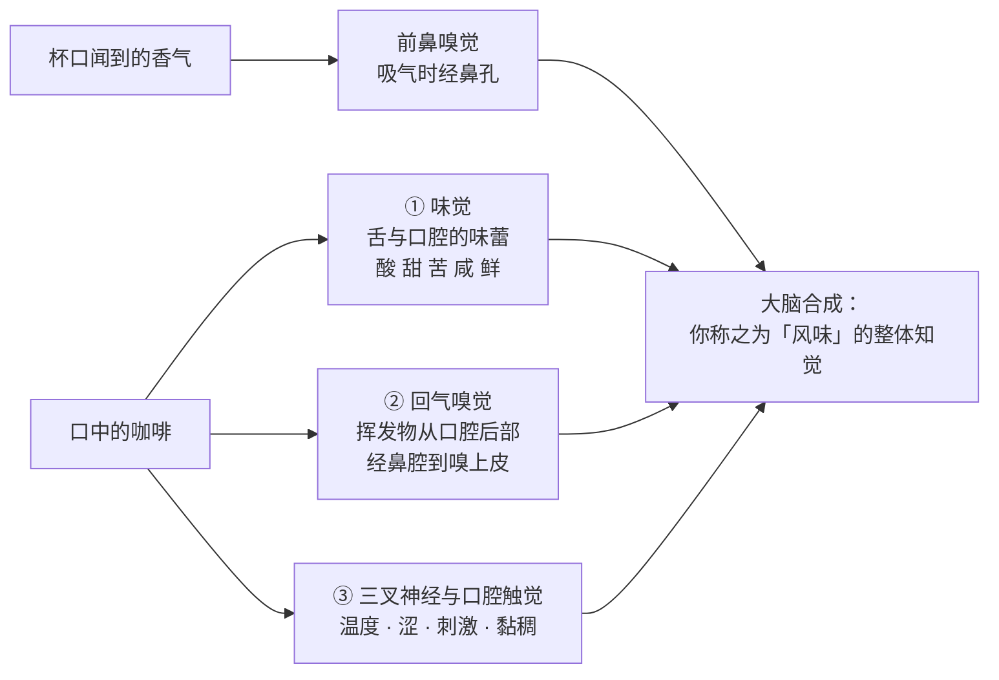
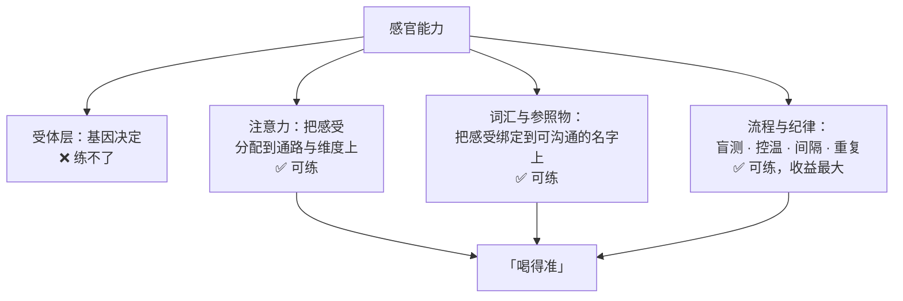

# 第 4 章 风味是怎么被感知的：味觉、嗅觉与三叉神经

> **本章目标**：把第 1~3 章讲的"杯子里有什么"翻到另一面——
> **这些分子是怎么变成"你觉得它酸/苦/甜/厚"的**。
>
> 学完这一章你会明白三件事：
> ① **"风味"绝大部分不是舌头的功劳**；
> ② 第 1 章那些 μmol/L 的阈值数字到底是什么意思、不是什么意思；
> ③ **描述能力可以练，但练的不是受体，是词与注意力**——
> 这决定了第六部分（杯测与感官）的训练方法为什么长那个样子。
>
> 本章的实操**几乎全在 🅐 档**：不需要咖啡，只需要你的鼻子和一杯水。

## 4.1 风味是三条通路合成的，不是一条

日常语言里"味道"是一个词，但生理上至少有三条独立的通路：

对照第 1 章的成分表，三条通路各自负责的分子类别是：

| 通路 | 主要负责 | 第 1~3 章里的对应内容 |
|------|---------|---------------------|
| ① 味觉 | 非挥发性的**呈味物**：有机酸、咖啡因、醌内酯、寡聚物… | §1.3 酸、§1.4 苦 |
| ② 回气嗅觉 | **挥发性香气分子** | §1.2 烘焙生成的香气、[V1][V2] |
| ③ [三叉神经 / 化学触感](../../glossary.md#chemesthesis) | **涩**、温度、黏稠感、金属感 | §1.5 body 与涩 |

> **本章要建立的第一个习惯**：听到"这支豆很有花香/柑橘感"时，
> 知道对方说的是**②**；听到"它很厚/很涩"时，知道说的是**③**；
> 只有"酸不酸、苦不苦"才主要是**①**。
> **把一句评价拆到通路上，你才知道该去调哪个变量。**

## 4.2 维度不对称：味觉很少，嗅觉很多

这是理解"风味主要不是味觉"的关键：**两条通路的维度差了两个数量级**。

**味觉侧**：公认的基本味只有少数几类（酸、甜、苦、咸、鲜），
苦味受体家族（TAS2R）在人类中大约是 **25~26 个**——
注意这个数字本身就是一堂课，见 §4.4。

**嗅觉侧**：人类的嗅觉受体基因是基因组里最大的超家族之一。
2001 年一项挖掘人类基因组草图的研究鉴定出**超过 900 个嗅觉受体基因与假基因**，
并指出其中**至少 63%** 的序列被假基因化过程破坏[^1]。
也就是说，**功能性受体在数百个的量级**。

> **本书为什么不写"人类有 400 个嗅觉受体"这个流传数字**：
> 因为不同研究的计数口径不同（算不算假基因、按哪个参考基因组、
> 按序列完整性还是按实际表达）。本书能核对到的是"总数 900 以上、至少 63% 是假基因"[^1]，
> 以及另一项 2026 年的研究在一个 OR–气味配对数据库里用到了 **385 个人类 OR**[^2]。
> 所以本书只写**量级：数百个**。

**这个不对称直接解释了两件日常现象**：

1. **感冒时"吃什么都没味道"**——坏掉的是②，而①基本完好，
   所以你还能尝出咸和甜，但尝不出"是什么东西"；
2. **咖啡的风味描述词几乎全是"某种食物的气味"**（柑橘、莓果、可可、坚果），
   而不是"某种味道"——因为可描述的维度几乎全在嗅觉侧。

[^1]: 本书编号 [N1]：Glusman 等 (2001). The complete human olfactory subgenome. *Genome Research* 11(5):685–702。用到：鉴定出 900 多个嗅觉受体基因与假基因；至少 63% 被假基因化破坏；它们构成 17 个基因家族。
[^2]: 本书编号 [N2]：Nishijima 等 (2026), *The Laryngoscope* 136(1):384–394。该研究分析 M2OR 数据库中 75,050 组"受体—气味"实验，涉及 **385 个人类 OR** 与 510 种气味分子。

## 4.3 回气嗅觉：为什么"捏住鼻子"能证明一切

香气进入嗅上皮有两条路：

- **[前鼻嗅觉](../../glossary.md#orthonasal)（orthonasal）**：吸气时从鼻孔进——你**闻**杯子时用的就是这条；
- **[回气嗅觉](../../glossary.md#retronasal)（retronasal）**：食物在口中释放的挥发物，随呼气从口腔后部上行进鼻腔——
  你**喝**的时候用的是这条。

这两条路**在感知与神经反应上都不一样**：

- 1982 年一项经典研究直接把这件事命名为"**味—嗅混淆**"（taste-smell confusions），
  并论证嗅觉的**双重性**——人们习惯把回气嗅觉的内容**归因到嘴里**，
  于是把它当成了"味道"[^3]；
- 2005 年一项人类脑成像研究发现，**同一种气味分子**经前鼻与经回气途径给予时，
  引发的神经反应**存在差异**[^4]。

> **所以"捏住鼻子喝咖啡"这个实验，验证的正是通路②**：
> 捏住鼻子会阻断回气气流，你会发现剩下的主要是**酸、苦和口感**，
> 而"它是什么味道的"几乎消失。松开鼻子的瞬间风味"回来"，
> 更是直接演示了通路②的贡献比例。
>
> 这是本章的核心实操（§4.12 任务一），**不需要买任何东西**。

[^3]: 本书编号 [N3]：Rozin, P. (1982). "Taste-smell confusions" and the duality of the olfactory sense. *Perception & Psychophysics* 31(4):397–401。
[^4]: 本书编号 [N4]：Small 等 (2005). Differential neural responses evoked by orthonasal versus retronasal odorant perception in humans. *Neuron* 47(4):593–605。

## 4.4 一个小插曲：人有 25 个还是 26 个苦味受体？

这一节很短，但它是本书方法论的一个标本。

- 2024 年一篇关于苦味感知复杂性的综述写的是"**约 25 个**人类苦味受体"[^5]；
- 第 1 章引过的那篇 2026 年 TAS2R43 结构研究，开篇写的是"**在 26 个苦味受体中**"[^6]。

**谁对？** 两者都不算错——差别来自计数口径
（是否把某些序列算作功能性受体、某些受体存在**拷贝数缺失多态**，
即一部分人天生就没有某个受体基因）。

> **要带走的判断**：**连"人有多少个苦味受体"这种听起来最该有唯一答案的问题，
> 文献里都会给出不同的数。**
> 遇到这种情况，正确处理不是选一个自己喜欢的，而是：
> **写成"约 25~26 个（不同文献计数口径不同）"，并说明差在哪里。**
>
> 如果一篇咖啡文章能精确告诉你"人有 25 个苦味受体"而不提口径，
> 它多半是从某一篇转抄的——这不一定错，但说明它没有查过第二个来源。

而对咖啡最相关的一条是第 1 章已经建立的：
**TAS2R43 被指认为识别咖啡苦味的关键受体**[^6]，
而**咖啡因的苦味强度在天然浓度下会被类黑精削弱约一半**[^7]。
再加上 2024 年那篇综述强调的一点——
**混合物里还存在拮抗剂，整体苦味不是各成分苦味的简单相加**[^5]——
你就得到了一个很重要的推论：

> **杯中的苦 ≠ 苦味分子的总量。** 它是一组分子在一组受体上的**净效果**，
> 其中有加成、有抑制、有掩盖。
> 这解释了为什么第 1 章说"你不能独立地给一杯咖啡减苦"。

[^5]: 本书编号 [N5]：Behrens, M. (2024). The Growing Complexity of Human Bitter Taste Perception. *J. Agric. Food Chem.* 72(26):14530–14534（开放获取）。该文强调拮抗剂的发现与混合物/整食评价带来的复杂性。
[^6]: 本书编号 [B8]：Kim 等 (2026), *Nature Structural & Molecular Biology*（开放获取）。见[出处与资料登记 §4.2](../../standards.md)。
[^7]: 本书编号 [B7]：Gigl、Kreissl & Frank (2026), *J. Agric. Food Chem.* 74(23):18243–18252（开放获取）。

## 4.5 阈值：第 1 章那些 μmol/L 到底是什么意思

第 1 章的苦味证据链里出现过一串数字：阈值 9.8~180 μmol/L、23~178 μmol/L、
58 μmol/L、100~537 μmol/L…… 这一节把它们解释清楚，因为**误读阈值是外行最常犯的错**。

| 概念 | 定义 | 注意 |
|------|------|------|
| **[检测阈](../../glossary.md#detection-threshold)**（detection threshold） | 能察觉"这杯和纯水不一样"的最低浓度 | 察觉到**有东西**，但说不出是什么 |
| **[识别阈](../../glossary.md#recognition-threshold)**（recognition threshold） | 能说出"这是苦的"的最低浓度 | **比检测阈高**。第 1 章引用的那些苦味阈值属于这一类 |
| **[气味活性值 OAV](../../glossary.md#oav)**（odor activity value） | 某成分的**浓度 ÷ 它的气味阈值** | OAV > 1 才意味着"单独存在时能被闻到" |

**为什么这个区分很重要**：

1. **阈值是浓度，不是重要性**。一个阈值很低的分子，如果在咖啡里含量更低，它照样不起作用；
   反之亦然。**要看的是"含量 ÷ 阈值"，也就是 OAV。**
2. **OAV 揭示的比例是惊人的**：一项研究在咖啡里检出 **111 种**挥发物，
   其中 **OAV > 1 的只有 32 种**[^8]；另一项研究共鉴定 85 种香气化合物，
   并指出呋喃类、酮类、吡嗪类为主要贡献者[^9]。
   **"检出多"和"闻得到"完全是两回事**——这也是第 1 章拒绝写"咖啡有 800 多种香气物质"的原因。
3. **阈值是在特定基质里测的**，通常是水溶液。咖啡是一个复杂基质，
   同一分子在其中的实际阈值可能完全不同（§4.4 说的拮抗与掩盖）。

> **所以正确的读法是**：第 1 章那些 μmol/L 说明的是
> "**这些分子在很低的浓度下就能被人尝出苦**"，
> **不是**"它们各自贡献了多少苦"。后者需要定量 + 重组实验才能回答。

[^8]: 本书编号 [V2]：Guo & Cao (2026), *Food Chemistry*（PMID 42102456）。
[^9]: 本书编号 [V1]：Chen 等 (2025), *Foods*（PMCID PMC12469716）。

## 4.6 交叉模态：气味能把"甜"造出来

第 1 章留下了一个悬案：黑咖啡里几乎没有糖，那"甜感"从哪来？
本章可以给出**其中一个有直接实验支持的候选机制**——
**气味诱导的甜感增强（odor-induced sweetness enhancement）**。

两项研究：

| 研究 | 设计 | 结果 |
|------|------|------|
| 2026 年 EEG + 感官研究[^10] | 16 名受试者评价**含糖量相同、气味强度不同**的溶液，同时记录脑电 | 呈**倒 U 形**：**中等**气味强度使甜度评分比无气味基线**提高 14.7%**；而**高**气味强度反而使甜度评分**降低 5.4%** |
| 2025 年西瓜汁气味研究[^11] | 把西瓜汁里的七种挥发物加入 2.5% 果糖溶液 | 七种都**显著提高**了甜度强度，效应在 10 秒内增强 |

> **两个必须说清的边界**：
>
> 1. **这两项都是在糖溶液上做的，不是在咖啡上做的。**
>    咖啡的情况更复杂（有苦、有酸、有大分子），本书**不外推具体数值**。
> 2. **样本量小**（第一项 n = 16）。方向可信，幅度不可当真。
>
> 所以本书对"甜"的判断从第 1 章的"⚠️ 机理合理但缺咖啡验证"，
> 前进到"**⚠️ 机理在其他体系中有直接实验支持，咖啡上仍缺验证**"——
> **前进了一格，但没到 ✅。**

顺带，那个"**倒 U 形**"很有意思：气味太强反而压低甜度评分[^10]。
如果这个形状在咖啡上也成立，它会预测一件反直觉的事——
**香气过于浓烈的咖啡，未必被评为更甜**。本书把它标为**待验证的预测**，
第六部分做感官实验时可以回来检验。

[^10]: 本书编号 [N7]：Yang 等 (2026). Odor-induced sweetness enhancement: EEG evidence for olfactory and gustatory cross-modal interactions. *Current Research in Food Science* 13:101469（开放获取）。n = 16。
[^11]: 本书编号 [N8]：Dai 等 (2025), *Foods* 14(6):1034（开放获取）。

## 4.7 温度会改写味觉本身（不只是挥发）

"凉了更苦"这类经验，通常被解释成"温度低了香气挥发少了"。
这个解释只对了一半——**温度还直接作用在味觉的信号通路上**。

味觉细胞里的 **TRPM5** 是甜、苦、鲜信号传导链上的关键离子通道。
一篇 2024 年的综述指出：**TRPM4 与 TRPM5 的活性会随温度升高而大幅增强**[^12]。

> 换句话说：**同一杯咖啡在不同温度下，不只是"挥发出来的香气不同"，
> 连味觉信号本身的放大倍数都不一样。**

本书在这里必须给出**边界**：

- 这条是**通道层面的机理**，来自离子通道生理学的综述；
- 本书**没有读到**把它定量对应到"咖啡在 60 ℃ 与 45 ℃ 下苦度差多少"的研究；
- 所以本章只写机理方向，**不写任何温度—强度的换算**。

但它足以支撑一条实操纪律（第 34 章杯测流程会正式引入）：

> **比较两杯咖啡时，必须在相同温度下比较。**
> 否则你比较的不只是两杯咖啡，还有两套不同放大倍数的味觉系统。

[^12]: 本书编号 [N9]：Uchida, K. (2024). TRPM3, TRPM4, and TRPM5 as thermo-sensitive channels. *The Journal of Physiological Sciences* 74(1):43（开放获取）。

## 4.8 个体差异与状态差异：为什么"你和我尝到的不一样"是真的

| 来源 | 说明 | 能不能改变 |
|------|------|-----------|
| **基因** | 味觉受体基因的多态影响敏感度。一篇 2026 年综述梳理了这一领域：甜味相关的 TAS1R2/TAS1R3、鲜味的 TAS1R1/TAS1R3、苦味的 TAS2R38 等，都有与个体差异相关的变异[^13] | ❌ 不能 |
| **受体拷贝数缺失** | 部分苦味受体存在整基因缺失的多态（§4.4 提到的计数分歧就与此有关） | ❌ 不能 |
| **适应 / 疲劳** | 连续暴露于同一刺激，感受强度会下降 | ✅ 可管理（间隔、清口） |
| **期待效应** | 知道价格、产区、别人的评价后，感受会被改变 | ✅ 可管理（**盲测**，第 39 章） |
| **词汇与注意力** | 你有没有那个词、有没有把注意力放在那个维度上 | ✅ **这是训练的主战场** |
| **生理状态** | 感冒、鼻塞、口腔状况、刚吃过什么 | ✅ 部分可管理 |

顺便澄清一个流传极广的图——**"舌头分区图"**：

> 那张"舌尖甜、舌侧酸、舌根苦"的图**早已被推翻**。
> 但一篇 2022 年的综述给了更准确的版本：分区图"长期以来已被否定"，
> 不过心理物理学证据确实显示**舌、软腭、咽部各处的味觉敏感度存在显著但很小的差异**[^14]。

所以正确说法是：**不是"某个区域只尝某种味"，而是"各处都能尝，但灵敏度略有不同"**。
这个区别在杯测时有实际意义——**你怎么把液体铺开在口腔里，会轻微影响你尝到什么**
（第 34 章的"啜吸"动作就与此有关）。

[^13]: 本书编号 [N10]：Miller-Kasprzak & Bogdański (2026). Genetic Variants Influencing Taste Perception and Food Preferences: Current Evidence. *Nutrients* 18(15):2531（开放获取）。
[^14]: 本书编号 [N11]：Spence, C. (2022). The tongue map and the spatial modulation of taste perception. *Current Research in Food Science* 5:598–610（开放获取）。

## 4.9 所以"练"到底在练什么

把上面几节合起来，可以给出一个相当清晰的答案：

**这就是为什么第六部分的训练方法长成那样**：

- **用参照物锚定词**（闻真实的柠檬、可可、烤面包），而不是背风味轮上的词——
  因为要建立的是"气味 ↔ 名字"的绑定，绑定必须有实物；
- **强制盲测**——因为期待效应是可管理项里最大的一个；
- **固定温度、固定时间点**——因为温度会改写味觉本身（§4.7）；
- **做三角测试而不是"我觉得"**——因为要把"能不能分辨"和"喜不喜欢"分开（第 38、39 章）。

> **一句话**：**你练的不是舌头，是流程和词汇。**
> 好消息是，这两样恰恰是练得动、而且进步最快的部分。

## 4.10 常见说法辨析

按本书约定标注**证据强度**：✅ 有共识 / ⚠️ 有争议 / ❌ 明确错误 / **缺乏证据**。

| 说法 | 判定 | 说明 |
|------|------|------|
| "风味主要靠舌头" | ❌ **明确错误** | 味觉维度极少，嗅觉受体在数百个量级[^1][^2]；而且人会把回气嗅觉的内容**误归因到嘴里**[^3]——这正是"靠舌头"这个错觉的来源 |
| "捏住鼻子喝，风味会大部分消失" | ✅ **方向有共识** | 回气嗅觉被阻断，剩下的主要是味觉与口腔触觉。回气与前鼻在感知与神经反应上确有差异[^3][^4] |
| "舌尖尝甜、舌根尝苦（舌头分区图）" | ❌ **明确错误**，但要说完整 | 分区图"长期以来已被否定"；不过心理物理学确实显示各处敏感度有**显著但很小**的差异[^14]。所以错的是"只有某处能尝某味"，不是"处处完全一样" |
| "咖啡有 800~1000 多种香气物质" | ⚠️ **数字不可核对，且方向误导** | 检出数随方法而变（本书读到的是 85 种[^9]、111 种[^8]）；更重要的是 111 种里 **OAV > 1 的只有 32 种**[^8]。**检出多 ≠ 闻得到** |
| "阈值越低的物质越重要" | ❌ **明确错误** | 重要性要看**含量 ÷ 阈值**（OAV），不是阈值本身（§4.5） |
| "黑咖啡的甜是气味造成的错觉" | ⚠️ **方向有实验支持，咖啡上未验证** | 气味诱导甜感在糖溶液上有直接实验（中等气味强度 +14.7%）[^10][^11]，但**没有在咖啡上做过**。而且"错觉"一词不准确——它是**真实的知觉**，只是成因不是糖 |
| "香气越浓，喝起来越甜" | ⚠️ **有反例的预测** | 那项 EEG 研究观察到**倒 U 形**：高气味强度反而使甜度评分下降 5.4%[^10]。本书把它列为**待在咖啡上检验的预测** |
| "凉了更苦只是因为香气少了" | ⚠️ **不完整** | 温度还直接改变味觉信号通道的活性（TRPM4/TRPM5 随温度升高而增强[^12]）。但本书**不给任何温度—强度的定量关系** |
| "有人天生就喝不出某些味道" | ⚠️ **部分成立，但不是全有全无** | 味觉受体基因多态确实影响敏感度[^13]，某些苦味受体还存在整基因缺失。但这通常表现为**阈值高低**，而不是"完全尝不到" |
| "感官是天赋，练不出来" | ❌ **明确错误（作为整体命题）** | 受体层确实练不了，但注意力、词汇与流程纪律可练，而且是"喝得准"的主要来源（§4.9） |
| "专业杯测师能尝出产地和海拔" | **缺乏证据** | 本书**未读到**任何盲测条件下"从杯中反推产地/海拔"的验证研究。能稳定做到的是**分辨差异**与**规范描述**，这与"猜出身世"是两回事（第 35、38 章） |
| "喝咖啡前不能刷牙/吃东西" | ⚠️ **方向合理，程度未知** | 口腔状态会影响感受（§4.8），牙膏中的表面活性剂改变味觉是常见经验；但本书未核对针对咖啡的定量研究。杯测时按惯例避免，**属于流程纪律而非实验结论** |

## 4.11 🔎 买豆与冲煮时的用处

1. **听到风味描述词，先翻译成通路**：花果类词 = 通路②（香气），
   酸苦 = ①，厚/涩/干 = ③。**不同通路对应不同的调整手段**——
   ②主要由豆与烘焙决定，③受滤材影响极大（第 1 章），只有①能靠冲煮参数大幅移动。
2. **比较两支豆时，把温度也固定**（§4.7）。凉热不同的两杯，比较结果不可信。
3. **喝第三杯之后要停一停**。适应会让强度感受下降，这不是豆子变淡了（§4.8）。
4. **想练"喝得准"，先把盲测做起来，再谈词汇**——期待效应的影响通常大于词汇量。
5. **看到"能尝出海拔/产地"的宣传，知道它超出了本书能核对到的证据**。
   可核对的是"能稳定分辨两个样品不同"（三角测试），这个能力更有用也更容易验证。

## 4.12 思考题

1. 请解释：为什么感冒鼻塞时，你还能尝出咖啡的酸和苦，却尝不出"这是耶加雪菲"？
   用本章的三条通路回答。
2. 第 1 章给出的苦味阈值大多在几十到几百 μmol/L。有人据此说"某某分子阈值最低，
   所以它是咖啡最主要的苦味来源"。请指出这个推理缺了什么。
3. 一项研究在咖啡里检出 111 种挥发物，其中 OAV > 1 的只有 32 种。
   请说明 OAV 是怎么算的，以及这个 111 / 32 的对比**比"总共有多少种"更有用**在哪里。
4. 气味诱导甜感的研究显示**倒 U 形**关系：中等气味强度使甜度评分上升 14.7%，
   高气味强度反而下降 5.4%。请说明这个形状对"香气越浓越好"这个直觉意味着什么，
   以及为什么本书仍然只把它列为"待验证的预测"。
5. 本章说"你练的不是舌头，是流程和词汇"。请分别举出一个**练得动**和一个**练不动**的例子，
   并说明你怎么判断某项能力属于哪一类。
6. **【案例】** 一位朋友说："我做了个实验——同一支豆，我用 92 ℃ 冲了一杯当场喝，
   又用 88 ℃ 冲了一杯放凉到室温再喝，结果 88 ℃ 那杯明显更苦更涩，
   所以低水温会让咖啡更苦。"请指出这个实验设计的问题，
   并给出一个只改一处就能大幅改善的方案。
7. **【案例】** 某咖啡馆菜单写着：*"本店豆款经 Q Grader 盲测评分 87 分，
   带有明显的白桃与红茶尾韵，甜感极高。"*
   请分别判断这三句话各自属于什么性质的陈述，以及哪一句是你**可以自己验证**的。
8. **【辨识】** 找一个你能拿到的**真实气味参照物**（柠檬皮、可可粉、烤面包、红茶叶都行），
   闭眼闻 10 秒，写下你对它的三个描述词。然后去查一下这个食物里的**关键气味分子**是什么。
   说明：这个练习训练的是本章 §4.9 中的哪一层能力，以及它为什么不能替代盲测。

> 📖 **参考答案**（想清楚再看）：[Q1](../../qa/04-perception-qa.md#q1) ·
> [Q2](../../qa/04-perception-qa.md#q2) · [Q3](../../qa/04-perception-qa.md#q3) ·
> [Q4](../../qa/04-perception-qa.md#q4) · [Q5](../../qa/04-perception-qa.md#q5) ·
> [Q6](../../qa/04-perception-qa.md#q6) · [Q7](../../qa/04-perception-qa.md#q7) ·
> [Q8](../../qa/04-perception-qa.md#q8)

## 4.13 本章实操

本章是全书 🅐 档最重的一章——**几乎所有实验都不需要咖啡**。

### 🅐 无器具版 · 任务一：捏鼻测试（本书最推荐的五分钟实验）

> **需要**：任何一杯有风味的饮料（咖啡、茶、果汁都行）。不需要器具。

| 步骤 | 你观察到什么 |
|------|------------|
| 1. **捏住鼻子**，含一口，在口中停留 5 秒，**不要呼气** | |
| 2. 此时你能感觉到哪些？（酸/甜/苦/咸/厚/涩/温度） | |
| 3. **咽下后松开鼻子**，然后呼气 | |
| 4. 松开的瞬间发生了什么？ | |
| 5. 重复一次，这次全程不捏鼻 | |
| 6. 用一句话描述：**捏鼻时缺失的是哪一类信息？** | |

> **预期**：捏鼻时剩下的基本是①味觉与③口腔触觉；松开呼气的瞬间，
> "是什么味道"会突然回来——那就是通路②（回气嗅觉）。
> **这个实验一旦做过，"风味主要不是舌头"这句话就不再需要论证了。**

### 🅐 无器具版 · 任务二：把一句评价拆到通路上

找**三条**别人写的咖啡评价（豆袋文案、店里菜单、朋友的消息都行），逐词拆：

| 原词（照抄） | 通路①味觉 | 通路②香气 | 通路③触觉/三叉神经 | 无法归类 |
|------------|----------|----------|------------------|---------|
| 例："明亮的柑橘酸" | 酸 ✓ | 柑橘 ✓ | | |
| 例："丝滑的口感" | | | 丝滑 ✓ | |
| 例："干净" | | | | ✓（见下） |

然后统计：

| 统计项 | 数量 |
|-------|------|
| 能明确归到某一通路的词 | |
| 跨通路的复合词（如"柑橘酸"） | |
| **无法归类的词**（"干净""平衡""复杂""高级"） | |

> **这个练习最常见的结果**：无法归类的词占了相当一部分。
> 这些词**不是废话**，它们描述的是整体印象——但它们**不可操作**：
> 你没法通过调一个参数去"增加高级感"。
> **第六部分要做的，就是把这类词逐步替换成可归类、可对照的描述。**

### 🅐 无器具版 · 任务三：温度扫描（同一杯，喝五次）

> **需要**：一杯咖啡（或茶），一个计时器（手机即可）。

冲好后**不要一口气喝完**，在五个时间点各喝一小口并记录：

| 时间点 | 大致温度感 | 酸 | 苦 | 甜感 | 香气强度 | 厚度/涩 |
|-------|----------|---|---|-----|---------|--------|
| 刚做好 | 烫 | | | | | |
| 3 分钟 | 热 | | | | | |
| 8 分钟 | 温 | | | | | |
| 15 分钟 | 接近室温 | | | | | |
| 30 分钟 | 室温 | | | | | |

> **观察重点**：哪个维度变化最大？**很多人会发现"甜感"在温度下降时先升后降**。
> 本章能给的解释是机理层面的两条——挥发速率变了（通路②）、
> 味觉通道活性随温度变化（§4.7）——但**本书不给定量预测**，
> 所以这张表的价值是**建立你自己的基线**，而不是验证某个数字。
>
> 附带一提：关于"很烫的饮品"，第 5 章会**复述一条机构给出的证据分级结论**
> （本书只复述其原话与适用范围，不做任何建议）。

### 🅐 无器具版 · 任务四：气味参照物配对（词汇训练的最小版本）

找 4~6 种家里有的**气味明确的东西**：柠檬皮、橙皮、可可粉、肉桂、烤面包、
红茶叶、花生、酱油……放进不透明杯子，请人打乱顺序。

| # | 闭眼闻到的描述（**先写感受，不许先猜名字**） | 你的猜测 | 实际是什么 | 对了吗 |
|---|------------------------------------------|---------|-----------|-------|
| 1 | | | | |
| 2 | | | | |

> **纪律**：**必须先写感受再猜名字**。
> 一旦先猜了名字，你后面写的描述就会被名字牵着走——这是期待效应的微缩版。
> 这个练习训练的是 §4.9 里的"**词汇与参照物绑定**"那一层。

### 🅑 有条件版 · 任务五：做一次自己的味觉阈值梯度（备齐后再做）

> **所需器具**：**电子秤（0.1 g 精度更好）**、若干个相同的杯子、
> **食用级白砂糖 / 食盐 / 柠檬酸（或新鲜柠檬汁）**、饮用水。
> **替代方案**：没有精确秤，可以用"逐次对半稀释"的办法做相对梯度
> （每次取一半溶液加等量水），同样能找到你的转折点。
> ⚠️ 只用**食品级**材料；**不要**用咖啡因粉、生物碱或任何非食用试剂做阈值测试。

选一种味（建议从**酸**开始，因为它和咖啡最相关），做 6 个浓度梯度：

| 杯号 | 浓度（或稀释倍数） | 能不能察觉与清水不同？ | 能不能说出是"酸"？ |
|------|------------------|---------------------|-------------------|
| 1（最稀） | | | |
| 2 | | | |
| … | | | |
| 6（最浓） | | | |

| 结果 | 你的值 |
|------|-------|
| 你的**检测阈**大约在第几杯？ | |
| 你的**识别阈**大约在第几杯？ | |
| 两者差几档？ | |

> **要观察的重点**：**检测阈和识别阈之间通常隔着好几档**。
> 亲手量出这个差距之后，你就理解了 §4.5 的那张表，
> 也理解了为什么"我好像尝到点什么"和"我确定这是酸"是两种不同的能力。
>
> 进阶：把同一组梯度**换个日子再做一遍**，看看自己的值稳不稳定。
> 不稳定是正常的——这正是第 38 章要讲的"自我校准"存在的理由。

### 🅑 有条件版 · 任务六：同一杯咖啡，两个温度的正式对照（备齐后再做）

> **所需器具**：**温度计**（能测液体的即可）、两个相同的杯子、同一支豆与同一次冲煮的咖啡。

把一次冲煮的咖啡分成两份，一份放到指定温度，另一份保温，
**在两者温度差明显时同时品尝**：

| | 杯 A（较热） | 杯 B（较凉） |
|---|-----------|------------|
| 实测温度 | ____ ℃ | ____ ℃ |
| 酸 | | |
| 苦 | | |
| 甜感 | | |
| 香气强度 | | |
| 厚度 / 涩 | | |

> **这个实验的意义不是"证明温度有影响"**（那已经很清楚），
> 而是让你亲身确认：**在不同温度下比较两支豆是没有意义的**。
> 把这条纪律带进第 34 章（杯测流程），你会发现杯测协议里那些"死板"的规定
> 几乎每一条都在消除某个这样的干扰。

---

## 4.14 本章依据

完整书目信息登记在[出处与资料登记 §4.7](../../standards.md)。

- **[N1]** Glusman 等 (2001), *Genome Research* 11(5):685–702 —— 人类嗅觉亚基因组：
  900 多个嗅觉受体基因与假基因，至少 63% 序列被假基因化破坏。
  本书据此只写"功能性受体在**数百个**量级"，不写具体数字。已读摘要。
- **[N2]** Nishijima 等 (2026), *The Laryngoscope* 136(1):384–394 —— 分析 M2OR 数据库
  75,050 组受体—气味实验，涉及 385 个人类 OR 与 510 种气味分子。作为量级的第二来源。已读摘要。
- **[N3]** Rozin (1982), *Perception & Psychophysics* 31(4):397–401 —— "味—嗅混淆"与嗅觉的双重性；
  人把回气嗅觉的内容归因到口中。已核对书目与题名。
- **[N4]** Small 等 (2005), *Neuron* 47(4):593–605 —— 同一气味经前鼻与回气途径引发的神经反应不同。已读摘要。
- **[N5]** Behrens (2024), *J. Agric. Food Chem.* 72(26):14530–14534 —— "约 25 个"人类苦味受体；
  拮抗剂的发现使混合物的苦味不能简单相加。开放获取，已读摘要。
- **[B8]** Kim 等 (2026), *Nat. Struct. Mol. Biol.* —— "在 26 个苦味受体中"，TAS2R43 是识别咖啡苦味的关键受体。
  与 [N5] 的计数差异，本章用作"基础数字也会有口径分歧"的实例。
- **[B7]** Gigl、Kreissl & Frank (2026), *J. Agric. Food Chem.* 74(23):18243–18252 ——
  类黑精在天然浓度下把咖啡因苦度削弱约一半。
- **[N7]** Yang 等 (2026), *Current Research in Food Science* 13:101469 —— 气味诱导甜感的
  倒 U 形关系（中等气味强度 +14.7%、高气味强度 −5.4%），n = 16，**在蔗糖溶液上**。开放获取，已读摘要。
- **[N8]** Dai 等 (2025), *Foods* 14(6):1034 —— 西瓜汁七种挥发物显著提高果糖溶液的甜度强度。开放获取，已读摘要。
- **[N9]** Uchida (2024), *J. Physiol. Sci.* 74(1):43 —— TRPM4 与 TRPM5 的活性随温度升高而大幅增强。
  本书只取**机理方向**，不做任何温度—强度换算。开放获取，已读摘要。
- **[N10]** Miller-Kasprzak & Bogdański (2026), *Nutrients* 18(15):2531 —— 味觉感知与食物偏好的
  遗传变异综述（TAS1R2/TAS1R3、TAS1R1/TAS1R3、TAS2R38 等）。开放获取，已读摘要。
- **[N11]** Spence (2022), *Current Research in Food Science* 5:598–610 —— 舌头分区图
  "长期以来已被否定"，但各部位味觉敏感度存在**显著但很小**的差异。开放获取，已读摘要。
- **[V1] [V2]** 见[§4.4 香气](../../standards.md) —— 分别提供 85 种香气化合物的鉴定与
  "111 种检出、仅 32 种 OAV > 1"的对比，用于 §4.5 说明 OAV。

**本章刻意没写的东西**：

- "人类有 400 个嗅觉受体"这个流传数字（计数口径不一，只写量级）；
- 任何"温度每降 x ℃，苦度上升 y"的定量关系；
- 把气味诱导甜感的 14.7% 直接套到咖啡上；
- "专业人士能盲测尝出产地/海拔"——未找到验证研究；
- "人能分辨多少种气味"的总数类数字——同样存在方法学争议，本书不引用。

---

**下一章**：第 5 章 咖啡与健康——**只讲证据等级**。
那一章不会告诉你"该喝多少"，它会教你怎么读一项研究、
怎么读机构结论的原话与适用范围，以及为什么"某研究表明咖啡能防 X"这句话
在绝大多数情况下建立在被正式评级为"低"或"极低"的证据上。
