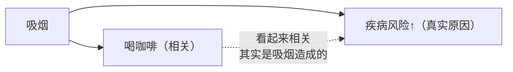

# 第 5 章 咖啡与健康：只讲证据等级

> **⚠️ 本章的边界声明（请先读完这一段再往下）**
>
> 本书**不做任何医疗或健康建议**。本章：
>
> - **不给摄入量建议**（不写"每天几杯"），
> - **不做疗效承诺**，也**不做风险承诺**，
> - **不复述机构风险评估报告里的具体数值**——需要那些数字时，请去读原文。
>
> 本章教的是**一项与咖啡有关的健康研究该怎么读**：
> 它是什么设计、证据被正式评成了几级、常见的陷阱在哪、
> 机构结论的原话与适用范围是什么。
>
> 换句话说：**这一章的产出不是结论，是筛子。**
> 学完之后，你看到任何"研究表明咖啡……"的标题，
> 能在三十秒内判断它值不值得读下去。

## 5.1 为什么营养流行病学天生做不硬

先说清楚这个领域的结构性困难，否则后面的"证据等级低"会被误读成"研究者不行"。

| 困难 | 为什么难 |
|------|---------|
| **不能随机分配** | 你没法把一万人随机分成"喝咖啡组"和"不喝组"，然后跟踪二十年 |
| **不能设盲** | 受试者知道自己喝没喝咖啡（这与药物试验的本质区别） |
| **暴露测量很粗** | "一杯"是多少毫升？什么烘焙度？什么冲煮方式？——而第 1 章已经证明，**不同冲煮方式进入杯中的成分差两个数量级** |
| **结局很远** | 心血管事件、癌症要几十年才出现 |
| **喝咖啡的人和不喝的人本来就不同** | 吸烟、作息、职业、收入……全都相关 |

所以这个领域的绝大多数研究是**观察性的**（队列、病例对照、横断面），
而观察性研究**只能给出关联，不能给出因果**。

这不是本书的评论，而是这个领域自己的共识——下一节那篇伞形综述在引言里就是这么写的：
观察性证据"能提示关联但无法作出因果论断"，而要真正理解咖啡的作用
"最终需要干预性研究，理想情况下是随机对照试验"[^1]。

[^1]: 本书编号 [H1]：Poole 等 (2017). Coffee consumption and health: umbrella review of meta-analyses of multiple health outcomes. *BMJ* 359:j5024（开放获取，PMCID PMC5696634）。本章大量使用这一篇，**因为它是一个可以照抄的方法论样板**。

## 5.2 一个可以照抄的样板：BMJ 的伞形综述

2017 年《*BMJ*》上的一篇**伞形综述**（umbrella review，即"对荟萃分析做荟萃"）
把当时能找到的咖啡与健康证据整个过了一遍[^1]。它的规模和结论都值得记住：

| 项目 | 数字 |
|------|------|
| 纳入的**观察性研究荟萃分析** | **201 篇**，覆盖 **67 个**不同健康结局 |
| 纳入的**随机对照试验荟萃分析** | **17 篇**，覆盖 **9 个**结局 |
| RCT 覆盖的结局有哪些 | 收缩压、舒张压、总胆固醇、LDL、HDL、甘油三酯，以及三项与妊娠有关的结局 |
| 方法学质量（AMSTAR，满分 11） | 中位 **5 分**（范围 2~9） |
| **证据等级（GRADE）** | 约 **25% 被评为"低"**，约 **75% 被评为"极低"** |
| 连 RCT 的荟萃分析呢？ | **也被评为"低"**——原因是偏倚风险、不一致性或不精确 |

**请把最后两行读三遍。**

> **[GRADE](../../glossary.md#grade)** 是国际通用的证据分级方法，把证据分为
> **高 / 中 / 低 / 极低**四级。研究设计决定起点，其他因素（异质性、发表偏倚、
> 不精确、间接性等）可以上调或下调[^1]。
>
> 在这篇伞形综述里，**没有一个结局达到"高"或"中"**。

于是本书可以给出一条几乎可以无脑套用的判断：

> **当你看到"研究表明咖啡能降低 X 风险"时，
> 这句话背后的证据，按国际通用标准评，几乎总是"低"或"极低"。**
>
> 这不意味着它是假的，而意味着：**它是一个待验证的线索，不是一个可依赖的结论。**

## 5.3 三个最常见的陷阱（这篇综述里都有实例）

### 陷阱一：混杂（confounding）——尤其是吸烟

这是咖啡研究里最经典的例子。

> 某些荟萃分析曾观察到咖啡与某些癌症风险上升的关联。
> 但当研究者**只在"从不吸烟者"中重做荟萃分析时，有害关联消失了**；
> 再只纳入**调整过吸烟**的研究，有害关联的幅度变小且不再显著。
> 该篇作者的结论是：**残余混杂（residual confounding）很可能解释了这个表观有害关联**[^1]。

为什么会这样？因为**喝咖啡与吸烟在人群中正相关**。
如果不把吸烟扣干净，咖啡就会替吸烟"背锅"。

> **"调整过混杂因素"不等于"排除了混杂"**。
> 调整依赖于混杂因素被**准确测量**——而"每天抽多少烟、抽了多少年"这类自报数据，
> 天然是不准的。剩下的那部分就叫**残余混杂**。

### 陷阱二：反向因果（reverse causation）

如果一个人因为身体不舒服而**戒了咖啡**，那么在数据里他会表现为
"不喝咖啡 + 生病"——于是"不喝咖啡"看起来像是风险因素。

伞形综述在方法上专门处理了这个问题：当某个结局同时有队列和病例对照的数据时，
他们**优先选择队列设计**，理由之一正是队列"更不容易受反向因果偏倚影响"[^1]。

### 陷阱三：发表偏倚（publication bias）

阳性、有趣的结果更容易被发表。伞形综述用 Egger 检验做了统计检查，
在**若干个结局**上发现了发表偏倚的统计学证据[^1]。

> **本书不复述具体是哪几个结局的 p 值**——重点不是哪几个，
> 而是：**即使在做过系统检索的荟萃分析层面，发表偏倚仍然查得出来。**

## 5.4 全书唯一一条"机制—暴露—结局"三段齐全的链条

本章绝大部分内容是在教你怀疑。但有一条链条例外，值得单独讲——
因为它把第 1 章、第 3 章、第五部分串成了一条线。

**这条链是：双萜（咖啡醇 / 咖啡豆醇）→ 冲煮方式决定它进不进杯子 → 血脂指标。**

| 环节 | 证据 |
|------|------|
| ① **机制侧** | 咖啡醇与咖啡豆醇是咖啡油中的双萜成分 |
| ② **暴露侧（定量）** | 第 1 章引过的测定[^2]：家用**滤纸**冲煮 12 与 8 mg/L；**煮沸不过滤** 939 与 678 mg/L；同一煮沸咖啡**经布滤**降到 28 与 21 mg/L；**部分意式样品**高至 2447 mg/L 咖啡醇（样本量小，n = 3~11） |
| ③ **结局侧** | 伞形综述指出：RCT 的荟萃分析里有**一致的证据**显示总胆固醇、LDL 与甘油三酯的**小幅上升**，并认为这是**双萜的作用**；而且**制备方式很重要**——速溶与滤泡咖啡的双萜含量与意式相比可忽略，煮沸与法压壶更高；在他们纳入的荟萃分析中，**滤泡咖啡对血脂的影响可忽略或极小**[^1] |

**为什么这条值得单独拿出来说**：

1. 三段都有独立证据，而且**②的定量与③的归因互相对得上**；
2. ③来自 **RCT** 的荟萃分析，而不是观察性研究；
3. 它给出的不是"喝不喝"的问题，而是"**用什么器具**"的问题——
   而器具恰恰是第 1 章说的 **(A) 侧**：**滤材决定哪些分子能进杯子**。

**但本书仍然不给建议**。本书能说的是：

> **这条链条是本章证据等级最高的一条**（RCT 荟萃分析 + 定量暴露数据 + 明确机制），
> 而且它的作用点**恰好是你已经在为风味而选择的那个变量（滤材）**。
> 需要据此做任何决定的读者，请去读原文并咨询专业人士——**本书不替你做这个判断。**

> ⚠️ **注意伞形综述自己也把 RCT 荟萃分析评为"低"质量证据**[^1]。
> "本章最强的一条"≠"强"。这正是本章要教的尺度感。

[^2]: 本书编号 [A5]：Orrje 等 (2025), *Nutrition, Metabolism & Cardiovascular Diseases*（PMID 40089392）。见[出处与资料登记 §4.3](../../standards.md)。

## 5.5 机构结论怎么读：原话、分级、适用范围

### IARC：分级说的是**证据强度**，不是**风险大小**

国际癌症研究机构（IARC）在其专论第 **116** 卷《Drinking Coffee, Mate, and Very Hot
Beverages》（2018 年出版）中评估了这一组暴露[^3]。
本书直接从 IARC 官方的分类数据中取到三条记录[^4]：

| 被评估的对象（IARC 的原始条目名） | 分组 | 卷次 | 评估年 |
|--------------------------------|------|------|-------|
| **Coffee, drinking**（饮用咖啡） | **Group 3** | 51, 116 | 2016 |
| **Very hot beverages at above 65 °C (drinking)**（饮用温度高于 65 ℃ 的很烫饮品） | **Group 2A** | 116 | 2016 |
| **Mate, not very hot (drinking)**（饮用不很烫的马黛茶） | **Group 3** | 51, 116 | 2016 |

IARC 在"饮用咖啡"这一条下还附了一条备注，本书复述其要点：
在人类中，**对胰腺癌、肝癌、女性乳腺癌、子宫内膜癌与前列腺癌，存在"提示缺乏致癌性"的证据**；
并且在肝癌与子宫内膜癌上**观察到了反向关联**[^4]。

**必须说清楚的两件事**：

1. **Group 是"证据有多强"，不是"危险有多大"。**
   Group 2A 的含义是"对人类很可能致癌"这一**证据分级**，
   它**不表示**风险程度、也不表示暴露量与效应大小。
   把 2A 读成"很危险"是这个体系被误用得最普遍的方式。
2. **被评为 2A 的不是咖啡，是"温度高于 65 ℃ 的很烫饮品"这一**暴露**本身**——
   它与是咖啡、茶还是马黛茶无关。同一卷里，**饮用咖啡本身被评为 Group 3**
   （即"无法归类为对人类是否致癌"）。

> 本书只复述以上分类与备注。**不由此推出任何饮用建议。**

### EFSA：本书只告诉你有这份文件，不复述它的数字

欧洲食品安全局（EFSA）发布过两份与本章直接相关的科学意见：

| 文件 | 出处 | 本书怎么处理 |
|------|------|------------|
| 《Scientific Opinion on the safety of caffeine》 | *EFSA Journal* 2015;13(5):4102，doi:10.2903/j.efsa.2015.4102[^5] | **不复述其中任何摄入量数值**。这正是"不给摄入量建议"这条纪律的落点——需要的读者请直接读原文，并注意它针对的人群与适用范围 |
| 《Scientific Opinion on acrylamide in food》 | *EFSA Journal* 2015;13(6):4104，doi:10.2903/j.efsa.2015.4104[^6] | 咖啡是食品中丙烯酰胺的暴露来源之一。**本书不复述其暴露估算与风险表征**，也**未核对**"烘焙度与丙烯酰胺含量"的关系，因此正文不写这条 |

> **为什么连数字都不复述**：因为风险评估报告里的数字**离开语境就会变形**——
> 它们绑定着特定的人群、特定的终点、特定的不确定性描述。
> 把一个数字从报告里摘出来放进一本咖啡书，几乎必然会被读成建议。
> **本书选择给出准确的文献坐标，让你去读原文。**

[^3]: 本书编号 [H3]：IARC Monographs Volume 116, *Drinking Coffee, Mate, and Very Hot Beverages*（2018 出版）。同时参见 Loomis 等 (2016). Carcinogenicity of drinking coffee, mate, and very hot beverages. *The Lancet Oncology* 17(7):877–878。
[^4]: 本书编号 [H2]：IARC 官方"List of Classifications"分类数据（`monographs.iarc.who.int`）。本书于 2026-09 直接从该页面所用的分类数据集中取得上述三条记录的条目名、分组、卷次与评估年。
[^5]: 本书编号 [H4]：EFSA (2015). Scientific Opinion on the safety of caffeine. *EFSA Journal* 13(5):4102。**书目已核对，本书不复述其内容数值。**
[^6]: 本书编号 [H5]：EFSA (2015). Scientific Opinion on acrylamide in food. *EFSA Journal* 13(6):4104。**书目已核对，本书不复述其内容数值。**

## 5.6 孟德尔随机化：听起来很硬，用起来要小心

**孟德尔随机化（Mendelian randomization, MR）**的思路很漂亮：
基因型在受精时就随机分配了，所以用与"喝咖啡多少"相关的遗传变异作为**工具变量**，
可以在一定程度上绕开混杂与反向因果。伞形综述也承认这类方法
"更不容易受混杂影响"[^1]。

**但本书要给一个基于自己检索的观察**：

> **本书检索记录（2026-09-13，Europe PMC，题名字段同时含 "Mendelian randomization" 与 "coffee"）：
> 命中 117 篇。** 结局横跨甲状腺癌、腕管综合征、胃食管反流、糖尿病血管病变……
> 分布极为分散。

这本身不是对任何一篇的评价，但它是一个**值得警惕的模式信号**：

| 信号 | 它提示什么 |
|------|-----------|
| 同一暴露被反复套到几十上百个不同结局上 | **多重比较**——做得足够多，总会有"显著"的 |
| 结局选择缺乏先验假说 | 更像"有数据就跑一遍"，而不是检验特定机制 |
| 大量使用同一批公开 GWAS 汇总数据 | 各研究之间**并不独立**，"多项研究都支持"可能是同一份数据被用了很多次 |

**MR 自身还有三个必须成立的假设**：工具变量与暴露强相关、
只通过暴露影响结局（无水平多效性）、与混杂因素无关。
**这三条在"喝咖啡"这种高度行为化的暴露上都不容易保证**——
影响咖啡摄入的基因也可能影响其他行为。

> **要带走的判断**：MR 不是"因果的自动售货机"。
> 看到一篇 MR 研究时，先问：**这个结局是有先验机制假说的，还是被批量扫出来的？**

## 5.7 常见说法辨析

按本书约定标注**证据强度**：✅ 有共识 / ⚠️ 有争议 / ❌ 明确错误 / **缺乏证据**。
**注意：本表评的是"说法与证据是否匹配"，不是"你该怎么做"。**

| 说法 | 判定 | 说明 |
|------|------|------|
| "IARC 认定咖啡是致癌物" | ❌ **明确错误** | IARC 的条目里，**Coffee, drinking 是 Group 3**；被列为 Group 2A 的是"饮用温度高于 65 ℃ 的很烫饮品"这一暴露[^4] |
| "2A 说明危险性很高" | ❌ **明确错误** | IARC 的分组表示**证据强度**（对致癌性的判定把握有多大），**不表示风险大小或效应强度** |
| "研究证明咖啡可以预防某某病" | ⚠️ **几乎总是过度解读** | 伞形综述中，约 25% 的结局证据被 GRADE 评为"低"、约 75% 评为"极低"，**没有"高"或"中"**[^1]。"证明"这个词在这里不成立 |
| "很多研究都得出同样结论，所以可信" | ⚠️ **要先看它们独不独立** | 多篇可能共享同一批原始队列或同一份公开 GWAS 数据（§5.6）；而且发表偏倚会让文献整体看起来比真实世界更一致[^1] |
| "咖啡与某癌症风险上升有关" | ⚠️ **经典的混杂案例** | 只在从不吸烟者中重做荟萃分析时，有害关联消失；作者认为是**残余混杂**[^1] |
| "不喝咖啡的人反而更容易生病" | ⚠️ **典型的反向因果嫌疑** | 因病戒咖啡的人会被归进"不喝"组。这正是伞形综述优先采用队列设计的理由之一[^1] |
| "不同冲煮方式对血脂的影响不同" | ✅ **本章证据等级最高的一条**（但仍被评为"低"） | RCT 荟萃分析一致显示总胆固醇/LDL/甘油三酯小幅上升并归因于双萜；速溶与滤泡的双萜可忽略，煮沸/法压/意式更高[^1]，且有独立的浓度测定支持[^2] |
| "深烘的丙烯酰胺更高，所以应该喝浅烘" | **本书不评价** | 相关机构评估文件存在[^6]，但本书**未核对**烘焙度与丙烯酰胺的定量关系，按查证纪律**不写**。请勿把"本书没写"读成任何一个方向的结论 |
| "孟德尔随机化研究证明了因果" | ⚠️ **过度解读** | MR 降低了混杂与反向因果的影响，但依赖三个不易验证的假设；且咖啡领域的 MR 研究数量庞大、结局分散（§5.6） |
| "每个人代谢咖啡因的速度不同，所以这些研究都没意义" | ❌ **明确错误** | 个体差异确实存在，但它意味着**需要分层分析与更好的暴露测量**，而不是"研究无效"。把"不确定"当成"随便信哪个都行"，是比轻信更糟的错误 |
| "咖啡与健康这件事已经有定论了" | ❌ **明确错误** | 伞形综述自己的结论是：需要随机对照试验才能真正理解咖啡的作用[^1] |

## 5.8 🔎 买豆与冲煮时的用处

本章的"用处"不是买豆技巧，而是一个**读标题的筛子**。看到任何咖啡健康类内容，按顺序问：

1. **这是什么设计？** 观察性 / RCT / 动物 / 细胞 / 计算 / MR？
   （第 3 章已经练过一次：DFT 计算被当成冲煮结论用。）
2. **它评过级吗？** 有没有提 GRADE 或类似的证据分级？如果没提，
   默认它在"低/极低"那一档（§5.2）。
3. **混杂处理了吗？** 特别是**吸烟**——这是咖啡研究的头号混杂。
4. **暴露是怎么测的？** "一杯咖啡"是什么？如果连冲煮方式都没区分，
   那第 1 章那个**两个数量级**的差异就全被抹平了。
5. **它在替谁说话？** 是机构的风险评估、同行评议论文，还是转述的转述？

> **一句话**：**先看设计和分级，再看结论。**
> 这个顺序能过滤掉你在中文互联网上看到的绝大部分咖啡健康内容。

## 5.9 思考题

1. 请解释：为什么"咖啡与健康"这个领域的绝大多数研究只能是观察性的？
   并说明观察性证据在 GRADE 体系里通常起点较低的原因。
2. 伞形综述里，约 25% 的结局被评为"低"、75% 被评为"极低"，
   连 RCT 的荟萃分析也被评为"低"。请说明：这是不是意味着"这些研究都白做了"？
   为什么？
3. 某荟萃分析发现咖啡与某癌症风险上升相关，但只纳入从不吸烟者后关联消失。
   请说明这属于哪一类偏倚，并解释为什么"已经调整过吸烟"仍然不足以排除它。
4. IARC 把"饮用温度高于 65 ℃ 的很烫饮品"列为 Group 2A，把"饮用咖啡"列为 Group 3。
   请说明这两条各自在说什么，以及为什么"IARC 说咖啡致癌"是错的。
5. 本章说双萜那条链是"证据等级最高的一条"，但同时又说它仍被评为"低"。
   请说明这两句话为什么不矛盾，以及"相对最强"和"足够强"的区别在实践中意味着什么。
6. **【案例】** 一篇文章标题是：*"重磅研究：每天喝咖啡可降低 X 风险 20%！
   顶级期刊发表，涉及 50 万人"*。请写出你会依次检查的**五个**问题，
   并说明"50 万人"这个数字为什么**不能**提高证据等级。
7. **【案例】** 你的朋友说："我看到一篇孟德尔随机化研究，说咖啡会增加腕管综合征风险，
   这是基因证据，比问卷调查硬多了，所以我准备戒了。"
   请给出你的完整回应——既要承认 MR 的长处，也要指出这个推理链上的问题。
8. **【辨识】** 去找**一篇中文咖啡健康类文章**（公众号、新闻、短视频文案都行），
   做一次"证据溯源"：它的说法能不能追到一篇具体的研究？那篇研究是什么设计？
   文章有没有改写结论的强度？把过程填进 §5.10 的表里。

> 📖 **参考答案**（想清楚再看）：[Q1](../../qa/05-health-evidence-qa.md#q1) ·
> [Q2](../../qa/05-health-evidence-qa.md#q2) · [Q3](../../qa/05-health-evidence-qa.md#q3) ·
> [Q4](../../qa/05-health-evidence-qa.md#q4) · [Q5](../../qa/05-health-evidence-qa.md#q5) ·
> [Q6](../../qa/05-health-evidence-qa.md#q6) · [Q7](../../qa/05-health-evidence-qa.md#q7) ·
> [Q8](../../qa/05-health-evidence-qa.md#q8)

## 5.10 本章实操

本章的实操是**读文献的练习**，不涉及任何饮食改变。

### 🅐 无器具版 · 任务一：给一篇中文健康文章做证据溯源

找一篇关于"咖啡与健康"的中文文章，填这张表：

| 检查项 | 记录 |
|-------|------|
| 文章的核心主张（照抄一句） | |
| 它给出处了吗？（有 / 只说"研究表明" / 无） | |
| 能不能追到**具体的论文**？（题名 / 期刊 / 年份） | |
| 这篇论文是什么**设计**？（队列 / 病例对照 / 横断面 / RCT / 动物 / 细胞 / MR / 综述） | |
| 论文原文的措辞强度（"associated with" / "may" / "causes"） | |
| 文章改写后的强度（"有关" / "能" / "证明"） | |
| **强度被放大了吗？放大了几档？** | |
| 文章有没有提**证据等级**或**局限性**？ | |
| 有没有提**冲煮方式 / 暴露测量**？ | |

> **这个练习最常见的结果**：追不到具体论文，或者论文原文写的是
> "is associated with"，到了文章里变成"能降低"。
> **这一步的跃迁，就是绝大多数健康类内容错误的发生地。**

### 🅐 无器具版 · 任务二：把五个"证据等级"排个序

把下面这些说法按**证据强度**从强到弱排序，并写出理由：

| # | 说法 | 你的排序 | 理由 |
|---|------|---------|------|
| A | 一项细胞实验发现咖啡提取物抑制某癌细胞增殖 | | |
| B | 一项队列研究发现喝咖啡的人某病发病率较低 | | |
| C | 一项 RCT 荟萃分析发现不滤油的咖啡使 LDL 小幅上升 | | |
| D | 一位医生在采访中说咖啡对肝脏有好处 | | |
| E | 一项 DFT 计算显示某成分与某受体结合能高 | | |

> **参考方向**（不是唯一答案）：C > B > A ≈ E > D。
> 关键不是排序本身，而是你能不能说出**每一档为什么在那个位置**——
> 尤其是能不能看出 A 和 E 的共同问题：**它们离"人喝下去会怎样"都还隔着好几步**。
> 第 3 章的 DFT 例子和这里的 E 是同一个错误模式。

### 🅐 无器具版 · 任务三：读一次机构原文的"适用范围"

去找一份机构文件（本章给了坐标：IARC 专论第 116 卷、
或 EFSA 的两份科学意见[^5][^6]），**不看结论，先看这三件事**：

| 检查项 | 记录 |
|-------|------|
| 它评估的**对象**到底是什么？（"咖啡"还是"很烫的饮品"？"咖啡因"还是"咖啡"？） | |
| 它的**人群范围**是什么？（一般成年人？特定人群？） | |
| 它评的是**危害识别**（有没有这个性质）还是**风险评估**（在实际暴露下有多大）？ | |
| 它自己声明的**局限**有哪些？ | |

> **这个练习是本章最重要的一个**。
> 因为绝大多数误读，都发生在**把评估对象搞错**这一步——
> 把"很烫的饮品"读成"咖啡"、把"咖啡因"读成"咖啡"、
> 把"危害识别"读成"风险有多大"。

### 🅑 有条件版 · 任务四：自己跑一次检索（需要能访问文献数据库）

> **所需条件**：能访问 Europe PMC 或 PubMed（都是免费公开的），
> 以及一点英文阅读能力。**不需要任何器具。**
> **替代方案**：只用中文检索也能做，但你会亲身体会到二手信息的损耗有多大——
> 这本身就是这个任务的一半价值。

| 步骤 | 记录 |
|------|------|
| 1. 选一个你关心的结局（例如"咖啡 与 某某"） | |
| 2. 检索并记下**命中数** | |
| 3. 前 10 条里，**设计类型**各有几篇？（综述 / 队列 / RCT / 动物 / 细胞 / MR） | |
| 4. 有没有**荟萃分析或系统综述**？ | |
| 5. 找到最"高阶"的那一篇，看它有没有做**证据分级** | |
| 6. 它的结论措辞是什么？（照抄英文原句） | |
| 7. 与你在任务一里那篇中文文章相比，差在哪里？ | |

> **一个可以预期的发现**：命中数往往大得惊人，而其中**设计足够强的只有很少几篇**。
> 本章 §5.6 给出的那个观察（题名含 MR + coffee 命中 117 篇）就是这么来的——
> **你完全可以自己重复一次本书的检索，并核对本书说得对不对。**
> 这正是本书希望你养成的最终习惯。

---

## 5.11 本章依据

完整书目信息登记在[出处与资料登记 §4.8](../../standards.md)。

- **[H1]** Poole 等 (2017), *BMJ* 359:j5024（开放获取）。本章**主干来源**。用到：
  201 篇观察性荟萃分析 / 67 个结局、17 篇 RCT 荟萃分析 / 9 个结局；
  AMSTAR 中位 5 分（范围 2~9）；**GRADE 约 25% "低"、约 75% "极低"，
  连 RCT 荟萃分析也被评为"低"**；使用 GRADE 与 AMSTAR 的方法说明；
  吸烟残余混杂使表观有害关联消失的实例；优先采用队列设计以减少反向因果偏倚；
  Egger 检验查出若干结局存在发表偏倚；RCT 荟萃分析中总胆固醇/LDL/甘油三酯的小幅上升
  与双萜归因，以及速溶/滤泡与意式、煮沸、法压壶之间双萜含量的差别。已读全文相关章节。
- **[H2]** IARC "List of Classifications" 官方分类数据（`monographs.iarc.who.int`，2026-09 取得）。
  用到：**Coffee, drinking = Group 3**（卷 51、116，评估年 2016）；
  **Very hot beverages at above 65 °C (drinking) = Group 2A**（卷 116，2016）；
  **Mate, not very hot (drinking) = Group 3**；以及咖啡条目下关于
  "提示缺乏致癌性"与反向关联的备注要点。
- **[H3]** IARC Monographs Volume 116, *Drinking Coffee, Mate, and Very Hot Beverages*（2018）。
  用到：卷次、题名与出版年；该卷的评估范围（工作组审阅了逾千项观察性与实验研究，
  覆盖 20 余个癌症部位）。同时记录 Loomis 等 (2016), *The Lancet Oncology* 17(7):877–878
  作为该卷的公开摘要。官网条目已核对。
- **[H4]** EFSA (2015). Scientific Opinion on the safety of caffeine. *EFSA Journal* 13(5):4102。
  **仅登记书目与坐标，本书不复述其数值。**
- **[H5]** EFSA (2015). Scientific Opinion on acrylamide in food. *EFSA Journal* 13(6):4104。
  **仅登记书目与坐标，本书不复述其数值。**
- **[A5]** Orrje 等 (2025), *Nutr. Metab. Cardiovasc. Dis.* —— 各冲煮方式的咖啡醇/咖啡豆醇浓度
  （滤纸 12/8、煮沸 939/678、布滤 28/21、部分意式最高 2447 mg/L；n = 3~11）。
  用于 §5.4 的"暴露侧"定量。
- **本书自己的检索记录（2026-09-13）**：Europe PMC 题名字段同时含 "Mendelian randomization"
  与 "coffee"，命中 **117** 篇。这是**本书的检索观察**，不是任何文献的结论，
  读者可自行重复（§5.10 任务四）。

**本章刻意没写的东西**：

- 任何摄入量（"每天几杯"）——这是本书的纪律红线；
- EFSA 两份意见中的具体数值（剂量、暴露估算、风险表征）；
- 烘焙度与丙烯酰胺的定量关系——**未核对，因此不写**；
- 任何"咖啡能防/会致"某病的结论性表述；
- 具体哪几个结局存在发表偏倚的统计细节——与本章要教的方法无关。

---

**第一部分到此结束。** 五章下来，你已经有了一整套解释框架：

| 章 | 它给了你什么 |
|----|------------|
| 1 | 成分 → 感受的对应，以及**冲煮第一原理** |
| 2 | 这些成分原本被包在什么结构里，每一层会在哪一章回来 |
| 3 | 占了 98% 的那个溶剂，以及一次完整的查证示范 |
| 4 | 感受是怎么被合成的，以及"练"到底在练什么 |
| 5 | 一套读研究的筛子——**这一章的方法适用于全书所有的"有人说"** |

**下一站**：第一部分的实战项目 **P1**——
给三包豆做一份"成分翻译"，把营销词逐条翻译成成分与工艺语言。
之后进入第二部分：**上游——从一棵树到一袋生豆**。
